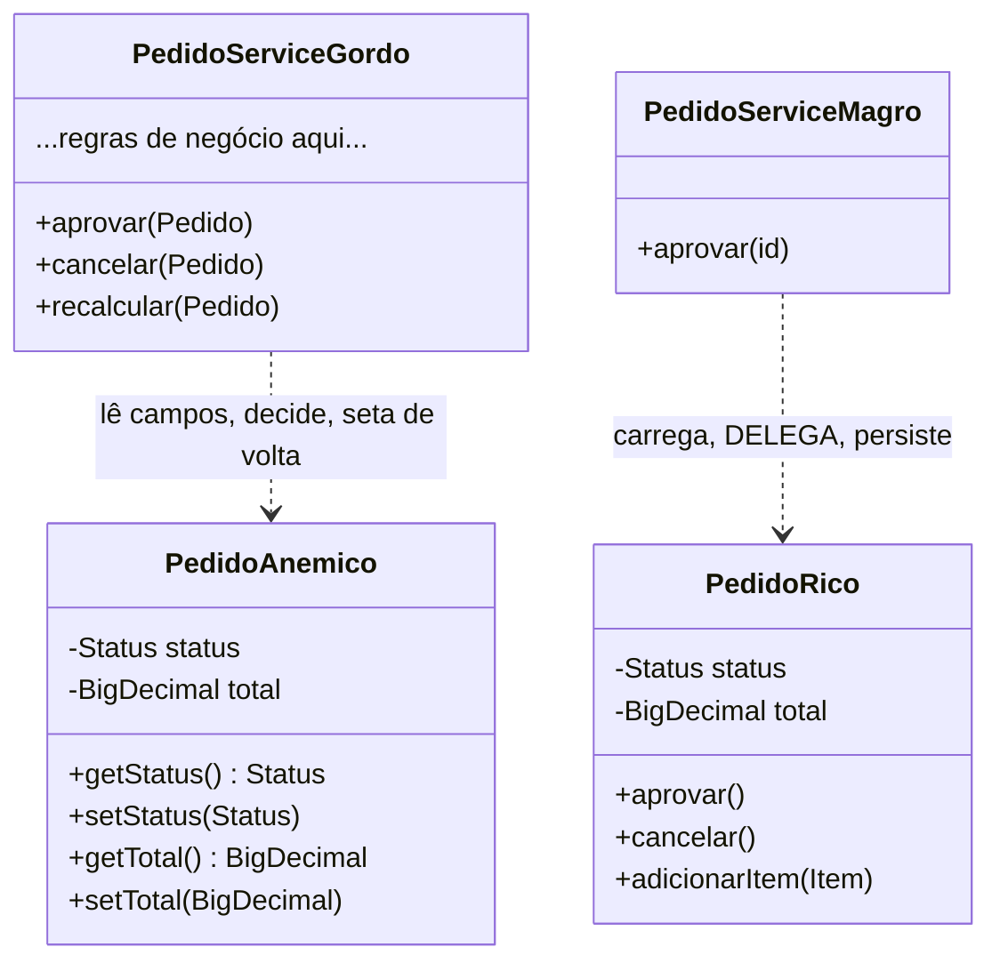

# Rich vs Anemic Domain Model

> [!summary] Resumo
> Um **modelo anêmico** é objeto sem comportamento (só getters/setters) com toda a regra num *service* gordo — programação procedural disfarçada de OO; o **modelo rico** põe a regra dentro da entidade que ela protege, que é [[08 - Acoplamento e coesão|Tell Don't Ask]] aplicado ao domínio.

Você abre uma classe `Pedido`. Lá dentro: um campo `status`, um campo `total`, e umas vinte linhas de `getStatus()`, `setStatus()`, `getTotal()`, `setTotal()`. Nada mais. Nenhuma regra. Nenhuma decisão.

Onde mora a regra "um pedido só pode ser aprovado se estiver pendente e dentro do limite"? Num `PedidoService` de 800 linhas, claro. Você já viu esse código. Talvez você já tenha escrito esse código.

Essa é a pergunta desta nota: **o comportamento mora junto dos dados, ou longe deles?** A resposta divide dois mundos.

## O modelo anêmico: OO no nome, procedural na alma

Martin Fowler batizou e atacou o padrão num [post famoso](https://martinfowler.com/bliki/AnemicDomainModel.html): o **Anemic Domain Model**. Anêmico porque os objetos não têm sangue — não têm comportamento. São sacos de dados.

O sintoma é fácil de reconhecer. As entidades têm só getters e setters. Toda a lógica de negócio vive em classes de "serviço" que recebem a entidade, leem seus campos, decidem, e escrevem de volta.

```java
// ANÊMICO — Pedido é um saco de dados
public class Pedido {
    private Status status;
    private BigDecimal total;
    public Status getStatus() { return status; }
    public void setStatus(Status s) { this.status = s; }
    public BigDecimal getTotal() { return total; }
    public void setTotal(BigDecimal t) { this.total = t; }
}

// ...e a regra mora longe, no service
public class PedidoService {
    public void aprovar(Pedido p) {
        if (p.getStatus() != Status.PENDENTE)
            throw new IllegalStateException("só aprova pendente");
        if (p.getTotal().compareTo(LIMITE) > 0)
            throw new IllegalStateException("acima do limite");
        p.setStatus(Status.APROVADO);   // qualquer um pode setar status
    }
}
```

Repare na crítica de Fowler — ele não foi gentil. Chamou de **anti-padrão** e disse que é "exatamente o tipo de design de estilo procedural que os fanáticos por objetos como eu (e o Eric) vimos combatendo desde os tempos de Smalltalk". A frase que fecha a acusação:

> "Em essência, o problema dos modelos de domínio anêmicos é que eles incorrem em **todos os custos** de um modelo de domínio, **sem render nenhum dos benefícios**."

Por que "todos os custos sem os benefícios"? Você paga o preço de mapear o domínio em classes (ORM, hierarquia, ida-e-volta entre objeto e tabela) mas não colhe a recompensa de OO: encapsulamento, coesão, comportamento polimórfico. Você tem o esqueleto de OO com a fisiologia de um *transaction script*.

E há um custo concreto: com `setStatus()` público, **qualquer linha de qualquer lugar** pode botar o pedido em `APROVADO` sem passar pela regra. A invariante não está protegida — está apenas *documentada num service que você espera que todos chamem*. Isso viola [[02 - Encapsulamento]] na raiz: o objeto não guarda seus próprios invariantes.

## O modelo rico: a regra mora onde ela protege

No **Rich Domain Model**, o comportamento volta para dentro da entidade. A regra "só aprova se pendente e dentro do limite" vira um método do próprio `Pedido`, que protege o seu estado.

```java
// RICO — o Pedido sabe se aprovar e protege seu próprio invariante
public class Pedido {
    private Status status;
    private BigDecimal total;

    public void aprovar() {
        if (status != Status.PENDENTE)
            throw new IllegalStateException("só aprova pendente");
        if (total.compareTo(LIMITE) > 0)
            throw new IllegalStateException("acima do limite");
        this.status = Status.APROVADO;
    }
    // sem setStatus() público — não há porta de fundo para o estado
}

// O service NÃO some — ele encolhe e vira orquestrador
public class PedidoService {
    private final PedidoRepository repo;

    public void aprovar(Long id) {
        Pedido pedido = repo.buscar(id);  // 1. carrega
        pedido.aprovar();                  // 2. delega a REGRA à entidade
        repo.salvar(pedido);               // 3. persiste
    }
}
```

Olhe o que mudou. A regra está num lugar só, fisicamente colada ao estado que ela defende. Não existe `setStatus()` público — para mudar o status, você é *obrigado* a passar por `aprovar()`, que valida. O objeto ficou impossível de corromper de fora.

E note: **o service não desapareceu.** Ele só parou de pensar. No modelo rico, o service vira um **orquestrador**: carrega do repositório, manda a entidade fazer o trabalho, persiste o resultado. Ele cuida da *infraestrutura* (transação, repositório), não da *regra de negócio*. A regra é da entidade.



Leitura do diagrama: à esquerda, o `PedidoAnemico` só tem dados e o `PedidoServiceGordo` carrega toda a inteligência — a seta de dependência aponta para os campos da entidade, que ele manipula de fora. À direita, a inteligência (`aprovar`, `cancelar`) migrou para dentro do `PedidoRico`, e o `PedidoServiceMagro` só faz a coreografia. O peso visual se inverte: o que era um service inchado vira uma entidade densa e um service fino.

## Por que isto é Tell, Don't Ask

Se você leu [[08 - Acoplamento e coesão]], reconheceu o padrão. O modelo anêmico é **Ask**: o service *pergunta* o estado (`getStatus()`, `getTotal()`), decide do lado de fora, e *seta* o resultado de volta. O modelo rico é **Tell**: você *diz* `pedido.aprovar()` e o objeto decide por si.

Rich Domain Model **é** Tell, Don't Ask aplicado ao domínio inteiro, em vez de a um método isolado. É o mesmo princípio em escala: leve o comportamento até os dados, não os dados até o comportamento.

E o efeito é o que [[08 - Acoplamento e coesão]] previa: a regra colada ao dado dá **alta coesão** (o `Pedido` sabe tudo sobre ser um pedido) e **baixo acoplamento** (ninguém de fora precisa conhecer as condições internas de aprovação). O service anêmico era o oposto: baixa coesão (a regra do pedido vivia *fora* dele) e alto acoplamento (o service tinha que conhecer cada campo da entidade).

```mermaid
sequenceDiagram
    participant C as Controller
    participant S as PedidoService (orquestra)
    participant R as PedidoRepository
    participant P as Pedido (rico)

    C->>S: aprovar(id)
    S->>R: buscar(id)
    R-->>S: pedido
    S->>P: aprovar()
    Note over P: valida status == PENDENTE<br/>valida total &lt;= LIMITE<br/>muda o próprio estado
    P-->>S: ok (ou lança exceção)
    S->>R: salvar(pedido)
    S-->>C: aprovado
```

Leitura do diagrama: o service nunca lê nem escreve o `status` diretamente. Ele só pede a entidade no repositório, **delega** a decisão ao `Pedido` (a nota sobre `P` mostra a regra rodando *dentro* dele) e persiste. A inteligência de negócio acontece toda na faixa do `Pedido` — o service é encanamento.

## A fronteira: isto é DDD *tático*

Aqui é onde preciso ser honesto sobre o mapa. Tudo o que vimos — comportamento na entidade, proteger invariantes, modelar tipos do domínio — é o nível **tático** do Domain-Driven Design de Eric Evans. É o nível dos blocos de construção que vivem *dentro* de uma fronteira de contexto.

Dois desses blocos você já tem em [[09 - Identidade, igualdade e imutabilidade]]:

- **Entity** (entidade): objeto definido pela sua *identidade*, não pelos atributos. Um `Pedido` continua o mesmo pedido mesmo que o total mude.
- **Value Object** (objeto de valor): imutável, definido pelos *atributos*, sem identidade própria. Um `Dinheiro(100, BRL)` é igual a qualquer outro `Dinheiro(100, BRL)`.

Essa nota fica no nível tático e para por aqui. O **DDD estratégico** — o mapa de cidades, não de ruas — mora em [[Arquitetura de Software]]. Para você saber onde aprofundar, aqui está cada peça em uma linha:

| Bloco estratégico | Em uma linha | Onde aprende |
| --- | --- | --- |
| **Aggregate** e **raiz de agregado** | Cluster de entidades/VOs com uma raiz que é a *única porta* e garante as invariantes do grupo | [[Arquitetura de Software]] |
| **Bounded Context** | Fronteira onde um modelo é válido e consistente; "pedido" significa coisas diferentes em contextos diferentes | [[Arquitetura de Software]] |
| **Ubiquitous Language** | Vocabulário único compartilhado entre código e especialistas do domínio | [[Arquitetura de Software]] |
| **Domain Event** | Algo relevante que *aconteceu* no domínio (`PedidoAprovado`), modelado explicitamente | [[Arquitetura de Software]] |
| **Repository** | Abstração de coleção que esconde a persistência das entidades | [[Arquitetura de Software]] |
| **Domain Service** | Operação de domínio que não pertence naturalmente a *nenhuma* entidade | [[Arquitetura de Software]] |

> [!info] Lastro
> O termo **Anemic Domain Model** e seu status de anti-padrão são de **Martin Fowler** (post de 2003), que credita **Eric Evans** como co-crítico e cita *Domain-Driven Design* (2003) como a defesa do modelo rico. A divisão **tático × estratégico** é a leitura canônica de DDD: o tático cuida do que está *dentro* de um Bounded Context (Entity, Value Object, Aggregate, Repository, Domain Service); o estratégico cuida das fronteiras entre contextos e da linguagem (Bounded Context, Ubiquitous Language, Context Map). Esta nota cobre o *tático* aplicado a OO; o estratégico vive em [[Arquitetura de Software]]. Os exemplos em Java são simplificações didáticas minhas, não casos reais. Fontes: [Fowler, AnemicDomainModel](https://martinfowler.com/bliki/AnemicDomainModel.html), [Fowler, DomainDrivenDesign](https://martinfowler.com/bliki/DomainDrivenDesign.html), [Wikipedia: Domain-driven design](https://en.wikipedia.org/wiki/Domain-driven_design).

## Quando anêmico é aceitável (OO não é religião)

Antes que você saia refatorando todo getter/setter do mundo: nem tudo precisa de domínio rico. O modelo anêmico é uma ferramenta legítima em alguns lugares.

- **CRUD trivial.** Se a "regra" é só ler e gravar um registro sem nenhuma invariante, uma entidade plana com getters/setters é honesta. Não há comportamento para encapsular — inventar um não traz benefício, só cerimônia.
- **DTOs de fronteira.** O objeto que entra e sai da sua API REST (*request*/*response*) é, e deve ser, um saco de dados. Ele transporta, não decide. Misturar regra de negócio num DTO é que seria o erro.
- **Camadas de transporte e mapeamento.** Objetos que existem só para atravessar uma fronteira (serialização, mensageria) não têm domínio para proteger.

O critério é: **há um invariante a defender?** Se "este estado nunca pode acontecer" é uma frase verdadeira sobre o objeto, ele merece comportamento que defenda esse estado — modelo rico. Se o objeto é só um carregador de dados de passagem, anêmico está certo.

Como [[13 - OO na prática e em entrevista]] vai martelar: OO é ferramenta, não religião. O modelo anêmico vira anti-padrão quando você o usa *onde havia domínio para modelar* e empurrou tudo para um service gordo. Como padrão consciente numa camada sem regras, é só pragmatismo.

## Na prática

No começo da minha carreira, eu escrevia `Service` gigantes. Toda a lógica de negócio morava neles, e as minhas entidades eram só getters e setters — o Anemic Domain Model clássico, embora eu nem soubesse que aquilo tinha nome (ou que era um anti-padrão).

O preço veio depois. Refatorar isso, anos mais tarde, é doloroso: a regra está espalhada por tantos services que mover comportamento para dentro das entidades vira uma cirurgia de risco, com testes frágeis e medo de quebrar coisa que ninguém lembra mais por que existe.

Hoje eu começo do outro lado. Começo com Rich Domain Model. A regra "um pedido só pode ser aprovado se estiver pendente e dentro do limite" vive dentro de `Pedido.aprovar()`, não espalhada em services. Quando a regra mora colada ao dado desde o primeiro commit, ela não tem para onde vazar — e eu não pago a dívida de desfazer isso anos depois.

## Em entrevista

Esse contraste é ouro em entrevista de design porque mostra que você entende *por que* OO existe, não só sintaxe. Falas prontas:

- "**An anemic domain model is procedural code disguised as OO** — objects with only getters and setters, and all the business logic pushed into fat service classes."
- "**Fowler calls it an anti-pattern: you pay all the cost of a domain model and get none of the benefits.**"
- "I prefer a **rich domain model**, where the entity owns its own invariants — `order.approve()` enforces the rule instead of a service mutating its state from outside."
- "**A rich domain model is Tell, Don't Ask applied to the whole domain** — the behavior lives next to the data it protects."
- "This is **tactical DDD** — entities and value objects. Aggregates, bounded contexts, and the ubiquitous language are **strategic DDD**, which is a different conversation."
- "**An anemic model is fine for trivial CRUD or boundary DTOs** — not everything needs a rich domain. The smell is anemia *where there was a domain to model*."

Vocabulário PT → EN:

| Português | Inglês |
| --- | --- |
| modelo de domínio anêmico | anemic domain model |
| modelo de domínio rico | rich domain model |
| anti-padrão | anti-pattern |
| saco de dados | bag of data |
| service gordo / inchado | fat / bloated service |
| script de transação | transaction script |
| invariante | invariant |
| proteger os próprios invariantes | enforce its own invariants |
| orquestrar / orquestrador | orchestrate / orchestrator |
| diga, não pergunte | tell, don't ask |
| DDD tático | tactical DDD |
| DDD estratégico | strategic DDD |
| raiz de agregado | aggregate root |
| contexto delimitado | bounded context |
| linguagem ubíqua | ubiquitous language |

## Veja também

- [[01 - O que é Orientação a Objetos]]
- [[02 - Encapsulamento]] — o modelo rico protege o estado; o anêmico o expõe com setters
- [[03 - Abstração]]
- [[04 - Herança]]
- [[05 - Polimorfismo]]
- [[06 - Interfaces e classes abstratas]]
- [[07 - Composição sobre herança]]
- [[08 - Acoplamento e coesão]] — Rich Domain Model é Tell, Don't Ask aplicado ao domínio
- [[09 - Identidade, igualdade e imutabilidade]] — Entity vs Value Object, os blocos táticos de DDD
- [[11 - Como o modelo OO difere entre linguagens]]
- [[12 - Anti-patterns de OO]]
- [[13 - OO na prática e em entrevista]] — "OO é ferramenta, não religião"
- [[Arquitetura de Software]] — DDD estratégico: Aggregate, Bounded Context, Ubiquitous Language
- [[03-Dominios/Engenharia/Design de Software/SOLID/index|SOLID]] — a engenharia de chegar a baixo acoplamento + alta coesão
