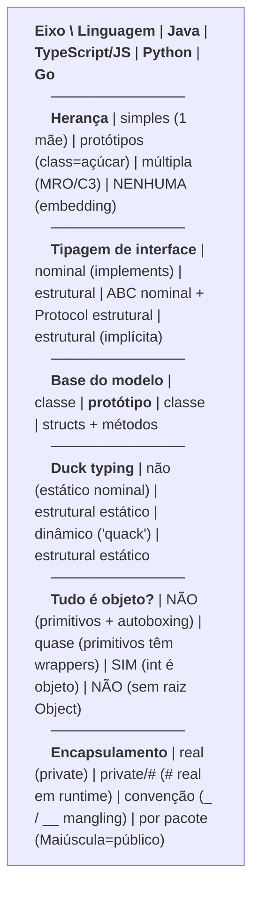
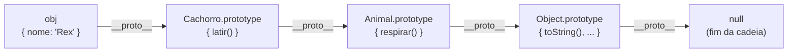
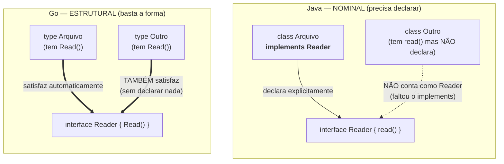

# Como o modelo OO difere entre linguagens

> [!abstract] TL;DR
> "OO" não é uma coisa só — é um guarda-chuva. Cada linguagem encarna o paradigma de um jeito
> diferente, e portar a mentalidade de uma para outra produz código que *funciona* mas soa com
> **sotaque errado**. Os eixos que mais divergem: **herança** (single no Java, múltipla com MRO no
> Python, nenhuma no Go), **tipagem** (nominal no Java vs. estrutural no Go/TS), **base do modelo**
> (classe vs. **protótipo** no JavaScript), **duck typing**, **"tudo é objeto"** vs. primitivos, e
> **encapsulamento** (real vs. convenção). Esta nota é o mapa comparativo; as outras notas do galho
> têm o detalhe conceitual de cada conceito.

## A palavra "OO" mente um pouco

Você aprende [[01 - O que é Orientação a Objetos|orientação a objetos]] em uma linguagem. Aí pega
outra e assume que é tudo igual — afinal, ambas têm classes, objetos, métodos. Erro clássico.

Pense em "carro". Um carro brasileiro tem o volante à esquerda; um inglês, à direita. Os dois são
carros, os dois te levam ao trabalho, mas se você dirigir o inglês como dirige o brasileiro, vai
entrar na rotatória pelo lado errado. "OO" é o mesmo: o conceito é compartilhado, a **encarnação**
muda — e os detalhes da encarnação é que separam código idiomático de código que delata um forasteiro.

A tese desta nota: **OO é uma família de dialetos**, não um idioma único. Quatro linguagens
(Java, TypeScript/JavaScript, Python, Go) que todo mundo chama de "OO" discordam em pontos
estruturais. Vamos percorrer os eixos de divergência um a um.

> [!info] Lastro
> Os pontos centrais aqui são canônicos e verificados na web (junho/2026): a `class` do ES6 é
> [açúcar sintático sobre a herança prototípica](https://developer.mozilla.org/en-US/docs/Web/JavaScript/Reference/Classes)
> ([MDN](https://developer.mozilla.org/en-US/docs/Web/JavaScript/Reference/Classes); o `extends`
> mapeia para a cadeia de protótipos); Go **não tem herança** — usa *struct embedding* e
> [satisfação implícita de interface](https://go.dev/tour/methods/10) (tipagem estrutural); Python
> resolve herança múltipla por [MRO/C3](https://docs.python.org/3/howto/mro.html) e oferece `ABC`
> (nominal) vs. `Protocol` (estrutural, [PEP 544](https://peps.python.org/pep-0544/)); em
> Python/Ruby/Smalltalk **tudo é objeto** (até `int`), enquanto Java separa primitivos de wrappers
> com [autoboxing](https://docs.oracle.com/javase/tutorial/java/data/autoboxing.html) (desde Java 5).
> *Simplificação consciente:* trato C# como "primo do Java" e Ruby/Smalltalk só como referência do
> "tudo é objeto" — o foco são as quatro linguagens do galho. Onde digo "Java", C# geralmente segue
> junto, com exceções (C# tem *structs* de valor; Java até o Project Valhalla não).

## Eixo 1 — Herança: single, múltipla ou nenhuma

A [[04 - Herança|herança]] é o eixo onde as quatro mais divergem. Quantas mães uma classe pode ter?

- **Java / C#**: **herança simples** (single). Uma classe estende *uma* superclasse. Para misturar
  capacidades de várias fontes, você usa **interfaces** (que desde Java 8 podem ter `default
  methods`). Decisão de projeto: evita o "problema do diamante" no nível das classes.
- **Python / C++**: **herança múltipla**. Uma classe pode herdar de várias. O diamante é resolvido
  por **MRO (Method Resolution Order)** via algoritmo **C3** — uma linearização determinística que
  define em que ordem Python procura o método. (Detalhe e exemplo de C3 em [[04 - Herança]].)
- **Go**: **NENHUMA herança**. Não existe `extends`, não existe superclasse. Em vez disso, Go tem
  **struct embedding** (composição com promoção de métodos). É
  [[07 - Composição sobre herança|composição sobre herança]] *imposta pela linguagem* — você não tem escolha.

Repare na assimetria: em Java você *pode* compor mas o caminho fácil é herdar; em Go você *só* pode
compor. A linguagem te empurra para o idioma certo.

```python
# Python — herança múltipla; o MRO/C3 decide a ordem de busca
class Logger:        ...
class Serializable:  ...
class Pedido(Logger, Serializable):  # duas mães, legal
    ...
print(Pedido.__mro__)  # Pedido -> Logger -> Serializable -> object
```

```go
// Go — sem herança; "embedding" promove métodos do tipo embutido
type Logger struct{}
func (Logger) Log(msg string) { /* ... */ }

type Pedido struct {
    Logger // embedded: Pedido.Log existe, mas NÃO é "Pedido is-a Logger"
}
```

O `Pedido` do Go ganha `Log()` de graça — mas isso é **composição com açúcar**, não herança. Não
há relação *is-a*, não há polimorfismo por subtipo de classe. Confundir os dois é o erro nº 1 de
quem chega ao Go vindo do Java.

## Eixo 2 — Tipagem nominal vs. estrutural

Quando é que um tipo "conta como" outro? Há duas filosofias, e elas mudam tudo (veja
[[06 - Interfaces e classes abstratas]]).

**Nominal** (Java, C#): satisfaz se *declara* que satisfaz. Sua classe só é um `Pagavel` se você
escrever `implements Pagavel`. O *nome* manda. Dois tipos com métodos idênticos mas nomes diferentes
são incompatíveis para o compilador.

**Estrutural** (Go, TypeScript): satisfaz se *tem a forma*. Se seu tipo tem todos os métodos que a
interface exige, ele a satisfaz — **sem declarar nada**. A *estrutura* manda. "Se tem patas, bico e
faz quack, é um pato; não preciso de uma certidão de nascimento."

E Python? Python oferece **as duas**: `ABC` (Abstract Base Class) é nominal — você registra/herda
explicitamente; `Protocol` (PEP 544, desde Python 3.8) é estrutural — basta ter a forma, como no Go.

```go
// Go — estrutural: nenhum "implements". Se tem Read([]byte), É um Reader.
type Reader interface { Read(p []byte) (int, error) }

type Arquivo struct{ /* ... */ }
func (Arquivo) Read(p []byte) (int, error) { /* ... */ return 0, nil }
// Arquivo satisfaz Reader automaticamente — Go descobre sozinho.
```

```java
// Java — nominal: a classe TEM que anunciar o contrato.
class Arquivo implements Reader { // sem este "implements", não compila como Reader
    public int read(byte[] p) { /* ... */ return 0; }
}
```

A diferença prática é profunda. Em Go/TS, você pode escrever uma interface *depois* e os tipos
existentes a satisfazem retroativamente — ótimo para desacoplar de bibliotecas que você não controla.
Em Java, o tipo precisa ter sido marcado na origem. O custo do estrutural: acoplamentos *implícitos*
— você pode satisfazer uma interface por acidente, sem saber.

## Eixo 3 — Class-based vs. prototype-based

Aqui mora a maior surpresa para quem vem do Java. **Java, Python, C#, Go são baseados em classe**:
a classe é o molde, o objeto é a peça fundida. Mas **JavaScript é baseado em PROTÓTIPOS**.

Em JS não existe (no fundo) "classe que é um molde". Existem **objetos que apontam para outros
objetos**. Quando você acessa `obj.metodo()` e `obj` não tem `metodo`, o motor sobe pela **cadeia de
protótipos** (`__proto__`) procurando — objeto por objeto — até achar ou bater em `null`.

E a `class` do ES6? É **açúcar sintático**. Por baixo, `class` cria uma função construtora e pendura
os métodos no `prototype`; `extends` apenas configura a cadeia de protótipos. *Não* introduziu um
novo modelo de herança — só deu uma roupa familiar para o mesmo mecanismo prototípico de sempre.

```javascript
const animal = { respira: true };
const cachorro = Object.create(animal); // cachorro.__proto__ === animal
cachorro.late = () => "au";

cachorro.respira; // true — não está em cachorro, veio pela cadeia de protótipos
// Busca: cachorro -> animal -> Object.prototype -> null
```

Por que isso importa em entrevista? Porque "`class` é açúcar sobre protótipos" é uma das perguntas
favoritas de JS, e porque entender a cadeia explica bugs reais (mutações compartilhadas no protótipo,
`this` perdido, `instanceof` percorrendo a cadeia). Veja o diagrama da cadeia mais abaixo.

## Eixo 4 — Duck typing: dinâmico vs. estrutural estático

O **duck typing** — "se grasna como pato, é pato" — é primo do eixo 2, mas com um recorte: *quando* a
checagem acontece (relaciona-se a [[05 - Polimorfismo]]).

- **Python / Ruby**: duck typing **dinâmico**. Ninguém checa o tipo na compilação. Você chama
  `obj.quack()`; se existir em tempo de execução, roda; se não, estoura `AttributeError`. A
  compatibilidade é decidida *no momento do uso*, e só pela parte que você de fato acessa.
- **Go / TypeScript**: tipagem **estrutural estática**. Mesma filosofia do "tem a forma, serve" — mas
  o compilador verifica *antes* de rodar. É duck typing com rede de segurança.

```python
# Python — duck typing dinâmico: nada é checado até a chamada
def fazer_barulho(x):
    return x.quack()   # funciona com QUALQUER objeto que tenha quack()
```

Resumindo o par de eixos 2+4: **nominal** pergunta "qual é o seu nome/linhagem?"; **estrutural**
pergunta "qual é a sua forma?"; **duck typing dinâmico** nem pergunta — só tenta e vê se dá certo.

## Eixo 5 — "Tudo é objeto" vs. primitivos

Quando você escreve `42`, isso é um objeto?

- **Python / Ruby / Smalltalk**: **sim, tudo é objeto**. `42` é instância de `int`; `(42).bit_length()`
  é uma chamada de método legítima. Não há "tipos de segunda classe".
- **Java**: **não** — há uma fronteira. `int`, `double`, `boolean`, `char` etc. são **primitivos**:
  valores crus, sem métodos, guardados direto na memória. Para tratá-los como objetos (ex.: pôr numa
  `List`), Java usa as classes **wrapper** (`Integer`, `Double`...) e o **autoboxing** (desde Java 5)
  converte automaticamente nos dois sentidos. É uma decisão de *performance*: primitivo é barato,
  objeto tem overhead.
- **Go**: nem um nem outro. Go **não é "tudo é objeto"** — tem tipos básicos (`int`, `string`) e
  `structs` com métodos, mas não há uma raiz `Object` universal nem o vocabulário de "tudo herda de
  Object". É um modelo deliberadamente mais simples.

```java
int a = 42;            // primitivo: sem métodos, mora na pilha
Integer b = a;         // autoboxing: Integer.valueOf(42) por baixo
List<Integer> nums = new ArrayList<>();
nums.add(7);           // autoboxing de novo: int 7 -> Integer
```

A pegadinha clássica de Java vive aqui: `Integer x = 200; Integer y = 200; x == y` pode dar `false`
(compara *referências* de objetos), enquanto `int` comparado com `==` compara valores. "Tudo é
objeto" elimina essa classe de bug — ao custo de performance. (Conecta com
[[09 - Identidade, igualdade e imutabilidade|identidade vs. igualdade]].)

## Eixo 6 — Encapsulamento: real, por convenção ou por pacote

Quem garante o `private`? (Detalhe em [[02 - Encapsulamento]].)

- **Java / C#**: encapsulamento **real**, imposto pelo compilador. `private` significa private — o
  código externo *não compila* se tentar acessar.
- **TypeScript**: tem `private` (checado em *compilação*, mas apagado em runtime — é só JS) e os
  **campos privados `#`** (ES2022), que são *de verdade* inacessíveis em runtime.
- **Python**: **convenção**. `_nome` é "pode usar, mas é privado por cavalheirismo". `__nome` (dois
  underscores) ativa **name mangling** — o atributo vira `_Classe__nome`, o que *dificulta* mas
  **não impede** o acesso. "Somos todos adultos consentindo aqui."
- **Go**: encapsulamento **por pacote, via capitalização**. Identificador com inicial **Maiúscula** é
  exportado (público); **minúscula** é privado *ao pacote*. Não há `private`/`public` — a ortografia
  *é* o modificador de acesso.

```go
type Conta struct {
    Saldo   float64 // Maiúscula -> exportado (público fora do pacote)
    titular string  // minúscula -> privado ao pacote
}
```

Curioso: em Python e Go, o controle de acesso é parte da *cultura* (convenção) ou da *ortografia*
(capitalização), não um portão trancado como no Java. Levar a expectativa de `private` "trancado"
para essas linguagens é fonte de frustração — e de código não-idiomático, como veremos.

## A tabela-mestra

Tudo junto, eixo por linguagem. Esta é a nota inteira condensada.



**Leitura do diagrama**: leia cada linha como uma frase comparando as quatro colunas. O padrão que
emerge: **Java** é o mais "cerimonioso" (declarações explícitas, fronteiras rígidas); **Go** é o mais
"enxuto" (sem herança, sem `private`, estrutural); **Python** é o mais "flexível" (múltipla herança,
duck typing dinâmico, encapsulamento por convenção); **JS/TS** é o "infiltrado" — parece OO clássico
por fora (`class`), mas é prototípico por dentro e estrutural na tipagem.

## A cadeia de protótipos do JavaScript

Como o JS resolve `obj.x` quando `obj` não tem `x`? Subindo a cadeia.



**Leitura do diagrama**: ao acessar `obj.respirar()`, o motor procura `respirar` em `obj` — não acha;
sobe para `Cachorro.prototype` — não acha; sobe para `Animal.prototype` — **acha**, e para. Se não
achasse em lugar nenhum, chegaria a `null` e retornaria `undefined` (ou lançaria erro na chamada). É
**exatamente** essa cadeia que `class ... extends ...` monta nos bastidores — por isso "açúcar
sintático". O `instanceof` também caminha por aqui, perguntando "este `prototype` está na sua cadeia?".

## Nominal vs. estrutural, lado a lado

O mesmo objetivo — "este tipo serve como aquela interface?" — resolvido por filosofias opostas.



**Leitura do diagrama**: à esquerda (Java), só o `Arquivo` "conta" como `Reader`, porque escreveu
`implements`; o `Outro`, mesmo tendo o método certo, **não** é aceito — faltou a declaração nominal.
À direita (Go), *ambos* satisfazem `Reader` pelo simples fato de terem o método `Read()` — a forma
basta, ninguém declara nada. O trade-off salta aos olhos: Java é explícito e seguro contra acidentes;
Go é flexível e desacoplado, ao custo de satisfações *implícitas* que ninguém anunciou.

## Na prática: o sotaque errado

Levar a mentalidade de uma linguagem para outra produz código que compila mas soa estranho — como um
estrangeiro tecnicamente correto, mas com sotaque. Três exemplos clássicos:

**Java → Go: procurar herança e não achar.** O dev recém-chegado ao Go quer "uma classe base
`AnimalBase` com método compartilhado, e `Cachorro extends Animal`". Não existe `extends`. Frustrado,
ele tenta emular herança com embedding *fingindo* que é is-a, monta hierarquias profundas de structs
embutidas e fica procurando polimorfismo por subtipo de classe. O idioma certo do Go é
**interfaces pequenas + composição**: aceite a interface `Speaker { Speak() }`, e qualquer struct com
`Speak()` serve. Hierarquia não é o caminho.

**Java → Python: procurar `private` de verdade.** O dev tenta "trancar" atributos com `__saldo` e
acha que está protegido como `private` do Java. Aí descobre que `conta._Conta__saldo` acessa tudo —
e que a comunidade nem usa `__` na maioria dos casos, prefere `_saldo` (um underscore, mero aviso). O
idioma certo do Python é **confiar na convenção** e expor com `@property` quando precisar de lógica de
acesso — não construir muros de `__` que não existem.

**Python/Java → JavaScript: tratar `class` como classe "de verdade".** O dev assume que `class` cria
um molde isolado e se surpreende quando muta o `prototype` e *todas* as instâncias mudam, ou quando
`this` "some" ao passar um método como callback. O idioma certo é **entender que é tudo protótipo por
baixo**: métodos vivem no objeto-protótipo compartilhado, e `this` é definido por *como* a função é
chamada, não por *onde* foi declarada.

O fio condutor: **cada linguagem te empurra para um idioma**. Lutar contra a corrente — herança no
Go, `private` trancado no Python, classe-molde no JS — gera código que delata o forasteiro. Aprender
o dialeto local é metade da fluência. (Veja os [[12 - Anti-patterns de OO|anti-patterns]] que isso
costuma gerar, e como tudo aterça em [[13 - OO na prática e em entrevista]].)

## Em entrevista

Este é um tema de *staff/senior* — entrevistadores usam para distinguir quem "sabe Java" de quem
"entende OO". Frases que demonstram a profundidade certa:

- Sobre JavaScript: *"In JavaScript, `class` is syntactic sugar over prototype-based inheritance — under
  the hood, `extends` just sets up the prototype chain."*
- Sobre Go: *"Go has no inheritance. It uses struct embedding for composition and implicit interface
  satisfaction — a type satisfies an interface just by having the right methods, structurally."*
- Sobre tipagem: *"Java uses nominal typing — you must declare `implements`. Go and TypeScript use
  structural typing — if it has the shape, it fits, no declaration needed."*
- Sobre Python: *"Python resolves multiple inheritance with the MRO using the C3 linearization
  algorithm, and offers both nominal `ABC`s and structural `Protocol`s."*
- Sobre primitivos: *"In Java, primitives like `int` aren't objects — wrappers like `Integer` plus
  autoboxing bridge the gap. In Python, everything is an object, even integers."*
- Frase-síntese: *"OO isn't one model — each language encarnates the paradigm differently, so idiomatic
  code in one language can be an anti-pattern in another."*

**Vocabulário PT → EN:**

- herança simples / múltipla → *single / multiple inheritance*
- baseado em protótipos → *prototype-based*; cadeia de protótipos → *prototype chain*
- açúcar sintático → *syntactic sugar*
- tipagem nominal / estrutural → *nominal / structural typing*
- satisfação implícita de interface → *implicit interface satisfaction*
- composição via embutimento de struct → *struct embedding*
- ordem de resolução de métodos → *method resolution order (MRO)*
- tipagem pato → *duck typing*
- empacotamento automático / desempacotamento → *autoboxing / unboxing*
- classe wrapper / classe invólucro → *wrapper class*
- código não-idiomático → *non-idiomatic code*; idiomático → *idiomatic*
- modificador de acesso → *access modifier*
- mangling de nome → *name mangling*

## Veja também

- [[01 - O que é Orientação a Objetos]] — a base que todas as linguagens compartilham (apesar dos dialetos)
- [[04 - Herança]] — single vs. múltipla, MRO/C3, e por que o Go aposentou a herança
- [[05 - Polimorfismo]] — duck typing dinâmico vs. polimorfismo estático estrutural
- [[06 - Interfaces e classes abstratas]] — o eixo nominal vs. estrutural em detalhe
- [[07 - Composição sobre herança]] — o que o Go impõe e as outras recomendam
- [[02 - Encapsulamento]] — real, por convenção ou por pacote
- [[09 - Identidade, igualdade e imutabilidade]] — onde a pegadinha de `Integer == Integer` vive
- [[03 - Abstração]] · [[08 - Acoplamento e coesão]] · [[10 - Rich vs Anemic Domain Model]]
- [[12 - Anti-patterns de OO]] — o "sotaque errado" virando armadilha
- [[13 - OO na prática e em entrevista]] — onde tudo isso vira resposta de entrevista
