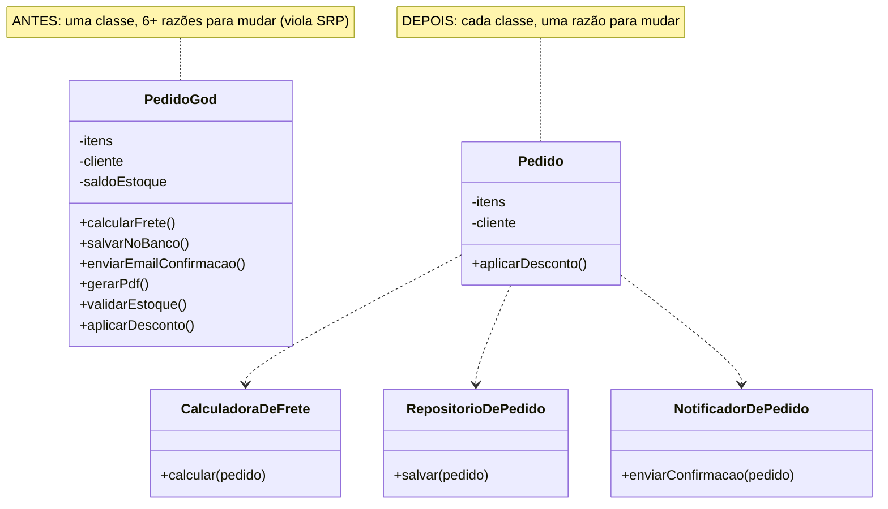
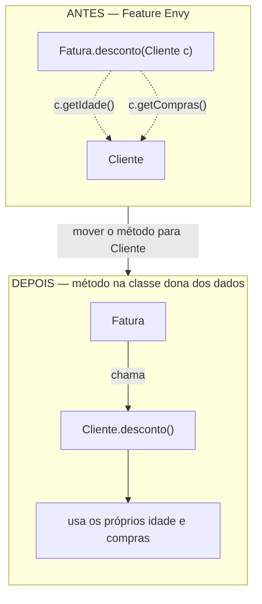
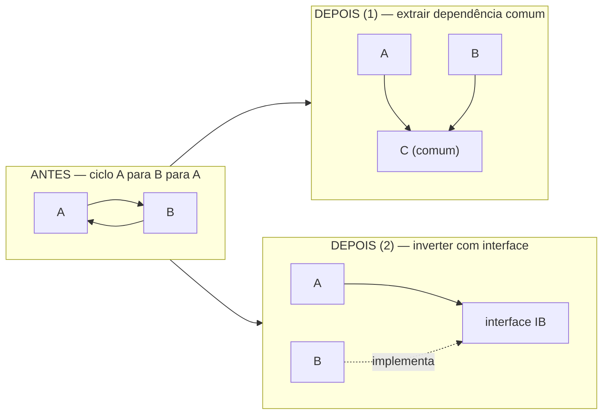
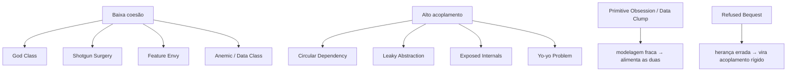

# Anti-patterns de OO

> [!summary] Resumo
> Anti-patterns de OO são **cheiros recorrentes** (*code smells*) que sinalizam baixa coesão ou alto acoplamento; este é o catálogo — sintoma, causa e correção de cada um —, e a maioria deles se cura empurrando o design na direção de [[08 - Acoplamento e coesão]].

Você já entrou numa cozinha e *soube*, antes de abrir a geladeira, que algo estava estragando? Não viu o quê — sentiu o cheiro. Code smell é exatamente isso: não é um bug, o código compila e roda, mas o **cheiro** te avisa que tem podre ali, e que mexer vai doer.

Um *anti-pattern* é o passo seguinte: não só o cheiro, mas o **padrão de erro** que o produziu — uma solução que parece resolver e na verdade enterra o problema mais fundo.

Quase tudo neste catálogo já foi tocado em outras notas do galho. Aqui não vamos reexplicar encapsulamento ou herança; vamos **nomear os monstros**. Porque, como você vai ver no fim, reconhecer o monstro é metade da luta — [[13 - OO na prática e em entrevista]].

Vamos agrupar por tema.

## Classes grandes demais: God Class e Data Class

São os dois extremos da mesma doença: uma classe que faz tudo, e uma que não faz nada.

### God Class (Objeto Deus)

**Sintoma**: uma classe gigante — `Pedido` com 2000 linhas, 40 campos, métodos que calculam frete, persistem no banco, mandam e-mail, geram PDF e validam estoque. Você abre o arquivo e rola, rola, rola.

**Causa**: a classe foi virando ímã. Cada feature nova "tinha tudo a ver com pedido", então foi parar lá. Ninguém violou nada de propósito; a entropia fez o trabalho. No fundo é violação direta de **SRP** ([[03-Dominios/Engenharia/Design de Software/SOLID/index|SOLID]]): a classe tem dezenas de razões para mudar.

**Correção**: quebre por **responsabilidade**. Pergunte "esta classe é responsável por ___" e cada vez que precisar de um "e", nasce uma classe nova: `CalculadoraDeFrete`, `RepositorioDePedido`, `NotificadorDePedido`. Cada peça vira coesa e o acoplamento despenca — veja [[08 - Acoplamento e coesão]].



Leitura do diagrama: à esquerda, `PedidoGod` acumula campos e verbos de mundos diferentes (cálculo, persistência, e-mail, PDF). À direita, cada verbo virou uma classe com um único propósito, e `Pedido` ficou só com o que é *intrínseco* a um pedido. A decomposição é sempre **por responsabilidade**, não por tamanho — não adianta cortar a God Class em três pedaços arbitrários de 666 linhas.

### Data Class (Classe Anêmica de dados)

**Sintoma**: o oposto. Uma classe que é só campos com `get`/`set` e *zero comportamento*. `Endereco` que só guarda rua, número, CEP — e toda lógica que mexe em endereço vive espalhada em *services*.

**Causa**: tratar objetos como structs. É legítimo às vezes (um DTO de borda), mas quando vira o domínio inteiro, você tem um **Anemic Domain Model**.

**Correção**: puxe o comportamento para dentro da classe (*Tell, Don't Ask*). Mas isso é tema de outra nota — não vou duplicar; resumindo: dados sem comportamento empurram a lógica para fora, baixando coesão. Detalhes em [[10 - Rich vs Anemic Domain Model]].

## A lógica na casa errada: Anemic Model e Feature Envy

Se Data Class é a classe sem comportamento, estes dois são sobre comportamento que mora **no lugar errado**.

### Anemic Domain Model

**Sintoma**: entidades de domínio são só getters/setters; toda a regra de negócio vive em classes `*Service`. O `Pedido` não sabe se aprovar — um `PedidoService.aprovar(pedido)` faz isso por ele.

**Causa**: arquitetura "procedural disfarçada de OO" — dados de um lado, funções do outro. Martin Fowler chamou isso de anti-pattern justamente porque *parece* OO mas joga fora o principal benefício: juntar dados e comportamento.

**Correção**: mover a regra para junto dos dados que ela usa. Resumo só; a discussão completa (incluindo quando o anêmico é aceitável) está em [[10 - Rich vs Anemic Domain Model]].

### Feature Envy (Inveja de Funcionalidade)

**Sintoma**: um método usa **mais dados de outra classe do que da própria**. Está "com inveja" das features alheias.

```java
// na classe Fatura, mas só interroga o Cliente
double desconto(Cliente c) {
    return c.getIdade() > 60 ? c.getCompras() * 0.10 : 0.0;
}
```

**Causa**: o método nasceu na classe errada — ou os dados foram parar numa classe e o comportamento noutra.

**Correção**: **mova o método para a classe cujos dados ele inveja**. `desconto()` pertence ao `Cliente`. Coesão sobe (lógica perto dos dados), acoplamento cai (a `Fatura` para de bisbilhotar as entranhas do `Cliente`) — [[08 - Acoplamento e coesão]].



Leitura do diagrama: antes, o método mora em `Fatura` mas todas as setas tracejadas (acesso a dados) apontam para `Cliente` — sinal claro de que está na casa errada. Depois, o método foi para `Cliente`, e os acessos viraram acesso aos *próprios* campos. A regra é simples: o comportamento deve morar onde estão os dados que ele mais usa.

## Dados que andam em bando: Data Clump e Primitive Obsession

Dois cheiros sobre **modelagem fraca de dados** — e que costumam aparecer de mãos dadas.

### Data Clump (Aglomerado de dados)

**Sintoma**: o mesmo grupinho de parâmetros aparece junto em vários lugares — `(double latitude, double longitude)`, `(int dia, int mes, int ano)`, `(String rua, String numero, String cep)`. Onde aparece um, aparecem todos.

**Causa**: existe um conceito de domínio ali (`Coordenada`, `Data`, `Endereco`) implorando para nascer, e ninguém o criou.

**Correção**: **extraia o objeto**. Os três viram um `Endereco`, passado como uma coisa só. Bônus: agora há um lugar para colocar comportamento (validação, formatação) — e o Data Clump deixa de ser também uma Data Class.

### Primitive Obsession (Obsessão por primitivos)

**Sintoma**: representar conceitos de domínio com tipos primitivos — `String cpf`, `String email`, `BigDecimal valor` solto, `int` para dinheiro. O compilador não te impede de somar um CPF com um CEP.

**Causa**: primitivo é o caminho de menor resistência. Mas `String` não valida formato, não carrega regra, não tem identidade própria.

**Correção**: crie **value objects** — `Cpf`, `Email`, `Money`. Tipos pequenos, imutáveis, que validam no construtor e carregam o comportamento do conceito. Aí `pagar(Money)` nunca recebe um CEP por engano. Value objects são o coração de [[09 - Identidade, igualdade e imutabilidade]].

> [!tip] Os dois são primos
> Data Clump e Primitive Obsession quase sempre andam juntos: o aglomerado `(rua, numero, cep)` *são* três primitivos que deveriam ser um value object. Extrair o objeto cura os dois de uma vez.

## Mudanças que se espalham: Shotgun Surgery e Circular Dependency

Aqui o cheiro não está numa classe — está na **topologia** das dependências.

### Shotgun Surgery (Cirurgia com Espingarda)

**Sintoma**: uma mudança *simples e única* — "adicionar um campo `desconto`" — obriga você a tocar em **muitas classes diferentes**. Um tiro de espingarda: o estilhaço atinge tudo.

**Causa**: uma responsabilidade foi **espalhada** por várias classes (baixa coesão). O conceito "desconto" não tem dono; mora em pedacinhos por todo lado.

**Correção**: **junte o que muda junto**. Puxe a responsabilidade espalhada de volta para uma classe coesa. (É o inverso da God Class: lá você divide demais o que está junto; aqui você junta o que foi dividido demais.) Veja [[08 - Acoplamento e coesão]].

### Circular Dependency (Dependência Circular)

**Sintoma**: `A` depende de `B`, que depende de `A`. Ou um ciclo mais longo: `A → B → C → A`. Você não consegue entender, testar ou compilar um sem o outro.

**Causa**: as duas classes compartilham um conceito que não foi extraído, ou a dependência está apontando para o lado errado.

**Correção**: duas saídas clássicas — (1) **extraia a dependência comum** para uma terceira classe `C`, e deixe `A → C ← B`; ou (2) **inverta com uma interface** (DIP de [[03-Dominios/Engenharia/Design de Software/SOLID/index|SOLID]]): `A` passa a depender de uma interface que `B` implementa, quebrando o ciclo. Mais sobre depender de abstrações em [[06 - Interfaces e classes abstratas]].



Leitura do diagrama: à esquerda, as setas formam um laço fechado — não há "começo". As duas curas quebram o laço: extrair `C` faz as duas dependerem de um terceiro neutro (setas convergem, não voltam); inverter com `IB` faz `B` apontar *para cima*, para a abstração, em vez de `A` apontar para o concreto de `B`. Em ambos, o ciclo some.

## Hierarquias mal feitas: Yo-yo e Refused Bequest

Quando o problema é **herança** ([[04 - Herança]]) usada onde não devia.

### Yo-yo Problem

**Sintoma**: para entender um único fluxo, você fica **subindo e descendo** uma hierarquia profunda — `A` chama método de `B`, que está sobrescrito em `C`, que volta a chamar `super` de `B`... Seu olho vira um ioiô entre arquivos.

**Causa**: hierarquia profunda demais. Cada nível adicionou um pedaço do comportamento, e o fluxo real ficou fatiado em cinco classes verticais.

**Correção**: **hierarquias rasas**. Achate a árvore; prefira [[07 - Composição sobre herança]], que põe as peças *lado a lado* (você lê na horizontal, numa classe só) em vez de empilhadas. Uma boa regra: se você precisa de mais de dois ou três níveis, desconfie.

### Refused Bequest (Herança Recusada)

**Sintoma**: uma subclasse herda métodos que **não usa, não fazem sentido para ela, ou que ela sobrescreve para lançar exceção**. O clássico `Penguin extends Bird` com `voar()` jogando `UnsupportedOperationException`.

**Causa**: a herança foi usada para *reaproveitar código*, não para modelar um "é-um" honesto. O pinguim *é* uma ave, mas a superclasse `Bird` assumiu errado que toda ave voa.

**Correção**: ou a hierarquia está errada (extraia `AveQueVoa`/`AveQueNaoVoa`, ou componha o comportamento de voo), ou você está violando **LSP** ([[03-Dominios/Engenharia/Design de Software/SOLID/index|SOLID]]): a subclasse deveria poder substituir a superclasse sem surpresas, e lançar exceção num método herdado é a surpresa que quebra o contrato. Quando a herança "recusa a herança", quase sempre o certo é [[07 - Composição sobre herança]].

## Encapsulamento e abstração furados: Exposed Internals e Leaky Abstraction

Dois cheiros sobre **fronteiras que vazam**.

### Exposed Internals (Entranhas Expostas)

**Sintoma**: getters/setters públicos para tudo, ou — pior — métodos que devolvem a referência **mutável** de uma coleção interna. Quem chamar `getItens()` pode dar `.clear()` na sua lista interna e você nem fica sabendo.

```java
// VAZA: devolve a lista interna; qualquer um a modifica
public List<Item> getItens() { return this.itens; }
```

**Causa**: gerar getter/setter no automático, sem perguntar se aquilo *precisa* ser exposto. O objeto perde controle dos próprios invariantes.

**Correção**: exponha **comportamento, não estado**. Em vez de `getItens()` mutável, ofereça `adicionarItem(item)` e devolva uma cópia ou view imutável quando precisar ler. É encapsulamento na veia — [[02 - Encapsulamento]].

### Leaky Abstraction (Abstração Vazada)

**Sintoma**: a interface **vaza sua implementação**. Um `Repository` que deveria abstrair "guardar e buscar entidades" expõe um `executeRawSQL(String)`. Agora todo cliente sabe que por baixo é um banco SQL.

```java
interface RepositorioDeUsuario {
    Usuario buscarPorId(Long id);
    void salvar(Usuario u);
    List<Usuario> executeRawSQL(String sql);  // VAZA: o "como" furou o "o quê"
}
```

**Causa**: a abstração foi conveniente em vez de honesta — alguém precisava de uma query específica e furou a interface em vez de modelar a necessidade.

**Correção**: a interface deve expor **o quê**, nunca **o como**. Troque por `buscarPorEmail(String)` ou `buscarAtivos()` — métodos que falam a linguagem do domínio, não a do banco. Se a implementação trocar para um NoSQL ou um cache, ninguém percebe. É o ponto central de [[03 - Abstração]].

> [!info] Lastro
> A maioria destes nomes vem do **catálogo de code smells de Martin Fowler** (*Refactoring*, 1999/2018, com Kent Beck): God Class (Large Class), Data Class, Data Clump, Feature Envy, Shotgun Surgery, Primitive Obsession, Refused Bequest. **Anemic Domain Model** é termo de Fowler (artigo de 2003). **Leaky Abstraction** é a "lei" de **Joel Spolsky** (2002). **Yo-yo Problem** vem de Taenzer, Ganti & Podar (1989). **Circular Dependency** e **God Object** são vocabulário corrente de engenharia. Os opcionais abaixo (Poltergeist, Sequential Coupling) vêm de Brown et al., *AntiPatterns* (1998). Os exemplos de código são simplificações didáticas minhas, não casos reais.

## Bônus: três anti-patterns menores

Aparecem menos em entrevista, mas vale reconhecer o cheiro:

- **Poltergeist** (objeto-fantasma): uma classe sem estado real e vida curta, que só existe para chamar outra — `IniciadorDoProcesso` que tem um método e some. **Correção**: corte o intermediário; chame o destino direto.
- **Sequential Coupling** (acoplamento temporal): a classe *exige* que seus métodos sejam chamados numa ordem específica — `init()` antes de `start()` antes de `stop()` — e quebra silenciosamente se você errar a sequência. **Correção**: torne a ordem impossível de errar (construtor que já deixa o objeto pronto, ou *builder*).
- **Base Bean**: herdar de uma classe utilitária só para reusar seus métodos (`MeuServico extends StringUtils`). É herança por conveniência, não por "é-um" — primo do Refused Bequest. **Correção**: [[07 - Composição sobre herança]] (use a utilidade, não herde dela).

## Como tudo se conecta

Recue e olhe o catálogo inteiro. Quase todos esses cheiros são **sintomas de duas doenças de base**:

- **Baixa coesão**: God Class, Shotgun Surgery, Feature Envy, Anemic/Data Class — coisas que pertencem juntas estão separadas, ou vice-versa.
- **Alto acoplamento**: Circular Dependency, Leaky Abstraction, Exposed Internals, Yo-yo — módulos que sabem demais uns dos outros.



Leitura do diagrama: os anti-patterns não são uma lista de coincidências — são **folhas** de duas raízes. Por isso a cura quase sempre é a mesma família de manobras: extrair, mover, inverter, encapsular — tudo empurrando o sistema para **alta coesão + baixo acoplamento** ([[08 - Acoplamento e coesão]]). E por isso reconhecer o cheiro já é metade da refatoração: nomeado o monstro, você quase sempre já sabe a saída.

## Tabela-resumo: sintoma → anti-pattern → correção

| Sintoma | Anti-pattern | Correção |
| --- | --- | --- |
| Classe gigante que faz tudo | God Class | Quebrar por responsabilidade (SRP) |
| Classe só com get/set, sem comportamento | Data Class / Anemic Model | Mover comportamento para junto dos dados |
| Método usa mais dados de outra classe | Feature Envy | Mover o método para a classe dona dos dados |
| Mesmo grupo de parâmetros em vários lugares | Data Clump | Extrair um objeto |
| Primitivos para conceitos de domínio | Primitive Obsession | Criar value objects (Cpf, Email, Money) |
| Mudança simples toca muitas classes | Shotgun Surgery | Juntar a responsabilidade espalhada |
| A depende de B que depende de A | Circular Dependency | Extrair dependência comum ou inverter com interface |
| Subir/descer hierarquia profunda p/ entender | Yo-yo Problem | Achatar a hierarquia; preferir composição |
| Subclasse não usa / lança exceção em método herdado | Refused Bequest | Corrigir hierarquia ou compor (viola LSP) |
| Getter expõe coleção interna mutável | Exposed Internals | Expor comportamento, não estado |
| Interface vaza o "como" (executeRawSQL) | Leaky Abstraction | Modelar o "o quê" do domínio |
| Objeto sem estado que só repassa chamada | Poltergeist | Cortar o intermediário |
| Métodos exigem ordem de chamada | Sequential Coupling | Tornar a ordem impossível de errar |
| Herdar de utilitário só para reusar método | Base Bean | Compor em vez de herdar |

Leitura da tabela: esta é a folha de cola do refatorador. Você raramente "decora" anti-patterns — você sente o **sintoma** (coluna 1), nomeia o **padrão** (coluna 2), e a **correção** quase sempre cai por gravidade (coluna 3). É o ciclo de [[13 - OO na prática e em entrevista]] em forma de tabela.

## Em entrevista

Reconhecer cheiros ao vivo, no code review ou no design, é o que separa pleno de sênior. Tenha estas falas prontas:

- "**This is a God Class — it has too many responsibilities, so it violates SRP.** I'd split it by responsibility into smaller, cohesive classes."
- "**This method has Feature Envy** — it uses another class's data more than its own, so I'd move it to the class that owns the data."
- "**This is Primitive Obsession.** Passing a raw `String` for a CPF means nothing validates it — I'd introduce a `Cpf` value object."
- "**A simple change forces edits across many classes — that's Shotgun Surgery.** The responsibility is scattered; I'd consolidate it into one cohesive place."
- "**This subclass refuses its bequest** — it throws on an inherited method, which breaks LSP. The hierarchy is wrong; I'd favor composition."
- "**That's a leaky abstraction** — the interface exposes `executeRawSQL`, so it leaks that it's backed by a SQL database. The interface should express *what*, not *how*."
- "**Most of these smells are symptoms of low cohesion or high coupling** — recognizing them is already half the refactoring."

Vocabulário PT → EN:

| Português | Inglês |
| --- | --- |
| anti-padrão | anti-pattern |
| cheiro de código | code smell |
| objeto deus / classe gigante | God Class / Large Class |
| modelo de domínio anêmico | anemic domain model |
| inveja de funcionalidade | feature envy |
| aglomerado de dados | data clump |
| obsessão por primitivos | primitive obsession |
| objeto de valor | value object |
| cirurgia com espingarda | shotgun surgery |
| dependência circular | circular dependency |
| problema do ioiô | yo-yo problem |
| herança recusada | refused bequest |
| entranhas expostas | exposed internals |
| abstração vazada | leaky abstraction |
| refatorar | to refactor |
| invariante | invariant |

## Veja também

- [[01 - O que é Orientação a Objetos]]
- [[02 - Encapsulamento]] — a cura de Exposed Internals
- [[03 - Abstração]] — a cura de Leaky Abstraction
- [[04 - Herança]] — hierarquias rasas contra Yo-yo
- [[05 - Polimorfismo]]
- [[06 - Interfaces e classes abstratas]] — inverter dependências
- [[07 - Composição sobre herança]] — a cura de Refused Bequest e Base Bean
- [[08 - Acoplamento e coesão]] — a raiz de quase todos esses cheiros
- [[09 - Identidade, igualdade e imutabilidade]] — value objects contra Primitive Obsession
- [[10 - Rich vs Anemic Domain Model]] — o detalhe de Anemic/Data Class
- [[11 - Como o modelo OO difere entre linguagens]]
- [[13 - OO na prática e em entrevista]] — reconhecer o cheiro é metade da refatoração
- [[03-Dominios/Engenharia/Design de Software/SOLID/index|SOLID]] — SRP, LSP, DIP por trás das curas
- [[Design Patterns]] — muitas curas têm nome de padrão
