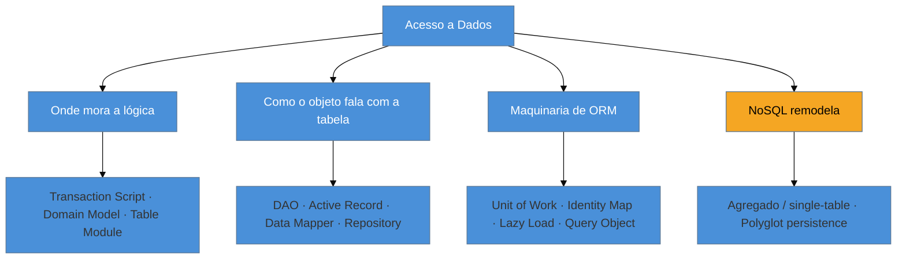

# Panorama do acesso a dados

> [!abstract] TL;DR
> Esta é a abertura da família **Acesso a Dados** — os padrões que resolvem *como um objeto conversa
> com o armazenamento*. Todos nascem do mesmo atrito: o **descasamento objeto-relacional** (*impedance
> mismatch*) — objetos são hierárquicos, têm comportamento e se referenciam por ponteiros; tabelas são
> planas, só guardam dados e se ligam por chaves estrangeiras. A família se organiza em três grupos:
> **onde mora a lógica** (Transaction Script, Domain Model, Table Module), **como o objeto fala com a
> tabela** (DAO, Active Record, Data Mapper, Repository) e a **maquinaria de ORM** (Unit of Work,
> Identity Map, Lazy Load, Query Object) — e o **NoSQL** remodela tudo no fim. O eixo dorsal é o debate
> **Active Record × Data Mapper**. A lente deste galho não é a linguagem, é o **ORM**: qual framework
> encarna qual padrão.

## O atrito que gera todos esses padrões

Você tem um objeto `Pedido` com uma lista de `Item`, um `Cliente` associado, e métodos que calculam total e aplicam desconto. Você precisa guardá-lo num banco relacional — onde não existe "lista dentro de linha", nem "método", nem "referência por ponteiro". Existe uma tabela `pedido`, uma tabela `item` com uma chave estrangeira `pedido_id`, e um `JOIN` para reuni-los. Salvar seu objeto exige **traduzir** um grafo de objetos numa porção de linhas planas; carregá-lo exige o caminho inverso.

Esse atrito tem nome: **descasamento objeto-relacional** (*object-relational impedance mismatch*). Objetos e tabelas modelam o mundo de formas incompatíveis — herança, associações bidirecionais, identidade por referência de um lado; normalização, chaves estrangeiras, identidade por valor do outro. **Toda** a família de padrões de acesso a dados existe para gerenciar esse atrito: cada padrão é uma resposta diferente à pergunta "como faço meus objetos e minhas tabelas conviverem sem que um contamine o outro?".

> [!question]- O ORM não resolveu isso de vez?
> Os ORMs (Object-Relational Mappers) **automatizam** boa parte da tradução — mas não fazem o atrito sumir; escondem-no atrás de uma abstração. E, como toda abstração sobre algo essencialmente diferente, ela **vaza**: o *N+1*, a `LazyInitializationException`, o *flush* em hora inesperada são o descasamento reaparecendo. Entender os padrões por baixo do ORM é o que te permite depurar quando a abstração vaza — exatamente como no [[22 - Reconhecer GoF nos frameworks|GoF dentro dos frameworks]].

## O mapa da família

- **Onde mora a lógica** — antes de acessar o banco, você decide *onde a regra de negócio vive*: espalhada por scripts de caso de uso (Transaction Script), rica dentro dos objetos (Domain Model) ou concentrada num objeto por tabela (Table Module). Essa escolha condiciona todo o resto.
- **Como o objeto fala com a tabela** — o coração da família: o objeto **é** a linha e sabe se salvar (Active Record)? Ou um tradutor externo cuida disso, deixando o domínio ignorante do banco (Data Mapper)? DAO e Repository são fachadas de acesso sobre essas escolhas.
- **Maquinaria de ORM** — os padrões que fazem um Data Mapper sério funcionar: agrupar mudanças numa transação (Unit of Work), garantir uma instância por linha (Identity Map), carregar sob demanda (Lazy Load), montar consultas como objetos (Query Object).
- **NoSQL remodela** — quando o armazenamento não é relacional, o design **inverte**: modela-se por padrão de acesso, não por normalização (agregado, single-table), e escolhe-se o banco certo para cada carga (polyglot persistence).

## O eixo dorsal: Active Record × Data Mapper

Se você guardar uma só distinção desta família, guarde esta. São as **duas filosofias rivais** de como o objeto fala com a tabela:

| | **Active Record** | **Data Mapper** |
| --- | --- | --- |
| Ideia | o objeto **é** a linha e sabe se persistir (`user.save()`) | um **tradutor externo** move dados entre objeto e banco; o objeto não sabe do banco |
| Domínio | acoplado ao esquema da tabela | **ignorante** da persistência (domínio puro) |
| Encarnado por | Rails, Django ORM, Laravel Eloquent | Hibernate/JPA, SQLAlchemy, Doctrine |
| Brilha em | CRUD, apps de dados, produtividade rápida | domínio rico, testabilidade, complexidade alta |
| Custo | vira God object; difícil testar sem banco | mais cerimônia, curva de aprendizado |

A regra prática de Fowler: **comece com Active Record** pela produtividade; **evolua para Data Mapper** quando a complexidade do domínio justificar a separação. Não é "um é superior" — são otimizados para casos diferentes.

## A lente deste galho: cross-ORM, não cross-linguagem

No catálogo GoF, a lente era "o mesmo padrão em Java/TS/Python/Go". Aqui ela **muda**: em acesso a dados, o contraste revelador é **qual ecossistema de ORM encarna qual padrão**. Active Record é a alma do Rails e do Django; Data Mapper é a do Hibernate e do SQLAlchemy; Repository é o Spring Data; Query Object é a Criteria API / QueryDSL / Specifications. Reconhecer o padrão por trás do seu ORM é o que explica seus comportamentos — e suas armadilhas.

## Como usar este catálogo

Como a família GoF, esta é de **consulta**: cada nota é autocontida, com o padrão, os ORMs que o encarnam, e uma seção **Armadilhas** reforçada sobre *quando não usar*. Há sobreposição com [[03-Dominios/Tecnologia/Java/index|Java (persistência)]] e [[03-Dominios/Engenharia/Dados/index|Engenharia de Dados]] — é intencional; cross-link como "aprofunde", não dependência. Num sistema legado, você vai **encontrar** um DAO de 2008, um Active Record inchado ou um Table Module .NET — e nomeá-los é o primeiro passo para trabalhar com eles.

## Armadilhas comuns

> [!warning] Escolher Active Record ou Data Mapper por moda, não por caso
> **O que acontece:** adota-se Data Mapper "porque é mais arquiteturalmente puro" num CRUD simples, ou Active Record num domínio riquíssimo que sofre com o acoplamento ao banco.
> **Por quê:** os dois servem a casos opostos. Data Mapper paga cerimônia por separação que um CRUD não precisa; Active Record paga acoplamento por produtividade que um domínio complexo não pode arcar.
> **Como evitar:** deixe a **complexidade do domínio** decidir. CRUD e apps de dados → Active Record. Domínio rico, regras densas, alta testabilidade → Data Mapper. Comece simples e evolua quando doer.

> [!warning] Achar que o ORM elimina o descasamento
> **O que acontece:** trata-se o ORM como se objetos e tabelas fossem a mesma coisa, e leva-se um susto com N+1, lazy loading, ou uma entidade "mágica" que dispara SQL ao acessar um getter.
> **Por quê:** o ORM **esconde** o descasamento, não o elimina — e a abstração vaza justamente nos pontos onde objeto e tabela discordam (associações, carregamento, identidade, transação).
> **Como evitar:** saiba quais padrões seu ORM implementa (Unit of Work, Identity Map, Lazy Load) e onde eles vazam. O ORM é uma conveniência sobre um problema real, não um apagador dele.

> [!warning] Adicionar camadas de acesso "por padrão"
> **O que acontece:** empilha-se DAO **sobre** Repository **sobre** o ORM, cada camada só repassando pra próxima, "porque é boa prática ter camadas".
> **Por quê:** cada camada de acesso deve **conter** algo (uma decisão, uma abstração, uma fronteira). Camadas que só repassam são cerimônia — a mesma abstração prematura que a família GoF combate, aplicada à persistência.
> **Como evitar:** cada camada precisa justificar sua existência. Spring Data já te dá o Repository sobre o Data Mapper; um DAO anêmico por cima é redundante.

## Como explicar em inglês

> "Every data access pattern exists to manage one friction: the object-relational impedance mismatch. Objects are hierarchical, have behavior, and reference each other by pointers; relational tables are flat, hold only data, and link by foreign keys. The family splits into where the logic lives — Transaction Script, Domain Model, Table Module — how the object talks to the table — DAO, Active Record, Data Mapper, Repository — and the ORM machinery like Unit of Work and Identity Map. The one distinction I always anchor on is Active Record versus Data Mapper: in Active Record the object *is* the row and knows how to save itself, which is great for CRUD but couples the domain to the schema; in Data Mapper a separate translator keeps the domain ignorant of the database, which is better for rich domains and testability. And the ORM doesn't remove the mismatch — it hides it, which is why it leaks as N+1 and lazy-loading exceptions."

| PT | EN |
| --- | --- |
| descasamento objeto-relacional | object-relational impedance mismatch |
| acesso a dados | data access |
| camada de persistência | persistence layer |
| domínio ignorante do banco | persistence-ignorant domain |
| abstração que vaza | leaky abstraction |
| CRUD (criar/ler/atualizar/apagar) | CRUD |
| mapeamento objeto-relacional | object-relational mapping (ORM) |

## O que vem a seguir

Antes de decidir *como* o objeto fala com a tabela, decide-se **onde a lógica de negócio mora** — porque essa escolha condiciona todos os padrões de acesso. Começamos pela resposta mais simples e direta: a lógica como um roteiro procedural por caso de uso.

- [[02 - Transaction Script]] — lógica procedural direto sobre o banco; simples, e onde apodrece.
- [[03 - Domain Model]] — o oposto: lógica rica dentro dos objetos.
- [[08 - Data Mapper]] · [[06 - Active Record]] — o eixo dorsal, para quando quiser ir direto ao debate.

## Veja também

- [[03-Dominios/Tecnologia/Java/index|Java]] — JPA/Hibernate, a encarnação Data Mapper mais usada no vault.
- [[03-Dominios/Engenharia/Dados/index|Engenharia de Dados]] — modelagem de dados e o lado analítico da persistência.
- [[03-Dominios/Engenharia/Design de Software/Padrões de Projeto/index|Padrões de Projeto]] — o galho-pai e as outras famílias.

## Fontes

- **Martin Fowler** — *Patterns of Enterprise Application Architecture* (2002) — a fonte canônica de toda esta família (data source, domain logic, O/R behavioral patterns).
- **Martin Fowler** — [*OrmHate*](https://martinfowler.com/bliki/OrmHate.html) — por que o descasamento objeto-relacional é real e os ORMs o gerenciam, não o eliminam.
- **Matthias Noback** — [*Active Record versus Data Mapper*](https://matthiasnoback.nl/2022/08/simple-solutions-1-active-record-versus-data-mapper/) — o debate dorsal com exemplos.
- **Thoughtful Code** — [*ORM Patterns: Active Record vs Data Mapper*](https://www.thoughtfulcode.com/orm-active-record-vs-data-mapper/) — os trade-offs de cada um.
