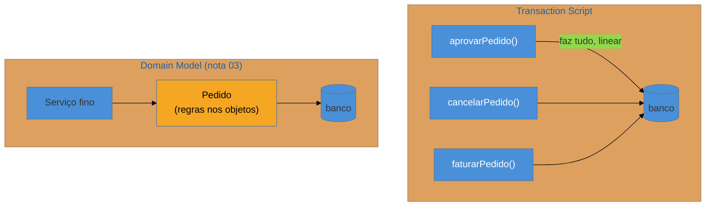

# Transaction Script

> [!abstract] TL;DR
> O **Transaction Script** organiza a lógica de negócio como um **procedimento por caso de uso** — um
> "roteiro" por transação que valida, calcula e mexe no banco, de forma linear e direta. É a resposta
> mais **simples e honesta** para lógica pouca: fácil de escrever, fácil de seguir, sem cerimônia de
> modelo de objetos. Brilha em CRUD, apps de dados e prazos curtos. **Apodrece** quando a lógica
> cresce: a mesma regra se **duplica** entre scripts, e o método vira um monstro de 200 linhas. É o
> ponto de partida do qual se evolui para o [[03 - Domain Model]] quando a complexidade justifica. A
> armadilha central é insistir nele quando o domínio já ficou complexo demais.

## Um roteiro por caso de uso

Você precisa implementar "aprovar pedido". A saída mais direta: um método que faz **tudo, na ordem** — busca o pedido, valida se está pendente, checa se o limite de crédito comporta, muda o status para aprovado, grava, e dispara o e-mail de confirmação. Um roteiro linear, de cima para baixo, que você lê como uma receita. Cada caso de uso do sistema (aprovar, cancelar, faturar) vira um script desses.

Isso é o Transaction Script: a lógica de negócio **organizada por procedimento**, cada um tratando uma requisição do início ao fim, geralmente conversando direto com o banco (via SQL, um gateway ou um DAO). Não há um modelo de objetos rico onde o comportamento mora — a inteligência está **nos scripts**, e os dados são estruturas passivas que eles manipulam.

Para pouca lógica, isso é uma **virtude**, não um defeito. Não há indireção, não há abstração para entender: o que o código faz está escrito na sequência em que acontece. Um dev novo lê o script e entende o caso de uso inteiro sem navegar por dez classes.

## A ideia (e o contraste com Domain Model)

No Transaction Script, a regra vive **em cada roteiro**. No Domain Model, a regra vive **nos objetos** e os roteiros ficam finos. Repare o risco já no diagrama: se "validar se o pedido pode mudar de status" é preciso em `aprovar`, `cancelar` e `faturar`, essa regra tende a ser **reescrita** nos três scripts.

## Onde ele aparece (e onde é a resposta certa)

Transaction Script não é "código ruim de júnior" — é uma escolha de arquitetura legítima, e a mais comum na prática. Você o encontra em: **services/controllers procedurais**, **stored procedures**, **funções serverless** simples, e a maior parte do código CRUD do mundo. É a resposta certa quando:

- A lógica de negócio é **pouca e rasa** (validações simples, sem regras que interagem).
- O sistema é essencialmente **CRUD** ou relatórios sobre dados.
- O time é pequeno, o prazo é curto, e a clareza imediata vale mais que a evolução de longo prazo.

Combina naturalmente com os padrões de fonte de dados mais simples — um [[07 - Gateways|Table Data Gateway]] ou um [[05 - DAO (Data Access Object)|DAO]] — porque o script precisa apenas de um jeito direto de ler e gravar linhas.

## Armadilhas comuns

> [!warning] Duplicação da mesma regra entre scripts
> **O que acontece:** a regra "um pedido só muda de status se estiver pendente e dentro do limite" aparece copiada em `aprovar`, `cancelar` e `faturar`. Um dia a regra muda, e você corrige em dois dos três lugares.
> **Por quê:** sem um modelo de objetos onde a regra **more uma vez**, cada script reimplementa a lógica de que precisa. Quanto mais casos de uso compartilham regras, mais a duplicação cresce — é o sintoma clássico de que o Transaction Script está passando do ponto.
> **Como evitar:** extraia regras compartilhadas para funções/objetos reutilizáveis. Quando a duplicação vira regra e não exceção, é o sinal de migrar para um [[03 - Domain Model]].

> [!warning] O script que vira um God method
> **O que acontece:** um caso de uso complexo cresce até virar um método de 150–300 linhas, com muitos `if` aninhados, chamadas ao banco no meio da lógica e responsabilidades misturadas.
> **Por quê:** o Transaction Script não impõe estrutura interna; nada impede o roteiro de inchar. Sem a decomposição que um modelo de objetos naturalmente induz, a complexidade se acumula no procedimento.
> **Como evitar:** quebre o script em passos nomeados; extraia sub-rotinas. Se mesmo assim ele resiste, a complexidade do domínio provavelmente já pede um Domain Model.

> [!warning] Lógica de negócio dentro do controller (misturada com HTTP)
> **O que acontece:** o Transaction Script é escrito **no controller**, colando validação de request, regra de negócio e acesso a banco na mesma classe.
> **Por quê:** confunde-se "lógica simples" com "não precisa de camada". Misturar HTTP com regra de negócio dificulta testar a regra sem subir a web e reaproveitá-la em outro canal (fila, CLI).
> **Como evitar:** o Transaction Script pode ser simples **e** morar numa camada de serviço própria, separada do controller. Simplicidade não é desculpa para acoplar transporte e negócio.

## Como explicar em inglês

> "Transaction Script organizes business logic as one procedure per use case — a straight-line script that validates, computes, and touches the database. It's the simplest, most honest approach when the logic is thin: no object-model ceremony, you read it top to bottom like a recipe, and a newcomer understands the whole use case without navigating ten classes. It's the right call for CRUD apps, reports, and tight deadlines, and it's by far the most common pattern in practice. Where it rots is duplication: when the same rule shows up across several scripts, it gets copied and drifts. That's the signal to evolve toward a Domain Model, where the rule lives in one place. So I treat Transaction Script as a legitimate starting point, not a mistake — I just watch for the duplication that tells me the domain has outgrown it."

| PT | EN |
| --- | --- |
| roteiro por transação | script per transaction |
| lógica procedural | procedural logic |
| caso de uso | use case |
| duplicação de regra | rule duplication |
| camada de serviço | service layer |
| God method | God method |
| evoluir para (um padrão) | to evolve toward |

## O que vem a seguir

O Transaction Script põe a lógica **nos roteiros**. O oposto — e a resposta para quando a complexidade do domínio cresce — é pôr a lógica **nos objetos**, deixando os roteiros finos. É a diferença entre um domínio anêmico e um domínio rico.

- [[03 - Domain Model]] — lógica de negócio rica dentro dos objetos do domínio.
- [[04 - Table Module]] — o meio-termo: um objeto por tabela, operando sobre um conjunto de registros.

## Veja também

- [[03-Dominios/Engenharia/Design de Software/Orientação a Objetos/10 - Rich vs Anemic Domain Model|Rich vs Anemic Domain Model]] — o Transaction Script frequentemente convive com um modelo de dados anêmico.
- [[03-Dominios/Engenharia/Complexidade de Software/index|Complexidade de Software]] — quando a simplicidade do script deixa de compensar.

## Fontes

- **Martin Fowler** — *Patterns of Enterprise Application Architecture* (2002) — Transaction Script como padrão de organização da lógica de domínio.
- **Martin Fowler** — [*Transaction Script* (catálogo PoEAA)](https://martinfowler.com/eaaCatalog/transactionScript.html) — a definição e o contraste com Domain Model.
