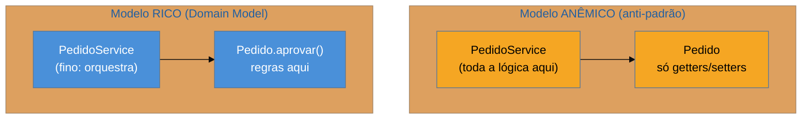

# Domain Model

> [!abstract] TL;DR
> O **Domain Model** organiza a lógica de negócio como uma **rede de objetos** que carregam **dados e
> comportamento juntos** — cada objeto conhece e aplica as próprias regras. É o oposto do
> [[02 - Transaction Script]]: em vez de roteiros procedurais, `pedido.aprovar()` sabe o que significa
> aprovar. Compensa quando o domínio é **complexo** — muitas regras que interagem, um sistema de vida
> longa — e é o coração do **DDD** (Domain-Driven Design). Combina melhor com o [[08 - Data Mapper]],
> que mantém o domínio **ignorante do banco**. A armadilha número um, e uma das mais comuns da
> engenharia, é o **modelo anêmico**: objetos que são só sacos de getters/setters, com toda a lógica
> num service — Transaction Script vestido de OO.

## A regra mora onde os dados moram

No Transaction Script, `aprovarPedido()` fazia tudo: buscava o pedido, checava o status, validava o limite, mudava o estado. O Domain Model desloca essa inteligência para **dentro** do objeto: existe um `pedido.aprovar()` que sabe que só um pedido pendente pode ser aprovado, que valida o próprio limite e muda o próprio estado — porque essas são regras **do pedido**, e é no pedido que elas devem viver. O serviço que orquestra vira **fino**: carrega o pedido, chama `aprovar()`, salva.

A vantagem aparece quando as regras **interagem** e se **repetem**. A regra "só muda de status se pendente" fica em **um** lugar (o objeto `Pedido`), e todos os casos de uso — aprovar, cancelar, faturar — a respeitam automaticamente, porque passam pelos métodos do objeto. Onde o Transaction Script duplicava, o Domain Model **centraliza** — ao custo de mais estrutura e de uma curva para modelar bem.

## Rico versus anêmico — a distinção que decide tudo

Ter classes `Pedido`, `Item`, `Cliente` **não** significa ter um Domain Model. A pergunta decisiva é: **onde está o comportamento?**

O **modelo anêmico** tem objetos que são só estruturas de dados (getters/setters) e concentra toda a lógica em *services*. Parece OO, mas é **Transaction Script disfarçado** — a regra não mora com os dados, e você perde exatamente o benefício que motivava o Domain Model. Martin Fowler o chama de anti-padrão justamente porque paga o custo de modelar objetos sem colher o ganho de encapsular comportamento. O aprofundamento vive em [[03-Dominios/Engenharia/Design de Software/Orientação a Objetos/10 - Rich vs Anemic Domain Model|Rich vs Anemic Domain Model]].

## Onde vive, e por que quer Data Mapper

O Domain Model é a casa do **DDD**: agregados, entidades, objetos de valor, regras invariantes encapsuladas. E ele tem uma **preferência de parceiro** entre os padrões de fonte de dados: o [[08 - Data Mapper]]. A razão é o **domínio ignorante da persistência** — para o `Pedido` conter só regras de negócio, ele **não** pode saber de tabelas, SQL ou sessões; um mapper externo cuida disso. O [[06 - Active Record]], por acoplar o objeto ao esquema (`pedido.save()`), empurra preocupações de banco para dentro do domínio, o que atrita com um modelo rico. Por isso Hibernate/JPA e SQLAlchemy (Data Mappers) são os lares naturais de um Domain Model sério.

Ele compensa quando: o domínio tem **muitas regras que interagem**; o sistema é de **vida longa** e vai evoluir; a corretude das invariantes de negócio é crítica. Para um CRUD raso, é over-engineering — aí o Transaction Script ganha.

## Armadilhas comuns

> [!warning] O modelo de domínio anêmico
> **O que acontece:** você cria `Pedido`, `Item`, `Cliente`, mas eles só têm getters/setters; toda a regra vive em `PedidoService`, `ItemService`. Parece Domain Model; é Transaction Script com mais arquivos.
> **Por quê:** separar dados de comportamento quebra o encapsulamento que é a razão de ser do modelo rico. A regra fica longe dos dados que ela protege, e as invariantes podem ser violadas por qualquer um que chame um setter.
> **Como evitar:** ponha o comportamento **junto** dos dados que ele governa. Se um método de service só lê e escreve campos de uma entidade, provavelmente ele pertence à entidade. Setters públicos que furam invariantes são o cheiro do modelo anêmico.

> [!warning] Domínio que conhece o banco
> **O que acontece:** o objeto de domínio importa anotações de ORM pesadas, monta SQL, ou chama o repositório de dentro de si — a persistência vaza para dentro da regra de negócio.
> **Por quê:** o Domain Model só entrega seu valor se for **ignorante da persistência**; quando o banco invade o domínio, você perde a testabilidade (não dá para testar a regra sem banco) e reacopla o que queria separar.
> **Como evitar:** mantenha a persistência num Data Mapper/Repository externo. O domínio expressa **regras**; carregar e salvar é responsabilidade de outra camada. (Anotações leves de mapeamento são um mal tolerável; lógica de acesso a dados dentro da entidade, não.)

> [!warning] Domain Model num CRUD que não pede
> **O que acontece:** monta-se agregados, objetos de valor e toda a maquinaria de DDD para um cadastro simples que é, no fundo, um formulário sobre uma tabela.
> **Por quê:** o modelo rico paga complexidade por encapsulamento de **regras densas**. Sem regras densas, você só ganhou cerimônia — a abstração prematura da família GoF, aplicada ao domínio.
> **Como evitar:** deixe a **densidade das regras** decidir. Pouca lógica → Transaction Script. Regras ricas e interagentes → Domain Model. Comece simples; suba quando a complexidade real aparecer.

## Como explicar em inglês

> "A Domain Model organizes business logic as a network of objects that carry data and behavior together — `order.approve()` knows what approving means, instead of a procedural script doing it. It's the opposite of Transaction Script, and it pays off when the domain is complex: rules that interact, a long-lived system, critical invariants. It's the heart of DDD, and it pairs best with Data Mapper, because the domain has to stay persistence-ignorant to keep the rules pure and testable. The trap I watch for most is the anemic domain model — objects that are just getters and setters with all the logic in services. That looks object-oriented but it's really Transaction Script in disguise: you pay the cost of modeling objects without the benefit of encapsulating behavior. My rule is that behavior belongs next to the data it governs."

| PT | EN |
| --- | --- |
| modelo de domínio | domain model |
| dados e comportamento juntos | data and behavior together |
| modelo rico / anêmico | rich / anemic model |
| ignorante da persistência | persistence-ignorant |
| invariante de negócio | business invariant |
| encapsular comportamento | to encapsulate behavior |
| Domain-Driven Design (DDD) | Domain-Driven Design |

## O que vem a seguir

Vimos os dois extremos — lógica nos roteiros (Transaction Script) e lógica nos objetos (Domain Model). Entre eles há um meio-termo, popular no mundo .NET: um objeto por **tabela** (não por registro) operando sobre um conjunto de resultados.

- [[04 - Table Module]] — um objeto por tabela, sobre um Record Set.
- [[08 - Data Mapper]] — o parceiro de fonte de dados que mantém o Domain Model ignorante do banco.

## Veja também

- [[03-Dominios/Engenharia/Design de Software/Orientação a Objetos/10 - Rich vs Anemic Domain Model|Rich vs Anemic Domain Model]] — o aprofundamento OO do rico × anêmico.
- [[03-Dominios/Engenharia/Arquitetura/index|Arquitetura]] — DDD, agregados e camadas onde o Domain Model se insere.

## Fontes

- **Martin Fowler** — *Patterns of Enterprise Application Architecture* (2002) — Domain Model como padrão de lógica de domínio.
- **Martin Fowler** — [*AnemicDomainModel*](https://martinfowler.com/bliki/AnemicDomainModel.html) — por que o modelo anêmico é um anti-padrão.
- **Eric Evans** — *Domain-Driven Design* (2003) — o Domain Model levado à sua expressão mais completa (agregados, entidades, value objects).
