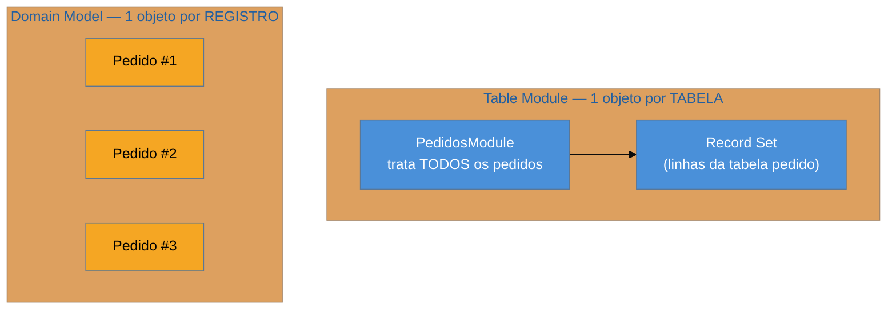

# Table Module

> [!abstract] TL;DR
> O **Table Module** organiza a lógica de negócio com **um objeto por tabela** (ou view) — não um
> objeto por registro. Uma única instância `PedidosModule` trata a lógica de **todos** os pedidos,
> operando sobre um **Record Set** (o resultado tabular carregado em memória). É o **meio-termo** entre
> o [[02 - Transaction Script]] (sem estrutura de domínio) e o [[03 - Domain Model]] (um objeto rico
> por registro): dá organização orientada a objetos **sem** abandonar o pensamento tabular. Seu habitat
> é o mundo **.NET**, onde o `DataSet`/`DataTable` torna o Record Set um cidadão de primeira classe;
> fora dele é raro. A armadilha principal é confundi-lo com o Domain Model — a diferença é **um objeto
> por tabela × um objeto por registro**.

## Um objeto para a tabela inteira

Você quer mais organização que scripts procedurais soltos, mas o domínio não é rico o suficiente para justificar um objeto de comportamento por registro. O Table Module oferece o meio do caminho: um objeto `ContratosModule` que **conhece a tabela `contrato` inteira** e expõe as operações de negócio sobre ela — `calcularReajuste(id)`, `contratosVencendo()`, `aplicarMulta(id)`. Ele não representa **um** contrato; representa a **coleção/tabela** de contratos e a lógica que opera sobre ela.

Por baixo, o Table Module trabalha sobre um **Record Set**: uma estrutura tabular em memória (linhas e colunas) que espelha o resultado de uma query. Os métodos do módulo recebem uma chave (ou um critério) e operam sobre as linhas correspondentes desse conjunto. É uma mentalidade **orientada a tabela**, não a objeto-de-domínio — você continua pensando em linhas e colunas, mas com um lugar coeso para a lógica.

## A ideia, e a diferença de granularidade

Essa é a distinção que cai em entrevista: no **Domain Model**, cada pedido é um objeto com identidade e comportamento próprios; no **Table Module**, há **um** objeto que manipula a tabela de pedidos como um todo. O Table Module fica mais perto do banco (pensa em Record Set); o Domain Model fica mais perto do negócio (pensa em entidades).

## Por que é (quase) só .NET

O Table Module floresceu no ecossistema **.NET** por um motivo concreto: o `DataSet`/`DataTable` do .NET é um **Record Set de primeira classe**, com forte suporte de ferramentas (data binding em UI, designers visuais, adapters). Quando o Record Set é um cidadão nativo e bem-suportado, um objeto que opera sobre ele é natural e produtivo.

Fora do .NET, o padrão é **raro**: o mundo Java/Ruby/Python seguiu majoritariamente pelo Domain Model (com Data Mapper) ou pelo Active Record, que abandonam a orientação a Record Set em favor de objetos-por-registro. Então, na prática, você encontra Table Module sobretudo em **sistemas legados .NET** — mais uma razão de reconhecê-lo pertence ao repertório de quem trabalha com legado. Ele faz sentido quando: a lógica é **moderada** (mais que trivial, menos que rica), o trabalho é fortemente **tabular/relatório**, e o ferramental favorece Record Sets.

## Armadilhas comuns

> [!warning] Confundir Table Module com Domain Model
> **O que acontece:** trata-se os dois como sinônimos, ou espera-se de um Table Module a modelagem rica (agregados, invariantes por entidade) de um Domain Model.
> **Por quê:** a granularidade é oposta — **um objeto por tabela** versus **um objeto por registro**. O Table Module pensa em conjuntos de linhas; o Domain Model pensa em entidades individuais com identidade e regras próprias.
> **Como evitar:** a pergunta decisiva: *o objeto representa a tabela inteira (Table Module) ou um único registro com comportamento (Domain Model)?* Se seus métodos recebem um id para saber sobre qual linha agir, é Table Module.

> [!warning] Usar Table Module fora do ecossistema de Record Set
> **O que acontece:** importa-se o padrão para Java/Python sem o suporte a Record Set, acabando com um objeto desajeitado que manipula listas de mapas ou arrays de arrays "na mão".
> **Por quê:** o Table Module se apoia num Record Set bem-suportado (como o `DataTable` do .NET). Sem essa base, você recria uma estrutura tabular pobre e perde a produtividade que justificava o padrão.
> **Como evitar:** fora do .NET, prefira Domain Model (para lógica rica) ou Transaction Script (para lógica rasa). Table Module sem Record Set nativo raramente compensa.

> [!warning] O módulo que vira o God object da tabela
> **O que acontece:** o Table Module acumula toda e qualquer operação relacionada à tabela, crescendo até virar uma classe enorme que faz de tudo com aqueles dados.
> **Por quê:** um objeto por tabela concentra responsabilidade; sem disciplina, ele incha como qualquer God object.
> **Como evitar:** mantenha o módulo focado na lógica de negócio da **sua** tabela; empurre orquestração entre tabelas para uma camada de serviço, e relatórios complexos para consultas dedicadas.

## Como explicar em inglês

> "Table Module organizes business logic with one object per table — not per row. A single `OrdersModule` instance handles the logic for all orders, working against a Record Set, the in-memory tabular result of a query. It's the middle ground between Transaction Script, which has no domain structure, and Domain Model, which has a rich object per record. Its natural home is .NET, where `DataSet`/`DataTable` makes the Record Set a first-class citizen with strong tooling; outside .NET it's rare, so I mostly meet it in legacy .NET systems. The key distinction from Domain Model is granularity: one object for the whole table versus one object per record. If the methods take an id to know which row to act on, it's a Table Module, not a Domain Model."

| PT | EN |
| --- | --- |
| um objeto por tabela | one object per table |
| conjunto de registros | record set |
| orientado a tabela | table-oriented |
| meio-termo | middle ground |
| granularidade (tabela × registro) | granularity (table vs record) |
| ecossistema .NET | .NET ecosystem |
| God object da tabela | God object |

## O que vem a seguir

Fechamos os três padrões de **onde a lógica mora** (Transaction Script, Domain Model, Table Module). Agora entramos em **como o objeto fala com a tabela** — os padrões de fonte de dados propriamente ditos. O primeiro é o clássico enterprise que você mais encontra em legado Java.

- [[05 - DAO (Data Access Object)]] — a interface de acesso a dados do mundo J2EE.
- [[06 - Active Record]] · [[08 - Data Mapper]] — o eixo dorsal da família, logo à frente.

## Veja também

- [[02 - Transaction Script]] · [[03 - Domain Model]] — os dois extremos que o Table Module fica no meio.
- [[03-Dominios/Engenharia/Dados/index|Engenharia de Dados]] — o pensamento tabular/relatório onde o Record Set brilha.

## Fontes

- **Martin Fowler** — *Patterns of Enterprise Application Architecture* (2002) — Table Module e Record Set como padrões de lógica de domínio orientada a tabela.
- **Martin Fowler** — [*Table Module* (catálogo PoEAA)](https://martinfowler.com/eaaCatalog/tableModule.html) — a definição e a comparação com Domain Model.
