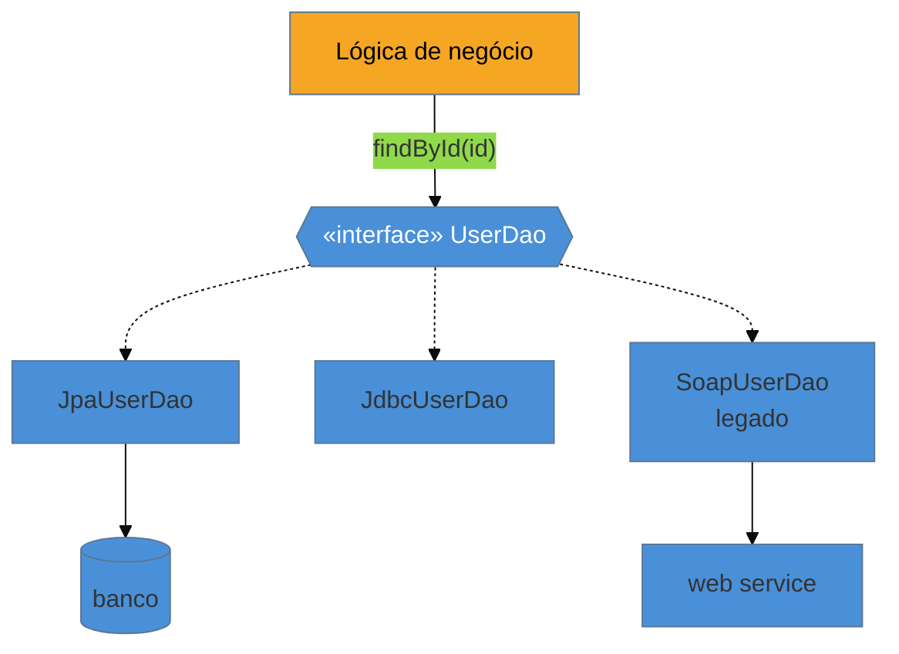

# DAO (Data Access Object)

> [!abstract] TL;DR
> O **DAO (Data Access Object)** é uma **interface** que abstrai e encapsula o acesso a uma fonte de dados, separando a lógica de negócio da mecânica de persistência. Seu código de negócio chama `userDao.findById(id)` sem saber se por baixo há Oracle, um arquivo ou um web service. Nasceu nos **J2EE Core Patterns** e é **onipresente em legado enterprise Java** — é o padrão de acesso a dados que você mais vai encontrar num sistema antigo. A pergunta de entrevista que ele sempre traz é **DAO × Repository**. E a armadilha que domina hoje: um DAO **anêmico** que só repassa chamadas para o Spring Data — uma camada inútil sobre o que já é uma abstração.

## Esconder de onde os dados vêm

Sua regra de negócio precisa de um usuário pelo id. Ela **não deveria** precisar saber se esse usuário está num Oracle, num Postgres, num arquivo CSV legado ou atrás de um web service SOAP de 2009. Se o código de negócio monta SQL ou fala com o driver diretamente, ele fica **acoplado** ao mecanismo — trocar a fonte, ou testar sem banco, vira um pesadelo.

O DAO resolve pondo uma **interface** entre a lógica e a fonte: `UserDao` declara `findById`, `save`, `deleteById`; uma implementação concreta (`JdbcUserDao`, `JpaUserDao`) sabe *como* fazer isso na fonte específica. A lógica depende só da interface. É a aplicação do [[07 - Adapter|Adapter]]/[[08 - Data Mapper|separação de responsabilidades]] à persistência, com um nome consagrado pelo mundo Java corporativo.

## A ideia

A lógica conhece só `UserDao`. Trocar a fonte (do SOAP legado para JPA, por exemplo) é trocar a implementação — sem tocar no negócio.

## DAO × Repository — a distinção de entrevista

As duas são interfaces de acesso a dados, e na prática **se confundem** — mas a origem e a intenção diferem:

| | **DAO** | **Repository** |
| --- | --- | --- |
| Origem | J2EE Core Patterns (2001) | DDD, Eric Evans (2003) |
| Orientação | **centrado em dados** — geralmente um por tabela/entidade | **centrado no domínio** — coleção de agregados |
| Interface | CRUD (`insert`, `update`, `delete`, `find`) | tipo coleção (`add`, `remove`, consultas de domínio) |
| Proximidade | mais perto do banco | mais perto do modelo de domínio |

Na prática moderna, a linha borra: o **Spring Data `JpaRepository`** se chama Repository mas é frequentemente usado como DAO (CRUD por entidade). A resposta honesta em entrevista é: *"conceitualmente, DAO é centrado em dados e Repository é centrado no domínio (DDD); na prática, Spring Data unificou os dois e o nome importa menos que o uso"*. O aprofundamento do Repository vem em [[09 - Repository]].

## Quando faz sentido (e quando é redundante)

O DAO **artesanal** fazia todo o sentido antes dos ORMs e do Spring Data: você escrevia `JdbcUserDao` com o SQL na mão porque não havia camada que o gerasse. Hoje, o Spring Data **gera** a implementação a partir de uma interface — então um DAO escrito à mão só para chamar o repositório é a camada inútil da armadilha abaixo.

Ele ainda se justifica quando: você precisa de uma **abstração estável** sobre fontes **múltiplas ou exóticas** (um banco + um web service legado + um cache), ou quando quer isolar um mecanismo de acesso que o ORM não cobre bem. Fora disso, em stack Java moderno, o Repository do Spring Data costuma ser o DAO — e você não escreve outro por cima.

## Armadilhas comuns

> [!warning] O DAO anêmico que só repassa para o ORM
> **O que acontece:** escreve-se `UserDaoImpl` cujos métodos apenas chamam `userRepository.findById(id)` do Spring Data — uma camada que não acrescenta nada. **Por quê:** o Spring Data `JpaRepository` **já é** a abstração de acesso a dados. Um DAO por cima só repassa, adicionando um arquivo, uma interface e uma indireção sem conter decisão nenhuma — a mesma "camada por padrão" que a nota 01 alerta. **Como evitar:** em stack Spring moderno, use o repositório diretamente; ele é o seu DAO. Só introduza um DAO próprio se ele **contiver** algo (unificar fontes, esconder um mecanismo exótico, uma fronteira de domínio real).

> [!warning] O DAO que vaza detalhes da fonte
> **O que acontece:** a interface do DAO expõe tipos do JPA, exceções específicas do driver, ou objetos de resultado do SQL — e o vazamento contamina quem chama. **Por quê:** a razão de existir do DAO é **esconder** o mecanismo. Se a interface fala a língua da fonte (entidades gerenciadas, `SQLException`, cursores), o acoplamento que ele deveria eliminar reaparece. **Como evitar:** a interface do DAO fala a língua do **domínio** (recebe/retorna objetos de negócio ou DTOs); traduz exceções da fonte para exceções próprias. Nada do mecanismo cruza a interface.

> [!warning] A God interface de DAO
> **O que acontece:** um único DAO acumula dezenas de métodos (`findByNameAndStatusAndDateBetween...`), virando uma interface gigante e instável. **Por quê:** empilhar consultas específicas na interface do DAO a faz crescer sem limite e acopla o consumidor a métodos que ele não usa (fere o ISP). **Como evitar:** mantenha o DAO focado; para consultas complexas e componíveis, prefira um [[13 - Query Object]] ou Specifications, em vez de mais um método na interface.

## Como explicar em inglês

> "A DAO is an interface that abstracts and encapsulates access to a data source, so the business logic calls `userDao.findById(id)` without knowing whether it's Oracle, a file, or a web service behind it. It comes from the J2EE Core Patterns and it's everywhere in legacy enterprise Java. The interview question it always raises is DAO versus Repository: conceptually, a DAO is data-centric — usually one per table with CRUD methods — while a Repository is domain-centric, a collection of aggregates from DDD. In practice Spring Data blurred the line, since `JpaRepository` is called a repository but often used as a DAO. The trap today is an anemic DAO that just forwards to Spring Data — that's a useless layer over something that's already an abstraction. I only hand-write a DAO when it actually contains something, like unifying multiple or exotic sources."

| PT | EN |
| --- | --- |
| objeto de acesso a dados | data access object |
| fonte de dados | data source |
| encapsular o acesso | encapsulate access |
| centrado em dados / no domínio | data-centric / domain-centric |
| camada inútil (que só repassa) | useless pass-through layer |
| vazar detalhes da fonte | leak source details |
| abstração estável | stable abstraction |

## O que vem a seguir

O DAO é uma interface de acesso **externa** aos objetos de negócio. O próximo padrão faz o contrário radical: coloca a persistência **dentro** do próprio objeto — ele *é* a linha e sabe se salvar. É metade do eixo dorsal da família.

- [[06 - Active Record]] — o objeto que é a linha e conhece o próprio banco.
- [[09 - Repository]] — o parente do DAO, centrado no domínio, aprofundado no bloco Adepto.

## Veja também

- [[03-Dominios/Tecnologia/Java/index|Java]] — o DAO no seu habitat J2EE/Spring.
- [[03-Dominios/Engenharia/Design de Software/SOLID/05 - ISP - Segregação de Interfaces|ISP]] — o princípio que a God interface de DAO viola.

## Fontes

- **Core J2EE Patterns** — Alur, Crupi, Malks (2001) — a origem do Data Access Object.
- **Oracle** — [*Core J2EE Patterns — Data Access Object*](https://www.oracle.com/java/technologies/data-access-object.html) — a definição canônica.
- **Martin Fowler** — [*Repository* (catálogo PoEAA)](https://martinfowler.com/eaaCatalog/repository.html) — o contraponto centrado no domínio.
