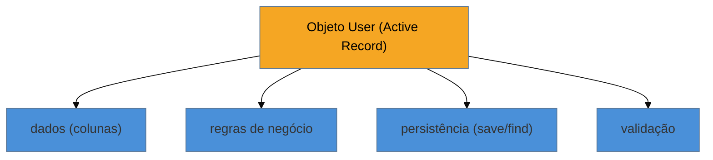

# Active Record

> [!abstract] TL;DR
> O **Active Record** envolve uma **linha da tabela** num objeto que carrega **dados, comportamento e
> persistência juntos** — o objeto *é* a linha e sabe se salvar: `user.save()`, `Order.find(1)`. É
> metade do eixo dorsal da família (a outra é o [[08 - Data Mapper]]). Sua marca registrada é a
> **produtividade**: é a alma do Rails, do Django ORM e do Laravel Eloquent, e por isso esses
> frameworks decolaram para CRUD. O preço vem depois: o objeto **acopla o domínio ao esquema** do
> banco, tende a virar um **God object** (regra + persistência + validação na mesma classe) e é
> **difícil de testar** sem banco. A regra prática: comece com Active Record pela velocidade; migre
> para Data Mapper quando o domínio ficar rico demais.

## O objeto que sabe se salvar

No Active Record, a experiência é direta a ponto de parecer mágica:

```ruby
user = User.find(1)      # carrega a linha 1 como um objeto User
user.email = "novo@ex.com"
user.save                # grava a alteração de volta na tabela
```

O objeto `User` **é** a linha da tabela `users`: cada atributo é uma coluna, e os próprios métodos do objeto (`save`, `destroy`, `find`) cuidam da persistência. Não há tradutor externo, não há mapeamento a configurar — a classe **espelha** a tabela e traz a persistência embutida. Some a isso validações e regras de negócio como métodos do mesmo objeto, e você tem um modelo que faz tudo relacionado àquela entidade num lugar só.

Essa fusão é a **força** do padrão: para aplicações centradas em dados (o típico CRUD), é rápido de escrever, intuitivo de ler e tem pouquíssimo *boilerplate*. Foi essa produtividade que fez o Ruby on Rails explodir — o padrão até deu nome à biblioteca (`ActiveRecord`).

## A lente cross-ORM

O Active Record é a filosofia de um lado inteiro do ecossistema:

- **Ruby on Rails** — `ActiveRecord`, o exemplo canônico e homônimo.
- **Django (Python)** — o *Model* (`User.objects.get(...)`, `user.save()`) é Active Record.
- **Laravel (PHP)** — Eloquent.
- **TypeScript** — TypeORM oferece um "Active Record mode" (`user.save()`).

Repare quem **não** está na lista: o mundo **Java** enterprise, que seguiu majoritariamente pelo Data Mapper (Hibernate/JPA). Reconhecer isso já responde meia entrevista: "Rails/Django = Active Record; Hibernate = Data Mapper".

## A fusão que cobra o preço



Tudo num objeto só. Isso é conveniente — e é exatamente a raiz das fraquezas: como o objeto **conhece o banco** (o esquema, a persistência), o **domínio fica acoplado à tabela**; e como ele acumula dados + regra + persistência + validação, tende a inchar. Daí os *fat models* de Rails, e a dificuldade de testar a regra de negócio sem subir um banco. Esse é o ponto onde a balança vira a favor do [[08 - Data Mapper]] — que separa o domínio da persistência ao custo de mais cerimônia.

## Armadilhas comuns

> [!warning] O fat model / God object
> **O que acontece:** o modelo Active Record acumula validações, regras de negócio, callbacks, escopos de query e persistência, crescendo para centenas de linhas — a clássica *fat model* de Rails.
> **Por quê:** o padrão **convida** a pôr tudo relacionado à entidade no mesmo objeto, e não há fronteira que impeça o acúmulo. Persistência + domínio + validação numa classe fere o SRP de forma estrutural.
> **Como evitar:** extraia regras complexas para objetos de serviço/domínio à parte (service objects, form objects); mantenha o Active Record focado em persistência + comportamento simples. Quando o modelo resiste a emagrecer, considere migrar para Data Mapper.

> [!warning] Difícil de testar sem banco
> **O que acontece:** testar uma regra de negócio exige instanciar o modelo, que já está atado à persistência — os testes precisam de um banco (ou de mocks pesados) mesmo para lógica que não deveria tocar o disco.
> **Por quê:** dados e persistência estão **fundidos** no mesmo objeto; não há como exercitar a regra isoladamente, porque o objeto não existe sem seu vínculo com a tabela.
> **Como evitar:** isole a lógica pura em objetos que não herdam do Active Record (POROs — plain old Ruby objects, ou equivalentes); reserve o modelo para persistência. É paliativo — a testabilidade nativa é justamente o que o Data Mapper oferece.

> [!warning] Domínio acoplado ao esquema
> **O que acontece:** a forma do objeto **é** a forma da tabela; uma mudança de esquema (renomear coluna, quebrar uma tabela em duas) reverbera direto no domínio e em tudo que o usa.
> **Por quê:** o Active Record **espelha** a tabela por design. Sem uma camada de tradução, não há folga entre o modelo de negócio e o modelo de dados — eles são a mesma coisa.
> **Como evitar:** aceite o acoplamento enquanto ele for barato (domínio simples, esquema estável). Quando o modelo de negócio precisar divergir do modelo de dados, é o sinal do Data Mapper.

## Como explicar em inglês

> "Active Record wraps a table row in an object that carries data, behavior, and persistence together — the object *is* the row and knows how to save itself, like `user.save()`. It's half the family's core axis, opposite Data Mapper. Its strength is productivity: it's the soul of Rails, Django, and Laravel Eloquent, and it's fantastic for CRUD-centric apps with little boilerplate. The cost shows up later: because the object knows the database, the domain gets coupled to the schema; it tends to become a God object with rules, validation, and persistence in one class; and it's hard to unit-test without a database. So my rule is Fowler's: start with Active Record for speed, and move to Data Mapper when the domain gets rich enough that the coupling and testability start to hurt. And the quick recognition is Rails and Django are Active Record, while Hibernate is Data Mapper."

| PT | EN |
| --- | --- |
| o objeto é a linha | the object is the row |
| persistência embutida | built-in persistence |
| modelo inchado | fat model |
| acoplado ao esquema | coupled to the schema |
| difícil de testar sem banco | hard to test without a database |
| centrado em dados | data-centric |
| começar simples e evoluir | start simple and evolve |

## O que vem a seguir

Fechamos o **bloco Iniciado** — onde a lógica mora (Transaction Script, Domain Model, Table Module) e as duas primeiras respostas de acesso (DAO, Active Record). O bloco **Adepto** entra nos padrões que fazem o outro lado do eixo — o Data Mapper — funcionar de verdade. Começamos pelos wrappers finos que os ORMs absorveram.

- [[07 - Gateways (Row-Table Data Gateway + Record Set)]] — os wrappers de linha e de tabela do JDBC/ADO cru.
- [[08 - Data Mapper]] — a outra metade do eixo dorsal: domínio ignorante do banco.

## Veja também

- [[03-Dominios/Engenharia/Design de Software/SOLID/02 - SRP - Responsabilidade Única|SRP]] — o princípio que o fat model viola ao fundir persistência e domínio.
- [[03-Dominios/Tecnologia/Python/index|Python]] — o Django ORM como Active Record no vault.

## Fontes

- **Martin Fowler** — *Patterns of Enterprise Application Architecture* (2002) — Active Record e o contraste com Data Mapper.
- **Martin Fowler** — [*Active Record* (catálogo PoEAA)](https://martinfowler.com/eaaCatalog/activeRecord.html) — a definição canônica.
- **Rails Guides** — [*Active Record Basics*](https://guides.rubyonrails.org/active_record_basics.html) — a encarnação homônima do padrão.
