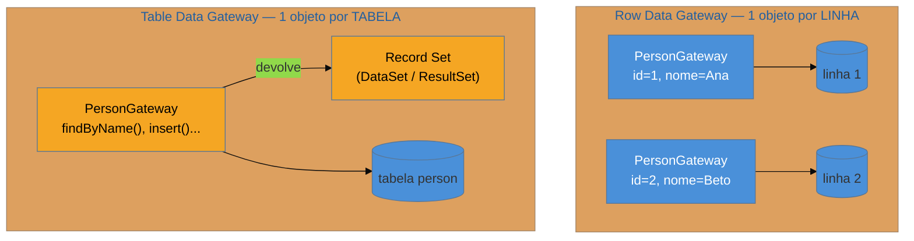

# Gateways (Row Data Gateway e Table Data Gateway)

> [!abstract] TL;DR
> Um **Gateway** é um objeto **burro** que encapsula o acesso a uma fonte externa e nada mais. Fowler
> distingue dois sabores no acesso a banco: o **Row Data Gateway** — um objeto que espelha **uma linha**
> (campos = colunas, mais `find/insert/update/delete`), sem regra de negócio nenhuma — e o **Table Data
> Gateway** — **um** objeto que fala por **uma tabela inteira** e devolve os resultados como um **Record
> Set** (a representação tabular em memória: `DataSet`/`DataTable` do .NET, `ResultSet` do JDBC). São a
> **fundação** sobre a qual o [[06 - Active Record|Active Record]] (Row Gateway + lógica) e o
> [[04 - Table Module|Table Module]] (opera sobre um Record Set) foram construídos. Hoje aparecem pouco
> como padrão nomeado: os ORMs **absorveram** essa plumbing. Você os encontra em legado .NET e em código
> JDBC/`database/sql` cru — e a armadilha é escrevê-los à mão quando o ORM já os gera.

## O encanamento por baixo do ORM

Antes de qualquer ORM sofisticado, alguém tinha que escrever o código chato: montar o `SELECT`, abrir o
cursor, ler coluna por coluna, empacotar num objeto, fazer o `INSERT` de volta. Esse **encanamento** —
puro acesso a dados, sem uma linha de regra de negócio — precisa morar em *algum* lugar. Se você o
espalha pela lógica, acopla o negócio ao driver; se joga dentro do objeto de domínio, o domínio passa a
conhecer SQL. O padrão **Gateway** dá a esse encanamento um objeto próprio: *"um objeto que encapsula o
acesso a um sistema ou recurso externo"* (Fowler). Nada além disso — ele é deliberadamente burro.

No acesso a banco, Fowler separa esse encanamento em **duas geometrias**, e a diferença é exatamente
**quantas linhas cada objeto representa**.

## Row Data Gateway — um objeto por linha

O **Row Data Gateway** é um objeto que corresponde a **uma única linha** da tabela. Seus campos são as
colunas (`id`, `nome`, `email`); seus métodos são o encanamento (`insert`, `update`, `delete`) e há um
**finder** — muitas vezes separado, numa classe à parte — que roda a query e devolve gateways populados.
O ponto crucial: **ele não tem regra de negócio**. É o registro em memória, mais a mecânica de ir e
voltar ao banco. Se você colar validação, cálculo ou política de domínio nele, ele deixou de ser um Row
Data Gateway — virou um [[06 - Active Record|Active Record]].

Essa é, aliás, a relação-chave para uma entrevista: **Active Record = Row Data Gateway + lógica de
domínio**. O Active Record da nota anterior é um Row Data Gateway que ganhou métodos de negócio. Ver os
dois lado a lado explica por que o Active Record vira *fat model* com tanta facilidade — a fundação já
era o objeto-linha, e a tentação é empilhar comportamento em cima dela.

## Table Data Gateway — um objeto por tabela

O **Table Data Gateway** inverte a geometria: **um** objeto atende a **tabela inteira**. Ele não
representa uma linha — representa o *ponto de acesso* à tabela `pedidos`, com métodos como
`findByCustomer(id)`, `insert(...)`, `update(...)`. E aqui está o detalhe que o define: seus métodos de
consulta devolvem um **Record Set** — uma estrutura tabular genérica em memória, não objetos de domínio.

Isso o casa naturalmente com o [[04 - Table Module|Table Module]]: o Table Module é a lógica de negócio
que **opera sobre** o Record Set que o Table Data Gateway produziu. No mundo .NET clássico, o par era
onipresente — o gateway enche um `DataSet`/`DataTable`, o Table Module aplica as regras sobre ele.

> [!question]- Se os dois se chamam "gateway", como não confundir na hora?
> Conte **quantas instâncias existem para uma consulta de N linhas**. No Row Data Gateway você recebe
> **N objetos**, um por linha — cada um sabe se salvar. No Table Data Gateway você recebe **um** objeto
> (o gateway) e **um Record Set** com as N linhas dentro — o gateway é singular, os dados vêm tabulares.
> Row = objeto-por-registro; Table = objeto-por-tabela + Record Set.

## O Record Set — resultado como tabela em memória

O **Record Set** é a peça que amarra o Table Data Gateway ao ecossistema. É uma representação **tabular
e genérica** do resultado de uma query: linhas e colunas, navegável, muitas vezes desconectada do banco
(você lê tudo, fecha a conexão, e continua trabalhando na cópia em memória). O caso canônico é o
`DataSet`/`DataTable` do ADO.NET — praticamente uma minitabela em RAM, com detecção de mudanças para dar
`update` depois. No mundo Java, o `ResultSet` do JDBC é o parente próximo, embora conectado ao cursor.

O Record Set é o que permite ao Table Module trabalhar sem objetos de domínio: a UI faz *data binding* na
tabela em memória, a lógica opera sobre ela, e no fim o gateway sincroniza com o banco. Foi produtivo —
e é também a razão pela qual esse estilo **não migrou** para ecossistemas sem um Record Set forte: fora
do .NET, ninguém quis programar o negócio inteiro sobre uma `DataTable` anônima.

## A lente cross-ORM: onde os gateways foram parar

Diferente do Active Record ou do Data Mapper, você quase nunca ouve um dev moderno dizer *"usei um Table
Data Gateway aqui"*. Não porque o padrão morreu — porque **o ORM virou o gateway**. A camada de acesso
gerada por Hibernate, Django ou Eloquent *é* o encanamento que o gateway isolava; ela só não usa esse
nome. Onde os gateways ainda aparecem **explícitos**:

| Ecossistema | Onde o gateway vive | Sabor |
| --- | --- | --- |
| **.NET legado** | `DataSet`/`DataTable` + `TableAdapter` | Table Data Gateway + Record Set — o habitat original |
| **Java sem ORM** | `JdbcTemplate`, `SimpleJdbcInsert`, `RowMapper` (Spring JDBC) | Table Data Gateway artesanal |
| **Go** | `database/sql`, `sqlx` — você escreve o gateway na mão | Row/Table Gateway cru, por design |
| **Node/TS** | Query builder do Knex, `pg` direto | Table Data Gateway sem esse nome |
| **Rails/Django** | — | absorvido: o Active Record **é** o Row Gateway com lógica |

O padrão sobrevive, então, como **fundação conceitual** (ajuda a entender o que o ORM faz por baixo) e
como **estilo prático** onde você deliberadamente foge do ORM: microsserviço Go, um relatório pesado que
pede SQL cru, um trecho *performance-critical* onde o mapeamento de objetos atrapalha.

## Armadilhas comuns

> [!warning] Colocar regra de negócio no gateway
> **O que acontece:** o Row Data Gateway ganha um método `podeReceberDesconto()`, um cálculo de imposto,
> uma validação de domínio — e vira um objeto híbrido.
> **Por quê:** a definição do Gateway é ser **burro**: só acesso a dados. No instante em que ele carrega
> lógica de negócio, ele deixou de ser Gateway e virou [[06 - Active Record|Active Record]] — com todos
> os problemas de testabilidade e acoplamento ao esquema que aquele padrão traz, só que sem você ter
> escolhido isso conscientemente.
> **Como evitar:** decida de propósito. Ou o objeto é encanamento puro (Gateway), ou você aceita o
> Active Record e assume o trade-off. Não escorregue de um para o outro método a método.

> [!warning] Reescrever à mão o que o ORM já gera
> **O que acontece:** num projeto com Hibernate/Spring Data, alguém escreve uma camada de
> `TableGateway`s artesanais "para ter controle", duplicando o que o ORM já faz.
> **Por quê:** é o mesmo alerta do [[05 - DAO (Data Access Object)|DAO anêmico]] — o ORM **já é** o
> gateway. Uma camada de gateways por cima só adiciona código sem conter decisão. Você paga manutenção
> por plumbing que a ferramenta oferecia de graça.
> **Como evitar:** só escreva gateways à mão quando você **saiu do ORM de propósito** (SQL cru por
> performance, uma fonte que o ORM não cobre, um `database/sql` idiomático em Go). Dentro de um ORM,
> use o que ele gera.

> [!warning] Confundir Row com Table (e o N+1 que vem junto)
> **O que acontece:** o dev quer os pedidos de um cliente e instancia **um Row Data Gateway por pedido
> num laço**, cada um disparando seu próprio `SELECT` — quando um Table Data Gateway resolveria em uma
> query só.
> **Por quê:** trocar as geometrias leva ao clássico **N+1**: N idas ao banco onde uma bastaria. O Row
> Gateway brilha para *um* registro que você vai manipular; o Table Gateway brilha para *conjuntos*.
> **Como evitar:** para ler/processar coleções, use o Table Data Gateway (uma query, um Record Set).
> Reserve o Row Data Gateway para a manipulação de registros individuais. O problema do carregamento
> sob demanda em geral é aprofundado em [[12 - Lazy Load]].

## Como explicar em inglês

> "A Gateway is a dumb object that encapsulates access to an external resource — nothing but data access,
> no business logic. For databases, Fowler splits it in two by how many rows each object represents. A
> **Row Data Gateway** mirrors a single row: fields are columns, plus insert/update/delete, and a finder
> that returns populated gateways — no domain rules. That's the foundation of Active Record, which is
> literally a Row Data Gateway plus business logic. A **Table Data Gateway** is a single object for the
> whole table whose query methods return a **Record Set** — a generic in-memory table like a .NET
> `DataSet` or a JDBC `ResultSet`. It pairs with the Table Module, which runs logic over that record set.
> You rarely name these patterns today because ORMs absorbed the plumbing — but they resurface in legacy
> .NET, in raw Spring JDBC, and in Go's `database/sql`, where you write the gateway by hand on purpose.
> The trap is hand-rolling gateways when the ORM already generates them."

| PT | EN |
| --- | --- |
| objeto burro (só acesso) | dumb object (data access only) |
| espelha uma linha | mirrors a single row |
| finder (busca que popula) | finder |
| conjunto de registros | record set |
| tabela em memória / desconectada | in-memory / disconnected table |
| encanamento (plumbing) | plumbing |
| o ORM absorveu o padrão | the ORM absorbed the pattern |

## O que vem a seguir

O gateway é encanamento **sem** domínio, e o Active Record é encanamento **com** domínio grudado. Falta
a terceira via, a que mantém os dois separados de propósito: uma camada que move dados entre objetos e
banco deixando **ambos ignorantes um do outro**. É a outra metade do eixo dorsal da família — e o rival
filosófico do Active Record.

- [[08 - Data Mapper]] — a camada que isola domínio e banco; o par do Active Record no grande debate.
- [[06 - Active Record]] — o Row Data Gateway que ganhou lógica de negócio.
- [[04 - Table Module]] — a lógica que opera sobre o Record Set do Table Data Gateway.

## Veja também

- [[05 - DAO (Data Access Object)|DAO]] — a interface de acesso mais ampla; o gateway é o encanamento fino que Fowler nomeia por baixo dela.
- [[03-Dominios/Tecnologia/Go/index|Go]] — `database/sql`/`sqlx`, onde escrever o gateway na mão ainda é idiomático.

## Fontes

- **Martin Fowler** — [*Row Data Gateway*](https://martinfowler.com/eaaCatalog/rowDataGateway.html) — a definição canônica do objeto-por-linha (PoEAA).
- **Martin Fowler** — [*Table Data Gateway*](https://martinfowler.com/eaaCatalog/tableDataGateway.html) — o objeto-por-tabela e o Record Set (PoEAA).
- **Martin Fowler** — [*Gateway*](https://martinfowler.com/eaaCatalog/gateway.html) e [*Record Set*](https://martinfowler.com/eaaCatalog/recordSet.html) — o conceito-mãe e a estrutura tabular.
- **Microsoft** — [*ADO.NET DataSet*](https://learn.microsoft.com/en-us/dotnet/framework/data/adonet/dataset-datatable-dataview/) — o Record Set no seu habitat .NET clássico.
