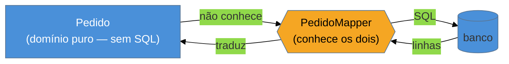

# Data Mapper

> [!abstract] TL;DR
> O **Data Mapper** é uma **camada separada** que move dados entre os objetos de domínio e o banco,
> mantendo **os dois ignorantes um do outro**. O objeto de negócio é um POJO puro — sem `save()`, sem
> uma linha de SQL, sem saber que um banco existe; quem conhece as duas pontas e faz a tradução é o
> **mapper**. É a metade do eixo dorsal oposta ao [[06 - Active Record|Active Record]], e a filosofia
> do mundo **Java enterprise** (Hibernate/JPA), do **SQLAlchemy**, do **Doctrine** e do **Ent** (Go). O
> que você compra: um **domínio limpo e testável sem banco**, livre para divergir do esquema — é o que o
> [[03 - Domain Model|Domain Model rico]] precisa para existir. O que você paga: **cerimônia** (mapeamento
> a configurar) e uma abstração que **vaza** nos momentos errados — `LazyInitializationException`, N+1,
> entidades gerenciadas atravessando fronteiras. A regra de Fowler: Active Record pela velocidade,
> Data Mapper quando o domínio fica rico demais para conhecer o banco.

## O domínio que não deveria saber que existe um banco

Imagine uma classe `Pedido` com toda a regra de negócio do seu sistema: calcula frete, aplica desconto,
valida itens. Agora responda: essa classe deveria conter `INSERT INTO pedidos ...`? Deveria saber que a
coluna se chama `valor_total` e não `total`? Deveria quebrar se você renomear uma tabela?

A intuição diz **não** — a regra de negócio é uma coisa, o formato de armazenamento é outra. Mas o
[[06 - Active Record|Active Record]] diz *sim*: lá o objeto **é** a linha e carrega a persistência
embutida. O Data Mapper é a resposta oposta: ele arranca todo o conhecimento de banco do objeto de
domínio e o concentra numa **camada à parte**, o mapper. O `Pedido` volta a ser um objeto puro — só
regra e dados; o `PedidoMapper` (ou o `EntityManager`, por baixo) é quem sabe carregar, gravar e
traduzir coluna↔campo. Nenhum dos dois enxerga o outro diretamente.

## A ideia: uma camada no meio, ignorância dos dois lados

A seta que importa é a que **não existe**: do domínio para o banco. O `Pedido` não tem referência ao
mapper nem ao banco — ele poderia rodar num teste sem nenhuma infraestrutura. Só o mapper vive no meio,
e é o **único** ponto que conhece as duas linguagens. Essa assimetria é o coração do padrão: a
dependência aponta **para dentro**, do detalhe (persistência) para o domínio, nunca o contrário.

> [!question]- Se ninguém no domínio chama o mapper, quem chama?
> Uma camada de cima — tipicamente um [[09 - Repository|Repository]] ou um serviço de aplicação. O fluxo
> é: o serviço pede ao repositório `findById(1)`; o repositório usa o mapper (ou o `EntityManager`) para
> buscar e reconstituir o `Pedido`; devolve o objeto de domínio puro. O domínio recebe-se pronto, sem
> nunca ter tocado no encanamento. É por isso que Data Mapper e Repository quase sempre aparecem juntos.

## Por que ele existe: o domínio rico precisa dele

O Data Mapper não é elegância gratuita. Ele é a **pré-condição** de um [[03 - Domain Model|Domain Model]]
verdadeiramente rico. Um domínio complexo — com hierarquias, invariantes, regras que evoluem — precisa
de liberdade para ter a forma que o **negócio** pede, não a forma que a **tabela** pede. Se o objeto
espelha o esquema (Active Record), toda mudança de banco reverbera no domínio e vice-versa; eles ficam
acorrentados. O mapper insere uma **folga** entre os dois modelos: você pode quebrar uma classe em três,
ou juntar duas tabelas numa entidade, e absorver a diferença **no mapeamento** — sem tocar na regra de
negócio nem no esquema. Essa folga é o que permite o domínio e o banco evoluírem em ritmos diferentes.

O segundo ganho é **testabilidade**: como o `Pedido` não tem persistência, você testa a regra de negócio
instanciando o objeto direto, sem subir banco nem mockar nada pesado — exatamente a dor que o Active
Record não resolve.

## A lente cross-ORM

Se o Active Record é o lado Rails/Django, o Data Mapper é o outro lado inteiro do mundo:

| Ecossistema | Encarnação do Data Mapper |
| --- | --- |
| **Java** | **Hibernate / JPA** — o `EntityManager` é o mapper; entidades anotadas, mapeamento por anotação/XML |
| **Python** | **SQLAlchemy** (ORM clássico e declarativo) — a `Session` faz o papel do mapper |
| **PHP** | **Doctrine** — o exemplo canônico de Data Mapper em PHP, oposto ao Eloquent (Active Record) |
| **Go** | **Ent**, **gorm** (parcialmente) — o mapeamento separado do struct de domínio |
| **TypeScript** | **TypeORM** em *Data Mapper mode* (entidades + repositórios); **Prisma** é mapper-ish (client separado do modelo) |

Reconhecer o par fecha meia entrevista de acesso a dados: **"Rails/Django/Eloquent = Active Record;
Hibernate/SQLAlchemy/Doctrine = Data Mapper"**. E a razão de o mundo Java ter escolhido o Data Mapper é
justamente o peso do domínio corporativo — sistemas grandes, de vida longa, onde a folga entre modelo e
esquema paga o custo da cerimônia.

## Armadilhas comuns

> [!warning] A abstração que vaza (leaky abstraction)
> **O que acontece:** o mapper promete esconder o banco, mas o vazamento aparece: `LazyInitializationException`
> quando você acessa uma coleção fora da sessão, entidades **gerenciadas** que se comportam diferente de
> objetos comuns, `flush` disparando SQL em hora inesperada.
> **Por quê:** esconder um banco relacional atrás de objetos é uma abstração **imperfeita por natureza** —
> o [[01 - Panorama do acesso a dados|impedance mismatch]] não desaparece, só muda de lugar. O mapper o
> empurra para as bordas (ciclo de vida da sessão, carregamento sob demanda), e é lá que ele vaza.
> **Como evitar:** não trate o ORM como caixa-preta. Entenda o ciclo de vida da sessão/`EntityManager`
> ([[10 - Unit of Work]]), quando as entidades estão gerenciadas, e o modelo de carregamento
> ([[12 - Lazy Load]]). A abstração vaza menos para quem sabe o que ela esconde.

> [!warning] O N+1 silencioso
> **O que acontece:** um laço sobre `pedidos` acessa `pedido.getCliente()` de cada um, e cada acesso
> dispara um `SELECT` — 1 query para a lista + N para os clientes.
> **Por quê:** justamente porque o mapper **esconde** as queries, você não vê o custo. O que parece um
> acesso a atributo em memória é, por baixo, uma ida ao banco via [[12 - Lazy Load|proxy]]. A abstração
> que dá conforto também esconde o desastre de performance.
> **Como evitar:** carregue o que vai usar de propósito — *fetch join* (JPQL), `joinedload` (SQLAlchemy),
> `Preload` (Ent), *entity graphs*. Meça as queries emitidas em desenvolvimento; o N+1 só aparece sob carga.

> [!warning] Data Mapper para um CRUD simples (over-engineering)
> **O que acontece:** um app pequeno, centrado em dados, sobe com Hibernate + repositórios + mapeamento
> completo — e a equipe passa mais tempo domando o ORM do que entregando telas.
> **Por quê:** a cerimônia do Data Mapper **só se paga** quando existe um domínio rico para proteger. Sem
> ele, você comprou complexidade sem o benefício — o Active Record teria entregue o mesmo CRUD em metade
> do código. Pior: o domínio anêmico ([[03 - Domain Model]]) mostra que nem havia domínio para isolar.
> **Como evitar:** comece pela regra de Fowler. CRUD simples e esquema estável → Active Record. Migre para
> Data Mapper quando o domínio ficar rico o bastante para que o acoplamento ao esquema comece a doer.

## Como explicar em inglês

> "Data Mapper is a separate layer that moves data between domain objects and the database while keeping
> both ignorant of each other. The domain object is a plain object — no `save()`, no SQL, no idea a
> database exists; the mapper is the only thing that knows both sides and does the translation. It's the
> half of the family's core axis opposite Active Record, and it's the philosophy of Java enterprise —
> Hibernate/JPA — plus SQLAlchemy and Doctrine. What you buy is a clean domain you can unit-test without a
> database, free to diverge from the schema — it's what a rich Domain Model needs to exist. What you pay
> is ceremony, and a leaky abstraction that bites at the edges: lazy-initialization exceptions, N+1,
> managed entities crossing boundaries. So my rule is Fowler's: Active Record for speed, Data Mapper when
> the domain gets rich enough that coupling it to the schema starts to hurt. The quick recognition is
> Rails and Django are Active Record; Hibernate, SQLAlchemy, and Doctrine are Data Mapper."

| PT | EN |
| --- | --- |
| ignorantes um do outro | ignorant of each other |
| camada de mapeamento | mapping layer |
| objeto de domínio puro | plain domain object |
| entidade gerenciada | managed entity |
| abstração que vaza | leaky abstraction |
| folga entre modelo e esquema | slack between model and schema |
| problema N+1 de consultas | N+1 query problem |

## O que vem a seguir

Fechamos o eixo dorsal: **Active Record** (objeto conhece o banco) × **Data Mapper** (mapper no meio,
domínio ignorante). Mas quem chama o mapper? O domínio não deveria falar com `EntityManager` diretamente
— falta uma camada que ofereça os objetos como se fossem uma **coleção em memória**, escondendo a query
por trás de uma interface de domínio. Esse é o companheiro natural do Data Mapper.

- [[09 - Repository]] — a coleção-em-memória sobre o mapper; onde o domínio pede seus objetos.
- [[06 - Active Record]] — o outro lado do eixo, para reler o contraste com o padrão fresco.
- [[10 - Unit of Work]] — o que rastreia as mudanças e as persiste numa transação só.

## Veja também

- [[03-Dominios/Tecnologia/Java/index|Java]] — Hibernate/JPA, o Data Mapper no seu habitat corporativo.
- [[03-Dominios/Engenharia/Design de Software/SOLID/06 - DIP - Inversão de Dependência|DIP]] — a dependência que aponta para dentro (domínio ← persistência) é DIP aplicado ao acesso a dados.

## Fontes

- **Martin Fowler** — [*Data Mapper* (catálogo PoEAA)](https://martinfowler.com/eaaCatalog/dataMapper.html) — a definição canônica e o contraste com Active Record.
- **Martin Fowler** — *Patterns of Enterprise Application Architecture* (2002) — o capítulo que estabelece o eixo AR × DM.
- **Hibernate** — [*Hibernate ORM documentation*](https://hibernate.org/orm/documentation/) — o Data Mapper mais influente do mundo Java.
- **SQLAlchemy** — [*ORM Quickstart*](https://docs.sqlalchemy.org/en/20/orm/quickstart.html) — a `Session` como Unit of Work + mapper em Python.
