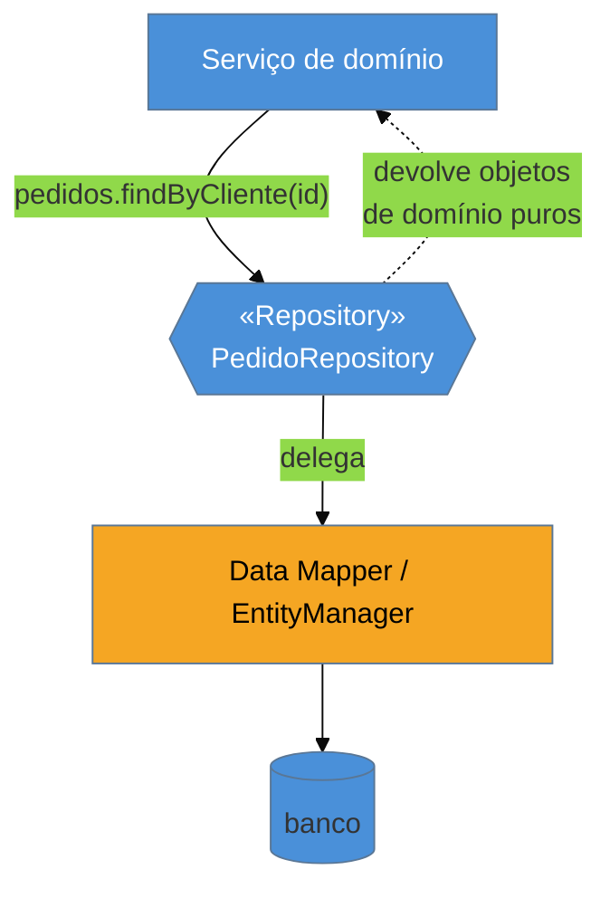

# Repository

> [!abstract] TL;DR
> O **Repository** apresenta os objetos de domínio como se fossem uma **coleção em memória**:
> `orders.add(pedido)`, `orders.findByCustomer(id)` — você "adiciona" e "busca" como numa lista, e a
> query, o [[08 - Data Mapper|mapper]] e o banco ficam **escondidos atrás dessa fachada de coleção**.
> Nasceu no **DDD** (Eric Evans) como a fronteira entre o domínio e a persistência, e é o companheiro
> natural do Data Mapper: o domínio pede seus objetos ao repositório sem nunca tocar no
> `EntityManager`. Sua encarnação dominante é o **Spring Data**, que **gera** a implementação a partir de
> uma interface. A pergunta de entrevista é sempre [[05 - DAO (Data Access Object)|Repository × DAO]]; e
> as armadilhas são três: o repositório **genérico que vaza** `Criteria`/`IQueryable`, o repositório
> **sobre Active Record** (redundante) e a **explosão de `findByXAndY`**.

## Uma coleção que, por baixo, é o banco inteiro

Pense em como você trabalha com uma lista em memória: `lista.add(x)`, `lista.stream().filter(...)`,
`lista.get(i)`. Você não pensa em *como* a lista guarda os elementos — ela é só uma coleção. Agora
imagine ter essa mesma experiência para objetos que, na verdade, vivem num banco com milhões de linhas:
`pedidos.add(pedido)` grava; `pedidos.findByCliente(id)` busca. Essa é a promessa do Repository —
oferecer ao domínio a **ilusão de uma coleção em memória** de todos os objetos de um tipo, quando por
baixo há SQL, um mapper e uma conexão.

Por que isso importa? Porque o domínio **não deveria** falar a língua da persistência. No
[[08 - Data Mapper|Data Mapper]] vimos que o objeto de negócio é ignorante do banco — mas alguém precisa
chamar o mapper, e não pode ser o próprio domínio com um `entityManager.createQuery(...)` no meio da
regra. O Repository é essa camada intermediária: fala a língua do **domínio** (coleções, agregados) para
cima, e a língua do **mapper** para baixo.

## A ideia: fachada de coleção sobre o mapper

Para o serviço, o `PedidoRepository` **é** uma coleção de pedidos. Ele nunca vê o mapper nem monta
query — pede em linguagem de domínio e recebe objetos de domínio prontos. Toda a mecânica de tradução
fica de um lado só da fachada.

## Repository × DAO — a distinção de entrevista (revisitada)

Já vimos os dois lados em [[05 - DAO (Data Access Object)|DAO]]; aqui está o resumo pela ótica do
Repository:

| | **Repository** | **DAO** |
| --- | --- | --- |
| Origem | DDD, Eric Evans (2003) | J2EE Core Patterns (2001) |
| Orientação | **centrado no domínio** — coleção de agregados | **centrado em dados** — geralmente um por tabela |
| Interface | tipo coleção (`add`, consultas de domínio) | CRUD (`insert`, `update`, `find`) |
| Mentalidade | "uma coleção dos meus objetos" | "uma porta para a fonte de dados" |

Na prática o **Spring Data `JpaRepository`** carrega o nome "Repository" mas é usado, na maioria dos
projetos, como um DAO (CRUD por entidade). A resposta honesta de entrevista permanece: *conceitualmente
Repository é centrado no domínio e DAO em dados; o Spring Data unificou os dois e o nome importa menos que
o uso*. A diferença **vira real** quando você faz DDD de verdade: o repositório é por **agregado** (não
por tabela), e só o agregado-raiz tem repositório.

## A lente cross-ORM

| Ecossistema | Encarnação do Repository |
| --- | --- |
| **Java** | **Spring Data** (`JpaRepository`, `CrudRepository`) — gera a implementação a partir da interface |
| **.NET** | repositórios sobre o Entity Framework `DbSet` (que já é *quase* um repositório) |
| **Python** | padrão manual sobre a `Session` do SQLAlchemy (não há um "Spring Data" canônico) |
| **PHP** | `EntityRepository` do Doctrine |
| **TypeScript** | os `Repository` do TypeORM em *Data Mapper mode* |

Repare no incômodo do **.NET/EF** e do **Spring Data JPA**: o `DbSet` e o `JpaRepository` já são, eles
mesmos, coleções sobre o mapper. Escrever *mais* um repositório por cima é, muitas vezes, a camada
redundante da armadilha abaixo.

## Armadilhas comuns

> [!warning] O repositório genérico que vaza a query
> **O que acontece:** cria-se um `Repository<T>` genérico cujo método `find` devolve um `IQueryable`
> (LINQ), um `Criteria` (JPA) ou expõe o `QueryDSL` para quem chama — e o consumidor monta a query lá fora.
> **Por quê:** a razão de existir do Repository é **esconder** a query atrás de uma interface de coleção.
> Se ele devolve um objeto de consulta aberto, o concern de persistência **vaza** para o domínio, que
> volta a montar SQL disfarçado. A fachada de coleção some.
> **Como evitar:** o repositório expõe **métodos de intenção de domínio** (`findClientesInadimplentes()`),
> não um `IQueryable` cru. Para consultas dinâmicas e componíveis, encapsule-as num
> [[13 - Query Object|Query Object]]/Specification — que é um objeto de query controlado, não um vazamento.

> [!warning] Repository sobre Active Record (redundante)
> **O que acontece:** num projeto Rails/Django/Eloquent, alguém introduz uma camada de `Repository` sobre
> os modelos Active Record "para desacoplar".
> **Por quê:** o Repository existe para dar ao domínio uma coleção **sobre o mapper** — mas o
> [[06 - Active Record|Active Record]] **não tem** mapper: o próprio objeto acessa o banco. Um repositório
> ali não esconde nada que já não estivesse no modelo; é indireção sem ganho, e briga com o idioma do
> framework (que espera `Order.where(...)`).
> **Como evitar:** Repository casa com **Data Mapper**, não com Active Record. Em stack Active Record, use
> *query objects*/*scopes* do próprio framework se precisar organizar consultas — não uma camada de
> repositório postiça.

> [!warning] A explosão de `findByXAndY`
> **O que acontece:** a interface do repositório cresce sem limite —
> `findByStatusAndClienteAndDataBetweenOrderByValor`, dezenas de variações — cada nova tela adicionando um
> método.
> **Por quê:** empilhar cada consulta específica como um método faz a interface inchar e a acopla a
> combinações que só uma tela usa; é a mesma God interface que o [[05 - DAO (Data Access Object)|DAO]]
> sofre, agora em roupa de Repository.
> **Como evitar:** para consultas complexas e variáveis, prefira um [[13 - Query Object|Query Object]] /
> Specifications (Spring Data `Specification`, Criteria) — o repositório aceita **um** critério componível
> em vez de ganhar mais um método a cada filtro novo.

## Como explicar em inglês

> "A Repository presents domain objects as if they were an in-memory collection — you `add` and `find`
> like on a list, and the query, the mapper, and the database stay hidden behind that collection facade.
> It comes from DDD as the boundary between the domain and persistence, and it's the natural companion of
> Data Mapper: the domain asks the repository for its objects and never touches the `EntityManager`. Its
> dominant incarnation is Spring Data, which generates the implementation from an interface. The interview
> question is always Repository versus DAO: conceptually a repository is domain-centric — a collection of
> aggregates — while a DAO is data-centric, usually one per table; in practice Spring Data blurred the
> line. The traps are a generic repository that leaks an `IQueryable` or `Criteria` — which defeats the
> whole point — a repository stacked on Active Record, which is redundant since there's no mapper to hide,
> and the explosion of `findByXAndY` methods, which you fix with a Query Object instead."

| PT | EN |
| --- | --- |
| coleção em memória | in-memory collection |
| fachada de coleção | collection facade |
| centrado no domínio | domain-centric |
| agregado (DDD) | aggregate |
| método de intenção de domínio | domain-intent method |
| vazar a query | leak the query |
| consulta componível | composable query |

## O que vem a seguir

O Repository esconde a query, e o Data Mapper faz a tradução — mas quando você `add`iciona três objetos e
altera dois numa mesma operação de negócio, quem garante que tudo grava numa **transação só**, na ordem
certa? Falta a peça que rastreia as mudanças ao longo da operação e as persiste de uma vez.

- [[10 - Unit of Work]] — rastreia o que mudou e persiste tudo numa transação.
- [[08 - Data Mapper]] — a camada que o repositório usa por baixo.
- [[13 - Query Object]] — a saída para consultas complexas sem inchar a interface.

## Veja também

- [[03-Dominios/Tecnologia/Java/index|Java]] — Spring Data, a encarnação mais comum do Repository.
- [[03-Dominios/Engenharia/Arquitetura/index|Arquitetura]] — o Repository como porta na arquitetura hexagonal/limpa.

## Fontes

- **Martin Fowler** — [*Repository* (catálogo PoEAA)](https://martinfowler.com/eaaCatalog/repository.html) — a definição canônica.
- **Eric Evans** — *Domain-Driven Design* (2003), cap. 6 — o Repository como fronteira do domínio, por agregado.
- **Spring** — [*Spring Data JPA — Reference*](https://docs.spring.io/spring-data/jpa/reference/) — repositórios gerados a partir de interfaces.
