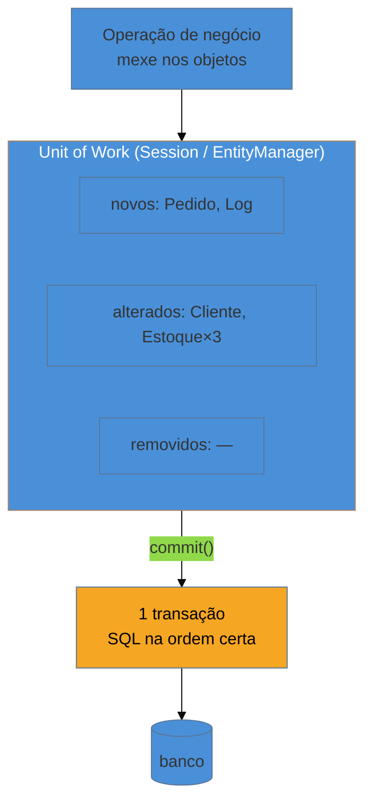

# Unit of Work

> [!abstract] TL;DR
> O **Unit of Work** mantém uma lista dos objetos afetados por uma operação de negócio — os **novos**, os **alterados** (*dirty*) e os **removidos** — e, no fim, resolve tudo numa **transação única**, descobrindo o SQL certo e a **ordem correta** de gravação. Em vez de cada `save()` disparar seu próprio `INSERT`, você trabalha com os objetos em memória e dá **um** `commit`. É a peça que faz o [[08 - Data Mapper|Data Mapper]] e o [[09 - Repository|Repository]] funcionarem de verdade: a **`Session` do Hibernate**, o **`EntityManager` do JPA** e a **`Session` do SQLAlchemy** *são* Units of Work. O ganho é atomicidade + menos idas ao banco (batching); o preço são as armadilhas de **ciclo de vida** — sessão longa demais, `flush` em hora surpresa e o temido **OSIV** (open-session-in-view).

## O problema de gravar em pedaços

Uma operação de negócio raramente toca um objeto só. "Confirmar pedido" cria o `Pedido`, decrementa o `Estoque` de três produtos, atualiza o `Cliente` e insere um `Log`. Se cada mudança grava na hora, no seu próprio comando, você tem dois problemas sérios: **atomicidade** — se o quarto `INSERT` falhar, os três primeiros já foram, e o banco fica inconsistente — e **eficiência** — são cinco viagens de rede onde uma transação em lote bastaria. Pior: você teria que gravar na **ordem** certa manualmente (o `Pedido` antes dos `Itens` que o referenciam), tarefa chata e fácil de errar.

A pergunta que o padrão responde é: *e se ninguém gravasse nada até o fim?* Você mexe nos objetos à vontade, alguém **anota** o que mudou, e no encerramento da operação essa lista vira **uma** transação, na ordem correta. Esse contador que anota é o Unit of Work.

## A ideia: registrar agora, gravar no commit

Durante a operação, o Unit of Work classifica cada objeto: **novo** (vai virar `INSERT`), **dirty** (`UPDATE`), **removido** (`DELETE`) ou limpo (nada a fazer). No `commit`, ele calcula a ordem que respeita as dependências (chaves estrangeiras) e emite tudo numa transação. Se algo falhar, *rollback* — nada foi gravado pela metade.

> [!question]- Como o Hibernate sabe que um objeto ficou "dirty" se eu só mudei um atributo?
> Por *dirty checking*: quando você carrega uma entidade, a `Session` guarda um *snapshot* do estado original. No `flush`, ela compara o objeto atual com o snapshot; se algum campo mudou, gera o `UPDATE`. É por isso que você não chama `save()` numa entidade gerenciada — basta mudar o atributo, e o Unit of Work detecta a diferença sozinho no commit. Conveniente — e a origem de vários `UPDATE`s "fantasmas" que surpreendem quem não conhece o mecanismo.

## A lente cross-ORM

Você quase nunca implementa um Unit of Work — você **usa** o do seu ORM, sob outro nome:

| Ecossistema | O Unit of Work é... |
| --- | --- |
| **Java (JPA/Hibernate)** | o **`EntityManager`** / a **`Session`** — *persistence context*, com dirty checking e flush |
| **Python (SQLAlchemy)** | a **`Session`** — o exemplo de manual didático do padrão |
| **PHP (Doctrine)** | o `EntityManager` (e uma classe literalmente chamada `UnitOfWork`) |
| **.NET (EF)** | o **`DbContext`** — `SaveChanges()` é o commit do Unit of Work |
| **Go (Ent/gorm)** | mais explícito: você controla a transação na mão (`tx`), sem um contexto de persistência mágico |

Reconhecer que `EntityManager`, `Session` e `DbContext` **são a mesma coisa** — o Unit of Work — é o tipo de conexão que separa quem decorou a API de quem entendeu o padrão.

## Armadilhas comuns

> [!warning] A sessão longa demais
> **O que acontece:** o `EntityManager`/`Session` é mantido aberto por muito tempo — durante uma requisição inteira, um job longo, ou pior, compartilhado entre operações — acumulando entidades. **Por quê:** o Unit of Work **segura em memória** todo objeto que passou por ele (o [[11 - Identity Map|Identity Map]] embutido), mantém uma conexão/transação aberta e pode reter locks. Uma sessão longa incha a memória, prende recursos e aumenta a janela de contenção. **Como evitar:** mantenha a sessão do tamanho da **operação de negócio** — abra, faça o trabalho, commit, feche. Um Unit of Work por caso de uso, não por vida da aplicação.

> [!warning] O flush em hora surpresa
> **O que acontece:** um `SELECT` no meio do código dispara um `UPDATE` inesperado, ou a ordem das gravações não é a que você imaginou — SQL aparece onde você não escreveu nenhum `save`. **Por quê:** o Unit of Work faz **auto-flush**: antes de rodar uma query, ele sincroniza as mudanças pendentes com o banco para a query enxergar o estado atual. Somado ao dirty checking, isso gera SQL em pontos que não são óbvios lendo o código imperativo. **Como evitar:** conheça a política de flush (`FlushMode`); em trechos sensíveis, controle-a explicitamente. Não presuma que "não escrevi `save`, logo nada gravou" — o Unit of Work grava por você.

> [!warning] Open-Session-in-View (OSIV)
> **O que acontece:** a sessão fica aberta **até a renderização da view/serialização da resposta**, para que o [[12 - Lazy Load|lazy loading]] funcione ao montar o JSON — e cada associação acessada na serialização dispara uma query. **Por quê:** manter o Unit of Work vivo através da camada de apresentação esconde um festival de [[12 - Lazy Load|N+1]] na serialização e prende a conexão do banco durante a renderização, degradando o pool sob carga. É um *anti-pattern* que o Spring Boot ainda liga por padrão (com um aviso no log). **Como evitar:** desligue o OSIV (`spring.jpa.open-in-view=false`) e carregue explicitamente o que a resposta precisa dentro da fronteira transacional (fetch joins, DTOs de projeção) — a view recebe dados prontos, não entidades meio-carregadas.

## Como explicar em inglês

> "A Unit of Work keeps a list of the objects a business operation touched — the new ones, the dirty ones, the removed ones — and at the end commits them all in a single transaction, in the right order. Instead of every `save()` firing its own INSERT, you work with the objects in memory and commit once. It's what makes Data Mapper and Repository actually work: Hibernate's `Session`, the JPA `EntityManager`, and SQLAlchemy's `Session` are all Units of Work, and EF's `DbContext` is too — `SaveChanges()` is its commit. The payoff is atomicity plus fewer round-trips through batching. The traps are all about lifecycle: a session held open too long, which bloats memory and holds locks; auto-flush firing SQL at surprising times because of dirty checking; and open-session-in-view, where keeping the session alive through rendering hides a swarm of N+1 queries and pins a DB connection during serialization."

| PT | EN |
| --- | --- |
| unidade de trabalho | unit of work |
| contexto de persistência | persistence context |
| objeto alterado (sujo) | dirty object |
| verificação de mudanças | dirty checking |
| descarga (sincronização) | flush |
| transação única | single transaction |
| sessão longa demais | long-lived session |

## O que vem a seguir

O Unit of Work precisa garantir que, se você carregou o `Cliente 1` duas vezes na mesma operação, é o **mesmo objeto** nas duas — senão duas cópias com estados diferentes gerariam `UPDATE`s conflitantes no commit. Essa garantia de "uma instância por linha na sessão" é um padrão próprio, embutido dentro do Unit of Work.

- [[11 - Identity Map]] — garante uma instância por linha dentro da sessão (o cache de 1º nível).
- [[09 - Repository]] — a coleção que agenda `add`/`remove` no Unit of Work.
- [[12 - Lazy Load]] — o carregamento sob demanda, cujo `LazyInitializationException` vem de fechar a sessão cedo demais.

## Veja também

- [[03-Dominios/Ciência/Banco de Dados/index|Banco de Dados]] — transações e isolamento, o mecanismo que o Unit of Work orquestra por cima.
- [[03-Dominios/Tecnologia/Java/index|Java]] — o `EntityManager`/`Session` do JPA/Hibernate como Unit of Work.

## Fontes

- **Martin Fowler** — [*Unit of Work* (catálogo PoEAA)](https://martinfowler.com/eaaCatalog/unitOfWork.html) — a definição canônica.
- **Hibernate** — [*Persistence Context*](https://docs.jboss.org/hibernate/orm/current/userguide/html_single/Hibernate_User_Guide.html#pc) — a `Session` como Unit of Work, dirty checking e flush.
- **Vlad Mihalcea** — [*The best way to use Open Session in View*](https://vladmihalcea.com/the-open-session-in-view-anti-pattern/) — por que o OSIV é um anti-pattern.
