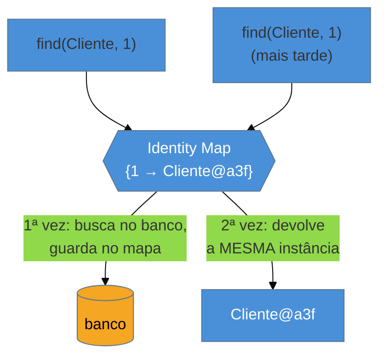

# Identity Map

> [!abstract] TL;DR
> O **Identity Map** garante que, **dentro de uma sessão**, cada linha do banco é representada por **um único objeto** em memória. Carregou o `Cliente 1` duas vezes? Você recebe **a mesma instância** nas duas — `c1 == c2` é verdadeiro, e não há como ter duas cópias com estados divergentes brigando no commit. Por baixo é um mapa indexado pela **chave primária**, mantido dentro do [[10 - Unit of Work|Unit of Work]]. É exatamente o **cache de primeiro nível (L1)** do Hibernate — sempre ligado, por sessão. Os ganhos: **identidade** de objeto, **consistência** e menos idas ao banco. As armadilhas: **dado obsoleto** (*stale*) quando outra transação alterou a linha, **consumo de memória** em processamento de lote, e a confusão clássica **L1 × cache L2**.

## Duas cópias da mesma linha são um bug esperando acontecer

Numa operação de negócio, você carrega o `Cliente 1` para conferir o limite de crédito. Mais adiante, no mesmo fluxo, outro trecho carrega o `Cliente 1` de novo para atualizar o telefone. Se cada carga cria um **objeto novo**, você agora tem **duas instâncias** da mesma linha — e elas vão divergir: uma tem o telefone velho, a outra o novo. No commit, qual estado ganha? Você acabou de criar uma inconsistência silenciosa, e o pior tipo de bug: o que depende de *quantas vezes* e *em que ordem* algo foi carregado.

Há ainda a questão da **identidade**. Em memória, esperamos que "o cliente 1 aqui" e "o cliente 1 ali" sejam **o mesmo objeto** — que `clienteAqui == clienteAli`. Se cada carga devolve uma instância nova, essa igualdade quebra, e todo código que compara por referência passa a mentir. O Identity Map resolve os dois problemas com uma regra só: **uma linha, um objeto, por sessão**.

## A ideia: um mapa por chave primária

A primeira busca por `Cliente 1` vai ao banco, cria o objeto e o **registra no mapa** sob a chave `1`. A segunda busca **encontra a chave no mapa** e devolve a instância existente — sem tocar no banco. Resultado: uma instância só, identidade preservada, e uma ida a menos ao banco. Esse mapa vive dentro do [[10 - Unit of Work|Unit of Work]] e morre com ele — por isso é "por sessão".

## É o cache L1 do Hibernate (que você não pode desligar)

O Identity Map não é teoria distante: é o **persistence context** do JPA / a **`Session`** do Hibernate, apelidado de **cache de primeiro nível (L1)**. Toda entidade que você carrega ou persiste numa `Session` fica no L1; pedir a mesma entidade de novo na mesma sessão **não** dispara SQL — vem do mapa. E ele é **obrigatório**: não há como desligar o L1, porque é ele que garante o dirty checking e a identidade que o Unit of Work precisa para funcionar.

> [!question]- Então o L1 é um cache de performance? É a mesma coisa que o cache L2?
> Não — e essa é a confusão de entrevista. O **L1 (Identity Map)** é **por sessão**, sempre ligado, e existe primariamente por **correção** (identidade e consistência), com o ganho de performance como bônus dentro daquela sessão. O **L2** é **compartilhado entre sessões**, *opt-in*, e existe puramente por **performance** (evitar ir ao banco entre requisições diferentes). Confundir os dois — esperar que um objeto carregado numa sessão apareça em outra por causa do "cache" — leva a bugs de dado obsoleto.

## A lente cross-ORM

| Ecossistema | O Identity Map é... |
| --- | --- |
| **Java (Hibernate/JPA)** | o **persistence context** / cache L1 da `Session`/`EntityManager` — sempre ativo |
| **Python (SQLAlchemy)** | a *identity map* da `Session` (documentada com esse nome exato) |
| **PHP (Doctrine)** | o Identity Map interno do `EntityManager` |
| **.NET (EF)** | o *change tracker* do `DbContext` faz o mesmo papel (uma entidade rastreada por chave) |
| **Rails (Active Record)** | **não tem** por padrão — dois `User.find(1)` dão objetos diferentes; foi removido do Rails 4 |

O caso do Rails é revelador: o Active Record **abandonou** o Identity Map justamente pelas armadilhas de consistência abaixo — e por isso, em Rails, você **não** pode assumir que `User.find(1) == User.find(1)`.

## Armadilhas comuns

> [!warning] Dado obsoleto (stale) na sessão
> **O que acontece:** você carrega o `Produto 1` (preço 100), outra transação altera o preço para 120 e commita, mas sua sessão continua devolvendo o objeto com preço 100 — o mapa não sabe que o banco mudou. **Por quê:** o Identity Map, uma vez que registrou a entidade, **serve do mapa** e não reconsulta o banco. Dentro de uma sessão longa, isso significa trabalhar com uma foto do passado enquanto o mundo avançou. **Como evitar:** mantenha a sessão **curta** (do tamanho da operação — a mesma cura do Unit of Work); quando precisar de estado fresco, force um `refresh()` da entidade ou abra uma sessão nova. Controle de concorrência otimista (`@Version`) protege contra gravar por cima.

> [!warning] Estouro de memória em processamento de lote
> **O que acontece:** um job percorre 500 mil linhas numa única sessão, e cada entidade fica presa no Identity Map — a memória cresce sem parar até o `OutOfMemoryError`. **Por quê:** o mapa **retém** toda entidade carregada para garantir a identidade; ele nunca solta sozinho. Ótimo para uma operação pequena, desastroso para varrer milhões de registros. **Como evitar:** em lote, use `session.clear()`/`flush()` periódico para esvaziar o mapa, uma *stateless session* (Hibernate) ou processamento em *chunks*. O Identity Map é para operações de negócio, não para ETL de milhões de linhas.

> [!warning] Esperar identidade entre sessões
> **O que acontece:** um objeto carregado numa requisição é comparado (`==`) com um carregado em outra, ou guardado num cache de aplicação e reusado depois — e a identidade não se sustenta. **Por quê:** o Identity Map é **por sessão**. Fora dela, a garantia "uma linha, um objeto" **não vale**: cada sessão tem seu próprio mapa, e entidades *detached* de sessões diferentes são objetos distintos. **Como evitar:** compare entidades por **igualdade de negócio** (`equals`/`hashCode` sobre a chave de negócio), nunca por referência entre sessões; não presuma identidade de objeto atravessando fronteiras transacionais.

## Como explicar em inglês

> "An Identity Map guarantees that, within one session, each database row is represented by a single object in memory. Load `Customer 1` twice and you get the same instance both times, so `c1 == c2` holds and you can't end up with two divergent copies fighting at commit. Under the hood it's a map keyed by primary key, living inside the Unit of Work — it's exactly Hibernate's first-level cache, always on, per session. People confuse it with the L2 cache: L1 is per-session and exists for correctness — identity and consistency — while L2 is shared across sessions and exists purely for performance. The traps are stale data, when another transaction changed the row but your session still serves the cached object; memory blowups in batch processing, since the map holds every entity you load; and expecting identity across sessions, which doesn't hold because the map is per-session. Rails actually dropped its identity map for these very reasons."

| PT | EN |
| --- | --- |
| mapa de identidade | identity map |
| uma linha, um objeto | one row, one object |
| cache de primeiro nível | first-level cache |
| contexto de persistência | persistence context |
| dado obsoleto | stale data |
| identidade de objeto | object identity |
| entidade destacada | detached entity |

## O que vem a seguir

O Identity Map guarda o que já foi carregado — mas e o que **ainda não** foi? Um `Pedido` tem uma lista de `Itens`; carregar o pedido deveria trazer os cem itens junto, sempre? A resposta — carregar sob demanda, via proxy — é o último padrão da maquinaria de ORM, e o que mais causa dor em produção.

- [[12 - Lazy Load]] — carregar associações sob demanda; a origem do N+1 e do `LazyInitializationException`.
- [[10 - Unit of Work]] — o container que abriga o Identity Map.
- [[13 - Query Object]] — a consulta como objeto, fechando o bloco Adepto.

## Veja também

- [[03-Dominios/Ciência/Banco de Dados/index|Banco de Dados]] — isolamento de transações, o que explica *por que* o dado fica stale.
- [[03-Dominios/Tecnologia/Python/index|Python]] — a *identity map* da `Session` do SQLAlchemy, nomeada assim na doc.

## Fontes

- **Martin Fowler** — [*Identity Map* (catálogo PoEAA)](https://martinfowler.com/eaaCatalog/identityMap.html) — a definição canônica.
- **Vlad Mihalcea** — [*How does the Hibernate first-level cache work*](https://vladmihalcea.com/first-level-cache-jpa-hibernate/) — o Identity Map como cache L1, na prática.
- **SQLAlchemy** — [*Session — Identity Map*](https://docs.sqlalchemy.org/en/20/orm/session_basics.html) — o padrão nomeado explicitamente na documentação.
