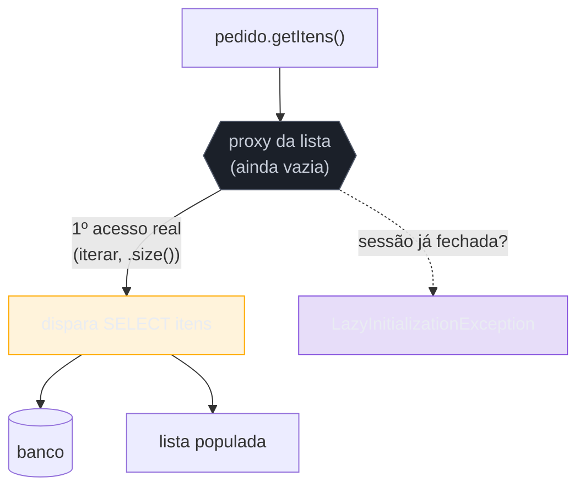

# Lazy Load

> [!abstract] TL;DR
> O **Lazy Load** adia o carregamento de um dado **até o momento em que ele é realmente usado** — em vez de trazer o `Pedido` com seus 500 `Itens`, o `Cliente` e o histórico inteiro numa tacada, você carrega o pedido e busca os itens **só se** alguém tocá-los. O mecanismo clássico é um **proxy** ([[10 - Proxy|o padrão Proxy]] do GoF): um objeto de fachada que parece o real e dispara a query no primeiro acesso de verdade. Fowler lista quatro sabores — *lazy initialization*, *virtual proxy*, *value holder* e *ghost*. É a peça que evita carregar meio banco a cada consulta — mas é também a **maior fonte de dor em produção** do mundo ORM: o **N+1** (uma query por item num laço) e a **`LazyInitializationException`** (acessar o proxy depois que a sessão fechou). A saída é carregar de propósito: *fetch join*, *entity graphs*, *batch fetching*.

## O problema do "carregue tudo": o efeito dominó

Você pede um `Pedido`. O pedido tem `Itens`; cada item tem um `Produto`; o produto tem uma `Categoria`; o pedido tem um `Cliente`; o cliente tem *outros* pedidos... Se cada objeto trouxesse **junto** tudo o que referencia, uma única busca por um pedido carregaria, por transitividade, uma boa fatia do banco inteiro em memória. Isso é **eager loading levado ao absurdo** — lento, pesado e quase sempre desperdício, porque raramente você precisa de todo esse grafo.

O Lazy Load corta o efeito dominó: carrega o pedido **agora** e deixa o resto como uma **promessa**. Os `Itens` só vão ao banco se, e quando, o código de fato iterar sobre eles. A pergunta que o padrão responde é: *como adiar uma busca sem que quem usa o objeto perceba a diferença?* A resposta é enganar o chamador com um objeto que **parece** já estar carregado.

## A ideia: um proxy que busca no primeiro toque

`getItens()` devolve um **proxy** — um substituto com a mesma interface da lista, mas ainda sem dados. Enquanto ninguém itera nem chama `.size()`, nenhuma query roda. No primeiro acesso real, o proxy dispara o `SELECT` e se popula. É o [[10 - Proxy|Proxy]] do GoF aplicado à persistência: o cliente conversa com o substituto achando que é o objeto real. **Mas** — se a sessão que sustenta o proxy já fechou quando o acesso acontece, não há como buscar: é a `LazyInitializationException`.

## Os quatro sabores (Fowler)

| Sabor | Como adia | Exemplo |
| --- | --- | --- |
| **Lazy initialization** | o getter checa se está `null`; se estiver, carrega e guarda | o mais simples, na mão |
| **Virtual proxy** | um objeto de mesma interface, vazio, que carrega no 1º uso real | proxies de coleção do Hibernate |
| **Value holder** | um objeto genérico "segura-valor" com `getValue()` que carrega | comum em .NET / implementações antigas |
| **Ghost** | o objeto **real**, mas parcial (só o ID); preenche o resto ao ser tocado | entidades parcialmente carregadas |

Na prática, o Hibernate usa **virtual proxy** para associações `@ManyToOne`/`@OneToOne` lazy (uma subclasse gerada por bytecode) e **coleções persistentes** (proxies de `List`/`Set`) para `@OneToMany`/`@ManyToMany`, que são lazy **por padrão**.

## Armadilhas comuns

> [!warning] O problema N+1
> **O que acontece:** você carrega 100 pedidos e itera acessando `pedido.getCliente().getNome()` de cada um — 1 query para os pedidos + 100 queries para os clientes, uma por proxy resolvido no laço. **Por quê:** cada associação lazy é uma promessa **individual**; tocá-la dispara **sua própria** query. O ORM esconde tão bem o custo que um acesso a atributo aparenta ser memória pura — e o laço vira 101 viagens ao banco sem uma linha de SQL à vista. É a armadilha nº 1 de performance de ORM. **Como evitar:** carregue o que o laço vai usar **de uma vez**: *fetch join* (`join fetch` em JPQL), *entity graph* (`@EntityGraph`), ou `@BatchSize`/batch fetching para agrupar as N em poucas queries. Meça as queries emitidas em desenvolvimento — o N+1 só dói sob carga real.

> [!warning] LazyInitializationException fora da sessão
> **O que acontece:** o serviço retorna a entidade, a sessão fecha, e a camada de apresentação (ou o serializador JSON) acessa uma associação lazy — estouro: `LazyInitializationException: could not initialize proxy - no Session`. **Por quê:** o proxy precisa de uma [[10 - Unit of Work|sessão viva]] para ir ao banco. Fechada a sessão, o proxy não tem como se resolver. A "cura" errada é manter a sessão aberta até a view ([[10 - Unit of Work|OSIV]]) — que troca a exceção por um N+1 silencioso na serialização. **Como evitar:** carregue tudo que a resposta precisa **dentro** da fronteira transacional (fetch join, DTO de projeção) e devolva para a camada de cima um objeto **já completo** — nunca uma entidade com proxies pendentes atravessando a fronteira.

> [!warning] Eager como reação exagerada ao N+1
> **O que acontece:** cansado de `LazyInitializationException`, o dev marca **tudo** como `EAGER` — e agora *toda* consulta arrasta o grafo inteiro, ressuscitando o efeito dominó que o Lazy Load resolvia. **Por quê:** `EAGER` global é o extremo oposto, e igualmente ruim: você paga o carregamento de associações que a maioria das telas nem usa, e perde o controle por caso de uso. **Como evitar:** mantenha as associações **lazy por padrão** e decida o *fetch* **por consulta** (fetch join / entity graph naquela query específica). O carregamento é uma decisão da **consulta**, não uma propriedade fixa do mapeamento.

## Como explicar em inglês

> "Lazy Load defers loading a piece of data until it's actually used — instead of pulling an order with its 500 line items, the customer, and the whole history at once, you load the order and fetch the items only if someone touches them. The classic mechanism is a proxy — the GoF Proxy pattern — a stand-in that looks like the real object and fires the query on first real access. Fowler lists four flavors: lazy initialization, virtual proxy, value holder, and ghost. It avoids loading half the database per query, but it's also the biggest source of ORM pain in production: the N+1 problem, where a loop over lazy associations fires one query per item, and the `LazyInitializationException`, when you touch a proxy after the session closed. The fix is to load on purpose — fetch joins, entity graphs, batch fetching — and to decide fetching per query, not by making everything eager, which just brings back the domino effect."

| PT | EN |
| --- | --- |
| carregamento preguiçoso | lazy loading |
| carregamento ansioso | eager loading |
| proxy virtual | virtual proxy |
| objeto parcial (ghost) | ghost |
| problema N+1 | N+1 problem |
| junção com busca | fetch join |
| grafo de entidade | entity graph |

## O que vem a seguir

Fecha a **maquinaria de ORM** — Unit of Work, Identity Map e Lazy Load, o trio que faz o Data Mapper funcionar por baixo. Falta um último padrão do bloco Adepto, e ele resolve justamente a dor recorrente das armadilhas acima: como montar consultas complexas (o *fetch join*, o filtro dinâmico) **sem** concatenar strings de SQL nem inchar a interface do repositório. A resposta é tratar a query como um **objeto**.

- [[13 - Query Object]] — a consulta como objeto componível e type-safe; fecha o bloco Adepto.
- [[10 - Proxy]] — o padrão GoF que o Lazy Load encarna.
- [[10 - Unit of Work]] — a sessão cujo fechamento causa a `LazyInitializationException`.

## Veja também

- [[03-Dominios/Tecnologia/Java/index|Java]] — proxies e fetch strategies do Hibernate/JPA.
- [[03-Dominios/Engenharia/Design de Software/Padrões de Projeto/Clássicos (GoF)/10 - Proxy|Proxy]] — a fundação estrutural do carregamento sob demanda.

## Fontes

- **Martin Fowler** — [*Lazy Load* (catálogo PoEAA)](https://martinfowler.com/eaaCatalog/lazyLoad.html) — a definição canônica e os quatro sabores.
- **Vlad Mihalcea** — [*The N+1 query problem*](https://vladmihalcea.com/n-plus-1-query-problem/) — o N+1 e as estratégias de fetch para evitá-lo.
- **Jakarta Persistence** — [*Entity Graphs*](https://jakarta.ee/specifications/persistence/) — o mecanismo padrão de controle de fetch por consulta.
