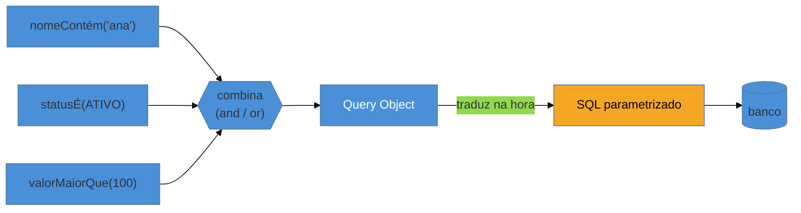

# Query Object

> [!abstract] TL;DR
> O **Query Object** trata uma consulta como um **objeto** — não uma string de SQL. Você **monta** o filtro programaticamente (`query.where(cliente.eq(id)).and(status.eq(ATIVO))`), **compõe** critérios e deixa o objeto se traduzir em SQL na hora certa. Ganhos: consultas **componíveis**, **type-safe** e sem concatenar strings (que abre porta para [[03-Dominios/Engenharia/Segurança/index|SQL injection]] e ilegibilidade). É a resposta para a **explosão de `findByXAndY`** que assombra o [[09 - Repository|Repository]]: em vez de mais um método por filtro, o repositório aceita **um** objeto de consulta. Encarna-se no **JPA Criteria**, **QueryDSL**, **Spring Data Specifications** e na *expression language* do **SQLAlchemy**. O parente próximo é o **Specification** (DDD). A armadilha: over-abstração — Criteria verboso onde um SQL nomeado seria mais claro.

## O inferno da query dinâmica montada com string

Uma tela de busca tem cinco filtros opcionais: nome, status, faixa de data, cidade, valor mínimo. O usuário preenche **qualquer combinação**. Como você monta o SQL? A tentação clássica é concatenar:

```java
String sql = "SELECT * FROM pedidos WHERE 1=1";
if (nome != null)   sql += " AND nome LIKE '" + nome + "'";   // ⚠ injeção + ilegível
if (status != null) sql += " AND status = '" + status + "'";
// ...e assim por diante
```

Isso é um festival de problemas: **SQL injection** pela concatenação, **ilegibilidade** que cresce a cada filtro, zero **segurança de tipo** (um erro de nome de coluna só explode em runtime) e o clássico `WHERE 1=1` para não ter que gerenciar o primeiro `AND`. A pergunta que o padrão responde: *e se cada pedaço da consulta fosse um objeto que eu combino, em vez de um trecho de texto que eu colo?*

## A ideia: critérios como objetos que se combinam



Cada condição é um **objeto** (`statusÉ(ATIVO)`), combinável com `and`/`or`. Você só adiciona ao Query Object os filtros que o usuário preencheu — nada de `1=1`, nada de concatenar. Na execução, o objeto se **traduz** em SQL **parametrizado** (adeus injeção), e o compilador valida os nomes de campo (adeus erro de digitação em runtime). O filtro virou dado manipulável, não texto.

## Query Object × Specification

O **Specification** (Evans/Fowler) é o parente próximo, e cai em entrevista de DDD: é um objeto que encapsula um **predicado de negócio** — "cliente inadimplente", "pedido elegível a frete grátis" — com um método `isSatisfiedBy(candidato)`. A sacada é que o **mesmo** Specification serve para dois usos: **filtrar em memória** (validar um objeto que você já tem) e **gerar a cláusula SQL** (buscar no banco). O Spring Data `Specification` é exatamente isso sobre a Criteria API — um Query Object com sabor de regra de domínio nomeada.

## A lente cross-ORM

| Ecossistema | Encarnação do Query Object |
| --- | --- |
| **JPA (padrão)** | **Criteria API** — type-safe via metamodel, porém **verbosa** (a fama de "prolixa") |
| **Java (add-on)** | **QueryDSL** — DSL fluente e legível, a alternativa preferida à Criteria crua |
| **Spring Data** | **`Specification<T>`** — Query Object com cara de predicado, componível com `and`/`or` |
| **Python** | a **expression language** do SQLAlchemy (`select().where(User.name == 'ana')`) |
| **.NET** | **LINQ / `IQueryable`** — talvez o Query Object mais elegante e integrado à linguagem |

O **LINQ** do .NET é o exemplo de ouro: a consulta é uma expressão de primeira classe na linguagem, e o provider a traduz para SQL. Do lado oposto, a **Criteria API** do JPA é o exemplo de como um Query Object mal ergonômico vira a armadilha abaixo.

## Armadilhas comuns

> [!warning] Over-abstração: Criteria onde um SQL nomeado bastava
> **O que acontece:** uma consulta **fixa** e simples (sem filtros dinâmicos) é escrita em Criteria API, gerando 15 linhas de `builder.and(builder.equal(...))` para o que um `@NamedQuery` resolveria em uma. **Por quê:** o Query Object **só se paga** quando a consulta é **dinâmica ou componível**. Para uma query estática, ele adiciona cerimônia e esconde a intenção sob a maquinaria do builder — complexidade sem o benefício da composição. **Como evitar:** reserve o Query Object para consultas que **variam** (filtros opcionais, critérios combináveis). Para queries fixas, um SQL nomeado / JPQL direto é mais legível e honesto.

> [!warning] A cadeia de builder ilegível
> **O que acontece:** a consulta vira uma torre de `.join().where().and(...).groupBy()` aninhada por páginas, mais difícil de ler do que o SQL que ela substitui. **Por quê:** trocar SQL por uma DSL não elimina a complexidade — só a move para a linguagem hospedeira. Se a query é intrinsecamente complexa, o builder fica complexo também, às vezes **pior** que o SQL por não ter a forma declarativa que o SQL oferece. **Como evitar:** para relatórios e agregações pesadas, um SQL nativo bem-escrito (em `@Query` ou view) costuma ser mais claro. Nem toda consulta ganha em virar objeto — use o Query Object onde a **composição dinâmica** é o requisito, não como dogma "nunca escreva SQL".

> [!warning] O Query Object que vaza do repositório
> **O que acontece:** o [[09 - Repository|Repositório]] devolve o próprio objeto de consulta (um `IQueryable`/`Criteria` aberto) para o serviço montar a query lá fora. **Por quê:** é a mesma armadilha do repositório genérico — o concern de persistência **vaza** para o domínio. O Query Object deve ser montado **dentro** da fronteira de acesso a dados (ou como um Specification de domínio bem-definido), não exposto cru para quem chama. **Como evitar:** encapsule o Query Object atrás de intenções de domínio (`buscarInadimplentes(spec)`); se usar Specifications, mantenha-os como **objetos de domínio nomeados**, não builders crus vazando pela interface.

## Como explicar em inglês

> "A Query Object treats a query as an object rather than a SQL string — you build the filter programmatically, compose criteria with and/or, and let the object translate itself to parameterized SQL. You get composable, type-safe queries with no string concatenation, which kills SQL injection and the unreadable dynamic-query mess. It's the answer to the `findByXAndY` explosion in repositories: instead of another method per filter, the repository takes one query object. It shows up as JPA Criteria, QueryDSL, Spring Data Specifications, SQLAlchemy's expression language, and LINQ in .NET — which is probably the most elegant version. Its close relative is the Specification from DDD, a named business predicate that can both filter in memory and generate the SQL clause. The trap is over-abstraction: the Criteria API is notoriously verbose, so for a fixed, simple query a named SQL query is clearer — use a query object where dynamic composition is the actual requirement."

| PT | EN |
| --- | --- |
| objeto de consulta | query object |
| consulta componível | composable query |
| segurança de tipo | type safety |
| predicado de negócio | business predicate |
| especificação (DDD) | specification |
| SQL parametrizado | parameterized SQL |
| consulta dinâmica | dynamic query |

## O que vem a seguir

Fecha o **bloco Adepto**: o eixo dorsal (Active Record × Data Mapper), a maquinaria de ORM (Unit of Work, Identity Map, Lazy Load) e agora a consulta como objeto. Tudo isso pressupõe um **banco relacional** — o descasamento objeto↔tabela. O bloco **Magus** vira a chave: o que acontece quando o banco **não** é relacional? O NoSQL inverte o design do acesso a dados de cabeça para baixo.

- [[14 - Modelagem por agregado e single-table design]] — o NoSQL inverte tudo: *query-first*, desnormalização, agregado como unidade.
- [[09 - Repository]] — quem recebe o Query Object como critério componível.
- [[08 - Data Mapper]] — a camada cujas consultas o Query Object organiza.

## Veja também

- [[03-Dominios/Engenharia/Segurança/index|Segurança]] — SQL injection, o risco que o Query Object elimina ao parametrizar.
- [[03-Dominios/Tecnologia/Java/index|Java]] — Criteria API, QueryDSL e Spring Data Specifications no habitat JPA.

## Fontes

- **Martin Fowler** — [*Query Object* (catálogo PoEAA)](https://martinfowler.com/eaaCatalog/queryObject.html) — a definição canônica.
- **Eric Evans / Martin Fowler** — [*Specifications* (PDF)](https://martinfowler.com/apsupp/spec.pdf) — o predicado de domínio que filtra e gera SQL.
- **Spring** — [*Spring Data JPA — Specifications*](https://docs.spring.io/spring-data/jpa/reference/jpa/specifications.html) — o Query Object componível sobre Criteria.
