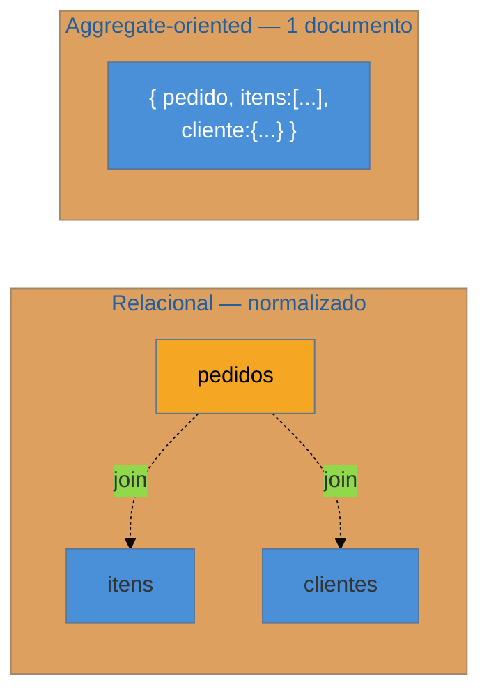

# Modelagem por agregado e single-table design

> [!abstract] TL;DR
> No relacional, você **normaliza primeiro e consulta depois** — o join resolve na hora da leitura. O **NoSQL inverte tudo**: você parte dos **access patterns** (as consultas que a aplicação fará), e **modela os dados para servi-los**, desnormalizando sem culpa. A unidade de design vira o **agregado** (o conceito de DDD): um cluster de dados que você lê e escreve junto, com uma **fronteira de consistência** — que num banco de documentos vira **o documento** (MongoDB), e no DynamoDB se estende ao **single-table design**, onde *vários tipos de entidade convivem numa tabela só*, com chaves compostas (PK/SK) modelando os relacionamentos. O motor de tudo: **NoSQL não faz join**, então você guarda junto o que lê junto. A armadilha-mãe: **modelar NoSQL como relacional** — normalizar, fazer joins na aplicação, uma-tabela-por-entidade — jogando fora a única vantagem que o NoSQL oferecia.

## Duas ordens opostas de pensar o esquema

No mundo relacional, o roteiro é conhecido: modele as entidades, **normalize** para eliminar redundância (3ª forma normal), crie as tabelas — e **só então** pense nas consultas, confiando que o otimizador e os `JOIN`s montam qualquer visão que você precisar depois. O esquema é neutro em relação às queries; a flexibilidade de consulta é o grande trunfo.

O NoSQL de alta escala (DynamoDB, Cassandra) **proíbe** o join — porque join não escala horizontalmente de forma barata. Isso inverte a ordem de raciocínio: você **começa** listando os *access patterns* ("buscar pedido por id", "listar pedidos de um cliente por data", "buscar itens de um pedido") e modela os dados **para que cada padrão seja uma leitura direta, sem junção**. O esquema deixa de ser neutro: ele é **moldado pelas perguntas** que a aplicação faz. Normalizar aqui é o erro; **desnormalizar** — repetir dado para tê-lo pronto onde será lido — é a regra.

## O agregado como unidade de armazenamento

A peça conceitual que organiza essa inversão é o **agregado** do [[03 - Domain Model|DDD]]: um grupo de objetos que formam uma unidade — um `Pedido` **com** seus `Itens` — tratado como um todo, com uma **raiz** (o `Pedido`) por onde tudo é acessado, e uma **fronteira de consistência** (você salva o agregado inteiro numa operação atômica). Fowler chama os bancos NoSQL de documento/chave-valor/coluna de **aggregate-oriented databases** justamente por isso: eles armazenam **um agregado por unidade**.

No relacional, o pedido vive espalhado em três tabelas que o join reconstitui. Num banco de documentos, o agregado inteiro é **um documento** — você lê o pedido com itens e cliente numa **única** operação, sem join. Guardou junto o que lê junto. A regra de ouro é essa: **a fronteira do agregado é a fronteira do documento**.

## Single-table design no DynamoDB

O DynamoDB leva a ideia ao extremo mais contra-intuitivo para quem vem do relacional: **uma tabela só** para o sistema inteiro, com **vários tipos de entidade misturados**. O truque está nas **chaves compostas** — *partition key* (PK) + *sort key* (SK) — usadas de forma **sobrecarregada**:

- `PK = CLIENTE#42`, `SK = PERFIL` → o perfil do cliente 42
- `PK = CLIENTE#42`, `SK = PEDIDO#1001` → um pedido do cliente 42
- `PK = PEDIDO#1001`, `SK = ITEM#3` → um item do pedido 1001

Como todos os itens com a mesma PK vivem na mesma partição, "buscar cliente 42 **e** todos os seus pedidos" vira **uma** *query* por `PK = CLIENTE#42` — sem join, numa ida ao banco. **Índices secundários globais (GSIs)** dão outras "visões" da mesma tabela para atender access patterns adicionais. O modelo mental muda de "tabelas que representam entidades" para "**itens que representam relacionamentos** pré-computados para as consultas".

> [!question]- Por que single-table, e não uma tabela por entidade como no relacional?
> Porque cada tabela extra seria um join — e o DynamoDB não junta. Espalhar entidades em tabelas separadas forçaria N leituras + montagem na aplicação (o mesmo N+1 do [[12 - Lazy Load|Lazy Load]], agora sobre a rede). Juntando tudo numa tabela com chaves compostas, o relacionamento já vem **materializado** na partição: uma query o entrega pronto. Você troca a flexibilidade de consulta do relacional pela **latência previsível** em escala — o negócio central do DynamoDB.

## Fundamento: o access pattern é o esquema

A teoria por trás é uma inversão de dependência do design de dados. No relacional, o **dado** é a verdade primária e a **consulta** se adapta a ele (via join/índice). No aggregate-oriented, a **consulta** é a verdade primária e o **dado** se molda a ela. Isso tem uma consequência dura: mudar os access patterns depois é **caro**, porque o esquema foi esculpido em torno dos antigos. Por isso a modelagem NoSQL exige **conhecer as consultas antes** — o oposto da promessa relacional de "modele agora, consulte como quiser depois". É também por isso que o NoSQL brilha onde os padrões de acesso são **conhecidos e estáveis** (um carrinho, um feed, um catálogo de sessões) e sofre onde as consultas são **ad hoc e imprevisíveis** (BI, relatórios exploratórios — que continuam sendo terreno do relacional/OLAP).

## Armadilhas comuns

> [!warning] Modelar NoSQL como se fosse relacional
> **O que acontece:** o time cria uma tabela por entidade no DynamoDB, normaliza os dados e "junta" na aplicação com múltiplas leituras — reproduzindo o modelo relacional sobre um banco que não o suporta. **Por quê:** é a transferência automática do hábito relacional para um motor que **não faz join** e não foi feito para normalização. O resultado combina o pior dos dois mundos: perde a flexibilidade do SQL e **não ganha** a latência previsível do NoSQL, ainda pagando N idas ao banco por consulta. **Como evitar:** parta dos access patterns, desnormalize de propósito, modele por agregado. Se o que você realmente quer é normalização e joins ad hoc, a resposta honesta talvez seja **usar um relacional** — não todo problema é NoSQL.

> [!warning] Access patterns não pensados antes
> **O que acontece:** modela-se a tabela "no feeling", e três sprints depois surge um novo padrão de consulta que a chave escolhida não atende — exigindo *migração de dados* ou uma cascata de GSIs. **Por quê:** no single-table design o esquema **é** os access patterns cristalizados; sem levantá-los antes, você escolhe PK/SK errados e o modelo não dobra para a pergunta nova. Refazer é caro porque não há `ALTER TABLE ... ADD JOIN`. **Como evitar:** liste **todos** os access patterns conhecidos **antes** de desenhar as chaves; projete PK/SK e GSIs para cobri-los; aceite que padrões genuinamente imprevisíveis pedem outra ferramenta ([[15 - Polyglot persistence e materialized views|polyglot]]).

> [!warning] Agregado grande demais
> **O que acontece:** o documento cresce sem limite — um `Cliente` com um array de **todos** os seus pedidos históricos — até bater no teto (16 MB por documento no MongoDB) ou criar *partições quentes* no DynamoDB. **Por quê:** juntar "tudo que se lê junto" vira juntar "tudo", e arrays ilimitados dentro do agregado estouram limites físicos e concentram carga numa partição. A fronteira do agregado foi desenhada larga demais. **Como evitar:** dimensione o agregado pela **fronteira de consistência real** (o que muda junto numa transação), não por conveniência de leitura; relacionamentos *ilimitados* (histórico crescente) viram **itens próprios** referenciados, não arrays embutidos.

## Como explicar em inglês

> "In relational you normalize first and query later — the join figures it out at read time. NoSQL inverts that: you start from your access patterns and model the data to serve them, denormalizing on purpose. The design unit becomes the aggregate, a DDD cluster you read and write together with a consistency boundary — which in a document store is literally the document, store together what you read together. DynamoDB pushes it to single-table design: multiple entity types in one table, with overloaded composite keys (partition key plus sort key) modeling relationships, so 'get a customer and all their orders' is one query on one partition, no join. The whole engine is that NoSQL doesn't join, so you materialize relationships up front. The core trap is modeling NoSQL like relational — normalizing, joining in the app, one table per entity — which throws away the only advantage NoSQL gave you. And because the schema is the access patterns crystallized, you must know your queries before you model."

| PT | EN |
| --- | --- |
| padrões de acesso | access patterns |
| desnormalização | denormalization |
| orientado a agregado | aggregate-oriented |
| fronteira de consistência | consistency boundary |
| chave composta (partição + ordenação) | composite key (partition + sort) |
| chave sobrecarregada | overloaded key |
| índice secundário global | global secondary index (GSI) |

## O que vem a seguir

Vimos como **um** banco NoSQL remodela o acesso a dados. Mas a lição real da era da nuvem é que não existe **o** banco certo — existe o banco certo para **cada carga**. Um sistema sério combina relacional + documento + chave-valor + busca, e sincroniza *read models* entre eles. É o último padrão da família, onde o acesso a dados encontra a arquitetura de eventos.

- [[15 - Polyglot persistence e materialized views]] — o banco certo para cada carga; read models e o encontro com CQRS.
- [[03 - Domain Model]] — o agregado, cuja fronteira de DDD vira a fronteira do documento.
- [[12 - Lazy Load]] — o N+1 relacional que o single-table design mata na origem.

## Veja também

- [[03-Dominios/Tecnologia/Cloud/index|Cloud]] — DynamoDB, MongoDB gerenciado e o custo por access pattern.
- [[03-Dominios/Engenharia/Arquitetura/index|Arquitetura]] — agregados e fronteiras de consistência no design tático de DDD.

## Fontes

- **Martin Fowler** — [*Aggregate-Oriented Database*](https://martinfowler.com/bliki/AggregateOrientedDatabase.html) — o agregado como unidade dos bancos NoSQL.
- **Alex DeBrie** — [*The DynamoDB Book*](https://www.dynamodbbook.com/) e [*single-table design*](https://www.alexdebrie.com/posts/dynamodb-single-table/) — a referência canônica de single-table design.
- **Eric Evans** — *Domain-Driven Design* (2003), cap. 6 — Aggregate, raiz e fronteira de consistência.
- **AWS** — [*NoSQL Design for DynamoDB*](https://docs.aws.amazon.com/amazondynamodb/latest/developerguide/bp-general-nosql-design.html) — access-pattern-first como método oficial.
