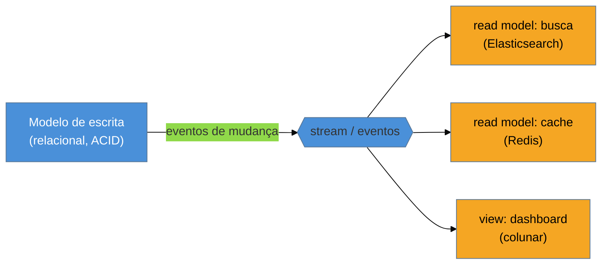

# Polyglot persistence e materialized views

> [!abstract] TL;DR
> **Persistência poliglota** é a ideia de que não existe **o** banco certo — existe o banco certo para **cada carga**: relacional para transações, documento para agregados, chave-valor para cache/sessão, motor de busca para texto livre, grafo para relacionamentos, colunar para analytics. Um sistema sério **combina** vários. E como manter dados sincronizados entre eles sem afogar a escrita? Com **materialized views / read models**: cópias **desnormalizadas e pré-computadas** de uma consulta, mantidas atualizadas — o coração do **CQRS**, que separa o **modelo de escrita** (normalizado, transacional) dos **modelos de leitura** (um por consulta, prontos para ler). O ganho é cada carga na ferramenta ideal; o preço é **complexidade operacional** (N bancos para rodar, monitorar e proteger) e **consistência eventual** (o read model *atrasa* em relação à escrita). A armadilha-mãe: **poliglota prematuro** — cinco bancos onde um Postgres bem-ajustado resolveria.

## Um banco só é sempre um compromisso

Um sistema real tem necessidades que puxam para lados opostos. O checkout precisa de **transações ACID** (relacional). O carrinho e a sessão precisam de leitura/escrita rápida por chave (**chave-valor**). A busca de produtos precisa de **texto livre, ranking e faceting** (Elasticsearch). O feed de recomendação precisa navegar **relacionamentos** (grafo). O dashboard executivo precisa de **agregações sobre milhões de linhas** (colunar/OLAP). Nenhum banco é excelente em tudo — escolher **um** é aceitar que ele será medíocre em várias dessas cargas.

A persistência poliglota é aceitar essa realidade de frente: use, no mesmo sistema, **o motor certo para cada padrão de acesso**. O termo é de Fowler/Sadalage, e a era da nuvem gerenciada o tornou barato — subir um DynamoDB + um Elasticsearch + um Postgres é questão de Terraform, não de meses. O que **não** ficou barato foi operá-los todos.

## Materialized views: o dado pré-computado

Se o mesmo fato vive em vários bancos, alguém precisa **mantê-los em sincronia** — e reconstruir a visão de leitura a cada request (com joins caros) mataria a performance. A resposta é a **materialized view**: o resultado de uma consulta **calculado uma vez e guardado pronto**, desnormalizado, atualizado quando a fonte muda. No banco relacional é o `MATERIALIZED VIEW` (Postgres) que você dá `REFRESH`; na arquitetura, é o **read model** — uma projeção desenhada para **uma** tela, alimentada pelos eventos da escrita.

Essa separação **escrita normalizada → leituras desnormalizadas** é o **CQRS** (Command Query Responsibility Segregation): comandos alteram o modelo de escrita; consultas leem dos read models otimizados. É o mesmo espírito do [[14 - Command|Command]] do GoF — separar a intenção de mudança da de leitura — agora no nível da arquitetura de dados. A propagação por eventos (event sourcing / *change data capture*) é o que mantém as views vivas; o assunto ganha corpo próprio na família de **Padrões de Eventos**, ainda por escrever.

> [!question]- Materialized view não é só um cache, então?
> É parente, mas com uma diferença de intenção. Um **cache** ([[12 - Lazy Load|lazy]], expira, é populado sob demanda e pode faltar — *cache miss*) acelera o que já existe. Uma **materialized view / read model** é uma **representação de primeira classe** dos dados para leitura: sempre presente, desnormalizada de propósito, mantida por um pipeline. O cache é um atalho opcional; o read model é *o* lugar de onde aquela consulta lê. (Cache-Aside, aliás, é assunto da família de Nuvem e Resiliência, não desta.)

## Fundamento: o teorema que cobra a conta

Por que o read model **atrasa**? Porque distribuir o mesmo dado por vários bancos esbarra no **teorema CAP**: sob partição de rede, você escolhe entre consistência e disponibilidade. Manter N réplicas **fortemente** consistentes exigiria coordenação síncrona que anula o ganho de ter bancos separados. Na prática, escolhe-se **consistência eventual**: a escrita confirma no modelo transacional, e os read models convergem **logo depois** (milissegundos a segundos). O sistema fica, por uma janela, com o dashboard mostrando um número e o banco de escrita já noutro. Poliglota **é** um sistema distribuído — e herda todas as durezas de um: ordering de eventos, reprocessamento, idempotência, a janela de inconsistência. Ignorar isso é a origem das duas armadilhas seguintes.

## Armadilhas comuns

> [!warning] Poliglota prematuro
> **O que acontece:** um sistema jovem, com carga modesta, nasce com cinco bancos "porque é a arquitetura certa" — e a equipe gasta a energia integrando armazenamentos em vez de entregar produto. **Por quê:** cada banco novo é um imposto **fixo** (operação, expertise, integração) cobrado desde o dia 1, independente da escala. E um **Postgres** moderno já faz documento (`JSONB`), chave-valor, busca full-text (`tsvector`), fila (`SKIP LOCKED`) e materialized views nativas — cobrindo muita carga antes de você *precisar* de um motor especializado. **Como evitar:** comece **monolítico no dado** (um relacional bem-ajustado), e introduza cada banco novo quando um access pattern **medido** justificar — não por antecipação. Poliglota é resposta a uma dor real de escala, não ponto de partida.

> [!warning] Consistência eventual mal gerida
> **O que acontece:** o usuário salva algo, é redirecionado para uma tela que lê do read model, e **não vê a própria alteração** — porque a projeção ainda não convergiu. O bug "sumiu o que acabei de criar". **Por quê:** o read model é **eventualmente** consistente, e a UI foi desenhada como se fosse imediata. A janela de atraso existe por design, mas ninguém a tratou. **Como evitar:** projete para a janela — *read-your-writes* (ler do modelo de escrita logo após uma alteração), UI otimista, ou indicar "processando". Torne a inconsistência **visível e finita**, nunca uma suposição silenciosa de imediatismo.

> [!warning] Sincronização frágil entre os bancos
> **O que acontece:** o pipeline que alimenta os read models falha em silêncio (um evento perdido, um consumidor travado), e as visões **divergem** da fonte sem ninguém perceber — até um relatório não bater. **Por quê:** manter N cópias em sincronia é um problema distribuído de verdade; sem idempotência, reprocessamento e monitoramento de *lag*, a deriva é questão de tempo. **Como evitar:** trate a sincronização como componente de primeira classe — consumidores idempotentes, capacidade de **reconstruir** a view do zero a partir da fonte (o read model é descartável por design), e alarme sobre o *lag* de replicação. A fonte de verdade é **uma**; as views são derivações recriáveis.

## Como explicar em inglês

> "Polyglot persistence is the idea that there's no single right database — there's a right database per workload: relational for transactions, document for aggregates, key-value for cache, a search engine for full-text, a graph for relationships, columnar for analytics. A serious system combines several. To keep data in sync across them without drowning writes, you use materialized views or read models — denormalized, precomputed copies of a query kept up to date. That's the heart of CQRS: separate the write model, normalized and transactional, from read models optimized per query, propagated by events. The payoff is each workload on its ideal engine; the price is operational complexity — N databases to run, monitor, and secure — and eventual consistency, since the read model lags the write. The big trap is premature polyglot: five stores where a well-tuned Postgres, which already does JSONB, key-value, full-text, and materialized views, would do. Polyglot is an answer to a measured scaling pain, not a starting point."

| PT | EN |
| --- | --- |
| persistência poliglota | polyglot persistence |
| visão materializada | materialized view |
| modelo de leitura | read model |
| segregação leitura/escrita (CQRS) | command-query responsibility segregation |
| consistência eventual | eventual consistency |
| janela de inconsistência | inconsistency window |
| ler-suas-escritas | read-your-writes |

## O que vem a seguir

Isto **fecha a família Acesso a Dados** — do [[01 - Panorama do acesso a dados|descasamento objeto↔relacional]] até a persistência poliglota. Vale amarrar o mapa da escolha, que é a pergunta sênior de verdade:

- **Onde mora a lógica?** Pouca e CRUD → [[02 - Transaction Script]]; rica e evolutiva → [[03 - Domain Model]].
- **Objeto conhece o banco?** Sim, produtividade → [[06 - Active Record]]; não, domínio puro → [[08 - Data Mapper]] (o eixo dorsal).
- **Como o domínio pede seus dados?** [[09 - Repository]] sobre o mapper; consultas variáveis → [[13 - Query Object]].
- **Qual banco?** Consultas ad hoc e transações → relacional; access patterns fixos e escala → NoSQL por [[14 - Modelagem por agregado e single-table design|agregado]]; cargas distintas demais → poliglota com read models.

O próximo passo do catálogo é a **família de Integração Empresarial (EIP)** — como os sistemas que escolhemos aqui **conversam** entre si por mensagens.

- [[01 - Panorama do acesso a dados]] — reler o mapa da família agora que todas as peças existem.
- [[14 - Modelagem por agregado e single-table design]] — o NoSQL que a persistência poliglota coloca ao lado do relacional.

## Veja também

- [[03-Dominios/Engenharia/Dados/index|Engenharia de Dados]] — pipelines, CDC e a Modern Data Stack que materializam views em escala.
- [[03-Dominios/Tecnologia/Cloud/index|Cloud]] — os bancos gerenciados que tornaram o poliglota barato de provisionar (e caro de operar).

## Fontes

- **Martin Fowler** — [*Polyglot Persistence*](https://martinfowler.com/bliki/PolyglotPersistence.html) — o termo e a tese do "banco certo para cada carga".
- **Martin Fowler** — [*CQRS*](https://martinfowler.com/bliki/CQRS.html) e [*Reporting Database*](https://martinfowler.com/bliki/ReportingDatabase.html) — read models e views materializadas.
- **Pramod Sadalage & Martin Fowler** — *NoSQL Distilled* (2012) — persistência poliglota como conclusão do livro.
