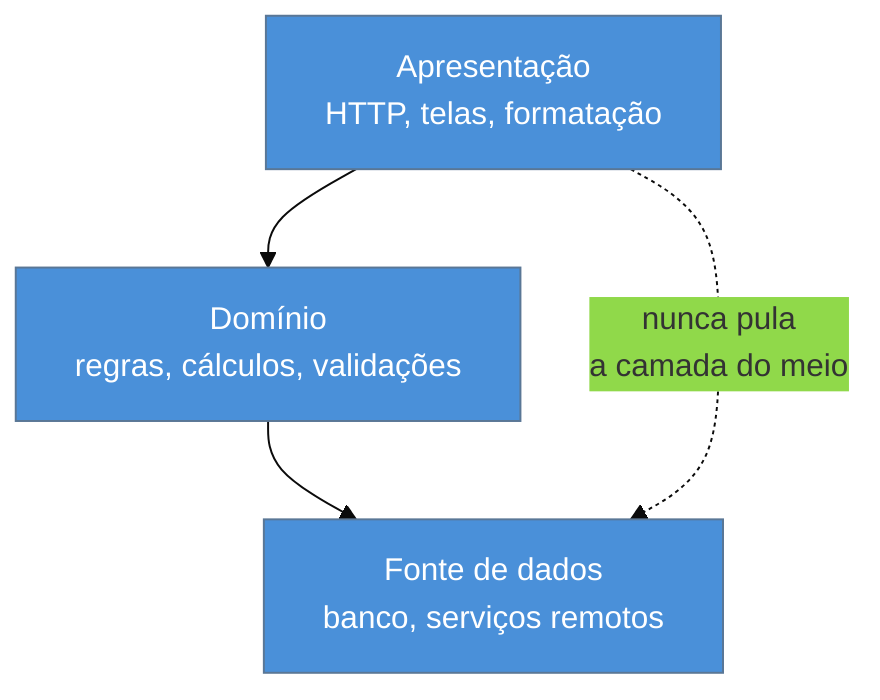
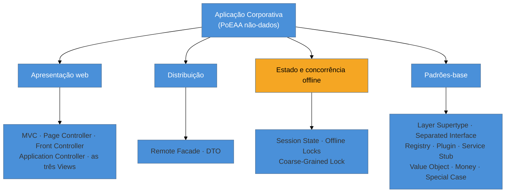

# Panorama da aplicação corporativa

> [!abstract] TL;DR
> Esta é a abertura da família **Aplicação Corporativa** — a metade **não-dados** do catálogo de Fowler (2002): como a **apresentação web** despacha requisições e monta telas, como a **distribuição** atravessa a fronteira de processo, como a **concorrência offline** protege dados entre requisições, e os **padrões-base** que todo framework embute. É a família mais **datada** das seis — e isso é a matéria-prima, não o defeito. Por isso a lente aqui não é comparar frameworks modernos: é **arqueológica**, no eixo *era × hoje*. Cada nota tem uma seção **A ressurreição**, porque a maioria desses padrões voltou — quase sempre **por causa** da nuvem, que desfez as premissas de 2002.

## Você acabou de herdar um sistema de 2006

Te chamaram para assumir um sistema que ninguém quer tocar. Você abre o repositório e encontra: um `web.xml` com um `ActionServlet`, dezenas de classes terminadas em `Action`, JSPs com `<c:forEach>` e um pouco de `<% %>` sobrando, um `struts-config.xml` de mil e duzentas linhas, classes chamadas `PedidoVO` que só têm getters e setters, uma `AbstractBaseAction`, e uma tabela `TB_SESSAO` no banco cuja finalidade ninguém sabe explicar.

A reação instintiva é chamar isso de bagunça. É a reação errada, e é a que separa o consultor do reclamante. **Quase nada ali é aleatório.** Cada um daqueles elementos é um padrão nomeado, documentado num livro de 2002, que resolvia um problema real com as restrições daquele ano. O `ActionServlet` é um **Front Controller**. As classes `Action` são o que sobrou de um **Application Controller**. O `PedidoVO` é um **DTO**. A `AbstractBaseAction` é um **Layer Supertype**. A `TB_SESSAO` é **Database Session State** — e foi provavelmente a decisão mais inteligente do projeto inteiro, porque permitiu rodar em dois servidores sem sessão pegajosa.

Esta família te dá o vocabulário para ler esse sistema. Não para admirá-lo: para **decidir com fundamento** o que preservar, o que isolar e o que substituir.

## O que "aplicação corporativa" quer dizer

Fowler usa o termo num sentido específico, e vale fixar porque ele delimita quando o catálogo se aplica. Uma aplicação corporativa tem: **dados persistentes** (que vivem muito mais que o programa e sobrevivem a várias versões dele), **muitos dados** e **muita gente acessando ao mesmo tempo**, **muitas telas** de UI, **integração** com outras aplicações que ninguém coordenou, e — o traço decisivo — **regras de negócio ilógicas**.

Esse último ponto é o que a maioria das discussões de arquitetura ignora. Não são regras complicadas de forma elegante, como um algoritmo de rota. São regras que **não seguem princípio nenhum**, porque foram negociadas por pessoas ao longo de vinte anos: o desconto vale para o cliente da região Sul exceto em novembro, salvo se o contrato for anterior a 2019. Não há refatoração que torne isso bonito. A arquitetura de aplicação corporativa existe para **conter** essa desordem numa camada onde ela faça o menor estrago possível.

> [!question]- Se meu sistema não é "corporativo", esses padrões não servem?
> Servem, mas com peso diferente. O catálogo assume o cenário de maior atrito — muitos dados, muita gente, muita regra arbitrária, integração não coordenada. Num CRUD pequeno, aplicar tudo isso é a **abstração prematura** que a família GoF combate em [[03-Dominios/Engenharia/Design de Software/Padrões de Projeto/Clássicos (GoF)/23 - Quando NÃO usar - anti-patterns e discernimento sênior|Quando NÃO usar]]. A pergunta certa não é "meu sistema é corporativo?", e sim "eu tenho o problema que este padrão resolve?".

## A decisão-mãe: três camadas

Antes de qualquer padrão específico vem a divisão que condiciona todos eles — separar o programa em **apresentação**, **domínio** e **fonte de dados**:

O ganho não é estético: é **reduzir o escopo de atenção**. Trabalhando na regra de negócio, você consegue ignorar como a tela é montada e tratar o banco como um conjunto abstrato de funções que entregam e guardam dados. Cada camada só conversa com a vizinha — a apresentação não fala com o banco por cima do domínio. Quando essa regra é violada (a JSP que abre conexão e roda SQL), o sistema perde exatamente a propriedade que justificava as camadas.

**Esta família cobre as duas camadas de cima.** A de baixo — como o objeto conversa com a tabela — é a [[03-Dominios/Engenharia/Design de Software/Padrões de Projeto/Acesso a Dados/index|família Acesso a Dados]], já escrita.

## O mapa desta família

- **Apresentação web** — como uma requisição HTTP vira uma tela. Quem recebe (um controlador por página ou um ponto único?), quem decide o próximo passo, e como o HTML é produzido.
- **Distribuição** — o que muda quando uma chamada atravessa a rede. É o bloco que gerou os dois padrões mais mal-aplicados do catálogo.
- **Estado e concorrência offline** — HTTP não tem memória, e uma edição de usuário dura várias requisições. Onde guardar a conversa e como impedir que dois usuários se sobrescrevam sem segurar uma transação de banco aberta.
- **Padrões-base** — os pequenos que você já usa sem saber o nome, porque estão embutidos no framework.

## A lente desta família: arqueológica

Nas famílias anteriores a lente foi comparativa entre implementações contemporâneas: **cross-linguagem** no GoF (o mesmo padrão em Java/TS/Python/Go), **cross-ORM** no Acesso a Dados (qual framework encarna qual padrão). Aqui essa lente **não funciona**, e insistir nela produziria comparação artificial.

O motivo é que a apresentação web **convergiu**. Em 2002, Page Controller × Front Controller era uma decisão real de projeto; hoje Spring MVC, Rails e ASP.NET Core já cravaram Front Controller antes de você escrever a primeira linha. Descrever *Two-Step View* como se fosse uma opção viva seria escrever uma nota morta. Então o eixo aqui é outro — **era × hoje**:

> Você abriu um sistema de 2006 e encontrou **isto**. Era a decisão certa naquele contexto — por quê? Onde esse padrão **ressuscitou**, sob que nome? E como se convive com ele, ou se migra?

## A ressurreição — o fio condutor

Aqui está o achado que organiza a família inteira: **quase todo padrão deste catálogo voltou**, e a maioria voltou *por causa* da nuvem. Serverless, autoescala e edge desfizeram as premissas de 2002 e reabilitaram decisões que os frameworks dos anos 2000 tinham enterrado.

O caso mais limpo é o **Session State**. Em 2002, Fowler trata guardar sessão no cliente como a opção cheia de ressalvas — tamanho, segurança, adulteração. Vinte anos depois é o **default**: serverless e autoescala mataram a sessão pegajosa, e a assinatura criptográfica do JWT resolveu a objeção de segurança. **A nuvem inverteu a recomendação do livro.** O mesmo vale para o **Page Controller**, dado como superado pelos frameworks MVC e ressuscitado inteiro pelo *file-based routing* do Next, SvelteKit e Nuxt: um arquivo por rota, handler colado na view.

Por isso cada nota desta família tem uma seção fixa **A ressurreição**: onde o padrão reapareceu, sob que nome, e o que mudou no contexto que o tornou viável de novo.

> [!warning] Regra de honestidade desta família
> Nem toda ressurreição tem o mesmo estatuto. Algumas a comunidade já nomeia explicitamente (BFF *é* Remote Facade); outras são **leitura deste catálogo** — defensáveis, mas não consenso. Cada seção marca qual é qual, e nenhuma interpretação é apresentada como fato estabelecido.

| Padrão | Voltou como | Estatuto |
| --- | --- | --- |
| Page Controller | *file-based routing*; uma função serverless por rota | reconhecida |
| Front Controller | mudou de camada: API Gateway, ingress, middleware de edge | reconhecida |
| Remote Facade | **BFF** (Backend for Frontend) | reconhecida |
| Client Session State | **JWT** — a nuvem inverteu a recomendação | reconhecida |
| Database Session State | session store em Redis/DynamoDB | reconhecida |
| Service Stub | *service virtualization*: MSW, WireMock, LocalStack, Testcontainers | reconhecida |
| Optimistic Offline Lock | *condition expressions*, `If-Match`/ETag, `@Version` do JPA | reconhecida |
| Separated Interface | a mecânica de Ports & Adapters / Hexagonal | reconhecida |
| Registry · Plugin | DI containers, service discovery; plugins de Vite/esbuild, providers do Terraform | reconhecida |
| Transform View | React (função dados → árvore), contra o Template View do JSP/ERB | leitura |
| Two-Step View | o payload dos React Server Components como primeiro estágio | leitura |
| Application Controller | Step Functions, Durable Functions, XState | leitura |
| Server Session State | Durable Objects / atores — estado com identidade, agora viável | leitura |
| DTO | mensagem protobuf do gRPC; o GraphQL resolve a *chatty interface* que o motivou | leitura |
| Value Object · Money | `record` do Java, *branded types* do TS, *newtype* do Rust | leitura |
| Special Case | `Optional` / `Result` e *pattern matching* | leitura |
| Coarse-Grained Lock | **sem ressurreição honesta** — diluído no agregado do DDD | — |

## Como ler um legado pelas camadas

O método arqueológico desta família, na ordem em que compensa aplicar:

1. **Ache o ponto de entrada.** Existe um servlet, filtro ou roteador único que recebe tudo? É Front Controller. Ou há um arquivo por página? É Page Controller. Isso te diz onde colocar instrumentação com um único ponto de edição.
2. **Siga até a tela.** O HTML vem de um template com buracos (Template View) ou de código que transforma dados em marcação (Transform View)? Se houver um estágio intermediário genérico antes do HTML final, é Two-Step View — e é aí que mora a lógica de aparência global.
3. **Procure a fronteira de processo.** Onde a chamada sai do processo? Ali deveriam estar Remote Facade e DTO. Se você encontrar DTOs **sem** fronteira de rede, achou cerimônia herdada de uma arquitetura que não existe mais.
4. **Descubra onde vive a conversa.** Sessão em memória? O sistema não escala horizontalmente sem sessão pegajosa — e isso é provavelmente o bloqueio principal de qualquer migração para contêineres.
5. **Cheque a concorrência entre requisições.** Existe coluna `versao` ou `timestamp` nas tabelas editáveis? Optimistic Offline Lock. Existe tabela de reservas com dono e expiração? Pessimistic. **Não existe nada?** Você achou o bug silencioso: dois usuários se sobrescrevendo desde sempre, sem ninguém notar.

## Armadilhas comuns

> [!warning] Confundir "datado" com "errado"
> **O que acontece:** o time decide reescrever tudo porque o sistema "usa padrões antigos", e no meio da reescrita descobre que a `TB_SESSAO` existia para permitir dois servidores, que os DTOs existiam porque havia mesmo uma chamada remota, e que a `AbstractBaseAction` centralizava a auditoria exigida por regulação. **Por quê:** o padrão foi escolhido contra restrições que não estão no código. O código registra a decisão; **não registra o motivo**. **Como evitar:** antes de remover um padrão, reconstrua a restrição que o gerou e verifique se ela ainda vale. Muitas ainda valem — e algumas voltaram a valer.

> [!warning] Aplicar o catálogo inteiro num sistema novo
> **O que acontece:** um projeto pequeno nasce com Front Controller próprio, Application Controller, DTOs entre todas as camadas e Registry global — cerimônia de uma escala que ele não tem. **Por quê:** o catálogo descreve respostas para atritos específicos (rede, concorrência offline, regra arbitrária). Sem o atrito, o padrão é só indireção — e seu framework já implementa metade deles por você. **Como evitar:** trate cada padrão como resposta a uma pergunta. Se você não consegue enunciar a pergunta, não aplique.

> [!warning] Pular a camada do meio "só nesta tela"
> **O que acontece:** uma tela de relatório vai direto da apresentação ao banco, "porque é só uma consulta". Em dois anos há quarenta dessas, e a regra de negócio existe em duas versões divergentes — uma no domínio, outra espalhada nas telas. **Por quê:** o valor do layering vem de ser **exceção-zero**. Uma exceção não custa nada; o que custa é que ela vira precedente e o limite deixa de ser verificável. **Como evitar:** se a consulta direta é legítima (relatórios costumam ser), torne isso um **caminho nomeado e explícito** — uma via de leitura declarada, não uma violação silenciosa. É o mesmo raciocínio que leva ao CQRS.

## Como explicar em inglês

> "This family covers the non-data half of Fowler's PoEAA: web presentation, distribution, offline concurrency, session state, and the base patterns. It's the most dated family in the catalog, and that's exactly why it's useful — when you inherit a legacy system, these are the patterns you'll actually find. A servlet dispatching everything is a Front Controller; a class that only holds getters and setters across a process boundary is a DTO; a session table in the database is Database Session State. What I find most interesting is that the cloud brought many of these back. Fowler treated client session state as the option with the most caveats in 2002; today JWT is the default, because autoscaling killed sticky sessions and signing solved the tampering problem. Serverless and file-based routing revived Page Controller, which the MVC frameworks had buried. So the lens here isn't comparing modern frameworks — it's reading the era."

| PT | EN |
| --- | --- |
| aplicação corporativa | enterprise application |
| camada de apresentação | presentation layer |
| fonte de dados | data source |
| regras de negócio ilógicas | illogical business rules |
| sistema legado | legacy system |
| fronteira de processo | process boundary |
| sessão pegajosa | sticky session |
| escalar horizontalmente | to scale out / scale horizontally |
| indireção sem ganho | indirection without payoff |

## O que vem a seguir

O bloco de apresentação começa pelo padrão que dá nome a metade dos frameworks existentes — e que quase ninguém usa com o mesmo sentido que o vizinho. Antes de discutir *quem despacha a requisição*, é preciso desfazer a confusão sobre o que MVC significa, porque ela contamina toda conversa de arquitetura de apresentação.

- [[02 - MVC — o padrão mais mal-entendido]] — o MVC original, o MVC web e a diáspora MV*.
- [[03 - Page Controller × Front Controller]] — quem recebe a requisição, e a ressurreição pelo *file-based routing*.
- [[08 - Session State — Client × Server × Database]] — a inversão mais interessante da família; vá direto se o seu problema é escalar um legado.

## Veja também

- [[03-Dominios/Engenharia/Design de Software/Padrões de Projeto/Acesso a Dados/index|Acesso a Dados]] — a outra metade do PoEAA; *Service Layer*, *Gateway* e *Mapper* têm casa canônica lá.
- [[03-Dominios/Engenharia/Arqueologia e Restauração de Software/index|Arqueologia e Restauração de Software]] — o método de assumir um sistema herdado, do qual esta família é o vocabulário de apresentação.
- [[03-Dominios/Engenharia/Design de Software/Padrões de Projeto/index|Padrões de Projeto]] — o galho-pai e as outras famílias.

## Fontes

- **Martin Fowler** — *Patterns of Enterprise Application Architecture* (2002) — a fonte canônica desta família; caps. de Web Presentation, Distribution, Offline Concurrency, Session State e Base Patterns.
- **Martin Fowler** — [*PoEAA — catálogo online*](https://martinfowler.com/eaaCatalog/) — o índice dos padrões por categoria, útil para conferir o roster completo (inclui *Implicit Lock* e *Record Set*, fora do corte desta família).
- **Martin Fowler** — [*Presentation Domain Data Layering*](https://martinfowler.com/bliki/PresentationDomainDataLayering.html) — por que a divisão em três camadas reduz o escopo de atenção, e quando ela não compensa.
- **Martin Fowler** — [*Layering Principles*](https://martinfowler.com/bliki/LayeringPrinciples.html) — a regra de só conversar com a camada adjacente e o que se perde ao violá-la.
