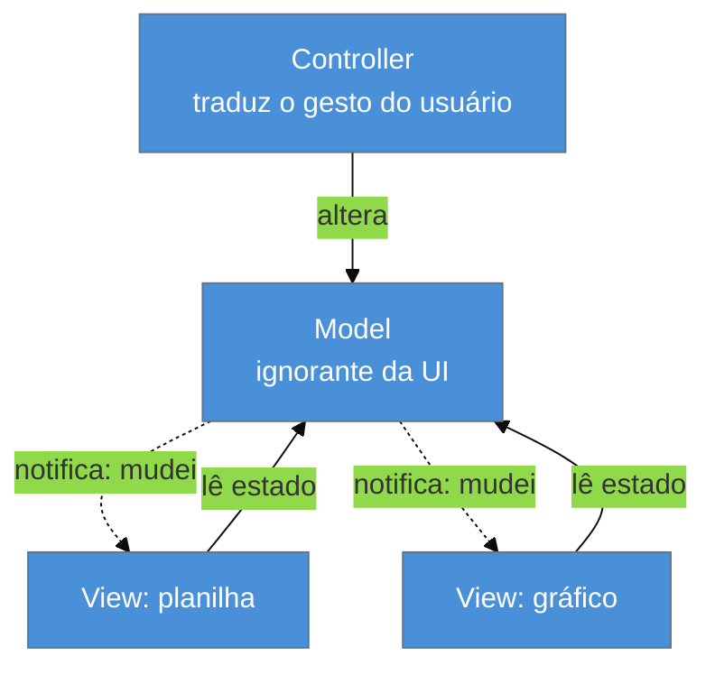

# MVC — o padrão mais mal-entendido

> [!abstract] TL;DR
> **MVC não é um padrão: são pelo menos três**, e as pessoas numa mesma reunião normalmente estão falando
> de dois deles ao mesmo tempo. O **MVC original** (Reenskaug, Xerox PARC, 1979) é uma arquitetura de
> **GUI desktop** cujo coração é a **sincronização por observação**: a view observa o model e se
> redesenha quando ele muda. O **MVC web** (Struts, Rails, Spring MVC) **não tem observer** — o ciclo
> requisição/resposta o dispensa — e por isso é, na prática, outro padrão com o mesmo nome. E o "Model"
> é o termo mais ambíguo do vocabulário de software: ora entidade, ora camada inteira. **A ressurreição
> é a volta do observer** — pelo estado reativo do frontend, não pelo servidor.

## A reunião em que ninguém está errado

Alguém propõe mover uma validação do controlador para o model. Um colega objeta: "isso não é papel do model, model é a entidade". Um terceiro discorda: "model é a camada de domínio inteira, claro que a validação vai lá". Uma quarta pessoa, vinda de frontend, comenta que "no MVC de verdade a view observa o model", e ninguém entende por que ela disse isso — não há observação nenhuma naquele sistema.

Ninguém ali está errado. Cada um está usando corretamente uma acepção diferente de um termo que se fragmentou ao longo de quarenta e poucos anos. Essa reunião custa uma hora, se repete todo mês, e o custo real não é o tempo: é que a discussão de arquitetura **fica travada num problema de vocabulário** e nunca chega ao mérito. Esta nota existe para dissolver esse impasse — não escolhendo a acepção certa, mas te dando o mapa das três.

## O MVC original: 1979, e o ponto é o observer

Trygve Reenskaug era cientista visitante no Xerox PARC no ano letivo de 1978/79, junto ao Learning Research Group. Sua primeira nota, de **12 de maio de 1979**, chamava-se *Thing-Model-View-Editor*. Depois de discussões com Adele Goldberg, a segunda nota, de **10 de dezembro de 1979**, fixou os termos: *Models — Views — Controllers*.

O contexto importa: GUI gráfica era novidade, e o problema que ele atacava era **como manter várias representações visuais do mesmo dado consistentes entre si**. Você tem uma planilha e um gráfico mostrando os mesmos números; edita a planilha; o gráfico precisa acompanhar. A resposta tem duas partes:

**Apresentação separada** (*separated presentation*) — os objetos de domínio modelam o mundo real e são **completamente ignorantes da UI**. Eles não sabem que existe tela.

**Sincronização por observação** (*observer synchronization*) — se o model não conhece a view, como a view fica sabendo que mudou? Ela **observa**. Todas as views e controllers observam o model; quando o model muda, ele notifica, e as views reagem.

As setas pontilhadas são o padrão inteiro. Sem elas, sobra uma divisão de arquivos em três pastas. **O MVC original é [[03-Dominios/Engenharia/Design de Software/Padrões de Projeto/Clássicos (GoF)/13 - Observer|Observer]] aplicado à consistência de telas** — o Observer do GoF, aliás, cita explicitamente essa origem.

> [!question]- Então o Controller do MVC original faz o quê, exatamente?
> Menos do que você imagina. Em Reenskaug ele **traduz gestos do usuário** — cliques, teclas, arrasto — em operações sobre o model. Ele não formata saída nem decide qual tela vem depois; a view cuida da saída, observando. E aqui está a primeira ironia: a implementação do Smalltalk-80 feita por Jim Althoff (sem participação do Reenskaug) já usou "Controller" com sentido diferente — mais próximo do que ele chamara de *Editor*: tratar entrada de dispositivo para uma view específica. **O termo já nasceu ambíguo, dentro da própria casa.**

## O MVC web: o mesmo nome, sem o mecanismo

Vinte anos depois, Struts, Rails, ASP.NET MVC e Spring MVC adotaram o nome. Mas o ciclo HTTP é **requisição → resposta → fim**: o servidor monta uma página e esquece que você existe. Não há tela viva para manter sincronizada, então **não há observer**. O que restou foi a separação de responsabilidades em três papéis, sem o mecanismo que os unia:

| | **MVC original (1979)** | **MVC web (anos 2000)** |
| --- | --- | --- |
| Contexto | GUI desktop, tela viva | HTTP, requisição/resposta |
| Model | objetos de domínio observáveis | ora entidade, ora camada de domínio inteira |
| View | observa o model e se redesenha | template renderizado uma vez e descartado |
| Controller | traduz gestos do usuário | recebe a requisição, orquestra, escolhe a view |
| Sincronização | **observer** — o coração do padrão | **não existe** |
| Quem manda no fluxo | o usuário, via eventos | o roteador, via URL |

Chamar os dois de MVC não foi má-fé: a separação de responsabilidades é genuinamente a mesma ideia. Mas o padrão perdeu seu mecanismo central e manteve o nome — e é dessa amputação silenciosa que nascem quase todas as discussões improdutivas sobre "MVC de verdade".

## O "Model" é o problema

Das três letras, a que causa mais dano é a primeira. Ela é usada, no dia a dia, para pelo menos três coisas distintas:

1. **O objeto de domínio** — a classe `Pedido` com regras e comportamento. É o sentido de Reenskaug.
2. **A camada inteira** — "vai no model" significando "vai na camada de domínio + acesso a dados". É o sentido de boa parte do mundo Rails e Spring.
3. **O objeto que a view recebe** — o mapa de dados formatados que o controlador entrega ao template. Frameworks chamam isso de *model* explicitamente (o `Model` do Spring MVC, o `ViewModel` alheio ao domínio).

Quando alguém diz "coloque a lógica no model", a frase é ambígua entre "enriqueça a entidade" e "mova para a camada de negócio" — que são decisões de arquitetura **diferentes**, com consequências diferentes. O sentido 3 é o mais traiçoeiro, porque parece o mesmo termo e não é: um objeto de apresentação, não de domínio.

**MVC em uma frase:** um vocabulário de separação entre domínio, tela e entrada — cujo mecanismo original (observação) sobreviveu no desktop e no frontend, mas não no servidor web.

## A diáspora MV*

As variantes nasceram tentando resolver o que ficou frouxo:

| Sigla | Origem | O que muda | Onde vive hoje |
| --- | --- | --- | --- |
| **MVP** | IBM/Taligent, anos 1990 | o *presenter* manipula a view diretamente; a view vira estrutura de widgets sem lógica | Android clássico, GWT, WinForms |
| **MVVM** | Microsoft, 2005 | o *view model* expõe estado observável, ligado à view por **data binding** — o observer de volta, automatizado | WPF, Vue, Angular |
| **MVI** | reativo funcional | o ciclo vira unidirecional: intenção → estado → view | Redux e derivados |

Repare no eixo: **MVP tira o observer** (o presenter empurra), **MVVM o traz de volta** e o torna declarativo. A discussão nunca foi sobre número de letras — é sempre sobre quem sincroniza a tela com o estado.

## A ressurreição

O MVC não morreu, então a ressurreição aqui não é do padrão inteiro: é **do mecanismo que o MVC web tinha perdido**.

**O observer voltou — no cliente.** O estado reativo do frontend moderno (o `useState` do React, os *signals* de Solid/Angular/Svelte, o sistema de reatividade do Vue) é sincronização por observação, exatamente no sentido de 1979: você altera o estado, e tudo que o lê se atualiza sozinho. A diferença é que a inscrição virou implícita — o framework rastreia a dependência em vez de você chamar `addObserver`. *Estatuto: leitura deste catálogo* — a comunidade descreve isso como "reatividade", não como MVC, mas a mecânica é a mesma e o MVVM é o elo documentado entre as duas.

**O servidor foi buscar a tela viva de volta.** HTMX, Hotwire/Turbo e Phoenix LiveView mantêm o estado no servidor e empurram fragmentos para a página, produzindo comportamento de tela sincronizada **sem** o observer viver no cliente. É a resposta mais recente à mesma pergunta de Reenskaug, com o mecanismo em outro lugar. *Estatuto: leitura.*

**O que não voltou** é o Controller como tradutor de gestos. No servidor ele virou o receptor de requisição HTTP e assim ficou.

## Armadilhas comuns

> [!warning] Achar que usar um framework MVC já dá separação de responsabilidades
> **O que acontece:** o projeto tem as pastas `models/`, `views/` e `controllers/`, e mesmo assim a regra de negócio está espalhada entre controladores gordos e templates com `if` de política comercial.
> **Por quê:** o framework impõe a **estrutura de diretórios**, não a alocação de responsabilidade. Ele não tem como saber que aquele `if` é regra de negócio.
> **Como evitar:** julgue pela pergunta "esta regra sobreviveria se trocássemos HTTP por uma CLI?". Se sim, ela não pertence ao controlador nem à view — independentemente da pasta em que está.

> [!warning] Controlador gordo (*fat controller*)
> **O que acontece:** o controlador acumula validação, cálculo, orquestração de transação e formatação; cresce para centenas de linhas e só é testável subindo o framework inteiro.
> **Por quê:** é o caminho de menor resistência — o controlador é o único ponto onde tudo já está à mão (requisição, sessão, repositórios). Toda regra nova cabe ali sem criar arquivo.
> **Como evitar:** o controlador deve **traduzir e delegar**: converter HTTP em chamada de domínio e o resultado em resposta. Se ele decide algo de negócio, esse algo pertence ao domínio — ou a um *Service Layer*, cuja nota canônica é [[03-Dominios/Engenharia/Design de Software/Padrões de Projeto/Acesso a Dados/04 - Table Module|Acesso a Dados/04]].

> [!warning] Discutir "MVC de verdade" sem fixar a acepção
> **O que acontece:** duas pessoas passam meia hora discordando e descobrem no fim que concordavam — uma falava do MVC de 1979, a outra do MVC do Rails.
> **Por quê:** o termo cobre três padrões e três sentidos de "model". Sem desambiguar, o debate é sobre palavras.
> **Como evitar:** abra a discussão com a pergunta mecânica: **"neste sistema, quem sincroniza a tela com o estado?"** Ela é respondível, distingue as acepções na hora, e vai direto ao que importa.

## Como explicar em inglês

> "MVC is probably the most overloaded term in our vocabulary. The original one — Reenskaug at Xerox PARC in 1979 — is a desktop GUI architecture, and its core is observer synchronization: the domain objects are completely ignorant of the UI, and the views observe the model and redraw when it changes. Web MVC borrowed the name but not the mechanism, because in a request/response cycle there's no live screen to keep in sync. So they're really two different patterns sharing a name. The word that causes the most damage is 'model' — people use it for the entity, for the whole domain layer, and for the bag of data handed to the template. When a discussion stalls, I skip the labels and ask a mechanical question instead: in this system, who keeps the screen in sync with the state? And it's worth noticing that observer synchronization did come back — not on the server, but in reactive frontend state."

| PT | EN |
| --- | --- |
| apresentação separada | separated presentation |
| sincronização por observação | observer synchronization |
| controlador gordo | fat controller |
| ligação de dados | data binding |
| estado reativo | reactive state |
| termo sobrecarregado | overloaded term |
| ciclo requisição/resposta | request/response cycle |

## O que vem a seguir

MVC diz que existe um controlador, mas não diz **quantos**. Essa é a primeira decisão concreta de arquitetura de apresentação — e a que mais visivelmente separa um sistema de 2002 de um de 2026, porque ela deu a volta completa: os frameworks mataram uma das opções, e a nuvem a ressuscitou.

- [[03 - Page Controller × Front Controller]] — um controlador por página ou um ponto único de entrada.
- [[04 - Application Controller]] — quem decide qual é a próxima tela, quando o fluxo é rico.
- [[05 - Template View × Transform View × Two-Step View]] — o outro lado do MVC: como a view produz a saída.

## Veja também

- [[03-Dominios/Engenharia/Design de Software/Padrões de Projeto/Clássicos (GoF)/13 - Observer|Observer]] — o mecanismo que é o coração do MVC original.
- [[01 - Panorama da aplicação corporativa]] — as camadas e a lente arqueológica desta família.

## Fontes

- **Martin Fowler** — [*GUI Architectures*](https://martinfowler.com/eaaDev/uiArchs.html) — a análise mais cuidadosa das diferenças entre MVC original, Forms and Controls e MVP; a origem dos termos *separated presentation* e *observer synchronization*.
- **Trygve Reenskaug** — [*The original MVC reports*](https://folk.universitetetioslo.no/trygver/2007/MVC_Originals.pdf) — as notas de maio e dezembro de 1979, escritas no Xerox PARC.
- **Martin Fowler** — *Patterns of Enterprise Application Architecture* (2002), cap. Web Presentation Patterns — a formulação do MVC no contexto de aplicação corporativa.
- **Gamma et al.** — *Design Patterns* (1994), Observer — o padrão cuja motivação é declaradamente o MVC do Smalltalk.
