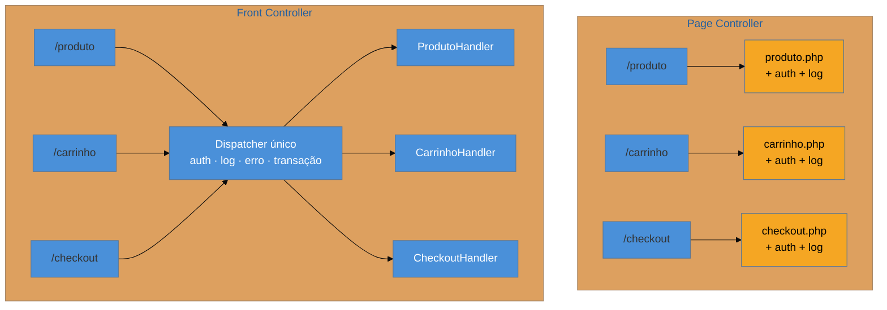

# Page Controller × Front Controller

> [!abstract] TL;DR
> Duas respostas para "quem recebe a requisição". **Page Controller**: um controlador por página ou ação — simples, localizado, e duplica tudo que é transversal. **Front Controller**: um ponto único que recebe tudo, resolve o transversal e delega — centraliza, mas vira gargalo de decisão. Os frameworks MVC dos anos 2000 declararam a disputa encerrada em favor do Front Controller. **E então o Page Controller voltou inteiro**, pelo *file-based routing* (`app/`, `pages/`, `routes/`) e por uma função serverless por rota — enquanto o Front Controller **mudou de camada** e virou infraestrutura: API Gateway, ingress, middleware de edge. Hoje você quase sempre usa os dois ao mesmo tempo.

## Dois repositórios que parecem opostos

Abra lado a lado o repositório de um sistema PHP de 2004 e o de um app Next.js de 2025.

No primeiro: `produto.php`, `produto_editar.php`, `carrinho.php`, `checkout.php`. Cada arquivo recebe sua própria requisição, lê o que precisa e cospe HTML. E, no topo de cada um, as mesmas seis linhas de `session_start()` e checagem de login — copiadas trinta e uma vezes, com duas versões divergentes porque alguém corrigiu um bug em algumas e não em todas.

No segundo: `app/produto/[id]/page.tsx`, `app/carrinho/page.tsx`, `app/checkout/page.tsx`. Cada arquivo trata sua própria rota, busca o que precisa e retorna markup.

O consenso da indústria diz que o primeiro é legado e o segundo é moderno. **Estruturalmente, são o mesmo padrão** — Page Controller nos dois casos. O que mudou não foi o padrão: foi o que ficou disponível para resolver o transversal sem duplicação.

## Page Controller: um por página

Um objeto (ou arquivo, ou função) trata as requisições de **uma** página ou ação. Ele conhece a sua URL, sabe o que precisa buscar e qual view renderizar. É o modelo mental mais direto que existe: quer saber o que acontece em `/checkout`? Abra o arquivo do checkout.

As virtudes são reais e frequentemente subestimadas: **localidade** (o comportamento de uma rota está em um lugar só), **isolamento** (mexer numa página não pode quebrar outra) e **legibilidade para quem chega** (a estrutura de URLs é visível no sistema de arquivos, sem ler configuração).

O defeito também é real: **tudo que é transversal se repete**. Autenticação, log, tratamento de erro, cabeçalhos de segurança, transação. Trinta e um arquivos, trinta e uma cópias, e o dia em que a política de sessão muda vira uma caçada.

## Front Controller: um só, para tudo

Um único ponto recebe **todas** as requisições. Ele resolve o que é comum — autenticar, abrir transação, registrar log, tratar erro — e então **delega** para o handler específico daquela rota, descoberto em configuração ou por convenção.

O âmbar marca exatamente o custo do Page Controller: aquele `+ auth + log` repetido em cada caixa. O Front Controller o resolve uma vez.

> [!question]- Se o Front Controller é claramente melhor nisso, por que a disputa existiu?
> Porque ele cobra em outra moeda. Centralizar significa que **toda** requisição passa por um ponto que precisa saber decidir para onde mandar cada uma — e essa decisão vira configuração. O `struts-config.xml` de mil e duzentas linhas do sistema legado é isso: o preço da centralização, pago em indireção. Para descobrir o que `/checkout` faz, você não abre um arquivo: você abre o dispatcher, encontra o mapeamento, e só então chega ao handler. Em um sistema com dez rotas, isso é puro custo. Em um com quinhentas, é o que impede o caos.

| | **Page Controller** | **Front Controller** |
| --- | --- | --- |
| Ponto de entrada | um por página/ação | único |
| Transversal (auth, log) | duplicado por página | resolvido uma vez |
| Achar o que uma rota faz | abrir o arquivo | dispatcher → configuração → handler |
| Custo de mudar política global | proporcional ao nº de páginas | um lugar |
| Risco característico | duplicação divergente | *God dispatcher*, configuração gigante |
| Brilha em | poucas rotas; rotas heterogêneas | muitas rotas; muito comportamento comum |

## Como a era encarnava

**Front Controller** foi a bandeira do Java web nos anos 2000: o `ActionServlet` do Struts declarado no `web.xml` capturando `*.do`, e depois o `DispatcherServlet` do Spring MVC. Todo o `struts-config.xml` existe para alimentar essa decisão de despacho. No .NET, o roteamento do ASP.NET MVC; no Rails, o `routes.rb`. Em PHP, o idioma foi um `index.php` na raiz mais regras de reescrita jogando toda URL para ele.

**Page Controller** foi o modelo default de tudo que veio antes: CGI, ASP clássico, JSP com scriptlet, PHP sem framework. Não porque alguém o escolheu, mas porque era o que o servidor web fazia naturalmente — mapear caminho de URL para caminho de arquivo. A migração para Front Controller nos anos 2000 foi, em boa medida, uma reação à duplicação transversal descrita acima.

Por volta de 2010, a discussão estava encerrada em praticamente todo framework sério.

## A ressurreição

E então ela reabriu — pelos dois lados ao mesmo tempo.

**Page Controller voltou como *file-based routing*.** O `app/` e o `pages/` do Next, o `routes/` do SvelteKit e do Remix, o `pages/` do Nuxt, o `src/pages/` do Astro: um arquivo por rota, o handler colado na view, a estrutura de URLs visível na árvore de diretórios. É a definição literal do padrão que os frameworks MVC haviam enterrado. *Estatuto: correspondência reconhecida* — a comunidade de frontend nomeia o mecanismo como *file-based routing*, e o mapeamento para o padrão de Fowler é direto.

**No serverless, também.** Uma função por endpoint atrás do API Gateway é Page Controller distribuído — com o bônus de que cada rota escala e falha isoladamente, que é a virtude do isolamento levada ao extremo operacional. *Reconhecida.*

**O Front Controller não morreu: mudou de camada.** Ele saiu do código da aplicação e virou **infraestrutura**. O API Gateway autentica, aplica *rate limit* e roteia. O ingress controller termina TLS e despacha. O middleware de edge (Next middleware, Cloudflare Workers) intercepta toda requisição antes de qualquer rota. É exatamente o papel do `ActionServlet` — receber tudo, resolver o transversal, delegar — executado por um serviço gerenciado em vez de uma classe do seu projeto. *Reconhecida.*

**O que tornou a volta possível** é a resposta à pergunta que abriu a nota: a duplicação transversal, o único defeito grave do Page Controller, **deixou de ser problema dele**. Ela subiu para a camada de infraestrutura ou para uma convenção de framework (o `middleware.ts`, o `layout.tsx`, o *route group*). Com o transversal resolvido em outro lugar, sobra só a virtude: localidade e isolamento.

> [!info] Hoje você usa os dois — e é bom saber disso
> Num app Next típico há um Front Controller (o middleware de edge + o roteador interno do framework) **e** Page Controllers (cada `page.tsx`). Não é contradição: são camadas diferentes resolvendo problemas diferentes. A pergunta útil ao herdar um sistema não é "qual dos dois ele usa", e sim **"onde mora o comportamento transversal deste sistema?"** — porque é lá que você vai instrumentar, autenticar e depurar.

## Armadilhas comuns

> [!warning] God dispatcher — o Front Controller que decide demais
> **O que acontece:** o controlador frontal acumula regra de negócio ("se for cliente premium, redirecione para..."), cresce sem limite, e vira o arquivo que todo mundo precisa editar — com todo conflito de merge do time passando por ele. **Por quê:** ele é o único ponto que vê **toda** requisição, então toda decisão "global" parece caber ali. Cada adição individual é razoável; a soma não é. **Como evitar:** o Front Controller resolve o que é **genuinamente independente de rota** (autenticação, log, correlação, erro). Se a decisão depende de qual rota é, ela pertence ao handler. Sintoma diagnóstico: um `switch` sobre o caminho da URL dentro do dispatcher.

> [!warning] Duplicação divergente no Page Controller
> **O que acontece:** as mesmas seis linhas de checagem de sessão em trinta e um arquivos, em duas versões — porque uma correção foi aplicada só onde o bug apareceu. A vulnerabilidade sobrevive nas outras. **Por quê:** copiar é mais barato que abstrair no momento de escrever, e nada no sistema torna a divergência visível depois. **Como evitar:** transversal não pode viver na página. Suba-o para middleware, *layout* ou um Front Controller — e trate qualquer preâmbulo repetido em rotas como dívida com risco de segurança, não como estilo.

> [!warning] Migrar de um para o outro sem o mecanismo de suporte
> **O que acontece:** o time adota file-based routing num sistema que tinha um Front Controller robusto, e a autenticação — que era uma linha no dispatcher — se espalha por cinquenta arquivos de rota. **Por quê:** o Page Controller **só** é viável quando existe outra camada cuidando do transversal. Migrar o roteamento sem migrar essa responsabilidade importa a virtude e o defeito juntos. **Como evitar:** antes de mover o roteamento, decida onde o transversal vai morar — middleware, layout, gateway — e mova-o **primeiro**.

## Como explicar em inglês

> "It's the question of who receives the request. With a Page Controller you have one controller per page or action — it's local and easy to follow, but everything cross-cutting gets duplicated: auth, logging, error handling, copied into every page. A Front Controller is a single entry point that handles all of that once and then dispatches to the right handler; the cost is indirection and a configuration file that tends to grow. The MVC frameworks settled this in favour of Front Controller around 2005 — and then file-based routing brought Page Controller straight back, because the duplication problem moved elsewhere: middleware, layouts, the API gateway. Meanwhile Front Controller didn't die, it moved down a layer into infrastructure. So in a modern app you're usually running both, and the useful question when you inherit a system is simply: where does the cross-cutting behaviour live?"

| PT | EN |
| --- | --- |
| ponto único de entrada | single entry point |
| despachante | dispatcher |
| comportamento transversal | cross-cutting behaviour |
| roteamento por arquivos | file-based routing |
| duplicação divergente | divergent duplication |
| indireção | indirection |
| reescrita de URL | URL rewriting |

## O que vem a seguir

Decidido quem **recebe** a requisição, sobra a pergunta que o controlador de requisição não responde bem: quem decide **qual é o próximo passo** quando a interação não cabe numa requisição só — um wizard de cinco telas, um checkout, uma aprovação em etapas.

- [[04 - Application Controller]] — a camada que centraliza o fluxo, e sua ressurreição como serviço de workflow.
- [[05 - Template View × Transform View × Two-Step View]] — o outro lado: como a resposta vira HTML.
- [[02 - MVC — o padrão mais mal-entendido]] — o vocabulário que enquadra estes dois padrões.

## Veja também

- [[03-Dominios/Engenharia/Design de Software/Padrões de Projeto/Clássicos (GoF)/09 - Facade|Facade]] — a mesma intuição de ponto único, com motivação diferente (esconder complexidade, não centralizar despacho).
- [[01 - Panorama da aplicação corporativa]] — o método de ler um legado pelas camadas; achar o ponto de entrada é o passo 1.

## Fontes

- **Martin Fowler** — *Patterns of Enterprise Application Architecture* (2002), Web Presentation Patterns — as formulações canônicas de Page Controller e Front Controller.
- **Martin Fowler** — [*PoEAA — catálogo online*](https://martinfowler.com/eaaCatalog/) — as fichas resumidas dos dois padrões.
- **Martin Fowler** — [*Layering Principles*](https://martinfowler.com/bliki/LayeringPrinciples.html) — por que o comportamento transversal tende a subir de camada.
