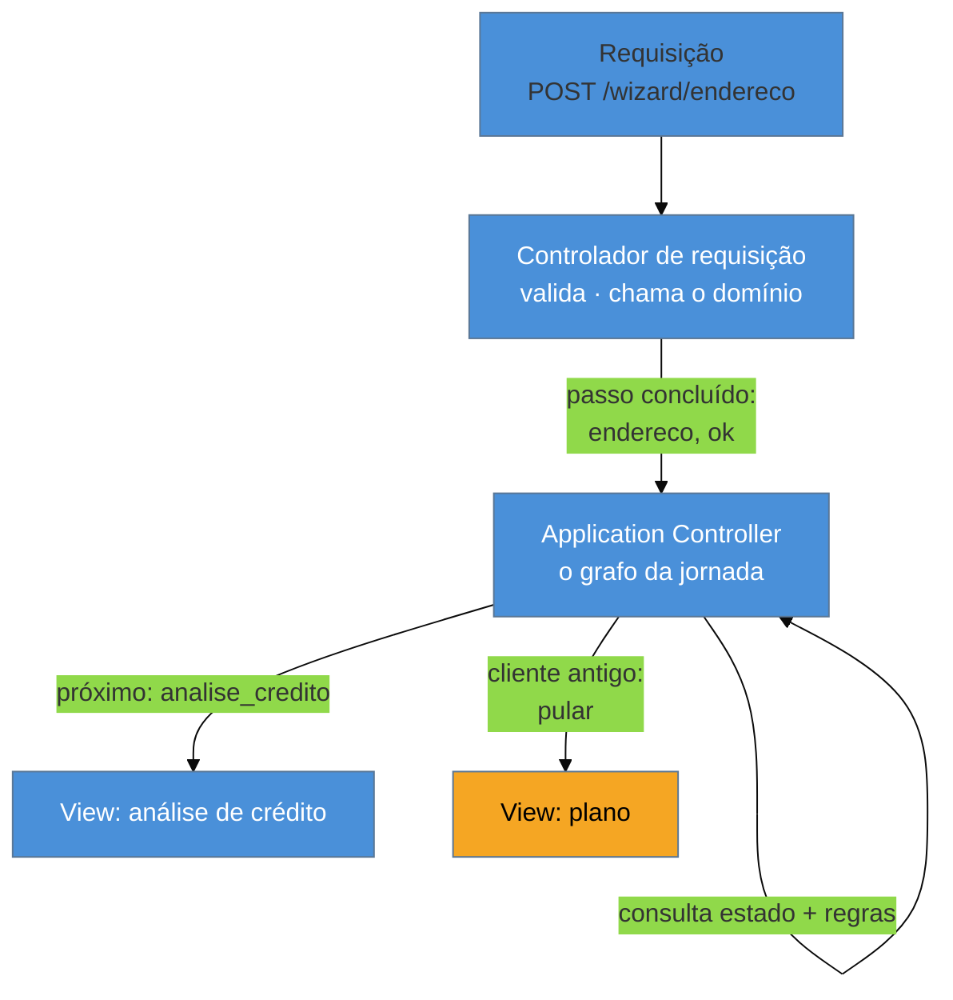

# Application Controller

> [!abstract] TL;DR
> Um controlador de requisição sabe tratar **uma** requisição; ele não sabe onde ela cai dentro de uma
> jornada. Quando o fluxo é rico — wizard, checkout, aprovação em etapas — a lógica de "de onde vim,
> para onde vou" se espalha em `if` pelos controladores, e ninguém consegue enunciar as regras de
> navegação sem ler o sistema inteiro. O **Application Controller** extrai esse fluxo para um lugar só:
> uma **máquina de estados da aplicação**, separada de quem trata HTTP. Aparece quando o fluxo é rico e
> **some quando é CRUD** — aplicá-lo sem fluxo é indireção pura. **A ressurreição** é a mesma ideia
> promovida a serviço: Step Functions, Durable Functions, Temporal, XState.

## A tela 3 que às vezes some

Um wizard de contratação com cinco telas: dados pessoais, endereço, análise de crédito, plano, confirmação. A regra é que a análise de crédito é pulada para quem já é cliente há mais de um ano — exceto se o valor passar de certo limite, e exceto se o cadastro estiver desatualizado.

Você abre o código procurando essa regra. Ela não está em lugar nenhum: está em **três**. Um `if` no controlador da tela 2 decide o destino do "avançar". Outro no controlador da tela 4, para tratar quem chegou pulando. Um terceiro no botão "voltar" da confirmação, porque voltar precisa saber se a tela 3 existiu naquela jornada. Uma quarta cópia, sutilmente diferente, no controlador de retomada — quando o usuário fecha o browser e volta no dia seguinte.

O bug reportado é que alguns clientes veem a análise de crédito duas vezes. Para investigar, você precisa ler quatro arquivos e reconstruir mentalmente um grafo que **não está escrito em lugar nenhum**. É a assinatura do problema que o Application Controller resolve.

## A ideia: separar o passo da requisição

São duas responsabilidades diferentes, quase sempre fundidas num objeto só:

- **Tratar a requisição** — extrair parâmetros, validar entrada, chamar o domínio, montar a resposta. É o trabalho do Page/Front Controller da nota anterior.
- **Decidir o próximo passo** — dado onde a jornada está e o que acabou de acontecer, qual é o estado seguinte e que tela ele mostra.

O Application Controller é a segunda, extraída. Ele guarda **o grafo**: os estados possíveis da jornada, as transições, e o que dispara cada uma. O controlador de requisição passa a perguntar em vez de decidir — "terminei o passo `endereco` com sucesso; qual é o próximo?".

O ganho não é ter mais uma camada: é que a pergunta **"quais são as regras de navegação deste fluxo?"** passa a ter uma resposta em um lugar — legível, testável sem subir HTTP, e alterável sem caçar `if` por controladores.

> [!question]- Isso não é só uma máquina de estados com outro nome?
> É exatamente uma máquina de estados — e reconhecer isso é o que dá acesso às ferramentas certas. A contribuição do padrão é **onde** ela mora: nem no controlador de requisição (que só vê um passo e não tem como conhecer o grafo), nem no domínio (a ordem das telas é decisão de aplicação, não regra de negócio — o mesmo contrato pode ser vendido por um app com fluxo diferente). É uma camada própria, entre a apresentação e o domínio. E a formalização visual disso são os *statecharts* de David Harel (1987), que é justamente a base do XState.

## Quando aparece — e quando não

Este é o padrão do roster com a fronteira de aplicabilidade mais nítida, então vale ser explícito:

| Sinal | Precisa de Application Controller? |
| --- | --- |
| CRUD: listar, ver, editar, apagar | **Não.** Cada ação é autocontida; o "próximo passo" é sempre voltar à lista. |
| Wizard multi-tela com ramificações | **Sim.** É o caso canônico. |
| Checkout com etapas condicionais | **Sim.** Frete, pagamento e revisão variam por carrinho e cliente. |
| Aprovação com estados e papéis | **Sim.** O grafo é o coração do sistema. |
| Fluxo linear de 2 telas, sem desvio | **Não.** Um `redirect` explícito é mais claro que uma camada. |

A regra prática: **se você consegue desenhar o fluxo num guardanapo e ele tem mais de um caminho, ele merece existir como dado em algum lugar.** Se o guardanapo é uma seta só, não merece.

## Como a era encarnava

O padrão foi bastante popular no Java web dos anos 2000, quase sempre em forma **declarativa**:

- **Struts** — os `<forward name="sucesso" path="/tela.jsp"/>` do `struts-config.xml`. O controlador devolvia o nome lógico `"sucesso"` e a configuração decidia a tela. É um Application Controller embrionário: extrai o mapeamento, mas não o **estado** da jornada.
- **JSF** — as *navigation rules* no `faces-config.xml`, mesma ideia com mais expressividade.
- **Spring Web Flow** — a versão completa: definições de fluxo em XML, com estados, transições, escopo de conversa e persistência da jornada. Ainda existe, hoje em nicho.
- **ASP.NET WebForms** — o controle `Wizard`, que embutia o grafo num componente de tela.

O elemento comum é o **nome lógico**: o código diz "terminei com sucesso", não "vá para `/analise.jsp`". Essa indireção é o que permite que o fluxo mude sem recompilar a lógica — e é também a fonte da crítica da época, quando o XML ficava grande demais para ser lido.

## A ressurreição

O Application Controller como camada de apresentação praticamente desapareceu — as SPAs levaram a navegação para o cliente e os frameworks server-side pararam de oferecê-lo. Mas **a ideia foi promovida**: a máquina de estados saiu do objeto e virou **serviço ou biblioteca dedicada**.

**No cliente: XState e statecharts.** Declarar estados, transições e guardas como dado, fora dos componentes, e deixar a UI ser função do estado. É o Application Controller do wizard, com ferramenta e visualizador. *Estatuto: leitura deste catálogo* — a comunidade descreve XState como *state machines/statecharts*, não como Application Controller, mas o problema atacado é literalmente o desta nota.

**No backend distribuído: orquestração durável.** AWS Step Functions, Azure Durable Functions e Temporal fazem a mesma coisa numa escala diferente: o grafo é declarado fora do código de cada passo, o estado da jornada é **persistido** pelo motor, e ela sobrevive a reinício, falha e espera de dias. É o Application Controller com durabilidade — que era exatamente o ponto fraco da versão de 2002, onde a jornada vivia na sessão e morria com ela. *Estatuto: leitura.*

**O que mudou no contexto:** em 2002 a jornada era curta (minutos, dentro de uma sessão web) e o estado cabia na memória do servidor. Hoje a jornada pode durar dias, atravessar serviços e sobreviver a *deploys* — e isso exigiu tirar a máquina de estados da aplicação e dar a ela um motor próprio.

> [!info] Por que isso importa num legado
> Ao encontrar `struts-config.xml` ou `faces-config.xml` com muitas regras de navegação, você não achou lixo: achou **o grafo do processo de negócio, escrito de forma declarativa**. É frequentemente a documentação mais fiel do fluxo que existe no projeto — e o melhor ponto de partida para migrar, porque já está em forma de dado.

## Armadilhas comuns

> [!warning] Aplicar em CRUD
> **O que acontece:** um sistema de cadastro ganha camada de navegação, com nomes lógicos e mapeamento configurável, para fluxos que são sempre "salvou → volta pra lista".
> **Por quê:** o padrão parece "mais arquitetural", e a indireção é confundida com desacoplamento.
> **Como evitar:** sem ramificação, não há grafo — e sem grafo, a camada só acrescenta um salto entre você e a resposta. Um `redirect` explícito é mais legível.

> [!warning] Fluxo espalhado em `if` pelos controladores
> **O que acontece:** o oposto — a regra de navegação existe em três ou quatro cópias, e o bug aparece no caminho que só uma delas conhece (voltar, retomar, expirar).
> **Por quê:** cada `if` foi adicionado no lugar onde o problema apareceu, nunca no lugar onde a decisão pertence.
> **Como evitar:** o sintoma diagnóstico é precisar ler mais de um arquivo para responder "quando a tela 3 aparece?". Quando isso acontece, o grafo já existe — só não está escrito.

> [!warning] Confundir fluxo de aplicação com regra de negócio
> **O que acontece:** a máquina de estados começa a decidir sobre o domínio ("se o limite for excedido, negue o contrato"), e a lógica de negócio se muda para a camada de navegação.
> **Por quê:** o Application Controller é o único lugar que enxerga a jornada inteira, então toda decisão que depende de contexto amplo parece caber ali.
> **Como evitar:** ele decide **qual tela vem depois**; o domínio decide **se algo é permitido**. Teste: se o mesmo negócio fosse vendido por API, sem telas, essa regra teria de continuar existindo? Se sim, ela é de domínio.

## Como explicar em inglês

> "A request controller knows how to handle one request — it doesn't know where that request sits in a longer journey. Once you have a wizard or a checkout with conditional steps, the navigation logic gets scattered across controllers as if-statements, and nobody can tell you when step three actually appears without reading four files. An Application Controller pulls that out into one place: it holds the state machine for the journey, separate from the code that handles HTTP. The important caveat is that it only pays off when the flow actually branches — on plain CRUD it's pure indirection. And the pattern didn't so much die as get promoted: XState does this on the client, and Step Functions, Durable Functions and Temporal do it on the backend, with the big improvement that the journey state is now durable — it survives restarts and can run for days, which is exactly what the 2002 version couldn't do."

| PT | EN |
| --- | --- |
| máquina de estados | state machine |
| fluxo de telas | screen flow |
| nome lógico (de destino) | logical (view) name |
| regra de navegação | navigation rule |
| jornada / conversa | journey / conversation |
| orquestração durável | durable orchestration |
| guarda (de transição) | guard |

## O que vem a seguir

Fechado o lado de quem recebe e de quem decide o próximo passo, falta o outro extremo da apresentação: como a resposta vira efetivamente HTML. São três estratégias com destinos históricos muito diferentes — e é onde mora a ressurreição mais surpreendente da família.

- [[05 - Template View × Transform View × Two-Step View]] — as três formas de produzir a saída; fecha o bloco de apresentação.
- [[08 - Session State — Client × Server × Database]] — onde o estado da jornada é guardado entre requisições.
- [[03 - Page Controller × Front Controller]] — quem recebe a requisição que este padrão encaminha.

## Veja também

- [[03-Dominios/Engenharia/Design de Software/Padrões de Projeto/Clássicos (GoF)/19 - Mediator|Mediator]] — a mesma intuição de centralizar coordenação, no nível de objetos.
- [[01 - Panorama da aplicação corporativa]] — a lente arqueológica e o método de leitura por camadas.

## Fontes

- **Martin Fowler** — *Patterns of Enterprise Application Architecture* (2002), Web Presentation Patterns — a formulação canônica de Application Controller.
- **Martin Fowler** — [*PoEAA — catálogo online*](https://martinfowler.com/eaaCatalog/) — a ficha resumida do padrão.
- **David Harel** — *Statecharts: A Visual Formalism for Complex Systems* (1987) — a formalização de máquinas de estado hierárquicas que fundamenta o XState.
