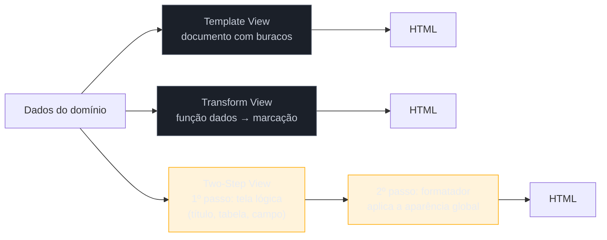

# Template View × Transform View × Two-Step View

> [!abstract] TL;DR
> Três formas de transformar dados em tela. **Template View**: um documento de marcação com buracos onde os dados entram (JSP, ERB, Thymeleaf) — natural de ler, e convida lógica para dentro do template. **Transform View**: uma função que percorre os dados e **produz** a marcação (XSLT no livro) — testável e composável, menos parecida com o resultado final. **Two-Step View**: renderiza primeiro para uma **tela lógica** independente de formato, e só depois para HTML — a resposta de 2002 ao "mudar a aparência do sistema inteiro". Aqui está a ressurreição mais surpreendente da família: **React é Transform View**, e a indústria migrou de um para o outro quase sem nomear a mudança.

## "Precisamos mudar o visual do sistema inteiro"

O pedido chega assim, e parece razoável. O sistema tem quatrocentas telas. Você abre uma JSP e encontra a estrutura da página — cabeçalho, menu lateral, migalhas, o bloco de conteúdo, o rodapé — escrita ali dentro. Abre a segunda: a mesma estrutura, copiada, com uma diferença de duas classes CSS que ninguém sabe se é intencional. Na terceira, o menu está numa `<table>` em vez de `<div>`, porque aquela tela é de 2004 e as outras de 2009.

Não existe "o lugar onde a aparência é definida". A aparência é uma **propriedade emergente** de quatrocentos arquivos que concordam entre si por hábito. Foi para esse problema — e ele era muito mais agudo antes do CSS moderno — que Fowler catalogou a terceira estratégia desta nota.

## Template View: marcação com buracos

Você escreve o documento de saída como ele será, e marca os pontos onde os dados entram.

```jsp
<h1>Pedido ${pedido.numero}</h1>
<c:forEach items="${pedido.itens}" var="item">
  <li>${item.descricao} — ${item.valor}</li>
</c:forEach>
```

A virtude é imediata: **o arquivo se parece com o resultado**. Quem trabalha com a aparência consegue ler e editar sem entender o programa. Foi essa propriedade que fez JSP, ASP, PHP, ERB, Thymeleaf, Blade e Jinja dominarem a web por vinte anos.

O defeito é a mesma propriedade vista de outro ângulo. O template é um lugar confortável onde toda a informação já está à mão — e cada `if` que entra ali é individualmente razoável. Primeiro é um `if` de exibição ("se não houver itens, mostre um aviso"). Depois é um `if` de política ("se o cliente for premium, mostre o desconto"). O segundo é regra de negócio morando na camada de apresentação, agora invisível para qualquer busca por regra no domínio.

## Transform View: uma função que produz a marcação

Em vez de partir do documento, você parte dos dados: uma função percorre cada elemento e **produz** a saída correspondente.

```xslt
<xsl:template match="item">
  <li><xsl:value-of select="descricao"/> — <xsl:value-of select="valor"/></li>
</xsl:template>
```

No livro o veículo é XSLT, o que hoje soa datado — mas o que define o padrão não é a tecnologia, é a **direção**: dados entram, marcação sai, por transformação. E isso muda três coisas. A transformação é **testável** sem servidor (entra estrutura, sai estrutura). É **composável** — transformações se aplicam a resultados de outras. E é **recursiva por natureza**, o que casa com a árvore que todo documento é.

O custo, em 2002, era que XSLT tem curva íngreme e o arquivo não se parece com a tela.



## Two-Step View: passar por uma tela lógica

Os dois primeiros vão de dados a HTML em um salto — e é por isso que a aparência acaba espalhada por quatrocentos arquivos. O Two-Step View quebra o salto em dois.

**Primeiro passo:** transformar os dados do domínio numa **tela lógica** — uma estrutura que diz *o que* a página tem, sem dizer como se parece. Não "uma `<table>` com `class="grid"`", e sim "um título, uma tabela de itens, um campo de valor". É uma representação independente de formato de saída.

**Segundo passo:** um formatador único converte essa tela lógica em HTML, decidindo aparência para o sistema todo. Trocar o visual inteiro passa a ser mexer no segundo passo — **um lugar**, não quatrocentos.

O ganho é claro e o custo também: você agora tem uma linguagem intermediária própria, que precisa ser rica o bastante para expressar suas telas e restrita o bastante para não virar HTML disfarçado. E qualquer tela que não caiba no vocabulário lógico exige uma saída de emergência — que, uma vez aberta, tende a ser usada.

> [!question]- Isso não é o que um bom CSS resolve hoje?
> Em boa parte, sim — e é a razão honesta pela qual o Two-Step View saiu de moda. Em 2002 a aparência estava misturada à estrutura (tabelas de layout, `<font>`, atributos de apresentação no HTML), então trocar o visual **exigia** reescrever a marcação. Com a separação estrutura/estilo consolidada, mudar aparência virou mudar folha de estilo, e a necessidade que justificava o padrão encolheu bastante. **Encolheu, não desapareceu:** ela reaparece sempre que a saída precisa mudar de *forma*, não só de *estilo* — HTML e PDF e e-mail e voz a partir da mesma tela lógica; ou uma marca branca em que cada cliente tem componentes diferentes, não só cores diferentes.

## Como a era encarnava

**Template View** foi o default absoluto: JSP com JSTL, ASP clássico, PHP, ERB no Rails, Velocity e FreeMarker, depois Thymeleaf. **Transform View** viveu quase inteiramente no mundo XML — servidores que produziam XML e aplicavam XSLT para gerar HTML, comuns em publicação de conteúdo e integração. **Two-Step View** foi o mais raro dos três: aparecia em frameworks de publicação (o Apache Cocoon é o exemplo típico, com *pipelines* de transformações XSLT encadeadas) e em sistemas grandes com marca branca. Sitemesh, popular no Java, resolvia um pedaço do problema — decorar a saída depois de gerada.

## A ressurreição

**A migração que ninguém anunciou: a web foi de Template View para Transform View.**

Um componente React não é um documento com buracos: é uma **função que recebe dados e retorna uma árvore de elementos**, e o JSX é açúcar sintático sobre chamadas de função. Vue e Svelte compilam templates para funções de renderização — chegam ao mesmo lugar por outro caminho. Toda a virtude que Fowler atribui ao Transform View reaparece: testável isoladamente (entra `props`, sai árvore), composável (componentes recebem resultados de componentes), recursivo por construção.

*Estatuto: leitura deste catálogo.* A comunidade descreve isso como "componentes" e "renderização declarativa", não como Transform View, e a discussão de 2002 — XSLT contra JSP — não é lembrada como antecedente. Mas a distinção estrutural de Fowler é exatamente a que separa JSP de React, e ela explica coisas que a conversa usual não explica: **por que testar um componente React é fácil e testar uma JSP não é**, ou por que o escape contra XSS pôde virar padrão numa abordagem e não na outra.

**Two-Step View reaparece nos React Server Components.** O RSC não renderiza para HTML: renderiza para um **payload serializado** — uma representação da árvore, independente da saída final — que o segundo estágio, no cliente, converte em DOM. Dois passos, com uma representação lógica intermediária. *Estatuto: leitura* — não vi essa ligação feita explicitamente por ninguém, e ela é oferecida como lente, não como fato estabelecido.

**A necessidade original do Two-Step View também sobreviveu por outra via:** *design tokens* e bibliotecas de componentes resolvem "mudar a aparência do sistema inteiro" concentrando a decisão visual num lugar — o mesmo objetivo, alcançado por composição de componentes em vez de um segundo passo de renderização. *Leitura.*

## Armadilhas comuns

> [!warning] Regra de negócio no template
> **O que acontece:** um `if` de política comercial mora na JSP. Meses depois, alguém procura a regra de desconto no domínio e não a encontra — e implementa uma segunda versão. As duas divergem, e o relatório passa a discordar da tela. **Por quê:** o template tem todos os dados à mão e nenhuma barreira. Cada `if` isolado parece exibição. **Como evitar:** distinga **lógica de exibição** (como mostrar o que já foi decidido — plural, formato, ocultar seção vazia) de **lógica de decisão** (o quê e se). A segunda pertence ao domínio. Teste: se essa regra vale também na API sem tela, ela não é do template.

> [!warning] Escapar por engano e não por padrão
> **O que acontece:** uma variável é interpolada sem escape numa tela, e vira XSS armazenado. As outras trezentas e noventa e nove telas escapam corretamente — o que faz a falha ser invisível em revisão. **Por quê:** no Template View clássico, escapar é um **ato** que se pode esquecer, repetido em cada interpolação. A segurança fica proporcional à disciplina, em centenas de pontos. **Como evitar:** prefira mecanismos que escapam **por padrão** e exigem gesto explícito para não escapar (`dangerouslySetInnerHTML`, `<c:out>`, autoescape do Jinja/Twig). Essa inversão do default é um ganho concreto e pouco celebrado do modelo Transform View.

> [!warning] Two-Step View sem a necessidade que o justifica
> **O que acontece:** o time cria uma camada de "tela lógica" com vocabulário próprio para um sistema com uma única aparência. Toda tela nova exige estender o vocabulário, e as que não cabem usam a saída de emergência — até que metade das telas a use e a camada só acrescente uma etapa. **Por quê:** o padrão é atraente por parecer mais abstrato, mas ele paga por uma necessidade específica: **múltiplas aparências ou múltiplos formatos de saída**. **Como evitar:** enuncie a segunda saída antes de construir a camada. Se você não consegue nomear a segunda aparência ou o segundo formato, ainda não é hora.

## Como explicar em inglês

> "There are three ways to turn data into a screen. Template View is a markup document with holes in it — JSP, ERB, Thymeleaf. It reads like the output, which is why it won, but it's also an inviting place for business logic to hide. Transform View goes the other way: a function walks the data and produces the markup; Fowler's example was XSLT. Two-Step View splits rendering in two — first into a logical screen that says what's on the page without saying how it looks, then a single formatter turns that into HTML, so changing the whole system's appearance is one place instead of four hundred. What I find interesting is that the industry quietly migrated from Template View to Transform View without naming it: a React component is a function from data to a tree, not a document with holes. That reframing explains why component testing is easy and JSP testing wasn't — and why escaping could become the default in one model and not the other."

| PT | EN |
| --- | --- |
| marcação | markup |
| tela lógica | logical screen |
| lógica de exibição | display logic |
| escape por padrão | escaping by default |
| marca branca | white-labelling |
| renderização declarativa | declarative rendering |
| saída de emergência | escape hatch |

## O que vem a seguir

Isso fecha o bloco de **apresentação**: quem recebe a requisição, quem decide o próximo passo, e como a saída é produzida. O próximo bloco muda de problema — o que acontece quando uma chamada deixa de ser local e **atravessa a rede**. É onde nascem os dois padrões mais aplicados sem motivo do catálogo inteiro.

- [[06 - Remote Facade]] — por que uma interface remota precisa ser grossa; abre o bloco Adepto.
- [[07 - DTO — e por que virou pejorativo]] — o padrão que quase todo projeto usa e quase nenhum precisa.
- [[02 - MVC — o padrão mais mal-entendido]] — a view aqui é o V do MVC; a nota do vocabulário.

## Veja também

- [[03-Dominios/Engenharia/Design de Software/Padrões de Projeto/Clássicos (GoF)/22 - Reconhecer GoF nos frameworks|Reconhecer GoF nos frameworks]] — o mesmo exercício de identificar padrões dentro de ferramentas do dia a dia.
- [[01 - Panorama da aplicação corporativa]] — a lente arqueológica e o passo 2 do método (seguir até a tela).

## Fontes

- **Martin Fowler** — *Patterns of Enterprise Application Architecture* (2002), Web Presentation Patterns — as formulações canônicas dos três padrões.
- **Martin Fowler** — [*PoEAA — catálogo online*](https://martinfowler.com/eaaCatalog/) — as fichas resumidas, úteis para conferir as definições curtas.
- **Martin Fowler** — [*GUI Architectures*](https://martinfowler.com/eaaDev/uiArchs.html) — o contexto de apresentação separada em que estes padrões se encaixam.
