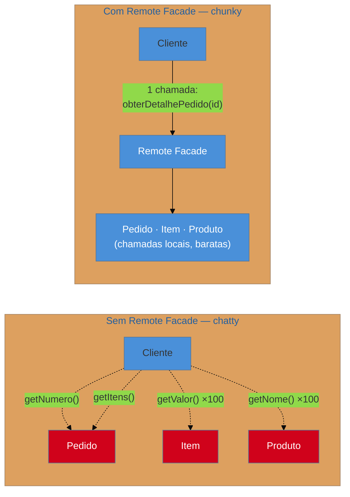

# Remote Facade

> [!abstract] TL;DR
> Um objeto bem projetado tem métodos **finos** — muitos, pequenos, expressivos. Essa é a granularidade
> certa **dentro** de um processo, e a errada atravessando a rede, onde cada chamada custa milissegundos
> em vez de nanossegundos. O **Remote Facade** é uma interface **grossa** que fica na fronteira: uma
> chamada, muitos dados, uma viagem. Ele **não tem lógica de negócio** — só agrega e traduz. É a
> aplicação direta da Primeira Lei da Distribuição de Objetos de Fowler: *não distribua seus objetos*.
> **A ressurreição** tem nome que você usa toda semana: **BFF** — Backend for Frontend.

## A tela que demora oito segundos

A tela de detalhe do pedido demora oito segundos para carregar. O banco está saudável, as consultas são rápidas, a CPU está ociosa. Você liga o profiler e o resultado é constrangedor: **340 chamadas remotas** para montar uma página.

Olhando o código, ninguém fez nada obviamente errado. Alguém escreveu:

```java
for (ItemPedido item : pedido.getItens()) {        // 1 chamada remota
    total += item.getValor();                      // 1 chamada remota por item
    nomes.add(item.getProduto().getNome());        // 2 chamadas remotas por item
}
```

Num objeto local, esse laço é exemplar — é código expressivo, com métodos pequenos, exatamente o que se ensina. Só que `pedido` não é local. Cada `get` atravessa a rede: serializa, transmite, desserializa, volta. Um acesso que custaria nanossegundos passa a custar milissegundos, e o laço multiplica isso por cem itens.

Esse é o problema que o Remote Facade resolve — e, mais importante, é a **assinatura** dele. Quando você encontrar uma tela inexplicavelmente lenta num sistema distribuído legado, conte as chamadas antes de otimizar qualquer consulta.

## A granularidade certa depende de onde a chamada vai

Fowler enuncia isso como a **Primeira Lei da Distribuição de Objetos**: *não distribua seus objetos*. A frase é deliberadamente provocativa, e o raciocínio é este: um bom design orientado a objetos produz muitos objetos pequenos com muitos métodos pequenos. Distribuir esses objetos significa transformar cada método pequeno numa chamada de rede — e a granularidade que torna o design bom localmente é a que o torna inviável remotamente.

A resposta não é piorar o design do domínio. É colocar, **na fronteira**, um objeto de granularidade diferente:



O vermelho marca o custo: cada seta pontilhada é uma viagem de rede. O Remote Facade converte trezentas e quarenta viagens em uma — o cliente pede o que quer em uma frase, e a fachada faz todas as chamadas **locais** necessárias do outro lado.

> [!question]- Se ele agrega tudo isso, não estou só movendo a lentidão para dentro?
> Não, porque o custo que domina não é o trabalho: é a **viagem**. Latência de rede, serialização e desserialização por chamada somam ordens de grandeza mais que os mesmos acessos feitos em memória. Trezentos e quarenta acessos locais são microssegundos; trezentas e quarenta viagens são segundos. O Remote Facade não faz menos trabalho — ele faz o mesmo trabalho **do lado certo da rede**.

**Regra decisiva: o Remote Facade não tem lógica de negócio.** Ele agrega chamadas e traduz formatos, e nada mais. Toda regra continua nos objetos de domínio que ele chama. Um Remote Facade com regra dentro é o começo do God service da seção de armadilhas.

## Como a era encarnava

O padrão nasceu do trauma coletivo dos **objetos distribuídos**: CORBA, RMI, e sobretudo os **Entity Beans remotos** do EJB 1.x/2.x, que ofereciam exatamente a tentação descrita acima — objetos de domínio persistentes, acessíveis remotamente, com getters finos. Sistemas inteiros foram construídos assim e ficaram inaceitavelmente lentos.

A resposta canônica do mundo J2EE foi o **Session Facade**, catalogado nos *Core J2EE Patterns*: um Session Bean stateless que expõe operações de caso de uso grossas e chama os Entity Beans localmente. Se você abrir um sistema Java de 2004 e encontrar `PedidoServiceBean` com métodos como `obterDetalheCompletoDoPedido`, achou um Remote Facade — e ele provavelmente está lá porque a primeira versão do sistema não tinha, e não funcionou.

A lição foi tão dura que virou princípio de arquitetura: a fronteira remota é uma **decisão de design**, não um detalhe de infraestrutura que se resolve depois.

## A ressurreição

**O Remote Facade é hoje o BFF.** *Backend for Frontend*: um serviço por tipo de cliente (web, mobile, parceiro), cuja função é agregar chamadas a vários serviços internos e devolver, numa resposta, exatamente o que aquela tela precisa. É a definição do padrão, palavra por palavra, com o "objeto remoto" substituído por "microsserviço". *Estatuto: correspondência reconhecida.*

O motivo do retorno é que **o problema voltou em escala maior**. Em 2002 a fronteira remota era rara e deliberada. Numa arquitetura de microsserviços ela é a norma: montar uma tela envolve consultar cinco ou seis serviços, e deixar o cliente móvel fazer isso significa seis viagens numa rede móvel, onde a latência é muito pior que num datacenter. O BFF existe porque a granularidade errada na fronteira dói mais hoje do que doía.

**O *aggregation pattern* do API Gateway** é a mesma ideia executada por infraestrutura em vez de código de aplicação. *Reconhecida.*

**O GraphQL é um Remote Facade dinâmico.** Em vez de o servidor definir de antemão qual agregação está disponível, o cliente descreve o que quer numa consulta, e o servidor resolve tudo do seu lado — uma viagem, dados sob medida. A motivação declarada do GraphQL (evitar *over-fetching* e *under-fetching*, reduzir round-trips em rede móvel) é literalmente a motivação do Remote Facade. *Estatuto: leitura deste catálogo* — a ligação é raramente feita nesses termos, mas o problema atacado é o mesmo.

> [!info] Não confunda com o Facade do GoF
> Os dois criam uma interface simplificada sobre um subsistema, e o nome comum sugere parentesco maior do que existe. A diferença está na **motivação**, e ela muda as decisões: o [[03-Dominios/Engenharia/Design de Software/Padrões de Projeto/Clássicos (GoF)/09 - Facade|Facade do GoF]] existe para esconder **complexidade** — a granularidade é irrelevante, e uma fachada local com vinte métodos finos é perfeitamente válida. O Remote Facade existe para amortizar **latência** — a granularidade é o ponto inteiro, e uma fachada remota com vinte métodos finos não serve para nada.

## Armadilhas comuns

> [!warning] Aplicar in-process
> **O que acontece:** cria-se uma "fachada" com métodos grossos entre camadas do mesmo processo, e o código passa a montar objetos gordos para atravessar uma fronteira que não existe.
> **Por quê:** o padrão é lembrado como "boa prática de camadas", desligado da razão que o motiva.
> **Como evitar:** o Remote Facade paga por **latência de rede**. Sem chamada remota, ele é indireção pura — e provavelmente arrasta DTOs desnecessários junto, que é a armadilha da próxima nota.

> [!warning] God service — a fachada que ganha lógica
> **O que acontece:** a fachada começa agregando, depois valida "porque já está aqui", depois decide, e vira uma classe de duas mil linhas que o time inteiro edita — com a regra de negócio agora fora do domínio.
> **Por quê:** ela é o único ponto que vê a requisição inteira, então toda regra transversal parece caber ali. É a mesma dinâmica do *God dispatcher* da nota 03.
> **Como evitar:** teste mecânico — se você remover a fronteira remota, a fachada deveria poder sumir sem perda de regra. Se algo se perde, esse algo estava no lugar errado.

> [!warning] Uma fachada genérica para todos os clientes
> **O que acontece:** um único serviço de agregação atende web, mobile e parceiros. Cada cliente precisa de campos diferentes, então a resposta cresce para conter a união de tudo — e o app móvel baixa três vezes mais dados do que usa, numa rede onde isso custa caro.
> **Por quê:** parece reúso; é acoplamento. Um consumidor não pode evoluir a resposta sem afetar os outros.
> **Como evitar:** é exatamente por isso que o BFF é **por tipo de cliente**. Duplicar a agregação é mais barato que acoplar consumidores com necessidades divergentes.

## Como explicar em inglês

> "Good object design gives you lots of small objects with lots of small methods, and that's the right granularity inside a process — but it's the wrong granularity across a network, where every call costs milliseconds instead of nanoseconds. Fowler's first law of distributed object design is literally 'don't distribute your objects'. A Remote Facade is a coarse-grained interface that sits on the boundary: one call, all the data, one round-trip. The key constraint is that it holds no business logic — it only aggregates and translates, and the domain keeps the rules. The pattern is very much alive under a different name: a BFF is a Remote Facade per client type, and API gateway aggregation is the same thing done in infrastructure. If anything the problem got worse — with microservices, crossing a remote boundary went from rare and deliberate to routine."

| PT | EN |
| --- | --- |
| interface grossa / fina | coarse-grained / fine-grained interface |
| conversação excessiva | chatty interface |
| viagem de ida e volta | round-trip |
| fronteira de processo | process boundary |
| latência de rede | network latency |
| agregação | aggregation |
| dados demais / de menos | over-fetching / under-fetching |

## O que vem a seguir

Se o Remote Facade responde uma chamada com muitos dados de uma vez, falta responder **em que forma** esses dados atravessam a fronteira — porque mandar o objeto de domínio pela rede traz problemas próprios. É o padrão companheiro, e o mais mal-aplicado do catálogo inteiro.

- [[07 - DTO — e por que virou pejorativo]] — o objeto que atravessa a fronteira, e por que ele quase nunca deveria existir onde está.
- [[08 - Session State — Client × Server × Database]] — o próximo problema de fronteira: onde vive o estado entre requisições.
- [[03 - Page Controller × Front Controller]] — a outra decisão de fronteira, do lado da entrada.

## Veja também

- [[03-Dominios/Engenharia/Design de Software/Padrões de Projeto/Clássicos (GoF)/09 - Facade|Facade]] — o primo local, com motivação diferente.
- [[03-Dominios/Engenharia/Comunicação entre Sistemas/index|Comunicação entre Sistemas]] — a infraestrutura da chamada remota (protocolos, gRPC, contratos); aqui só o padrão de granularidade.

## Fontes

- **Martin Fowler** — *Patterns of Enterprise Application Architecture* (2002), Distribution Patterns — a formulação canônica e a Primeira Lei da Distribuição de Objetos.
- **Martin Fowler** — [*PoEAA — catálogo online*](https://martinfowler.com/eaaCatalog/) — a ficha resumida do padrão.
- **Alur, Crupi & Malks** — *Core J2EE Patterns* (2001/2003), Session Facade — a encarnação do padrão no mundo EJB.
- **Sam Newman** — *Building Microservices* — o BFF como padrão de agregação por tipo de cliente.
