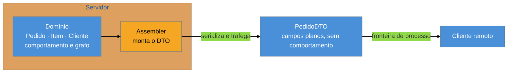

# DTO — e por que virou pejorativo

> [!abstract] TL;DR
> Um **Data Transfer Object** é um objeto burro que carrega dados **através de uma fronteira de
> processo**, para que uma chamada remota leve tudo de uma vez. Essa cláusula — *através de uma
> fronteira de processo* — é a razão inteira do padrão, e é a primeira coisa que se perde ao repeti-lo.
> Hoje o DTO é provavelmente o padrão **mais aplicado sem motivo** do catálogo: `PedidoDTO` entre duas
> camadas do mesmo processo, mais um mapeador, mais uma classe para manter. Mas ele **não é um
> anti-padrão** — na fronteira certa, ele resolve três problemas reais que o objeto de domínio não
> resolve. A nota separa os dois usos.

## "Falta o DTO aqui"

Numa revisão de código, alguém comenta: *"o serviço não deveria retornar a entidade, falta um DTO"*. É uma frase de autoridade — soa a boa prática consolidada, e normalmente ninguém discute.

A pergunta útil é curta: **por quê?**

Se a resposta for "porque a entidade tem campos que não devem sair na resposta HTTP", excelente — há um motivo, e um dos bons. Se for "porque não se deve expor a entidade", a conversa está circular. E se for "porque é o padrão do projeto", você achou uma classe que existe por inércia, com um mapeador que precisa ser mantido em sincronia para sempre e nenhum problema sendo resolvido.

Esta nota existe para dar a você o vocabulário de responder aquele "por quê?" nos dois sentidos — a favor e contra.

## A ideia original: amortizar a viagem

O DTO nasce colado ao [[06 - Remote Facade|Remote Facade]] e resolve a outra metade do mesmo problema. A fachada garante **uma chamada**; o DTO define **o que trafega nela**.

A definição é deliberadamente humilde: um objeto **sem comportamento**, com campos e acessadores, **serializável**, cuja única função é atravessar a rede carregando o conjunto de dados que o cliente precisa. Ele agrega, numa estrutura só, informação que do lado do servidor vive espalhada por vários objetos de domínio.

E ele existe porque **objeto de domínio não atravessa rede bem**. Três razões concretas:

1. **Ele arrasta o grafo.** Serializar `Pedido` puxa `Cliente`, que puxa `Endereco`, que puxa `Cidade` — e você acaba mandando metade do banco por acidente.
2. **Ele tem comportamento e dependências.** Métodos, referências a serviços, estado de carregamento preguiçoso que estoura do outro lado.
3. **Ele muda por motivos internos.** Renomear um campo do domínio quebraria todos os clientes remotos.

O âmbar é onde mora o custo: o **assembler**, o código que traduz domínio em DTO e vice-versa. Ele nunca é interessante, precisa acompanhar toda mudança dos dois lados, e é onde os bugs silenciosos de campo esquecido acontecem. Esse custo é aceitável quando há uma fronteira real; é puro desperdício quando não há.

> [!question]- Não daria para o cliente receber a entidade e só ignorar o que não usa?
> Dá — e é o que muitos sistemas fazem, pagando de três formas. Trafega-se dados demais (caro em rede móvel). Expõe-se campos que não deveriam sair (o `hash` de senha, o custo interno, o `flag` de fraude) — e "o cliente ignora" não é controle de acesso, porque o dado **chegou** na máquina dele. E amarra-se a evolução: o domínio não pode mais ser refatorado sem quebrar clientes. O terceiro problema costuma ser o mais caro, porque só aparece meses depois.

## Como a era encarnava — inclusive uma confusão de nomes

No J2EE dos anos 2000 esse era o padrão mais onipresente do sistema. As classes terminavam em `VO`: `PedidoVO`, `ClienteVO`. O nome vinha do padrão **Value Object** dos *Core J2EE Patterns* (2001) — que descrevia exatamente o que Fowler chama de DTO.

O problema é que **Value Object já era um padrão diferente**, e importante: no PoEAA e no DDD, um Value Object é um objeto **imutável com identidade por valor** — `Dinheiro`, `Data`, `CPF` — que tem comportamento e é o oposto de um saco de campos. Dois padrões incompatíveis, um nome. A segunda edição dos *Core J2EE Patterns* renomeou o seu para **Transfer Object**, justamente para desfazer a colisão.

Vale saber disso por dois motivos práticos. Primeiro, num sistema legado, uma classe `XxxVO` é quase certamente um DTO, não um Value Object — nomeá-la corretamente evita mal-entendido em revisão. Segundo, porque o Value Object verdadeiro é uma das notas mais úteis desta família, e ela vem no bloco Magus: [[13 - Value Object + Money]].

## Por que virou pejorativo

Três dinâmicas, todas partindo de uma boa intenção:

**A fronteira desapareceu e o DTO ficou.** Sistemas migraram de EJB remoto para monólito local, de SOAP para chamada direta — mas as classes `VO` continuaram, agora atravessando fronteiras que só existem no diagrama. O padrão sobreviveu ao seu motivo.

**Ele virou regra de camada.** "Cada camada tem seus DTOs" produz `PedidoEntity` → `PedidoDTO` → `PedidoResponse` → `PedidoViewModel`, com três mapeadores. Adicionar um campo exige tocar sete arquivos, e o benefício declarado — desacoplamento — não se materializa, porque na prática todos mudam juntos.

**Ele empurra o domínio para a anemia.** Se toda saída do sistema é um saco de campos, o caminho de menor resistência é fazer o domínio também ser um saco de campos, com a lógica em *services*. Essa é a crítica de fundo: a onipresença do DTO **normalizou** o modelo anêmico — o que conecta esta nota diretamente ao debate de [[03-Dominios/Engenharia/Design de Software/Padrões de Projeto/Acesso a Dados/03 - Domain Model|Domain Model]].

**Quando o DTO é a decisão certa**, e vale enunciar com a mesma clareza:

| Situação | Por que o DTO se justifica |
| --- | --- |
| Fronteira de rede real | o motivo original: uma viagem, dados sob medida |
| Contrato público de API | o contrato precisa poder ficar estável **enquanto** o domínio é refatorado |
| Campos sensíveis no domínio | o que não entra no DTO não sai da máquina — é controle, não convenção |
| Entrada de dados (o outro sentido) | aceitar a entidade direto abre *mass assignment*; o DTO define o que é aceitável escrever |

Repare que os quatro são sobre **fronteira** — de processo, de contrato ou de confiança. Nenhum é sobre camada.

## A ressurreição

**O DTO voltou gerado por ferramenta.** Uma `message` de Protocol Buffers é literalmente um DTO: campos, sem comportamento, serializável, existindo para atravessar a fronteira — com a diferença decisiva de que a classe é **gerada a partir do contrato**, não escrita à mão. Isso elimina o pior do padrão (manter DTO e assembler em sincronia manualmente) e preserva o melhor (contrato explícito, estável, versionável). O mesmo vale para clientes gerados a partir de OpenAPI. *Estatuto: leitura deste catálogo* — ninguém chama o `.proto` de DTO, mas a estrutura e a motivação coincidem.

**O GraphQL ataca a mesma dor pelo outro lado.** Em vez de o servidor definir DTOs fixos, o cliente descreve os campos que quer e recebe exatamente isso. O problema declarado — *over-fetching*, *under-fetching*, round-trips em rede móvel — é o problema que gerou o DTO em 2002. *Leitura.*

**O que mudou no contexto** é que a fronteira remota deixou de ser rara: com microsserviços, APIs públicas e clientes móveis, quase todo sistema tem várias. O padrão está mais justificado do que nunca **na fronteira** — e é exatamente por isso que a sua aplicação fora dela ficou mais visível como desperdício.

## Armadilhas comuns

> [!warning] DTO sem fronteira
> **O que acontece:** `PedidoDTO` entre o serviço e o controlador do mesmo processo, com um mapeador. Adicionar um campo custa três arquivos, e ninguém sabe dizer o que o DTO protege.
> **Por quê:** o padrão é lembrado como regra de camadas, desligado da fronteira de processo que o motiva.
> **Como evitar:** exija o motivo em uma frase — "este DTO existe porque \_\_\_". Fronteira de rede, contrato público estável, campo sensível ou entrada controlada são respostas válidas. "É o padrão do projeto" não é.

> [!warning] Explosão de mapeadores
> **O que acontece:** entidade → DTO → response → view model, com MapStruct ou ModelMapper no meio. Um campo esquecido no mapeamento vira `null` em produção, sem erro de compilação e sem falha de teste.
> **Por quê:** cada camada foi adicionada por um bom argumento local; a soma nunca foi avaliada.
> **Como evitar:** conte os saltos. Mais de um mapeamento entre o domínio e a saída precisa de justificativa forte. E prefira mapeamento **verificado em compilação ou por teste de contrato** ao mapeamento reflexivo por nome, que falha em silêncio.

> [!warning] Deixar o DTO ganhar lógica
> **O que acontece:** o DTO ganha um `calcularTotal()` "porque é conveniente". A regra passa a existir em dois lugares — no domínio e no objeto de transporte — e as duas versões divergem.
> **Por quê:** ele está sempre à mão no ponto onde o dado é usado.
> **Como evitar:** DTO é dado, não comportamento. Se a regra precisa existir dos dois lados de uma fronteira, isso é um problema de **contrato compartilhado**, e replicá-la à mão é a pior das soluções possíveis.

## Como explicar em inglês

> "A DTO is a dumb object that carries data across a process boundary so a remote call can bring everything in one trip. That clause — across a process boundary — is the whole point of the pattern, and it's the first thing people drop. Today it's probably the most cargo-culted pattern in the catalogue: you'll find DTOs between two layers of the same process, with a mapper to maintain and nothing being solved. But I wouldn't call it an anti-pattern, because there are four situations where it genuinely earns its place: a real network boundary, a public API contract that has to stay stable while the domain gets refactored, sensitive fields you don't want leaving the machine, and inbound payloads where accepting the entity directly opens you to mass assignment. All four are about boundaries, not layers. And it's worth knowing that a protobuf message is a DTO — generated from the contract rather than hand-written, which removes the worst part of the pattern."

| PT | EN |
| --- | --- |
| objeto de transferência de dados | data transfer object |
| montador | assembler |
| modelo anêmico | anemic domain model |
| atribuição em massa | mass assignment |
| contrato de API | API contract |
| dados demais / de menos | over-fetching / under-fetching |
| aplicar padrão por inércia | cargo-culting a pattern |

## O que vem a seguir

Fechada a distribuição, o bloco muda para o outro problema de fronteira — só que no **tempo**, não no espaço. HTTP esquece você entre uma requisição e outra, mas uma edição de usuário dura várias. Onde guardar essa conversa é a pergunta cuja resposta a nuvem inverteu.

- [[08 - Session State — Client × Server × Database]] — a inversão mais interessante da família.
- [[09 - Optimistic × Pessimistic Offline Lock]] — o que impede dois usuários de se sobrescreverem nessa janela.
- [[06 - Remote Facade]] — o padrão companheiro, que define **quantas** chamadas atravessam a fronteira.

## Veja também

- [[03-Dominios/Engenharia/Design de Software/Padrões de Projeto/Acesso a Dados/03 - Domain Model|Domain Model]] — o outro lado do debate da anemia.
- [[13 - Value Object + Money]] — o padrão cujo nome o DTO usurpou no J2EE.
- [[03-Dominios/Engenharia/Comunicação entre Sistemas/index|Comunicação entre Sistemas]] — contratos, versionamento e serialização na fronteira.

## Fontes

- **Martin Fowler** — *Patterns of Enterprise Application Architecture* (2002), Distribution Patterns — a formulação canônica do Data Transfer Object.
- **Martin Fowler** — [*PoEAA — catálogo online*](https://martinfowler.com/eaaCatalog/) — a ficha resumida, útil por deixar explícita a cláusula da fronteira de processo.
- **Alur, Crupi & Malks** — *Core J2EE Patterns* (2001; 2ª ed. 2003) — o padrão como *Value Object*, renomeado para *Transfer Object* na segunda edição para desfazer a colisão de nomes.
- **Martin Fowler** — [*AnemicDomainModel*](https://martinfowler.com/bliki/AnemicDomainModel.html) — a crítica ao modelo de dados sem comportamento, para a qual o uso indiscriminado de DTO contribui.
