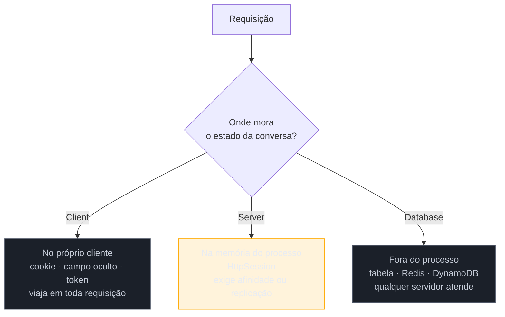

# Session State — Client × Server × Database

> [!abstract] TL;DR
> HTTP não lembra de você entre uma requisição e outra, mas a **conversa** dura várias — um carrinho, um wizard, uma edição longa. Esse estado precisa morar em algum lugar, e há exatamente três: no **cliente** (cookie, campo oculto, token), no **servidor** (memória do processo) ou no **banco** (tabela ou store dedicado). Em 2002, Fowler trata o cliente como a opção cheia de ressalvas e o servidor como a natural. **A nuvem inverteu isso.** Autoescala e serverless mataram a sessão pegajosa; a assinatura criptográfica resolveu a objeção de segurança; e o resultado é que hoje o default é **cliente (JWT) ou banco (Redis)** — as duas opções que o livro tratava como exceção.

## O segundo servidor que quebrou o sistema

O sistema está lento, e a solução é óbvia: subir um segundo servidor atrás de um balanceador. Fazem isso numa sexta.

Na segunda começam os chamados. Usuários perdem o carrinho no meio da compra. Um wizard de cadastro pede login de novo na terceira tela. As reclamações são intermitentes e ninguém reproduz — porque **funcionam** quando a requisição cai na mesma máquina, e falham quando cai na outra.

A causa é que o estado da conversa vive na **memória do processo** de um dos dois servidores. A primeira reação é ativar sessão pegajosa (*sticky session*) no balanceador, amarrando cada usuário a uma máquina. Isso apaga o incêndio — e cria o problema estrutural: agora nenhum servidor pode ser derrubado sem descartar as sessões de quem estava nele. Adeus *deploy* sem interrupção, adeus autoescala, adeus contêineres efêmeros.

**Essa é a razão pela qual esta nota importa mais do que parece.** Numa migração de legado para nuvem, onde a sessão mora costuma ser o bloqueio principal — e é quase sempre descoberto tarde.

## Os três lugares

**Client Session State** — o estado viaja junto de cada requisição. Nenhum servidor precisa lembrar de nada, o que torna o servidor genuinamente **sem estado**: qualquer instância atende qualquer requisição. Os custos são o **tamanho** (tudo trafega toda vez), a **confiança** (o cliente pode adulterar) e a **revogação** (o servidor não tem o que apagar para encerrar a sessão).

**Server Session State** — o estado fica na memória do processo, referenciado por um identificador no cookie. É o mais simples de programar e o que Fowler descreve como default. O custo é o do incidente acima: o processo vira parte do estado do sistema.

**Database Session State** — o estado sai do processo e vai para um armazenamento compartilhado. Qualquer servidor atende qualquer requisição, e a sessão sobrevive à queda de um deles. O custo é uma leitura e uma escrita por requisição, e mais uma peça de infraestrutura.

| | **Client** | **Server** | **Database** |
| --- | --- | --- | --- |
| Servidor sem estado | **sim** | não | sim |
| Sobrevive à queda do servidor | sim | não | **sim** |
| Custo por requisição | tráfego (paga sempre) | nenhum | ida ao store |
| Tamanho do estado | limitado (KB) | livre | livre |
| Adulteração pelo cliente | possível → exige assinatura | impossível | impossível |
| Revogação imediata | **difícil** | trivial | trivial |
| Veredito de 2002 | opção com ressalvas | natural | pesada |
| Prática de 2026 | **default (JWT)** | evitada | **default (Redis)** |

> [!question]- Por que Fowler tratava o estado no cliente como problemático?
> Porque, em 2002, as três objeções eram sérias e não tinham resposta padronizada. O espaço era minúsculo — cookies limitados a poucos KB, e banda de discada. A adulteração era real: um campo oculto com `preco=100` podia ser editado antes do envio, e assinar aquilo exigia criptografia escrita à mão, sem biblioteca consolidada. E qualquer dado sensível trafegava em toda requisição, muitas vezes sem TLS, que ainda era caro em CPU e reservado à tela de pagamento. **Nenhuma dessas três objeções sobreviveu intacta**, e é exatamente por isso que a recomendação virou de lado.

## Como a era encarnava

**Server Session State** era o caminho pavimentado: `HttpSession` no Java, `Session` no ASP, `$_SESSION` no PHP. Escrever `session.setAttribute("carrinho", carrinho)` era a coisa mais natural do mundo — e é por isso que tantos sistemas daquela geração são difíceis de escalar horizontalmente. Quando o único servidor deixava de bastar, havia duas saídas, ambas ruins: **sessão pegajosa** no balanceador, ou **replicação de sessão** entre os servidores do cluster (o mecanismo do WebLogic, WebSphere e Tomcat), que funcionava até o cluster crescer e o tráfego de replicação virar o gargalo.

**Client Session State** aparecia em doses pequenas e bem delimitadas: campos ocultos em formulários multi-etapa, dados de identificação no cookie. O `ViewState` do ASP.NET WebForms foi a versão mais ambiciosa — serializava o estado da tela inteira num campo oculto — e virou o exemplo canônico do custo do padrão, com páginas carregando centenas de KB de estado opaco.

**Database Session State** era a escolha dos sistemas que precisavam mesmo escalar ou sobreviver a falhas — bancos, e-commerces grandes. A `TB_SESSAO` do sistema legado da nota 01 é isso: parecia estranha, e era a decisão que permitia rodar em vários servidores.

## A ressurreição

**O JWT é Client Session State — e a inversão mais limpa desta família.** Um token assinado, guardado no cliente, enviado a cada requisição, contendo a identidade e o que mais couber. É exatamente o padrão que Fowler cercou de ressalvas, hoje adotado como default. *Estatuto: correspondência reconhecida.*

O que mudou foram as três objeções, uma a uma. **Adulteração** deixou de ser problema: a assinatura é verificada pelo servidor e as bibliotecas são maduras. **Tráfego** deixou de doer no mesmo grau — TLS é barato, banda é abundante, e um token de alguns KB é ruído perto de uma imagem. E, sobretudo, **a premissa arquitetural se inverteu**: em 2002 o servidor lembrar era grátis; com autoescala, serverless e contêineres efêmeros, lembrar virou o caro. O Client Session State ganhou porque tornou o servidor **sem estado**, que passou a ser o requisito.

**A objeção que sobreviveu é a revogação**, e ela é séria. Um token assinado vale até expirar; não há o que apagar para encerrar a sessão de imediato. A prática — *access token* de vida curta mais *refresh token* revogável, ou uma lista de negação consultada no servidor — resolve na prática à custa de reintroduzir estado do lado do servidor, o que é uma ironia honesta de reconhecer.

**O Database Session State virou o session store.** Redis, Memcached, DynamoDB: exatamente o padrão, com o armazenamento otimizado para o caso (chave-valor em memória, expiração nativa). É a resposta padrão quando se quer revogação imediata **e** servidor sem estado. *Reconhecida.*

**O Server Session State voltou pela porta dos fundos.** Durable Objects da Cloudflare, Durable Entities do Azure, sistemas de atores: estado em memória **com identidade endereçável**, roteado pela infraestrutura para a instância certa e persistido de forma transparente. É a virtude do Server Session State (estado na memória, sem ida ao store) sem o defeito (morrer com o processo). *Estatuto: leitura deste catálogo.*

> [!info] Fronteira com o galho de Auth
> Esta nota trata do padrão de **onde o estado da conversa mora** — a decisão de arquitetura de aplicação. As consequências de **segurança e identidade** (armazenar token em cookie ou `localStorage`, `HttpOnly`/`SameSite`, rotação de refresh token, revogação, o que nunca colocar dentro de um JWT) têm casa própria e muito mais profunda em [[03-Dominios/Engenharia/Auth e Identidade/1 - Fundamentos de identidade/02 - Sessões e cookies — auth stateful|Sessões e cookies]] e [[03-Dominios/Engenharia/Auth e Identidade/1 - Fundamentos de identidade/03 - JWT e a família de tokens|JWT e a família de tokens]]. Aqui é o padrão; lá é a prática de segurança.

## Armadilhas comuns

> [!warning] Sessão em memória atrás de balanceador
> **O que acontece:** o segundo servidor entra em produção e usuários passam a perder estado de forma intermitente e irreproduzível. **Por quê:** o estado vive no processo, e o balanceador não sabe disso. A correção rápida — sessão pegajosa — amarra o usuário à máquina e, com isso, impede *deploy* sem interrupção e autoescala. **Como evitar:** trate sessão pegajosa como **dívida declarada**, não como solução. Antes de escalar horizontalmente, mova o estado para fora do processo — store compartilhado ou cliente.

> [!warning] JWT gordo
> **O que acontece:** o token acumula perfil, permissões e preferências, chega a vários KB e passa a trafegar em **toda** requisição, inclusive nas de recursos estáticos. Alguns servidores rejeitam por tamanho de cabeçalho. **Por quê:** como o token já vai junto, colocar mais um campo parece grátis. O custo é distribuído por todas as requisições e nunca aparece num ponto só. **Como evitar:** no token, o mínimo para **identificar e autorizar**; o resto vem do banco quando for preciso. E lembre que dado no token fica **congelado** até a expiração — permissão revogada continua valendo.

> [!warning] Confundir sessão com cache
> **O que acontece:** resultados de consulta pesada são guardados na sessão "para não recalcular". A sessão incha, a memória do servidor ou do store estoura, e usuários veem dados velhos porque nada invalida aquilo. **Por quê:** os dois são "guardar para depois", e a sessão é o lugar mais fácil de escrever. **Como evitar:** sessão é **estado da conversa daquele usuário**, com ciclo de vida ligado a ele. Cache é **cópia de algo derivável**, com invalidação própria e compartilhável entre usuários. Se o dado pode ser recalculado e serve a mais de um usuário, é cache.

## Como explicar em inglês

> "HTTP doesn't remember you between requests, but the conversation does — a cart, a wizard, a long edit. That state has to live somewhere, and there are exactly three options: on the client, in server memory, or in a database. What I find fascinating is that the cloud inverted Fowler's 2002 advice. He treats client session state as the option with the most caveats and server memory as the natural default. Today it's the reverse: autoscaling and serverless made a stateful server the expensive thing, so JWT — which is client session state — and Redis session stores — which is database session state — became the defaults. The three original objections mostly dissolved: signing handles tampering, TLS and bandwidth handle the size, and cheap storage handles the rest. The one that survived is revocation: a signed token is valid until it expires, and you can't delete it. That's why you end up with short-lived access tokens plus a revocable refresh token — which quietly puts some server-side state back."

| PT | EN |
| --- | --- |
| estado de sessão | session state |
| sessão pegajosa / afinidade | sticky session / session affinity |
| servidor sem estado | stateless server |
| replicação de sessão | session replication |
| revogação | revocation |
| lista de negação | denylist / blocklist |
| campo oculto | hidden field |
| implantação sem interrupção | zero-downtime deployment |

## O que vem a seguir

Guardado o estado da conversa, aparece o problema seguinte: se a edição de um usuário dura várias requisições, **dois usuários podem estar editando o mesmo dado ao mesmo tempo** — e a transação de banco não ajuda, porque ela não pode ficar aberta durante o café de quem está preenchendo o formulário.

- [[09 - Optimistic × Pessimistic Offline Lock]] — as duas estratégias para isso, e por que a nuvem escolheu a otimista.
- [[10 - Coarse-Grained Lock]] — travar o conjunto em vez da parte.
- [[04 - Application Controller]] — quem conduz a jornada cujo estado esta nota guarda.

## Veja também

- [[03-Dominios/Engenharia/Auth e Identidade/1 - Fundamentos de identidade/02 - Sessões e cookies — auth stateful|Sessões e cookies (Auth)]] — a casa profunda do lado de segurança.
- [[03-Dominios/Engenharia/Auth e Identidade/2 - OAuth 2.1 e OpenID Connect/05 - Tokens em produção|Tokens em produção]] — expiração, rotação e revogação na prática.
- [[01 - Panorama da aplicação corporativa]] — o passo 4 do método arqueológico: descobrir onde vive a conversa.

## Fontes

- **Martin Fowler** — *Patterns of Enterprise Application Architecture* (2002), Session State Patterns — as três variantes e a avaliação de cada uma no contexto da época.
- **Martin Fowler** — [*PoEAA — catálogo online*](https://martinfowler.com/eaaCatalog/) — as fichas resumidas de Client, Server e Database Session State.
- **Martin Fowler** — [*Presentation Domain Data Layering*](https://martinfowler.com/bliki/PresentationDomainDataLayering.html) — o enquadramento de camadas em que a sessão é estado de apresentação, não de domínio.
