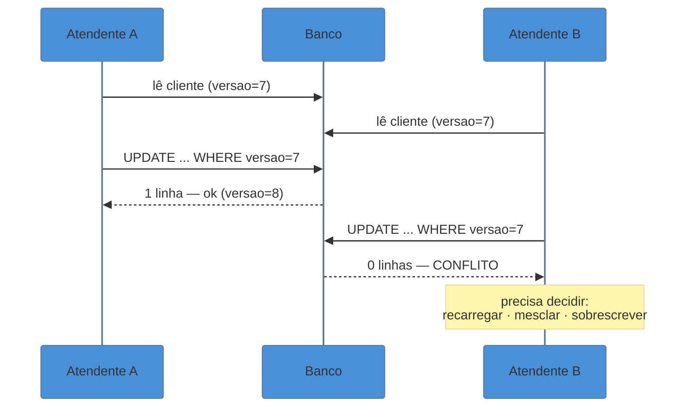

# Optimistic × Pessimistic Offline Lock

> [!abstract] TL;DR
> Uma edição de usuário dura minutos e várias requisições; uma transação de banco dura milissegundos.
> No intervalo entre carregar o formulário e salvá-lo, **outro usuário pode ter salvado o mesmo
> registro** — e o segundo `UPDATE` apaga o primeiro sem erro nenhum. Isso é o *lost update*, e é o bug
> mais silencioso que um sistema corporativo pode ter. Há duas defesas. **Otimista**: deixe editar e
> **detecte o conflito no salvamento**, comparando versões. **Pessimista**: **impeça** a edição
> concorrente, reservando o registro antes. A escolha é econômica — custo do retrabalho contra custo da
> espera. **A nuvem escolheu a otimista**, porque lock distribuído é caro e difícil de acertar.

## O bug que ninguém reporta

Dois atendentes abrem o cadastro do mesmo cliente às 14h02. O primeiro corrige o telefone e salva às 14h05. O segundo, que abriu a tela antes dessa correção, muda o endereço e salva às 14h07.

O telefone volta ao valor antigo.

Ninguém recebe erro. Ninguém vê aviso. O segundo `UPDATE` gravou **todos** os campos do formulário — inclusive o telefone, com o valor que estava na tela dele desde as 14h02. A correção do colega existiu por dois minutos e desapareceu.

Esse bug quase nunca é reportado como bug. Ele chega como "o sistema perde informação às vezes", ou como desconfiança difusa no cadastro, ou não chega nunca — os dados simplesmente ficam errados. E ele é **estrutural**: está presente em qualquer sistema que edite dados compartilhados por formulário e não faça nada a respeito, o que inclui a maioria dos sistemas corporativos que não pensaram no assunto.

## Por que a transação de banco não resolve

A objeção imediata é "use uma transação". Ela não funciona, e entender por que é o coração desta nota.

Fowler separa dois conceitos que costumam ser confundidos:

- **Transação de sistema** — o `BEGIN`/`COMMIT` do banco. Dura milissegundos, e o banco garante isolamento dentro dela.
- **Transação de negócio** — a unidade de trabalho do ponto de vista do usuário: abrir o cadastro, editar, revisar, salvar. Dura **minutos**, atravessa várias requisições HTTP, e inclui o tempo em que a pessoa foi buscar um café.

Manter uma transação de banco aberta durante uma transação de negócio é inviável: seguraria uma conexão e locks de banco por minutos, com uma conexão por usuário editando. Bastam algumas dezenas de pessoas para derrubar o pool. E se alguém fechar o navegador, o lock fica até o timeout.

Por isso o padrão se chama **offline lock**: é um mecanismo de concorrência que funciona **fora** da transação de banco, ao longo de uma conversa que o banco não enxerga.

## Otimista: deixe editar, detecte no fim

Assuma que colisões são raras. Cada registro carrega uma **versão** (um inteiro ou timestamp). Quem lê, lê também a versão; quem grava, grava condicionado a ela:

```sql
UPDATE cliente SET telefone = ?, endereco = ?, versao = versao + 1
 WHERE id = ? AND versao = ?     -- a versão que eu li lá atrás
```

Se outra pessoa gravou nesse meio-tempo, a versão mudou, **nenhuma linha é afetada**, e o sistema sabe que houve conflito. O `UPDATE` condicional é a peça inteira do mecanismo.



O ganho é que ninguém espera por ninguém. O custo aparece na última linha do diagrama: **alguém tem retrabalho**, e o sistema precisa ter uma resposta decente para isso. Um "erro: registro modificado por outro usuário" que descarta o que a pessoa digitou é tecnicamente correto e péssimo na prática.

## Pessimista: reserve antes de editar

Assuma que colisões são frequentes ou caras. Antes de permitir a edição, o usuário **adquire um lock** sobre o registro — tipicamente uma linha numa tabela de locks com o identificador do recurso, o dono e um instante de expiração. Quem chegar depois vê "em edição por Fulano" e não entra.

Ninguém tem retrabalho, porque o conflito nunca acontece. Em troca: alguém **espera**, o sistema fica mais complexo (adquirir, renovar, liberar, expirar) e surge um risco novo — o lock órfão, de quem fechou o navegador e deixou o registro travado.

## Como escolher

A decisão é econômica, e depende de duas grandezas:

| | Colisão **rara** | Colisão **frequente** |
| --- | --- | --- |
| Retrabalho **barato** (corrigir é fácil) | **Otimista** — o caso comum | **Otimista**, com boa UX de conflito |
| Retrabalho **caro** (meia hora de digitação, processo longo) | **Otimista**, mas salve rascunho | **Pessimista** — o caso que o justifica |

A pergunta prática que resolve quase todos os casos: **quanto dói descobrir o conflito só no fim?** Corrigir dois campos de um cadastro: nada. Perder quarenta minutos de laudo digitado: muito — e aí o lock pessimista, ou o salvamento incremental, se paga.

> [!info] O padrão irmão: Implicit Lock
> O catálogo tem um quarto padrão de concorrência offline que não ganha nota própria aqui, mas vale conhecer pelo nome. O **Implicit Lock** resolve o problema de que *esquecer* de travar é fácil e o erro é silencioso: em vez de cada caso de uso lembrar de adquirir o lock, coloque a aquisição no **framework** — na classe-base, no interceptador, no mapeador. É por isso que o `@Version` do JPA funciona tão bem na prática: uma anotação, e o ORM aplica o `UPDATE` condicional em toda gravação daquela entidade, sem depender da disciplina de quem escreve cada caso de uso.

## Como a era encarnava

**Otimista** era e continua sendo o caminho pavimentado. Uma coluna `VERSION` ou `LAST_UPDATED` na tabela e o `UPDATE` condicional acima. O Hibernate/JPA embutiu isso com `@Version`, lançando `OptimisticLockException` quando a contagem de linhas afetadas é zero; o ADO.NET fazia o equivalente comparando valores originais. Onde não havia coluna de versão, uma variante comparava **todos** os campos originais no `WHERE` — funciona, mas conflita à toa quando dois usuários mexem em campos diferentes.

**Pessimista** aparecia em processos longos e caros: laudos, apólices, fechamento contábil. Sempre com uma tabela de locks própria — nunca com `SELECT FOR UPDATE`, que é lock de banco e volta ao problema da transação aberta. Quase sempre com expiração, porque a lição do lock órfão foi aprendida cedo por todo mundo.

## A ressurreição

**O lock otimista virou o mecanismo de concorrência padrão da nuvem** — e a razão é direta: ele não exige coordenação. O `UPDATE` condicional funciona com uma única ida ao armazenamento, sem estado compartilhado entre servidores, o que é exatamente o que uma arquitetura distribuída consegue oferecer barato. *Estatuto: correspondência reconhecida.* Ele aparece em toda parte:

- **DynamoDB** — *condition expressions* (`attribute_not_exists`, comparação de versão) na escrita.
- **HTTP** — `ETag` na leitura e `If-Match` na escrita, que é o lock otimista **padronizado no protocolo**: o servidor devolve a versão do recurso, o cliente devolve a versão que tinha, e o servidor responde `412 Precondition Failed` se mudou.
- **JPA/Hibernate** — `@Version`, ainda o mesmo mecanismo de 2002.
- **Firestore, etcd, armazenamentos chave-valor em geral** — escrita condicionada a versão.

**O pessimista sobreviveu, mas ficou caro e delicado.** Fora de um banco único, ele exige um **lock distribuído** — Redis, Zookeeper, etcd — e essa é uma das áreas onde a implementação correta é notoriamente difícil: relógios que divergem, pausas de GC que fazem um processo perder o lock sem perceber, e a possibilidade de dois donos simultâneos. A crítica de Martin Kleppmann ao algoritmo Redlock, e o debate que ela gerou, são a referência de que **lock distribuído para correção** exige mais cuidado do que a maioria dos usos casuais tem. *Reconhecida.*

**O que mudou no contexto:** em 2002 havia um banco central, e coordenar era barato. Distribuído, coordenar é a operação cara — então a estratégia que **evita** coordenação venceu por economia, não por elegância.

## Armadilhas comuns

> [!warning] Lock pessimista sem expiração
> **O que acontece:** um usuário abre o registro para editar e fecha o navegador. O registro fica travado indefinidamente, e a solução operacional vira um chamado para alguém apagar a linha na mão.
> **Por quê:** não há evento de "usuário desistiu" — o navegador não avisa ninguém ao fechar.
> **Como evitar:** todo lock offline precisa de **expiração** e de renovação enquanto a tela estiver ativa. E de uma forma de administrador liberar, porque o caso vai acontecer.

> [!warning] Lock otimista sem tratamento de conflito
> **O que acontece:** o sistema detecta o conflito corretamente e responde com "erro: o registro foi modificado por outro usuário" — descartando os quarenta minutos que a pessoa acabou de digitar.
> **Por quê:** a detecção é a parte técnica e fica pronta primeiro; o tratamento é trabalho de produto e costuma ficar para depois, o que na prática significa nunca.
> **Como evitar:** o padrão só está completo com a resposta ao conflito. Do melhor para o pior: mesclar automaticamente quando os campos alterados são disjuntos; mostrar as diferenças e deixar a pessoa decidir; no mínimo, **preservar o que foi digitado** ao recarregar. Nunca descartar em silêncio.

> [!warning] Confundir lock offline com lock de banco
> **O que acontece:** o time usa `SELECT ... FOR UPDATE` para proteger uma edição de formulário, e o pool de conexões esgota assim que várias pessoas editam ao mesmo tempo.
> **Por quê:** os nomes são parecidos e o mecanismo do banco é o mais conhecido — mas ele vive **dentro** de uma transação de sistema, e o problema desta nota é justamente o que acontece **entre** transações.
> **Como evitar:** lock de banco protege milissegundos dentro de uma transação; lock offline protege minutos ao longo de uma conversa. Se a proteção precisa sobreviver a uma resposta HTTP, ela não pode ser do banco.

## Como explicar em inglês

> "A business transaction — open a record, edit it, review, save — takes minutes and spans several requests, while a database transaction takes milliseconds. You can't hold a database transaction open across a user's thinking time, so you need concurrency control that works outside it. That's what offline locking is. Optimistic means you let both people edit and detect the collision at save time by checking a version column — the update is conditional, and zero rows affected means conflict. Pessimistic means you reserve the record up front, so nobody collides but somebody waits. The choice is economic: how expensive is it to discover the conflict at the end? Two fields in a form, cheap — go optimistic. Forty minutes of typing, expensive — that's when pessimistic earns its keep. The cloud went almost entirely optimistic, because a conditional write needs no coordination, and distributed locking is both expensive and famously hard to get right."

| PT | EN |
| --- | --- |
| atualização perdida | lost update |
| transação de negócio | business transaction |
| transação de sistema | system transaction |
| escrita condicional | conditional write |
| lock órfão | stale / orphaned lock |
| resolução de conflito | conflict resolution |
| controle de concorrência | concurrency control |

## O que vem a seguir

O lock desta nota protege **um registro**. Mas os dados que o usuário edita raramente são um registro só — um pedido tem itens, uma apólice tem coberturas. Travar cada parte isoladamente deixa passar inconsistências entre elas, e é esse buraco que o último padrão do bloco fecha.

- [[10 - Coarse-Grained Lock]] — travar o conjunto com um lock só; fecha o bloco Adepto.
- [[08 - Session State — Client × Server × Database]] — onde vive o estado da edição que este lock protege.
- [[03-Dominios/Engenharia/Design de Software/Padrões de Projeto/Acesso a Dados/10 - Unit of Work|Unit of Work]] — quem agrupa as mudanças que serão gravadas juntas.

## Veja também

- [[03-Dominios/Ciência/Banco de Dados/11 - Concorrência e locking|Concorrência e locking (BD)]] — o lado do banco: isolamento, locks e transações de sistema.
- [[03-Dominios/Ciência/Concorrência e Paralelismo/09 - Memória transacional e otimismo|Memória transacional e otimismo]] — a mesma dicotomia otimista/pessimista no nível da memória.

## Fontes

- **Martin Fowler** — *Patterns of Enterprise Application Architecture* (2002), Offline Concurrency Patterns — as formulações canônicas de Optimistic e Pessimistic Offline Lock, e a distinção entre transação de negócio e de sistema.
- **Martin Fowler** — [*PoEAA — catálogo online*](https://martinfowler.com/eaaCatalog/) — as fichas resumidas, incluindo o *Implicit Lock*.
- **Martin Kleppmann** — [*How to do distributed locking*](https://martin.kleppmann.com/2016/02/08/how-to-do-distributed-locking.html) — por que lock distribuído para correção é mais difícil do que parece; a crítica ao Redlock.
