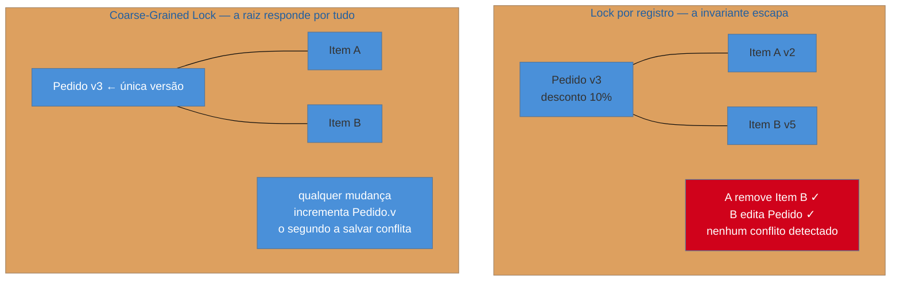

# Coarse-Grained Lock

> [!abstract] TL;DR
> O lock da nota anterior protege **um registro**. Mas o que o usuário edita quase nunca é um registro:
> é um **conjunto** — o pedido com seus itens, a apólice com suas coberturas. Travar cada parte
> isoladamente deixa passar a inconsistência que só existe **entre** elas: dois usuários passam nos
> seus locks individuais e o resultado combinado é inválido. O **Coarse-Grained Lock** usa **um lock
> para o grupo inteiro** — tipicamente a versão da raiz, incrementada quando qualquer parte muda. É o
> único padrão do roster **sem ressurreição limpa**: ele não voltou com outro nome, foi **absorvido**
> pelo conceito de agregado do DDD, que resolve o mesmo problema por modelagem em vez de mecanismo.

## Dois salvamentos válidos, um estado inválido

O pedido 4471 tem um desconto de 10% no cabeçalho, concedido porque o total passou de mil reais. Dois usuários abrem esse pedido.

O primeiro remove um item de trezentos reais. Salva. O lock otimista do **item** passa sem problema — ninguém mais mexeu naquele item.

O segundo, na mesma janela, ajusta um dado do cabeçalho. Salva. O lock otimista do **cabeçalho** passa sem problema — ninguém mais mexeu no cabeçalho.

Nenhum conflito foi detectado, e ambas as operações eram individualmente corretas. Mas o pedido agora tem setecentos reais e um desconto que exigia mil. **A invariante não pertencia a nenhuma das duas linhas** — pertencia à relação entre elas, e não havia nada guardando essa relação.

Este é o buraco que o lock por registro não cobre, e é a razão de existir do padrão.

## A ideia: um lock para o conjunto

Se a regra vale para o conjunto, o lock precisa ser do conjunto. Duas implementações clássicas:

**Versão compartilhada** — todas as linhas do grupo apontam para uma mesma versão, guardada num lugar só. Qualquer alteração em qualquer parte incrementa essa versão, e qualquer gravação a verifica.

**Lock da raiz** (*root lock*) — o grupo tem um objeto raiz natural (o pedido, a apólice), e travar a raiz vale por todos. Alterar um item significa verificar e incrementar a versão do **pedido**.

O ganho é que a **fronteira de consistência fica explícita**: existe um lugar no sistema que declara "estas coisas mudam juntas e são verificadas juntas". O custo é contenção — quem mexer em qualquer parte disputa com quem mexer em qualquer outra.

> [!question]- Isso não trava demais? Dois usuários mexendo em itens diferentes vão conflitar.
> Vão, e isso é **decisão de projeto, não defeito**. A pergunta certa não é "como reduzir conflitos", é "**qual é a menor unidade que precisa ser consistente?**". Se a regra do desconto depende do total, o pedido inteiro é essa unidade — e permitir edições paralelas nos itens significa aceitar violá-la. Quando a contenção dói de verdade, a resposta é rever a fronteira (o desconto realmente precisa depender do total em tempo real, ou pode ser recalculado depois?), não afrouxar o lock.

## Como a era encarnava

A implementação típica no mundo Java era o lock da raiz sobre um mecanismo otimista: uma coluna `VERSION` apenas no cabeçalho, e todo caso de uso que alterasse um filho tinha de lembrar de incrementá-la.

O "tinha de lembrar" era o problema — e é exatamente o que o **Implicit Lock** da nota anterior existe para resolver. Por isso o JPA acabou oferecendo o mecanismo pronto: `LockModeType.OPTIMISTIC_FORCE_INCREMENT` incrementa a versão da entidade raiz **mesmo quando ela própria não mudou**, bastando que um filho tenha mudado. Uma linha de configuração no lugar de disciplina espalhada por casos de uso.

Fora do Java, o padrão aparecia à mão: uma tabela de versões por agregado, ou uma coluna `updated_at` no cabeçalho tocada por *trigger* quando qualquer filho mudava.

## A ressurreição — a que não houve

Aqui a honestidade importa mais que a simetria com as outras notas. **Coarse-Grained Lock não voltou com outro nome, e não vou inventar uma correspondência para preencher a seção.** Ele não é discutido em arquitetura moderna, não aparece em catálogos de nuvem e não tem um equivalente direto em serviços gerenciados.

O que aconteceu foi diferente e mais interessante: **o problema foi absorvido por outro conceito**. O **agregado** do DDD (Evans, 2003, um ano depois do PoEAA) define exatamente a mesma coisa — um grupo de objetos com uma raiz, que é a **fronteira de consistência transacional**, dentro da qual as invariantes são garantidas. A regra prática do DDD de que uma transação altera **um agregado por vez** implementa o Coarse-Grained Lock por modelagem: não é preciso um mecanismo de lock de grupo se o grupo já é a unidade de gravação.

E é por isso que ele desapareceu do vocabulário: quando o agregado é bem escolhido, o padrão vira consequência automática. O mesmo raciocínio reaparece nos armazenamentos NoSQL, onde a escrita atômica é **por documento ou por item** — se o pedido inteiro é um documento, a atomicidade do armazenamento já dá a granularidade grossa de graça, sem lock nenhum. Isso conecta diretamente com a modelagem por agregado tratada em [[03-Dominios/Engenharia/Design de Software/Padrões de Projeto/Acesso a Dados/14 - Modelagem por agregado e single-table design|Acesso a Dados/14]].

**A lição para um legado:** ao encontrar um sistema relacional sem agregados explícitos e com locks por linha, você provavelmente tem invariantes de grupo sendo violadas em silêncio. O Coarse-Grained Lock é a correção **mecânica**, aplicável sem reescrever o modelo — e frequentemente a única viável no prazo disponível.

## Armadilhas comuns

> [!warning] Granularidade grossa demais
> **O que acontece:** o lock é colocado no cliente, não no pedido. Dois atendentes trabalhando em pedidos **diferentes** do mesmo cliente conflitam, e o sistema fica lento e irritante sem motivo aparente.
> **Por quê:** "se agrupar protege, agrupar mais protege mais" — mas cada ampliação da fronteira aumenta a contenção sem acrescentar invariante nenhuma.
> **Como evitar:** a fronteira é definida pela **invariante**, não pela hierarquia de dados. Se nenhuma regra liga dois pedidos do mesmo cliente, eles não pertencem ao mesmo lock — ainda que o modelo relacional os ligue por chave estrangeira.

> [!warning] Confundir a fronteira do lock com a fronteira da tela
> **O que acontece:** o lock cobre exatamente o que a tela de edição mostra. Vem uma tela nova, que mostra um recorte diferente, e o lock passa a proteger o conjunto errado.
> **Por quê:** a tela é o que está à vista quando o mecanismo é implementado, então parece o critério natural.
> **Como evitar:** a fronteira pertence ao **domínio** — é onde as invariantes valem — e telas são recortes de apresentação sobre ela. Telas mudam com frequência; agregados, muito pouco.

> [!warning] Aplicar sem invariante entre as partes
> **O que acontece:** o sistema trava o pedido inteiro para editar um campo de um item que nenhuma regra relaciona ao resto. A contenção é real; a proteção é imaginária.
> **Por quê:** o padrão é aplicado por analogia estrutural ("é pai e filho, então é um grupo") em vez de por regra.
> **Como evitar:** exija a invariante em uma frase — "o desconto depende do total dos itens". Sem essa frase, o lock por registro basta, e é mais barato.

## Como explicar em inglês

> "Row-level locking protects one record, but what a user edits is usually a group — an order with its lines, a policy with its coverages. Some invariants only exist between the parts: if a header discount depends on the total of the lines, two people can each pass their own row-level check and still leave the order in an invalid state. A Coarse-Grained Lock puts one lock on the whole group, usually by versioning the root, so any change to any part bumps the same version. This is the one pattern in the family I can't honestly say came back under a new name — what happened instead is that DDD absorbed it. An aggregate is precisely a consistency boundary with a root, and the rule of one aggregate per transaction gives you coarse-grained locking as a modelling consequence rather than a mechanism. In document stores you often get it for free, because atomic writes are per document."

| PT | EN |
| --- | --- |
| granularidade | granularity |
| fronteira de consistência | consistency boundary |
| invariante | invariant |
| raiz do agregado | aggregate root |
| contenção | contention |
| escrita atômica | atomic write |

## O que vem a seguir

Isso fecha o bloco **Adepto** — distribuição, estado e concorrência offline. O último bloco muda de natureza: em vez de padrões que resolvem um atrito de infraestrutura, os **padrões-base** são os pequenos que você já usa todo dia sem saber o nome, porque estão embutidos no framework. Reconhecê-los é o que permite conversar sobre eles.

- [[11 - Layer Supertype + Separated Interface]] — abre o bloco Magus; o segundo é a mecânica do Hexagonal.
- [[09 - Optimistic × Pessimistic Offline Lock]] — o lock por registro que esta nota generaliza.

## Veja também

- [[03-Dominios/Engenharia/Design de Software/Padrões de Projeto/Acesso a Dados/14 - Modelagem por agregado e single-table design|Modelagem por agregado]] — o conceito que absorveu este padrão.
- [[03-Dominios/Engenharia/Design de Software/Padrões de Projeto/Acesso a Dados/10 - Unit of Work|Unit of Work]] — quem agrupa as gravações que este lock verifica.
- [[03-Dominios/Ciência/Banco de Dados/11 - Concorrência e locking|Concorrência e locking (BD)]] — granularidade de lock no nível do banco.

## Fontes

- **Martin Fowler** — *Patterns of Enterprise Application Architecture* (2002), Offline Concurrency Patterns — a formulação canônica, com as variantes de versão compartilhada e lock da raiz.
- **Martin Fowler** — [*PoEAA — catálogo online*](https://martinfowler.com/eaaCatalog/) — a ficha resumida do padrão.
- **Eric Evans** — *Domain-Driven Design* (2003), cap. Aggregates — a fronteira de consistência que absorveu este padrão.
- **Martin Fowler** — [*DDD_Aggregate*](https://martinfowler.com/bliki/DDD_Aggregate.html) — o agregado como unidade de consistência transacional.
