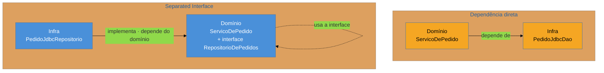

# Layer Supertype + Separated Interface

> [!abstract] TL;DR
> Dois padrões-base que você já usa sem os nomear — e cujos destinos foram **opostos**. **Layer
> Supertype** é a classe-base de uma camada, que carrega o que todos os seus objetos têm em comum
> (`AbstractEntity`, `BaseController`); ele **caiu** com a virada de herança para composição, e sua
> versão degenerada é a lixeira de utilitários. **Separated Interface** declara a interface num
> módulo diferente da implementação, invertendo a direção da dependência; ele **subiu** — é a mecânica
> exata da arquitetura **hexagonal**, e reconhecer isso desmistifica boa parte da conversa sobre Ports
> & Adapters.

## Duas classes que contam histórias opostas

Você abre o sistema herdado e encontra duas coisas.

A primeira é `AbstractEntity`, com novecentas linhas. Começou legítima: `id`, `equals`, `hashCode`, `createdAt`. Depois ganhou um método de formatação de data, porque várias entidades precisavam. Depois um `toJson`. Depois um acesso ao contexto de auditoria, o que fez a entidade — que deveria ser puro domínio — passar a conhecer infraestrutura. Hoje **toda** entidade do sistema herda tudo isso, e ninguém consegue instanciar uma no teste sem subir metade da aplicação.

A segunda é um pacote `dominio/portas/` contendo apenas interfaces — `RepositorioDePedidos`, `NotificadorDeCliente` — cujas implementações vivem num módulo `infraestrutura/`. E, mais notável: o módulo de domínio **não depende** do módulo de infraestrutura. É o contrário.

A primeira é um Layer Supertype que apodreceu. A segunda é um Separated Interface funcionando. Estão no mesmo sistema porque são padrões diferentes com pressões evolutivas diferentes.

## Layer Supertype: a base de uma camada

A ideia é modesta: se todos os objetos de uma camada compartilham comportamento, coloque-o numa **superclasse dessa camada**. Todas as entidades têm identidade e igualdade por identidade; todos os controladores tratam erro do mesmo jeito; todos os mapeadores buscam por chave primária.

É legítimo, e o critério do que pode entrar é mais restrito do que parece: **o que é verdade sobre todo membro da camada, por definição da camada**. Identidade é assim — uma entidade sem identidade não é uma entidade. Formatação de data não é: é verdade sobre *algumas* entidades, hoje.

A distinção importa porque a superclasse é o lugar de **menor resistência** do sistema inteiro. Colocar um método ali entrega-o a todo mundo sem tocar em nenhum arquivo existente — o que faz cada adição individual parecer gratuita, e a soma virar as novecentas linhas acima.

## Separated Interface: inverter quem depende de quem

O problema é outro. O domínio precisa gravar pedidos, e gravar é responsabilidade da infraestrutura. Se o domínio chama a infraestrutura, ele **depende** dela: não compila sem o driver do banco, não é testável sem ele, e uma troca de banco atravessa o domínio.

A saída é separar **onde a interface é declarada** de **onde ela é implementada**. A interface é declarada **junto de quem a usa** — no domínio, expressa no vocabulário do domínio. A implementação vive na infraestrutura, que **importa o domínio** para implementá-la.

Repare que a seta entre os módulos **inverteu de sentido**. Essa é a única coisa que o padrão faz — e é o suficiente para que o domínio compile e seja testado sem banco, e para que a infraestrutura seja substituível sem tocar no domínio.

> [!question]- Se eu tenho uma interface e uma implementação, já não é isso?
> Não necessariamente, e é a confusão mais comum. O que caracteriza o padrão é **onde a interface mora**. Uma interface declarada no mesmo módulo da implementação — `infraestrutura/RepositorioDePedidos` e `infraestrutura/RepositorioJdbc` — não inverte nada: o domínio continua tendo que importar `infraestrutura` para enxergar o tipo. Você ganhou um ponto de substituição, não uma inversão de dependência. O padrão exige que a interface esteja **do lado do cliente**, e é essa mudança de endereço que muda o grafo de dependências.

## Como a era encarnava

**Layer Supertype** era onipresente no Java corporativo: `AbstractEntity`, `BaseDAO`, `BaseAction`, `AbstractService`. Herança era a ferramenta de reúso padrão, e uma hierarquia de três ou quatro níveis não causava estranheza.

**Separated Interface** vinha em duas formas. A formal, dos frameworks que separavam `api` de `impl` em artefatos distintos — a JDBC é o exemplo perfeito: a interface `java.sql.Connection` está na plataforma, e cada fabricante fornece a implementação, sem que seu código conheça nenhuma delas. E a de aplicação, que ganhou tração com Spring e a popularização da injeção de dependência: interfaces no pacote de serviço, implementações injetadas.

Vale notar que este padrão **é** o mecanismo do **DIP** — o D do SOLID. Fowler catalogou como padrão o que Martin enunciou como princípio; ver [[03-Dominios/Engenharia/Design de Software/SOLID/06 - DIP - Inversão de Dependência|DIP]].

## A ressurreição

**Separated Interface subiu de status: virou arquitetura.** Ports & Adapters (hexagonal), Clean Architecture e Onion Architecture são, no seu mecanismo essencial, este padrão aplicado sistematicamente na fronteira do domínio. Uma "porta" é uma interface declarada no domínio; um "adaptador" é a implementação que vive fora e depende para dentro. A famosa regra de que **as dependências apontam sempre para o centro** é a inversão do diagrama acima, aplicada a todas as fronteiras. *Estatuto: correspondência reconhecida.*

Saber disso tem valor prático: boa parte da mística em torno do hexagonal se dissolve quando se percebe que o mecanismo é um padrão-base de 2002, e que a contribuição da arquitetura não é o mecanismo, mas a **disciplina de aplicá-lo em todas as fronteiras**. Isso também deixa mais fácil julgar quando ela não compensa — se há uma implementação só e nenhuma perspectiva de troca ou de teste isolado, a inversão custa mais do que rende.

**Layer Supertype teve o destino oposto: encolheu.** A virada de herança para **composição** tirou dele o papel de mecanismo de reúso. Hoje o comportamento comum é distribuído por *traits* e *mixins*, por interfaces com método default, por *decorators* e *middleware* (o `BaseController` virou uma cadeia de middleware), e por geração de código (o `@Data` do Lombok, os `record` do Java, os `@dataclass` do Python resolvem `equals`/`hashCode` sem superclasse).

Ele **não desapareceu** — `AbstractEntity` com `id` e igualdade continua defensável e comum. Mas deixou de ser a resposta default para "vários objetos precisam disso", e essa mudança é boa, pelas razões que a nota [[03-Dominios/Engenharia/Design de Software/Orientação a Objetos/07 - Composição sobre herança|Composição sobre herança]] detalha. *Estatuto: leitura deste catálogo* — ninguém descreve middleware como "a ressurreição do Layer Supertype"; a leitura é que o problema migrou de solução.

## Armadilhas comuns

> [!warning] Layer Supertype como lixeira de utilitários
> **O que acontece:** a superclasse acumula métodos que servem a algumas subclasses, cresce sem limite, e acaba puxando dependências de infraestrutura — tornando impossível instanciar uma entidade num teste sem subir a aplicação.
> **Por quê:** é o ponto de menor resistência do sistema: acrescentar ali entrega a todos sem editar nada.
> **Como evitar:** o critério de admissão é **"isto é verdade sobre todo membro desta camada, por definição?"**. Identidade e igualdade passam; formatação e auditoria não. Comportamento que serve a *algumas* subclasses quer composição, não herança.

> [!warning] Separated Interface com uma implementação só e sem teste
> **O que acontece:** cada serviço tem sua interface e sua única implementação, com o mesmo nome mais `Impl`. A navegação no código passa a exigir dois saltos e ninguém nunca troca nada.
> **Por quê:** o padrão é aplicado como regra de estilo, sem a pergunta sobre o que ele deveria estar comprando.
> **Como evitar:** a inversão paga por uma de três coisas — **troca real** de implementação, **teste isolado** com dublê, ou **fronteira de módulo** que você quer impedir de ser atravessada. Nenhuma das três? A classe concreta basta. (Ter só uma implementação **em produção** é normal; ter só uma no total, incluindo testes, é o sinal.)

> [!warning] Interface declarada do lado errado
> **O que acontece:** a interface fica no módulo de infraestrutura junto da implementação. O grafo de dependências não muda, e o time acredita ter aplicado o padrão.
> **Por quê:** parece natural guardar a interface junto de quem a implementa — é onde ela é "usada", no sentido errado da palavra.
> **Como evitar:** verifique a **direção da seta**, não a existência da interface. O teste definitivo: o módulo de domínio compila sem o módulo de infraestrutura no *classpath*? Se não, não houve inversão.

## Como explicar em inglês

> "These are two base patterns most people use without naming, and they went in opposite directions. Layer Supertype is the base class for a layer — AbstractEntity, BaseController — holding what every object in that layer shares. It's declined, partly because composition replaced inheritance as the reuse mechanism, and partly because its failure mode is so common: the superclass becomes a dumping ground and eventually drags infrastructure into your domain objects. Separated Interface went the other way. You declare the interface in the module that *uses* it and put the implementation elsewhere, so the dependency arrow flips — infrastructure depends on the domain instead of the other way round. That's exactly the mechanism behind hexagonal architecture: a port is a separated interface, an adapter is the implementation. Realising that demystifies a lot of the ports-and-adapters conversation — the mechanism is a 2002 base pattern, and what the architecture adds is the discipline of applying it at every boundary."

| PT | EN |
| --- | --- |
| supertipo de camada | layer supertype |
| interface separada | separated interface |
| inversão de dependência | dependency inversion |
| porta / adaptador | port / adapter |
| lixeira (de código) | dumping ground |
| dublê de teste | test double |
| composição sobre herança | composition over inheritance |

## O que vem a seguir

Declarada a interface do lado certo, falta a pergunta seguinte: **quem decide qual implementação será usada, e quando?** É um trio de padrões-base que resolve isso — e os três ressuscitaram com força, um deles virando uma indústria inteira de ferramentas de teste.

- [[12 - Registry + Plugin + Service Stub]] — achar, escolher e substituir a implementação.
- [[13 - Value Object + Money]] — o padrão cujo nome o DTO usurpou no J2EE.

## Veja também

- [[03-Dominios/Engenharia/Design de Software/SOLID/06 - DIP - Inversão de Dependência|DIP — Inversão de Dependência]] — o princípio de que o Separated Interface é o mecanismo.
- [[03-Dominios/Engenharia/Design de Software/Orientação a Objetos/07 - Composição sobre herança|Composição sobre herança]] — por que o Layer Supertype perdeu espaço.
- [[03-Dominios/Engenharia/Design de Software/Padrões de Projeto/Acesso a Dados/09 - Repository|Repository]] — o caso mais comum de Separated Interface no dia a dia.

## Fontes

- **Martin Fowler** — *Patterns of Enterprise Application Architecture* (2002), Base Patterns — as formulações canônicas de Layer Supertype e Separated Interface.
- **Martin Fowler** — [*PoEAA — catálogo online*](https://martinfowler.com/eaaCatalog/) — as fichas resumidas dos dois padrões.
- **Alistair Cockburn** — [*Hexagonal Architecture*](https://alistair.cockburn.us/hexagonal-architecture/) — Ports & Adapters, a aplicação sistemática do Separated Interface nas fronteiras.
- **Martin Fowler** — [*Inversion of Control Containers and the Dependency Injection pattern*](https://martinfowler.com/articles/injection.html) — a relação entre separar a interface e injetar a implementação.
