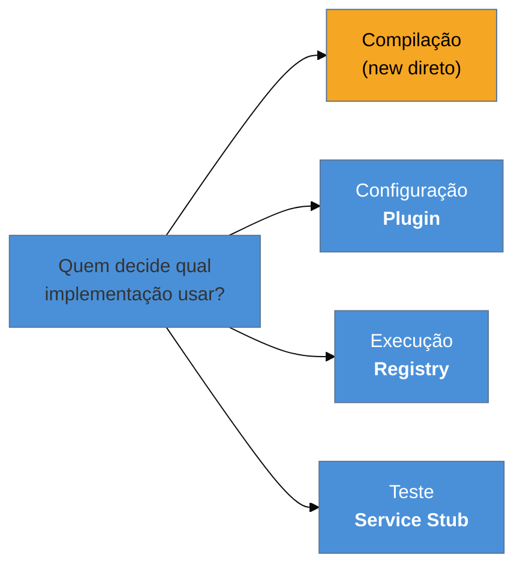

# Registry + Plugin + Service Stub

> [!abstract] TL;DR
> Três padrões-base que respondem à mesma pergunta em momentos diferentes: **quem decide qual
> implementação será usada?** O **Registry** responde *em tempo de execução* — um objeto global onde
> se procura o serviço; é o mais útil e o de pior reputação, porque esconde dependências. O **Plugin**
> responde *em configuração* — a implementação é escolhida no arranque, não na compilação. O **Service
> Stub** responde *em teste* — substitui o serviço externo por um dublê. Os três ressuscitaram com
> força, e o terceiro virou uma indústria: MSW, WireMock, LocalStack, Testcontainers.

## O teste que não roda sozinho

Você quer escrever um teste unitário para o cálculo de frete. Abre a classe e encontra, no meio do método:

```java
TabelaDeFrete tabela = ServiceLocator.get(TabelaDeFrete.class);
CotacaoTransportadora cotacao = ServiceLocator.get(CotacaoTransportadora.class);
```

A assinatura do método não menciona nenhuma das duas. Nada na classe declara que ela precisa delas. Para rodar o teste, é preciso descobrir — lendo o corpo inteiro — tudo que ele busca no localizador, e então popular o localizador global com dublês antes de cada teste. Se alguém acrescentar uma terceira busca amanhã, seu teste quebra sem que a assinatura tenha mudado.

Além disso, o `CotacaoTransportadora` chama de verdade a API da transportadora. O teste depende da internet, da disponibilidade do parceiro, e cobra por chamada.

Esse cenário reúne os três padrões desta nota: um Registry usado mal, um Plugin que faltou, e um Service Stub que não existe.

## Os três, no eixo do "quando"



**Registry** — um objeto bem-conhecido, acessível de qualquer lugar, onde se **procura** um serviço pelo nome ou tipo. Resolve o problema real de "como o código no fundo da pilha alcança algo que só foi criado no arranque", e resolve mal, pelo motivo da seção de armadilhas.

**Plugin** — a implementação é escolhida em **configuração**, lida no arranque, em vez de fixada em compilação. É o que permite ao mesmo binário usar um armazenamento em memória no teste e S3 em produção sem recompilar, e o que permite a terceiros estender o sistema sem tocar no seu código.

**Service Stub** — para testar, substitua o serviço externo (a transportadora, o gateway de pagamento) por um dublê que responde de forma previsível. O objetivo é remover do teste o que é lento, caro, instável ou fora do seu controle.

> [!question]- Registry não é o mesmo que injeção de dependência?
> Atacam o mesmo problema — o objeto precisa de colaboradores que ele não deveria construir — por caminhos opostos. Com Registry, o objeto **vai buscar** (`ServiceLocator.get(...)`); com injeção, ele **recebe** (pelo construtor) e nunca sabe quem escolheu. A diferença prática é a **visibilidade da dependência**: com injeção, o construtor **declara** tudo de que a classe precisa, e o compilador te obriga a fornecer; com Registry, a dependência fica escondida no corpo do método, invisível para quem lê a assinatura, para o compilador e para o teste. Fowler compara os dois em detalhe em *Inversion of Control Containers and the Dependency Injection pattern*, e a preferência da comunidade por injeção se consolidou por essa razão.

## Como a era encarnava

**Registry** era a espinha do J2EE, na forma do **JNDI**: para obter uma fonte de dados ou um EJB, fazia-se um *lookup* por nome numa árvore global. O `ServiceLocator` dos *Core J2EE Patterns* existia justamente para embrulhar e cachear esses lookups, que eram verbosos e caros. Se você abrir um sistema daquela geração, o JNDI está lá — e é a razão pela qual tantas classes daquele tempo são difíceis de testar isoladamente.

**Plugin** aparecia nos pontos de extensão dos frameworks e, na plataforma Java, no `ServiceLoader` com os arquivos `META-INF/services` — o mecanismo que permite a uma biblioteca descobrir implementações fornecidas por terceiros sem conhecê-las. Toda escolha de driver JDBC por configuração é esse padrão.

**Service Stub** era, quase sempre, escrito à mão: uma classe `TransportadoraFake` implementando a mesma interface, devolvendo valores fixos. Simples, e com o defeito de divergir do serviço real ao longo do tempo sem que nada avisasse.

## A ressurreição

Os três voltaram, e o terceiro voltou maior do que era.

**Registry virou duas coisas.** No processo, o **contêiner de DI** — o `ApplicationContext` do Spring — é literalmente um registry, com a diferença decisiva de que o padrão de uso mudou: em vez de o código chamar `get`, o contêiner injeta. O padrão sobreviveu; o *anti-padrão de acesso* a ele foi o que caiu em desuso. Fora do processo, virou **service discovery** — Consul, Eureka, o DNS interno do Kubernetes — que é o Registry na escala de rede: um lugar bem-conhecido onde se pergunta "onde está o serviço X agora?". *Estatuto: correspondência reconhecida.*

**Plugin está em toda parte.** Vite, esbuild, Rollup, ESLint e Babel são arquiteturas de plugin; os *providers* do Terraform são plugins descobertos e baixados por configuração; extensões de editor, idem. O modelo em que um núcleo pequeno define pontos de extensão e terceiros fornecem implementações virou a forma default de construir ferramenta de desenvolvedor. *Reconhecida.*

**Service Stub virou uma categoria de produto**, sob o nome *service virtualization*:

| Ferramenta | O que substitui |
| --- | --- |
| **MSW** | requisições HTTP no navegador e no Node, interceptadas na camada de rede |
| **WireMock** | serviços HTTP, com respostas programadas e simulação de latência e falha |
| **LocalStack** | os serviços da AWS, localmente |
| **Testcontainers** | o caminho oposto — em vez de dublar, sobe **o serviço real** em contêiner |

O Testcontainers merece destaque porque responde à principal fraqueza do padrão. O stub sempre corre o risco de **divergir** do serviço real: ele passa a devolver algo que o serviço verdadeiro não devolveria mais, e seu teste fica verde enquanto a produção quebra. Quando o serviço pode ser subido em contêiner (bancos, filas, o próprio Keycloak), usar o real elimina a divergência — e o stub fica reservado ao que não pode ser subido: APIs de terceiros, sistemas cobrados por chamada. *Reconhecida.*

**O que mudou no contexto:** contêineres tornaram viável rodar dependências reais na máquina do desenvolvedor e na esteira de CI, o que em 2002 era impensável. Isso não matou o Service Stub — deslocou a fronteira do que vale a pena dublar.

## Armadilhas comuns

> [!warning] Registry como singleton global que esconde dependências
> **O que acontece:** classes buscam colaboradores no meio dos métodos. A assinatura não revela nada, o teste exige montar um estado global, e a ordem de execução dos testes passa a importar — o que produz falhas intermitentes difíceis de rastrear.
> **Por quê:** a busca global é conveniente **para quem escreve** e cara para todo mundo que vier depois. E, sendo estado global mutável, ela vaza entre testes.
> **Como evitar:** prefira **receber** as dependências pelo construtor. Onde o Registry for inevitável (código legado, pontos estáticos, `main`), concentre o acesso na **borda** — não espalhe `get` pelo domínio.

> [!warning] Plugin sem contrato versionado
> **O que acontece:** o sistema carrega implementações externas por configuração, e uma mudança na interface quebra plugins de terceiros em produção, com erro de carregamento em vez de erro de compilação.
> **Por quê:** o ponto do padrão é justamente que a implementação **não é conhecida** em compilação — o que significa que o compilador não pode te proteger.
> **Como evitar:** ponto de extensão é **contrato público**: versione-o, mantenha compatibilidade, e valide na carga com mensagem clara. Trate quebrar um ponto de extensão como quebrar uma API pública, porque é.

> [!warning] Stub que diverge do serviço real em silêncio
> **O que acontece:** a suíte fica verde por meses enquanto a API do parceiro mudou um campo. O erro só aparece em produção — e a confiança nos testes, que era o ponto, some.
> **Por quê:** o dublê foi escrito uma vez, contra o comportamento daquele momento, e nada o obriga a acompanhar o original.
> **Como evitar:** três defesas, em ordem de força: subir o **serviço real** em contêiner quando possível; usar **testes de contrato** que verificam o dublê contra o provedor; ou, no mínimo, gerar o stub **a partir do esquema** (OpenAPI, `.proto`) em vez de escrevê-lo à mão.

## Como explicar em inglês

> "These three answer the same question at different moments: who decides which implementation gets used? A Registry answers at runtime — a well-known object you look services up in. It solves a real problem, but it has a bad reputation for a good reason: the dependency is hidden inside the method body, so the signature doesn't tell you what the class needs and tests have to set up global state. That's the argument that made dependency injection win — with injection the constructor declares everything. A Plugin answers at configuration time, so the same binary can use an in-memory store in tests and S3 in production. And a Service Stub answers at test time, replacing an external service with a double. All three came back: DI containers and service discovery are registries, Vite and Terraform are plugin architectures, and service virtualisation — MSW, WireMock, LocalStack — is a whole product category now. Testcontainers is the interesting counter-move: instead of doubling the service, run the real one, which removes the risk of the stub silently drifting."

| PT | EN |
| --- | --- |
| localizador de serviços | service locator |
| descoberta de serviços | service discovery |
| ponto de extensão | extension point |
| dublê de teste | test double |
| virtualização de serviços | service virtualization |
| teste de contrato | contract test |
| estado global mutável | mutable global state |

## O que vem a seguir

Vistos os padrões que decidem **quem** é a implementação, os dois últimos tratam de **como modelar os valores** que circulam por ela — começando pelo padrão cujo nome o DTO usurpou no J2EE, e pelo caso em que errar a modelagem custa dinheiro literalmente.

- [[13 - Value Object + Money]] — identidade por valor, e por que dinheiro em ponto flutuante é bug garantido.
- [[14 - Special Case + Null Object]] — o último padrão; fecha a família.

## Veja também

- [[11 - Layer Supertype + Separated Interface]] — declarar a interface do lado certo; estes padrões decidem quem a implementa.
- [[03-Dominios/Engenharia/Design de Software/SOLID/07 - DIP na prática - DI e IoC|DIP na prática — DI e IoC]] — a alternativa ao Registry, e por que ela venceu.

## Fontes

- **Martin Fowler** — *Patterns of Enterprise Application Architecture* (2002), Base Patterns — as formulações canônicas de Registry, Plugin e Service Stub.
- **Martin Fowler** — [*Inversion of Control Containers and the Dependency Injection pattern*](https://martinfowler.com/articles/injection.html) — a comparação entre Service Locator e injeção de dependência.
- **Martin Fowler** — [*PoEAA — catálogo online*](https://martinfowler.com/eaaCatalog/) — as fichas resumidas dos três padrões.
- **Alur, Crupi & Malks** — *Core J2EE Patterns* — o *Service Locator* como embrulho dos lookups JNDI.
