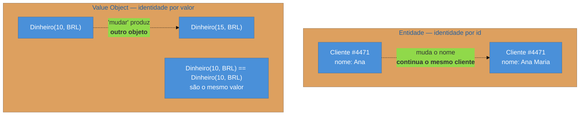

# Value Object + Money

> [!abstract] TL;DR
> Um **Value Object** tem identidade **pelo valor**, não por referência: dois objetos com o mesmo conteúdo *são* o mesmo, como dois "23 de março". Ele é **imutável**, comparado por conteúdo, e serve para dar nome e comportamento a conceitos que quase todo sistema representa como `String` ou `BigDecimal` soltos. **Money** é o caso canônico e o mais caro de errar: representar dinheiro em ponto flutuante produz erro garantido, a moeda faz **parte** do valor, e dividir exige decidir o destino do resto — quatro linhas de código que dão dois anos de discrepância contábil. A ressurreição veio pelo lado da **linguagem**: `record`, *branded types*, *newtype*.

## Os três centavos que não fecham

O relatório mensal fecha com três centavos de diferença. Todo mês. O valor muda, o sinal muda, e ninguém consegue reproduzir num caso isolado.

A causa está em duas linhas escritas anos atrás:

```java
double total = 0.0;
for (Item item : itens) total += item.getValor();   // 0.1 + 0.2 != 0.3
```

`double` é ponto flutuante binário, e não consegue representar exatamente frações decimais como `0.1` — do mesmo modo que a base 10 não representa exatamente um terço. Cada soma acumula um erro minúsculo; com mil linhas, o erro emerge em centavos. Não é bug de lógica: é a **representação errada** para o domínio.

E há um segundo problema, mais silencioso, na mesma linha. `getValor()` devolve um número **sem moeda**. Nada no sistema impede somar reais com dólares — e quando a operação internacional for aberta, essa soma vai acontecer e passar despercebida, porque o tipo `double` aceita tudo.

Os dois problemas têm a mesma raiz: um conceito rico do domínio foi representado por um tipo primitivo, que não carrega nem as regras nem as restrições daquele conceito.

## Value Object: identidade pelo conteúdo

A distinção-mãe é entre dois tipos de objeto:



Uma **entidade** tem identidade própria e contínua: o cliente 4471 continua sendo ele mesmo depois de trocar de nome e endereço. Um **value object** *é* o seu conteúdo: não faz sentido perguntar "qual dos R$ 10 é este?", e "alterar" um valor significa **produzir outro**.

Daí decorrem as três propriedades práticas:

**Imutabilidade.** Se identidade é conteúdo, mudar o conteúdo mudaria a identidade. Por isso operações retornam novos objetos (`preco.mais(frete)`), e não alteram o receptor. O ganho é que o objeto pode ser compartilhado, cacheado e usado entre threads sem sincronização — e ninguém consegue alterar por baixo dos panos um valor que você já guardou.

**Igualdade por conteúdo.** Comparar por referência estaria errado. Isso obriga a implementar `equals` e `hashCode` sobre todos os campos — e a fazê-lo direito, pelo motivo da seção de armadilhas.

**Expressividade.** É a razão pela qual o padrão vale a pena mesmo fora de dinheiro. Um método `enviar(String email, String telefone)` aceita os argumentos trocados sem reclamar; `enviar(Email, Telefone)` não compila. Trocar primitivos por tipos do domínio — o antídoto da *primitive obsession* — move erros do tempo de execução para o de compilação, e dá um lugar óbvio para colocar a validação: **dentro do construtor**, de forma que um `Email` inválido não chega nem a existir.

## Money: o value object que mais dói errar

Fowler dedica um padrão só ao dinheiro porque ele reúne todas as armadilhas de uma vez.

**Nunca em ponto flutuante.** Duas representações corretas: um **inteiro na menor unidade** (centavos em `long`) ou um **decimal exato** (`BigDecimal` no Java, `Decimal` no .NET, `numeric` no Postgres). A primeira é a mais comum em APIs — a Stripe expressa valores em centavos como inteiro exatamente por isso.

**A moeda faz parte do valor.** `Dinheiro` carrega quantia **e** moeda, e somar moedas diferentes deve falhar. Sem isso, a conversão internacional vira uma classe de bug que só aparece em produção e é difícil de auditar depois.

**Dividir exige decidir o destino do resto.** Este é o detalhe que quase todo sistema erra. Rateie R$ 100,00 entre três parcelas: cada uma seria 33,3333... Arredondar para 33,33 nas três produz R$ 99,99 — some cem mil operações e você tem uma discrepância contábil real. A resposta do padrão é uma operação de **alocação** que distribui os centavos restantes de forma determinística:

```java
Dinheiro[] partes = valor.alocar(3);   // [33.34, 33.33, 33.33] — soma exata
```

A propriedade essencial é que **a soma das partes é igual ao todo**, sempre. Fowler chama isso de *allocate*, e é a única operação de dinheiro que não tem equivalente óbvio em aritmética de números.

> [!question]- Não basta usar `BigDecimal` em todo lugar e pronto?
> Resolve a precisão, que é o primeiro problema, e deixa os outros três de pé. `BigDecimal` não carrega a moeda, então ainda dá para somar reais com dólares. Não tem `allocate`, então o rateio continua perdendo centavos. E ele traz armadilhas próprias: `new BigDecimal(0.1)` — a partir de um `double` — já nasce impreciso (use a `String` ou `valueOf`), e `equals` compara **escala**, de modo que `2.0` não é igual a `2.00` (o correto é `compareTo`). O tipo dá aritmética exata; o padrão dá um **domínio**.

## Como a era encarnava

No Java corporativo dos anos 2000, o que existia era `BigDecimal` cru circulando pelo sistema, com a moeda numa coluna separada e o arredondamento decidido caso a caso — cada `setScale` com o seu `RoundingMode` escolhido por quem escreveu aquela linha. Classes `Dinheiro` próprias existiam nos sistemas financeiros mais cuidadosos, e eram exatamente a implementação do padrão.

E há a colisão de nomes já vista na [[07 - DTO — e por que virou pejorativo|nota 07]], que vale repetir aqui do outro lado: os *Core J2EE Patterns* usaram o nome **Value Object** para o que Fowler chama de DTO. Por isso, num sistema legado, `ClienteVO` é quase certamente um saco de campos, e não um value object no sentido desta nota. Os dois conceitos são praticamente opostos — um é dado sem comportamento para atravessar a rede; o outro é comportamento e regra encapsulados num valor.

## A ressurreição

**O padrão voltou pelo lado da linguagem** — e essa é a diferença importante em relação a 2002, quando implementá-lo era escrever `equals`, `hashCode`, `toString` e getters à mão em cinquenta linhas.

- **Java** — `record` (desde o 16) gera igualdade por conteúdo, `hashCode`, `toString` e imutabilidade de campos numa linha. `record Dinheiro(long centavos, Moeda moeda) {}` é um value object completo, com validação no construtor compacto.
- **Kotlin / Scala** — `data class` e `case class`, com a mesma intenção.
- **TypeScript** — *branded types*, que dão a distinção de tipo (`Email` não é `string`) em tempo de compilação sem custo em execução.
- **Rust** — o idioma *newtype*, e o sistema de tipos que torna a imutabilidade o default em vez da exceção.
- **Python** — `@dataclass(frozen=True)`.

*Estatuto: leitura deste catálogo* — essas construções são apresentadas como recursos de linguagem, não como implementações do padrão de Fowler, mas é literalmente o padrão que elas tornam barato.

**O que ainda não chegou:** o **Project Valhalla** promete *value classes* na JVM — objetos sem identidade de referência, que o runtime pode achatar e alocar na pilha, dando ao padrão o desempenho de um primitivo. Ainda **não foi entregue**, e vale dizer isso claramente em vez de listá-lo como se já existisse.

**Do lado do domínio, o DDD adotou o conceito como um dos seus blocos de construção**, com o mesmo nome e sentido — o que é, na prática, a razão pela qual "value object" hoje significa mais o padrão de Fowler que o do J2EE. *Reconhecida.*

## Armadilhas comuns

> [!warning] Dinheiro em ponto flutuante
> **O que acontece:** somas acumulam erro e o fechamento diverge por centavos, de forma intermitente e não reproduzível em casos pequenos. **Por quê:** `float` e `double` são binários e não representam exatamente frações decimais. O erro é minúsculo por operação e cresce com o volume. **Como evitar:** inteiro na menor unidade ou decimal exato, do banco à API. E cuide da fronteira: um `numeric` no Postgres que vira `double` no cliente perdeu a garantia no caminho.

> [!warning] Value object mutável, ou com `equals`/`hashCode` inconsistentes
> **O que acontece:** o objeto é usado como chave de mapa ou colocado num conjunto, e depois é alterado. Ele "some" da estrutura — a busca falha porque o `hashCode` mudou de balde. **Por quê:** estruturas baseadas em hash assumem que a chave não muda. Implementar `equals` sem `hashCode` (ou sobre campos diferentes) produz o mesmo sintoma, com o agravante de o `equals` parecer correto em teste. **Como evitar:** imutabilidade real (campos finais, sem *setters*, cópias defensivas de coleções) e os dois métodos sobre **os mesmos campos**. Em linguagens com `record`/`data class`, deixe a linguagem gerar.

> [!warning] Misturar moedas sem tipo
> **O que acontece:** valores em moedas diferentes são somados. O total é numericamente plausível e semanticamente sem sentido — e o erro atravessa relatórios sem disparar nada. **Por quê:** com quantia e moeda em campos separados, a soma opera só sobre a quantia, e nada no tipo impede. **Como evitar:** moeda **dentro** do value object, e a operação de soma falhando explicitamente para moedas distintas. Conversão deve ser um ato deliberado, com taxa e data, nunca implícito.

## Como explicar em inglês

> "A value object has identity by value rather than by reference — two of them with the same contents *are* the same thing, like two dates. That makes it immutable, compared by content, and it's the antidote to primitive obsession: `send(Email, PhoneNumber)` won't compile with the arguments swapped, while `send(String, String)` will happily accept them. Money is the canonical case because it's the most expensive to get wrong. Never floating point — binary floats can't represent decimal fractions exactly, so totals drift by cents. The currency has to be part of the value, so adding dollars to euros fails instead of quietly succeeding. And division needs an explicit allocation operation: splitting a hundred three ways as 33.33 each loses a cent, so you allocate 33.34 / 33.33 / 33.33 and guarantee the parts sum to the whole. The pattern came back through languages — records, data classes, branded types — which made it cheap to write."

| PT | EN |
| --- | --- |
| objeto de valor | value object |
| identidade por valor / referência | value / reference identity |
| imutável | immutable |
| obsessão por primitivos | primitive obsession |
| menor unidade monetária | smallest currency unit / minor unit |
| alocar (rateio de resto) | to allocate |
| arredondamento | rounding |
| cópia defensiva | defensive copy |

## O que vem a seguir

Falta um último padrão-base, e ele trata do valor que **não existe** — o cliente não encontrado, o pedido ausente. É o padrão que ataca a checagem de `null` espalhada pelo sistema, e ele fecha a família com a síntese da lente arqueológica.

- [[14 - Special Case + Null Object]] — o caso especial como objeto; **fecha a família**.
- [[12 - Registry + Plugin + Service Stub]] — quem decide qual implementação usar.

## Veja também

- [[03-Dominios/Engenharia/Design de Software/Orientação a Objetos/09 - Identidade, igualdade e imutabilidade|Identidade, igualdade e imutabilidade]] — o fundamento OO deste padrão, com `equals`/`hashCode` em detalhe.
- [[07 - DTO — e por que virou pejorativo]] — o padrão que usurpou o nome *Value Object* no J2EE.
- [[03-Dominios/Engenharia/Design de Software/Padrões de Projeto/Acesso a Dados/08 - Data Mapper|Data Mapper]] — como um value object é persistido sem tabela própria (*embedded value*).

## Fontes

- **Martin Fowler** — *Patterns of Enterprise Application Architecture* (2002), Base Patterns — Value Object e Money, incluindo a operação de alocação.
- **Martin Fowler** — [*PoEAA — catálogo online*](https://martinfowler.com/eaaCatalog/) — as fichas resumidas dos dois padrões.
- **Martin Fowler** — [*ValueObject*](https://martinfowler.com/bliki/ValueObject.html) — a distinção entre value object e entidade, e a evolução do conceito.
- **Eric Evans** — *Domain-Driven Design* (2003) — Value Object como bloco de construção do domínio.
