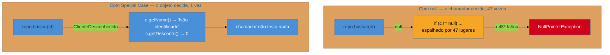

# Special Case + Null Object

> [!abstract] TL;DR
> `null` é o valor que **cabe em qualquer tipo e não responde a nada** — e por isso a checagem contra
> ele se espalha por todo o sistema, com o custo de que esquecer **uma** produz um erro em produção. O
> **Special Case** substitui o caso excepcional por uma **subclasse que sabe se comportar**:
> `ClienteDesconhecido` responde às mesmas mensagens que um cliente, com respostas neutras ou
> específicas. O **Null Object** é o seu caso mais famoso. **A ressurreição** é ampla: `Optional`,
> `Maybe`, `Result` e *pattern matching* atacam o mesmo problema com apoio do sistema de tipos. Esta
> nota **fecha a família**, com o mapa de reconhecimento dos 14 padrões e a síntese da lente
> arqueológica.

## Quarenta e sete verificações e um esquecimento

Você busca por `!= null` no sistema e encontra quarenta e sete ocorrências em torno de `Cliente`. Cada uma é uma pessoa que, num momento diferente, descobriu que `buscarCliente` pode devolver nada.

O código fica assim:

```java
Cliente c = repo.buscar(id);
String nome = (c != null) ? c.getNome() : "Não identificado";
BigDecimal desc = (c != null) ? c.getDesconto() : BigDecimal.ZERO;
```

E o problema não são as quarenta e sete. É a **quadragésima oitava** — a que alguém não escreveu, num caminho pouco percorrido, que só é exercitado quando o cliente foi excluído. Ali o sistema lança `NullPointerException`, quase sempre longe da origem, com uma mensagem que não diz **qual** referência era nula.

Repare também no que as três linhas revelam: existe uma **regra** sobre clientes desconhecidos — chamam-se "Não identificado" e têm desconto zero. Essa regra está espalhada por quarenta e sete lugares, em versões que provavelmente divergem. Ela não tem casa.

## A ideia: dar comportamento ao caso especial

Tony Hoare, que introduziu a referência nula em 1965, chamou-a depois de seu "erro de um bilhão de dólares". O problema estrutural é que `null` é **habitante de todo tipo** e **não responde a nada**: o compilador o aceita onde um `Cliente` é esperado, e o runtime falha quando alguém pede algo a ele.

O Special Case inverte isso. Em vez de devolver "nada", devolva **um objeto do mesmo tipo que sabe ser aquele caso**:

```java
class ClienteDesconhecido extends Cliente {
    String getNome()          { return "Não identificado"; }
    BigDecimal getDesconto()  { return BigDecimal.ZERO; }
    boolean podeComprarFiado(){ return false; }
}
```



Duas coisas mudaram. O chamador **não decide mais** — ele chama o método e recebe uma resposta válida, por polimorfismo. E a regra do caso especial ganhou **um lugar só**: quer mudar o rótulo do cliente desconhecido? Um arquivo.

O **Null Object** é a variante em que o comportamento é deliberadamente **neutro**: um `LoggerNulo` que descarta tudo, uma `PoliticaSemDesconto` que sempre devolve zero. O Special Case é mais geral — ele pode representar `ClienteInadimplente`, `ProdutoDescontinuado`, `TarifaIndisponível`, cada um com comportamento próprio.

> [!question]- Isso não esconde erros? Prefiro que estoure.
> Essa objeção é correta, e é o critério de aplicação do padrão. A pergunta é: **a ausência é esperada ou é falha?** Um cliente não identificado numa venda de balcão é um caso de negócio **legítimo** e recorrente — merece um objeto. Um pedido cujo identificador veio de uma chave estrangeira do próprio banco e não existe é **corrupção de dados** — deve explodir, alto e cedo. Aplicar Special Case ao segundo caso é o que produz o pior resultado possível: o sistema segue calculando sobre um total zero, grava, e o erro aparece semanas depois numa conciliação. **Special Case é para ausência prevista, nunca para erro.**

## Como a era encarnava

O padrão era conhecido e pouco usado. O Java não tinha `Optional` (chegou só no 8, em 2014), então a alternativa era `null` e a disciplina de verificar. Onde aparecia, era em domínios com casos especiais nomeados pelo próprio negócio: seguros com "sem cobertura", telecom com "tarifa não encontrada" — situações em que o especialista de negócio já falava daquele caso como uma **coisa**, o que é justamente o sinal de que ele merece um tipo.

Vale notar o parentesco com o [[03-Dominios/Engenharia/Design de Software/Padrões de Projeto/Clássicos (GoF)/12 - Strategy|Strategy]] e com o [[03-Dominios/Engenharia/Design de Software/Padrões de Projeto/Clássicos (GoF)/13 - Observer|Observer]]: em todos, a resposta a "como evito o condicional?" é **polimorfismo**. O Special Case é essa mesma ideia aplicada à ausência.

## A ressurreição

O problema foi levado a sério, e a resposta moderna é mais forte que o padrão original porque envolve o **sistema de tipos**.

**`Optional` / `Maybe` / `Option`.** Em vez de um objeto substituto, o tipo de retorno declara que pode não haver valor: `Optional<Cliente>`. A diferença crucial em relação ao Special Case é que aqui **o compilador participa** — não dá para usar o valor sem antes lidar com a ausência. `Optional` no Java, `Option` no Scala e no Rust, `Maybe` no Haskell e no Elm. *Estatuto: correspondência reconhecida* — o `Optional` do Java cita explicitamente a motivação de evitar `null`.

**Tipos anuláveis na própria linguagem.** Kotlin, Swift e o modo estrito do TypeScript separam `Cliente` de `Cliente?` no sistema de tipos, transformando o esquecimento em **erro de compilação**. É a solução mais completa: o problema deixa de existir por construção, em vez de ser mitigado por padrão de projeto. *Reconhecida.*

**`Result` e o irmão do problema.** `Result<T, E>` do Rust e equivalentes tratam do caso vizinho: não "pode não haver valor", mas "pode ter dado errado, e o erro tem informação". Vale distinguir os dois, porque usar `Optional` para sinalizar falha descarta a causa. *Reconhecida.*

**Pattern matching.** É o que torna tudo isso ergonômico: `switch` sobre tipos selados com verificação de exaustividade dá ao compilador o poder de dizer "você não tratou o caso `ClienteDesconhecido`". Isso é uma **alternativa estrutural** ao Special Case — em vez de o objeto decidir por polimorfismo, o chamador decide, mas com garantia de ter coberto todos os casos. *Estatuto: leitura deste catálogo.*

**O que mudou no contexto:** em 2002 o padrão era a única defesa disponível numa linguagem sem tipos para ausência. Hoje ele é **uma** das defesas, e frequentemente não a melhor. O Special Case continua superior quando o caso especial tem **comportamento próprio e nomeado pelo negócio** (`ClienteInadimplente` faz coisas); `Optional` é superior quando a ausência é só ausência.

## Armadilhas comuns

> [!warning] Null Object que esconde erro real
> **O que acontece:** o repositório devolve um objeto neutro para um identificador que **deveria** existir. O sistema calcula sobre zeros, grava, e a inconsistência só aparece semanas depois — sem rastro do ponto de origem.
> **Por quê:** o padrão remove a explosão, e a explosão era o mecanismo de detecção. Removê-la sem distinguir os casos troca uma falha ruidosa e barata por uma silenciosa e cara.
> **Como evitar:** separe as duas operações. `buscar` devolve ausência tratável; `obrigatorio` (ou `getOrFail`) explode. A escolha fica no chamador, explícita, em vez de escondida no repositório.

> [!warning] Proliferação de casos especiais
> **O que acontece:** nascem `ClienteDesconhecido`, `ClienteInativo`, `ClienteBloqueado`, `ClienteMigrado`, `ClienteTemporario` — cada um sobrescrevendo métodos de forma sutilmente diferente. Uma mudança na classe-base precisa ser avaliada contra seis subclasses.
> **Por quê:** o padrão é fácil de aplicar mais uma vez, e cada caso novo parece pequeno.
> **Como evitar:** quando os casos especiais viram um conjunto, isso é o modelo pedindo **estado explícito** (`Cliente` com uma `Situacao`) em vez de hierarquia. Três ou mais subclasses de caso especial é o sinal.

> [!warning] `Optional` usado onde não deve
> **O que acontece:** `Optional` vira campo de entidade, parâmetro de método e tipo de coleção. O código enche de `.get()` sem checagem — que é `null` com mais cerimônia — e a serialização se complica.
> **Por quê:** ele é adotado como "o jeito moderno" em vez de para o que foi desenhado.
> **Como evitar:** `Optional` foi feito para **tipo de retorno** de operações que podem não achar nada. Para coleção, devolva vazia. Para parâmetro opcional, sobrecarregue. E prefira `map`/`orElse` a `isPresent()` seguido de `get()`.

---

## Mapa de reconhecimento: os 14 padrões em campo

Esta família é um catálogo de consulta, e a lente é arqueológica — então o índice útil não é por nome, é **pelo que você encontra ao abrir o sistema**:

| Você encontrou… | É o padrão | Nota |
| --- | --- | --- |
| um servlet/filtro único que recebe tudo (`web.xml`, `*.do`) | Front Controller | [[03 - Page Controller × Front Controller\|03]] |
| um arquivo por página/rota, com preâmbulo repetido | Page Controller | [[03 - Page Controller × Front Controller\|03]] |
| `struts-config.xml` / `faces-config.xml` com regras de navegação | Application Controller | [[04 - Application Controller\|04]] |
| JSP/ERB/Thymeleaf com `<c:forEach>` e `if` de política | Template View | [[05 - Template View × Transform View × Two-Step View\|05]] |
| XSLT, ou componentes que retornam árvore | Transform View | [[05 - Template View × Transform View × Two-Step View\|05]] |
| um estágio intermediário genérico antes do HTML | Two-Step View | [[05 - Template View × Transform View × Two-Step View\|05]] |
| `PedidoServiceBean` com métodos de caso de uso grossos | Remote Facade | [[06 - Remote Facade\|06]] |
| classes `XxxVO`/`XxxDTO` só com getters e setters | DTO | [[07 - DTO — e por que virou pejorativo\|07]] |
| `HttpSession`, sessão pegajosa, `TB_SESSAO`, JWT | Session State | [[08 - Session State — Client × Server × Database\|08]] |
| coluna `VERSION`/`@Version`, `UPDATE ... WHERE versao = ?` | Optimistic Offline Lock | [[09 - Optimistic × Pessimistic Offline Lock\|09]] |
| tabela de locks com dono e expiração | Pessimistic Offline Lock | [[09 - Optimistic × Pessimistic Offline Lock\|09]] |
| versão só no cabeçalho, incrementada por mudança em filho | Coarse-Grained Lock | [[10 - Coarse-Grained Lock\|10]] |
| `AbstractEntity`, `BaseDAO`, `BaseAction` | Layer Supertype | [[11 - Layer Supertype + Separated Interface\|11]] |
| interface no domínio, implementação na infraestrutura | Separated Interface | [[11 - Layer Supertype + Separated Interface\|11]] |
| JNDI lookup, `ServiceLocator`, `ApplicationContext` | Registry | [[12 - Registry + Plugin + Service Stub\|12]] |
| `META-INF/services`, implementação escolhida em config | Plugin | [[12 - Registry + Plugin + Service Stub\|12]] |
| `TransportadoraFake` implementando a interface real | Service Stub | [[12 - Registry + Plugin + Service Stub\|12]] |
| `BigDecimal` solto, moeda em coluna separada | falta **Money** | [[13 - Value Object + Money\|13]] |
| `!= null` repetido dezenas de vezes em torno de um tipo | falta **Special Case** | esta nota |

## A lente arqueológica, em síntese

Fechando as quatorze notas, a pergunta que dá sentido à família: **por que tantos padrões de 2002 voltaram?** Não foi nostalgia. Três premissas mudaram, e cada uma reabilitou um conjunto de decisões.

**1. Servidor com estado deixou de ser grátis.** Em 2002, o servidor lembrar era o caminho natural — havia um servidor. Com autoescala, serverless e contêineres efêmeros, lembrar virou o caro. Isso inverteu o Session State (o cliente e o banco venceram a memória do processo) e é a mesma força que empurrou o Page Controller de volta pelo serverless.

**2. A fronteira remota virou rotina.** Era rara e deliberada; com microsserviços, APIs públicas e clientes móveis, virou norma. Isso reabilitou o Remote Facade como BFF e devolveu ao DTO a sua justificativa original — ao mesmo tempo em que tornou mais visível o quanto ele é aplicado onde não há fronteira nenhuma.

**3. Coordenação ficou cara.** Com um banco central, travar era barato. Distribuído, coordenar é a operação cara — o que fez a estratégia que **evita** coordenação (o lock otimista, a escrita condicional) vencer por economia.

E há a força inversa, a que **enterrou** padrões: quando um problema é resolvido numa camada mais baixa, o padrão que o resolvia acima desaparece. O CSS moderno absorveu a necessidade do Two-Step View; os *records* absorveram a cerimônia do Value Object; os tipos anuláveis tornaram o Special Case menos necessário; middleware e composição substituíram o Layer Supertype.

**Daí a lição prática para quem assume um sistema legado**, que é o ofício a que esta família serve: um padrão datado não é um erro a corrigir, é uma **decisão tomada sob restrições que não estão no código**. Antes de remover, reconstrua a restrição — e verifique se ela ainda vale. Às vezes não vale, e a remoção é limpa. Às vezes vale ainda. E, com mais frequência do que se imagina, ela **voltou a valer** com outro nome.

## Como explicar em inglês

> "Null is the value that fits every type and answers nothing, which is why null checks spread through a codebase — and why forgetting one is a production incident. Special Case replaces the exceptional value with a subclass that knows how to behave: an UnknownCustomer answers the same messages a customer does, with sensible defaults. Null Object is the best-known variant, where the behaviour is deliberately neutral. The important caveat is that it's for *expected* absence, never for errors — if the record should exist and doesn't, that's data corruption and it should fail loudly. The modern answer is stronger than the pattern, because it involves the type system: Optional and Maybe make absence explicit in the return type, nullable types in Kotlin or strict TypeScript turn a missed check into a compile error, and pattern matching gives you exhaustiveness. Special Case still wins when the special case has real named behaviour of its own; Optional wins when absence is just absence."

| PT | EN |
| --- | --- |
| caso especial | special case |
| objeto nulo | null object |
| ausência esperada | expected absence |
| falha ruidosa | fail loudly / fail fast |
| tipo anulável | nullable type |
| verificação de exaustividade | exhaustiveness checking |
| erro de um bilhão de dólares | billion-dollar mistake |

## O que vem a seguir

Isso **fecha a família Aplicação Corporativa** — os quatorze padrões não-dados do PoEAA, da apresentação aos padrões-base. O galho-pai continua: as próximas famílias tratam de **Arquitetura de Eventos** e de **Nuvem e Resiliência**, que são justamente onde muitos dos retornos descritos aqui foram catalogados como padrões próprios.

- [[03-Dominios/Engenharia/Design de Software/Padrões de Projeto/index|Padrões de Projeto]] — o galho-pai e o mapa das seis famílias.
- [[01 - Panorama da aplicação corporativa]] — a abertura, para reler a lente com as quatorze notas na cabeça.
- [[03-Dominios/Engenharia/Design de Software/Padrões de Projeto/Acesso a Dados/index|Acesso a Dados]] — a outra metade do PoEAA.

## Veja também

- [[03-Dominios/Engenharia/Design de Software/Padrões de Projeto/Clássicos (GoF)/23 - Quando NÃO usar - anti-patterns e discernimento sênior|Quando NÃO usar]] — o discernimento que atravessa todas as famílias.
- [[03-Dominios/Engenharia/Arqueologia e Restauração de Software/index|Arqueologia e Restauração de Software]] — o método de assumir um sistema herdado, de que esta família é o vocabulário.

## Fontes

- **Martin Fowler** — *Patterns of Enterprise Application Architecture* (2002), Base Patterns — a formulação canônica de Special Case.
- **Martin Fowler** — [*PoEAA — catálogo online*](https://martinfowler.com/eaaCatalog/) — as fichas resumidas dos padrões desta família.
- **Bobby Woolf** — *Null Object*, em *Pattern Languages of Program Design 3* (1997) — a formulação original do Null Object.
- **Tony Hoare** — *Null References: The Billion Dollar Mistake* (QCon, 2009) — o autor da referência nula sobre o custo da decisão.
