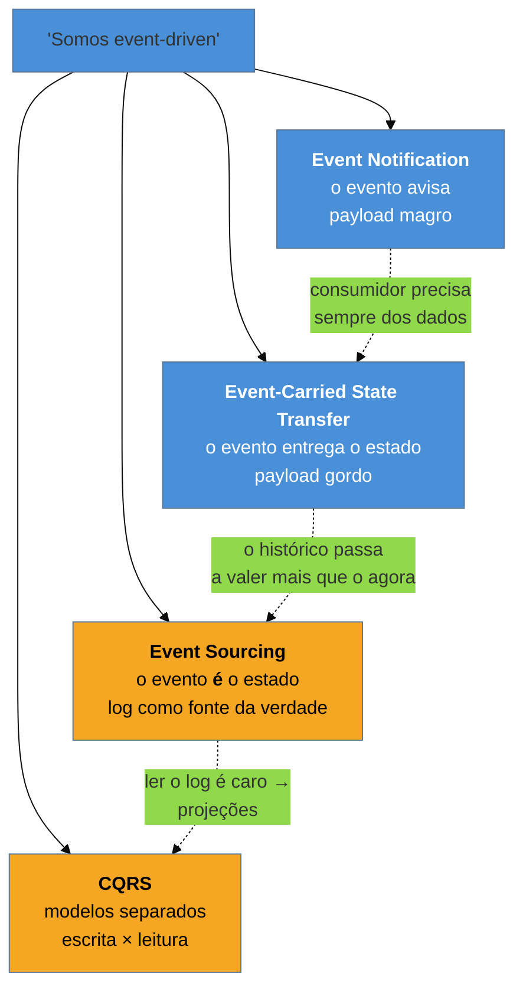

# Panorama da arquitetura de eventos

> [!abstract] TL;DR
> "Arquitetura orientada a eventos" não nomeia **uma** coisa: nomeia pelo menos quatro, que Fowler
> separou em **Event Notification**, **Event-Carried State Transfer**, **Event Sourcing** e **CQRS**.
> Duas pessoas dizendo "somos event-driven" podem estar descrevendo sistemas com propriedades opostas.
> Esta família organiza os quatro por uma pergunta só — **o que o evento carrega, e a quem isso
> amarra** —, porque é aí que mora a decisão de verdade. Um evento é um **fato ocorrido**, no passado,
> sem destinatário nomeado: quem o publica **não sabe quem reage**. Essa é a fonte de todo o ganho
> (desacoplamento) e de todo o custo (o fluxo deixa de ser legível num lugar só).

## Duas equipes, a mesma palavra, sistemas opostos

Numa reunião de arquitetura, duas equipes dizem que seus sistemas são orientados a eventos.

A primeira publica `PedidoConfirmado { pedidoId: 4471 }` — só isso. Quem se interessa chama a API de pedidos para buscar o resto. O sistema deles tem uma fonte da verdade e alguns consumidores curiosos.

A segunda publica `PedidoConfirmado { pedidoId, cliente, itens, total, endereço, ... }` — o pedido inteiro. Cada consumidor mantém uma **cópia local** dos dados de que precisa e nunca chama ninguém. O sistema deles tem cinco réplicas parciais do pedido, eventualmente consistentes.

As duas afirmações são corretas, e os sistemas são **opostos** naquilo que mais importa: o primeiro é acoplado em disponibilidade (se a API de pedidos cair, os consumidores param) e desacoplado em dados; o segundo é o inverso — sobrevive à queda do produtor e paga com dados replicados que podem estar velhos, e com um payload que virou contrato público.

A reunião não vai a lugar nenhum enquanto ninguém fizer a pergunta que distingue: **o que o evento carrega?**

## O que é um evento (e o que não é)

Antes dos estilos, a distinção que evita metade dos erros de modelagem. Três coisas trafegam por mensagem, e só uma é evento:

| | O que é | Quem sabe do destino | Nome típico |
| --- | --- | --- | --- |
| **Comando** | um pedido para que algo aconteça | o emissor **escolhe** o destinatário | `EnviarEmail`, imperativo |
| **Documento** | um dado sendo entregue | o emissor sabe a quem serve | `DadosDoCliente`, substantivo |
| **Evento** | um **fato que já ocorreu** | **ninguém** — o emissor não conhece consumidores | `PedidoConfirmado`, passado |

Três propriedades decorrem disso e valem como teste prático:

**Está no passado e é imutável.** Um evento relata algo consumado. Não se cancela um fato — publica-se outro (`PedidoCancelado`). Se o seu "evento" pode ser rejeitado por quem o recebe, ele era um comando com nome errado.

**Não tem destinatário nomeado.** O produtor publica e segue. Se ele espera resposta de alguém específico, é RPC com mensageria no meio.

**A inversão de controle é o ponto.** Num sistema de comandos, o serviço de pedidos **chama** o de estoque, o de faturamento e o de notificação — e para acrescentar um quarto, você edita o serviço de pedidos. Com eventos, o produtor publica um fato e novos consumidores entram **sem que ele saiba**. Adicionar comportamento deixa de exigir mudar quem gerou o gatilho.

> [!question]- Se o produtor não sabe quem reage, como eu depuro isso?
> Essa é a **contrapartida honesta** do desacoplamento, e ela é séria. Num sistema de comandos, o fluxo está escrito num lugar: você lê o método e vê os três passos. Num sistema de eventos, o fluxo **não existe em lugar nenhum** — ele é uma propriedade emergente de quem se inscreveu em quê. Para responder "o que acontece quando um pedido é confirmado?" é preciso buscar todos os consumidores daquele tópico, em repositórios diferentes, mantidos por times diferentes. É por isso que **rastreamento distribuído deixa de ser luxo e vira requisito** — e por que o [[08 - Process Manager|Process Manager]] existe: quando o fluxo importa, alguém precisa torná-lo explícito de novo.

## Os quatro estilos

Fowler separou os sentidos de "event-driven" em quatro padrões, e eles são o mapa desta família — cada um vira uma nota:

As setas pontilhadas indicam a **pressão evolutiva** que leva de um a outro, não uma escada a subir. Nada obriga a chegar ao fim, e a maioria dos sistemas saudáveis para no segundo — o âmbar sinaliza que os dois últimos reorganizam o sistema inteiro e cobram caro por isso.

- **Event Notification** — o evento diz apenas *o que aconteceu* e a *qual* entidade. Menor acoplamento de dados possível; em troca, o consumidor volta e pergunta.
- **Event-Carried State Transfer** — o evento **carrega o estado** necessário. O consumidor age sozinho e sobrevive à queda do produtor; em troca, mantém uma réplica e depende do formato do payload.
- **Event Sourcing** — os eventos deixam de notificar e passam a **ser** a fonte da verdade: o estado é derivado do log. Auditoria completa e capacidade de reinterpretar o passado; em troca, complexidade de leitura e evolução de esquema.
- **CQRS** — separar o modelo de **escrita** do de **leitura**. Aparece junto com Event Sourcing porque o log serve mal à consulta, mas é um padrão independente.

> [!info] Uma nota sobre nomes
> Fowler usou antes o termo **Event Collaboration** (no eaaDev) para o estilo em que componentes colaboram apenas por eventos — é próximo do que hoje se chama coreografia, e **não** faz parte da taxonomia dos quatro. Cito para você reconhecê-lo em textos mais antigos sem confundir os mapas.

## A lente desta família: o que o evento acopla

Este galho é um catálogo de consulta, e **Event Sourcing, CQRS, Saga, Outbox e pub-sub já têm casa profunda no vault** — em [[03-Dominios/Engenharia/Arquitetura/System Design/3 - Padrões recorrentes/03 - Event Sourcing sob a ótica de system design|System Design]] e em [[03-Dominios/Engenharia/Comunicação entre Sistemas/4 - Comunicação assíncrona/04 - Outbox e Saga|Comunicação entre Sistemas]]. Esta família não os repete: ela os olha por um eixo que aquelas notas não cobrem.

| Galho | Pergunta que responde |
| --- | --- |
| **System Design** | *quanto aguenta?* — throughput, storage, snapshots, projeções em escala |
| **Comunicação entre Sistemas** | *como chega?* — broker, entrega, ordenação, CDC, dual-write |
| **Esta família** | ***o que acopla?*** — o que o evento carrega, quem depende de quem, o que quebra ao evoluir |

E a razão de esse eixo merecer uma família: **desacoplamento não é uma quantidade, é uma escolha de qual acoplamento você prefere.** Nenhum dos quatro estilos elimina dependência; cada um a move de lugar.

- Notificação magra → desacopla **dados**, acopla **disponibilidade** (o consumidor precisa que o produtor atenda).
- Evento gordo → desacopla **disponibilidade**, acopla **formato** (o payload virou contrato público) e admite dados velhos.
- Event Sourcing → desacopla **o estado atual do histórico**, acopla o sistema ao **esquema dos eventos passados** — que é imutável e vai te acompanhar para sempre.

**A arquitetura de eventos em uma frase:** trocar a dependência de *quem chama quem* pela dependência de *o que o fato carrega* — e escolher conscientemente qual das duas dói menos no seu caso.

## Como usar este catálogo

Cada nota é autocontida, com **Armadilhas** reforçada sobre *quando não usar*, e abre declarando o recorte — o que ela trata e para onde ir atrás de escala ou infraestrutura. Num legado você vai encontrar as duas pontas: sistemas de 2010 com um barramento publicando eventos anêmicos que ninguém consegue rastrear, e sistemas recentes com Event Sourcing aplicado ao domínio inteiro porque parecia moderno. Nomear o estilo é o primeiro passo para discutir se ele cabe ali.

## Armadilhas comuns

> [!warning] "Event-driven" como se fosse uma coisa só
> **O que acontece:** o time decide "adotar arquitetura de eventos" sem escolher o estilo. Metade publica eventos magros, metade publica gordos, e os consumidores lidam com dois contratos implícitos e incompatíveis.
> **Por quê:** o termo cobre quatro padrões com propriedades diferentes, e a decisão parece já tomada quando se escolhe o broker — que é a parte que menos importa aqui.
> **Como evitar:** decida e **documente o estilo por fluxo**, com a pergunta concreta: *este evento carrega o estado, ou o consumidor volta e pergunta?* A escolha do Kafka ou do RabbitMQ não responde isso.

> [!warning] Comando disfarçado de evento
> **O que acontece:** publica-se `EnviarEmailDeConfirmação` num tópico. Um dia dois consumidores se inscrevem, e o cliente recebe dois e-mails. Ou ninguém se inscreve, e o e-mail simplesmente não sai — sem erro em lugar nenhum.
> **Por quê:** o nome imperativo denuncia que o produtor **sabe** o que deve acontecer e quem deve fazer. Isso é um comando, e comando quer um destinatário, não um tópico.
> **Como evitar:** teste do nome. Está no passado e descreve um fato (`PedidoConfirmado`)? É evento. Está no imperativo e pede uma ação (`EnviarEmail`)? É comando — use fila dirigida, com um consumidor.

> [!warning] Perder a legibilidade do fluxo e não repor nada
> **O que acontece:** seis meses depois, ninguém consegue responder "o que acontece quando um pedido é confirmado?" sem varrer vários repositórios — e um efeito colateral importante fica escondido num consumidor que ninguém lembra que existe.
> **Por quê:** o desacoplamento **compra** exatamente isso: o produtor não conhece os consumidores. A perda de legibilidade não é efeito colateral, é o preço.
> **Como evitar:** reponha a legibilidade por outro meio — **rastreamento distribuído** com id de correlação propagado, catálogo de eventos com produtores e consumidores registrados, e um [[08 - Process Manager|Process Manager]] onde o fluxo for de negócio e precisar ser auditável.

## Como explicar em inglês

> "'Event-driven' isn't one thing — Fowler splits it into four patterns, and two teams can both say they're event-driven while building systems with opposite properties. The question that separates them is what the event carries. With Event Notification the message just says what happened and to which entity, so consumers have to call back for details: you're decoupled on data but coupled on availability. With Event-Carried State Transfer the event carries the state, so consumers keep their own copy and survive the producer being down — but now the payload is a public contract and the copies go stale. Event Sourcing is different again: events stop notifying and become the source of truth. And the honest trade-off across all of them is that you lose a readable flow — nobody can tell you what happens when an order is confirmed without searching every consumer — so distributed tracing stops being optional."

| PT | EN |
| --- | --- |
| fato ocorrido | fact that happened |
| inversão de controle | inversion of control |
| acoplamento por disponibilidade | availability coupling |
| consistência eventual | eventual consistency |
| id de correlação | correlation id |
| rastreamento distribuído | distributed tracing |
| contrato de payload | payload contract |

## O que vem a seguir

Antes de decidir o que o evento publica para fora, vale um passo atrás: o evento costuma **nascer dentro do domínio**, como parte do modelo — e confundir esse evento interno com o que vai para o mundo é o erro que amarra o modelo de negócio aos consumidores externos.

- [[02 - Domain Events]] — o evento como elemento do domínio, e a fronteira com o evento de integração.
- [[03 - Event Notification]] — o estilo mais magro; abre o eixo dorsal da família.
- [[04 - Event-Carried State Transfer]] — o outro extremo do eixo; vá direto se seu problema é autonomia.

## Veja também

- [[03-Dominios/Engenharia/Design de Software/Padrões de Projeto/Integração Empresarial (EIP)/index|Integração Empresarial (EIP)]] — o vocabulário de canais e roteamento por baixo destes padrões.
- [[03-Dominios/Engenharia/Comunicação entre Sistemas/4 - Comunicação assíncrona/01 - Síncrono vs assíncrono — quando desacoplar|Síncrono vs assíncrono]] — a decisão anterior a esta família.
- [[03-Dominios/Engenharia/Design de Software/Padrões de Projeto/index|Padrões de Projeto]] — o galho-pai e as outras famílias.

## Fontes

- **Martin Fowler** — [*What do you mean by "Event-Driven"?*](https://martinfowler.com/articles/201701-event-driven.html) (2017) — a taxonomia dos quatro estilos que estrutura esta família.
- **Martin Fowler** — [*Event Collaboration*](https://martinfowler.com/eaaDev/EventCollaboration.html) — o termo anterior, útil para ler textos mais antigos.
- **Hohpe & Woolf** — *Enterprise Integration Patterns* (2004) — a distinção entre Command, Document e Event Message.
- **Chris Richardson** — [*microservices.io — event-driven architecture*](https://microservices.io/patterns/data/event-driven-architecture.html) — o catálogo de padrões de dados em microsserviços.
