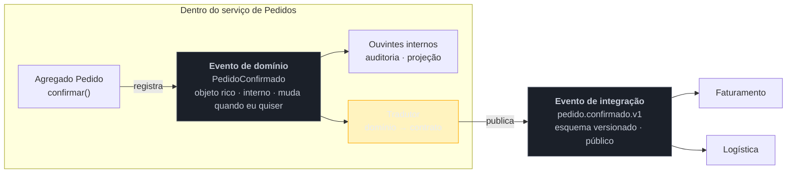

# Domain Events

> [!abstract] TL;DR
> Antes de ser uma mensagem num broker, o evento é um **elemento do modelo de domínio**: `PedidoConfirmado` é vocabulário que o especialista de negócio usa, não detalhe de infraestrutura. Tratá-lo assim torna explícito algo que costuma ficar implícito — o instante em que algo **aconteceu** — e dá um lugar limpo para os efeitos colaterais que hoje se acumulam dentro do método de negócio. A distinção que mais importa, e que quase todo sistema erra na primeira versão: **evento de domínio** (interno, no vocabulário do modelo, seu) ≠ **evento de integração** (publicado para fora, contrato público, de todos). Publicar o primeiro cru é como expor suas tabelas.

## O dia em que renomear um campo quebrou quatro times

O serviço de pedidos levanta um evento de domínio quando um pedido é confirmado, e alguém teve a ideia prática de publicá-lo direto no broker — afinal, o objeto já existe, já tem os dados, e serializar é uma linha.

Um ano depois, uma refatoração interna renomeia `valorLiquido` para `totalAposDescontos` e desmembra `endereco` em campos separados. É uma mudança **interna**, do modelo do time de pedidos, sem alteração de comportamento.

No dia do deploy, quatro serviços quebram: faturamento, logística, antifraude e o data lake. Nenhum deles foi consultado, porque ninguém sabia que aquele objeto era um contrato — ele nasceu como classe interna do domínio e virou API pública sem nunca ter sido discutido como tal.

Esse é o custo de não separar as duas coisas. E o mais caro nem é o incidente: é que, a partir dele, **o modelo de domínio congela**. Ninguém mais quer renomear nada, porque cada refatoração interna virou negociação com quatro times.

## O evento como elemento do modelo

A contribuição do padrão, no DDD, é tratar o evento como parte do **modelo**, não da plumbing. `PedidoConfirmado`, `PagamentoRecusado`, `EstoqueEsgotado` são conceitos que o especialista de negócio já usa nas frases dele — e que, sem o padrão, ficam invisíveis no código, dissolvidos dentro de um método que faz várias coisas.

Duas consequências práticas.

**A primeira é que o momento vira explícito.** Sem o padrão, o método `confirmar()` contém a mudança de estado **e** todos os efeitos que ela dispara: baixar estoque, enviar e-mail, notificar o parceiro, registrar auditoria. O método cresce, mistura níveis, e não há como saber o que é a regra e o que é a consequência. Com o padrão, `confirmar()` muda o estado e **registra que algo aconteceu**; os efeitos ficam em ouvintes separados, cada um com uma responsabilidade.

**A segunda é que o evento é imutável e nomeado no passado.** Ele não pede nada e não pode ser recusado — descreve um fato consumado. Um "evento" que o receptor pode rejeitar era um comando com o nome errado, conforme a nota anterior.

> [!question]- Evento de domínio precisa de broker? Precisa ser assíncrono?
> Não, e essa é uma das confusões mais comuns. Um evento de domínio pode ser **in-process e síncrono** — levantado pelo agregado, despachado ao final da transação, tratado por ouvintes no mesmo processo. O `ApplicationEventPublisher` do Spring com `@TransactionalEventListener(phase = AFTER_COMMIT)` faz exatamente isso, sem mensageria nenhuma. O padrão é sobre **modelagem** (tornar o fato explícito e separar efeitos), não sobre transporte. Muitos sistemas ganham bastante usando eventos de domínio internos e **nenhum** broker.

## Quando despachar: o detalhe que decide tudo

Se o evento é registrado durante a operação, resta escolher **quando** os ouvintes rodam — e as duas opções ingênuas têm falhas opostas:

**Despachar no meio da transação** faz o ouvinte enxergar um estado que ainda não foi confirmado. Se a transação abortar depois, o e-mail já foi enviado anunciando um pedido que não existe. Efeitos externos não têm rollback.

**Despachar depois do commit** resolve isso — o fato é definitivo quando os ouvintes rodam. Mas abre a outra falha: se o processo cair entre o commit e a publicação, o dado foi gravado e **o evento se perdeu**, sem erro em lugar nenhum.

O padrão usual é acumular os eventos **no agregado** durante a operação e despachá-los **após o commit**, aceitando a segunda falha — que é justamente o *dual-write problem* que o [[05 - Outbox|Outbox]] existe para resolver, gravando o evento na mesma transação do dado.

## Domínio × integração: a fronteira

O âmbar é a peça que costuma faltar — e é barata: uma função que mapeia o evento interno para o contrato publicado.

| | **Evento de domínio** | **Evento de integração** |
| --- | --- | --- |
| Alcance | dentro do serviço | atravessa fronteiras |
| Dono | o time do domínio | **compartilhado** com os consumidores |
| Forma | objeto rico, com tipos do domínio | esquema serializável e versionado |
| Muda | quando o modelo muda | só com compatibilidade e aviso |
| Transporte | in-process, síncrono ou não | broker |
| Vocabulário | interno, íntimo do modelo | público, estável, curado |

A regra que evita o incidente da abertura: **o evento de domínio nunca sai do serviço sem passar por uma tradução deliberada.** O que atravessa a fronteira é um contrato que você **escolheu** publicar — normalmente menor que o evento interno, e com campos que você aceita sustentar por anos.

## O que ele acopla

Pela lente da família: um evento de domínio **puramente interno acopla quase nada** — é uma reorganização do seu próprio código, e refatorá-lo custa uma busca no repositório.

O acoplamento nasce no instante da publicação, e é a partir daí que ele fica caro. Publicar cru acopla os consumidores **ao seu modelo interno**, que é a coisa que mais muda num sistema saudável. Publicar um contrato traduzido acopla-os **ao contrato**, que é a coisa que você projetou para não mudar. O custo dessa segunda via é uma função de tradução e a disciplina de versionar; o custo da primeira é o congelamento do seu domínio.

Vale notar a simetria com a família anterior: é o mesmo raciocínio do [[03-Dominios/Engenharia/Design de Software/Padrões de Projeto/Aplicação Corporativa/07 - DTO — e por que virou pejorativo|DTO]] — não expor a entidade na fronteira, para que o contrato público e o modelo interno possam evoluir em ritmos diferentes. Aqui o "DTO" é o evento de integração.

## Armadilhas comuns

> [!warning] Publicar o evento de domínio cru
> **O que acontece:** o objeto interno é serializado direto no tópico. Meses depois, uma refatoração interna quebra consumidores que ninguém sabia que existiam — e o modelo de domínio congela por medo. **Por quê:** é a linha de menor esforço no dia em que se escreve, e o custo aparece só quando o modelo precisa mudar. Nada no código sinaliza que aquele objeto virou API pública. **Como evitar:** uma tradução explícita na fronteira e um esquema versionado. Se você não consegue nomear quem consome um evento publicado, você já tem o problema — só ainda não o encontrou.

> [!warning] Nome imperativo ou no presente
> **O que acontece:** aparecem `AtualizarEstoque` ou `PedidoConfirmando` no barramento. Consumidores passam a tratá-los como ordens, e o produtor começa a **depender** de que alguém obedeça. **Por quê:** o nome carrega a intenção. Um nome imperativo revela que o produtor sabe o que deve acontecer — e isso é comando, não evento. **Como evitar:** particípio passado, sempre, e no vocabulário do negócio. Se o nome natural for imperativo, aceite: é um comando, e ele quer uma fila dirigida e um consumidor.

> [!warning] Efeito colateral escondido no ouvinte
> **O que acontece:** um ouvinte de `PedidoConfirmado` altera outro agregado, que levanta outro evento, que dispara um terceiro ouvinte. Ninguém consegue prever o que uma confirmação faz, e uma falha no meio deixa o sistema num estado inconsistente. **Por quê:** o ouvinte parece um lugar barato para pendurar comportamento — não exige mudar o código existente, o que é justamente a virtude do padrão levada longe demais. **Como evitar:** ouvintes devem ser **rasos** e, preferencialmente, tocar um agregado só. Encadeamento que atravessa vários agregados com regra de negócio no meio é um processo — e processo quer [[07 - Saga|Saga]] ou [[08 - Process Manager|Process Manager]], com compensação e visibilidade.

## Como explicar em inglês

> "A domain event is part of the model, not plumbing — PedidoConfirmado is language the business already uses. Making it explicit does two things: it names the moment something happened, and it gives side effects somewhere to live other than inside the business method, which otherwise ends up doing the state change plus five unrelated things. Worth stressing that domain events don't require a broker — they can be in-process and synchronous, dispatched after commit. The distinction that really matters is domain events versus integration events. A domain event is internal and yours to refactor; an integration event is a public contract shared with consumers. If you publish the raw domain object, you've turned your internal model into an API without noticing, and the first time you rename a field you break four teams — and after that nobody dares refactor the domain at all."

| PT | EN |
| --- | --- |
| evento de domínio | domain event |
| evento de integração | integration event |
| levantar um evento | to raise an event |
| despachar após o commit | dispatch after commit |
| linguagem ubíqua | ubiquitous language |
| esquema versionado | versioned schema |
| efeito colateral | side effect |

## O que vem a seguir

Decidido que existe um contrato público a publicar, vem a pergunta que estrutura a família: **quanta coisa esse contrato carrega?** O primeiro estilo escolhe carregar o mínimo possível.

- [[03 - Event Notification]] — o evento magro; abre o eixo dorsal da família.
- [[04 - Event-Carried State Transfer]] — o outro extremo: o evento que carrega o estado.
- [[05 - Outbox]] — como não perder o evento entre o commit e a publicação.

## Veja também

- [[03-Dominios/Engenharia/Design de Software/Padrões de Projeto/Acesso a Dados/14 - Modelagem por agregado e single-table design|Modelagem por agregado]] — o agregado que levanta e acumula os eventos.
- [[03-Dominios/Engenharia/Design de Software/Padrões de Projeto/Aplicação Corporativa/07 - DTO — e por que virou pejorativo|DTO]] — o mesmo raciocínio de não expor o modelo interno na fronteira.
- [[03-Dominios/Engenharia/Comunicação entre Sistemas/3 - Confiabilidade do contrato/02 - Versionamento e evolução de contrato|Versionamento e evolução de contrato]] — como sustentar o esquema publicado.

## Fontes

- **Eric Evans** — *Domain-Driven Design* (2003) e o *DDD Reference* — Domain Event como bloco de construção do modelo.
- **Martin Fowler** — [*Domain Event*](https://martinfowler.com/eaaDev/DomainEvent.html) — a formulação do padrão e a ênfase no fato ocorrido.
- **Vaughn Vernon** — *Implementing Domain-Driven Design* (2013) — o levantamento de eventos no agregado e o despacho na fronteira transacional.
- **Chris Richardson** — [*Domain event pattern*](https://microservices.io/patterns/data/domain-event.html) — a versão de microsserviços e a relação com o Outbox.
