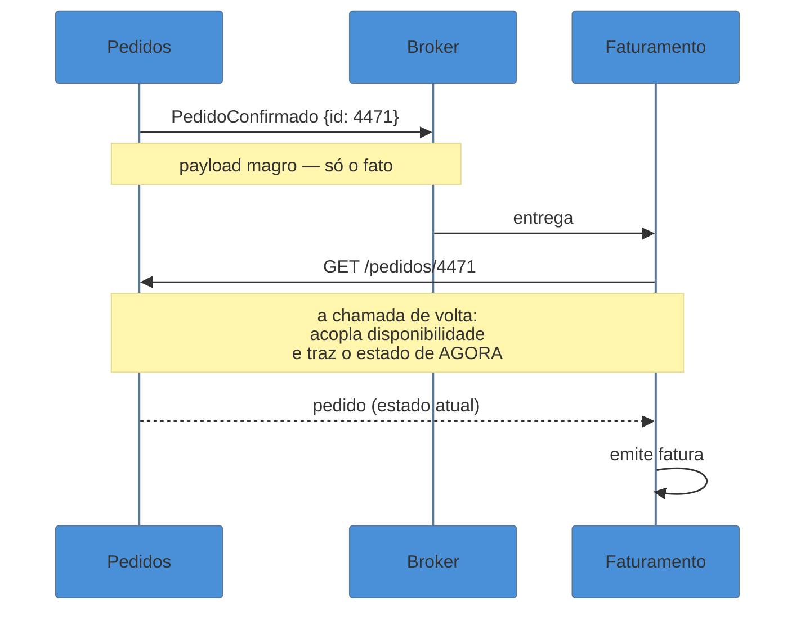

# Event Notification

> [!abstract] TL;DR
> O evento **magro**: diz apenas *o que aconteceu* e *a qual entidade* — `PedidoConfirmado { id }` — e
> quem se interessa **volta e pergunta**. É o menor acoplamento de dados possível: o produtor não sabe
> quem consome nem de que campos eles precisam, e pode refatorar quase tudo sem avisar ninguém. O preço
> tem duas partes, e a segunda é a que pega gente experiente: o consumidor passa a depender da
> **disponibilidade** do produtor, e a chamada de volta traz o **estado de agora**, não o do momento do
> evento — o que abre uma janela de corrida silenciosa.

## O reembolso que foi emitido para um pedido cancelado

O serviço de pedidos publica `PedidoConfirmado { pedidoId: 4471 }`. O serviço de faturamento consome, chama `GET /pedidos/4471` para saber o valor, e emite a fatura.

Um dia o cliente confirma e cancela em seguida — dois cliques, quatro segundos de diferença. O broker teve um pequeno atraso e o consumidor de faturamento processou `PedidoConfirmado` **depois** do cancelamento. Ele fez o `GET`, recebeu o pedido no estado **cancelado**, e o código — que não esperava essa possibilidade, porque afinal reagia a uma confirmação — emitiu a fatura assim mesmo.

O bug não está no broker, que entregou corretamente. Está numa propriedade do estilo que é fácil de não enxergar: **o evento fala do passado, e a chamada de volta traz o presente**. Entre um e outro, o mundo pode ter mudado — e o consumidor está processando uma foto e um vídeo ao vivo ao mesmo tempo, assumindo que são a mesma coisa.

## A ideia: carregar o mínimo

O payload contém o essencial para identificar o fato:

```json
{
  "tipo": "pedido.confirmado",
  "pedidoId": "4471",
  "ocorridoEm": "2026-07-30T14:05:22Z",
  "correlationId": "a1b2c3"
}
```

Nada de cliente, itens ou total. Quem precisar, busca.



A virtude está na primeira seta: o produtor publica um fato e **acabou**. Ele não sabe se há um consumidor ou quinze, não sabe de que campos eles precisam, e pode reorganizar seu modelo interno livremente — porque o contrato publicado é minúsculo e estável por construção. Adicionar um consumidor novo não exige mudança nenhuma do lado do produtor.

O custo está nas duas setas do meio, e é ali que a nota vive.

## O que ele acopla

Pela lente da família — nenhum estilo elimina acoplamento; cada um o move:

**Desacopla dados.** O contrato é um identificador e um nome de fato. O produtor pode renomear campos internos, mudar esquema, trocar de banco: nada disso atravessa a fronteira. É o estilo em que o modelo de domínio fica **mais livre para evoluir**.

**Acopla disponibilidade.** Esta é a troca central. Se o serviço de pedidos estiver fora do ar, o consumidor **não consegue processar** o evento que já recebeu — a informação chegou, mas está incompleta e o complemento depende de alguém que não responde. O sistema parece assíncrono e desacoplado no diagrama, mas mantém uma dependência síncrona em tempo de processamento.

**Acopla ao presente, não ao momento do fato.** É o bug da abertura. O evento é uma afirmação sobre `t₀`; a chamada de volta responde sobre `t₁`. Quanto maior o atraso — fila com backlog, retry, reprocessamento de ontem —, maior a divergência. Reprocessar eventos antigos é onde isso fica pior: ao reler a fila de uma semana atrás, **todas** as chamadas de volta devolvem o estado de hoje, e o replay não reconstitui coisa alguma.

**Acopla em carga.** Um evento pode gerar N chamadas de volta, uma por consumidor. O produtor que se desacoplou logicamente continua sendo martelado — e um pico de eventos vira um pico de leituras exatamente no serviço que acabou de trabalhar para gerá-los.

| | Vantagem | Custo |
| --- | --- | --- |
| Contrato | mínimo e estável | insuficiente por si só |
| Produtor | livre para refatorar | vira dependência de leitura de todos |
| Consumidor | não guarda cópia de nada | não funciona se o produtor cair |
| Tempo | — | lê o presente, reage ao passado |

> [!question]- Dá para consertar a corrida sem abandonar o estilo?
> Dá, em boa parte, com uma linha a mais no payload: a **versão** da entidade no momento do fato (`{ pedidoId, versao: 3 }`). O consumidor busca e compara: se o recurso está na versão 5, ele sabe que o mundo andou e pode decidir — ignorar, buscar o estado histórico daquela versão, ou tratar como conflito. Isso não elimina o acoplamento de disponibilidade, mas troca uma falha **silenciosa** por uma **detectável**, que é quase sempre o melhor negócio. É o mesmo raciocínio do lock otimista.

## Quando este estilo é a escolha certa

- **Poucos consumidores precisam dos dados.** Se a maioria só quer saber que aconteceu — para invalidar cache, disparar métrica, registrar auditoria —, carregar estado no evento seria desperdício.
- **Os consumidores precisam de recortes muito diferentes.** Um evento que carregasse a união de tudo ficaria gordo e instável; deixar cada um buscar o seu é mais limpo.
- **O dado é sensível.** O que não vai no evento não fica replicado em cinco sistemas nem retido no broker. Para dados pessoais, isso é argumento de peso — inclusive de conformidade.
- **O dado muda rápido e o valor histórico é baixo.** Se o consumidor sempre quer o mais recente, buscar é honesto.

E quando **não** é: se praticamente todo consumidor faz a chamada de volta imediatamente e sempre, você tem [[04 - Event-Carried State Transfer|Event-Carried State Transfer]] disfarçado — com um *round-trip* extra e a corrida de brinde.

## Armadilhas comuns

> [!warning] Ler o estado atual como se fosse o do evento
> **O que acontece:** o consumidor reage a `PedidoConfirmado`, busca o pedido e o encontra cancelado — mas o código assume a confirmação e segue. Emite fatura, dá baixa em estoque, envia e-mail.
> **Por quê:** o evento afirma algo sobre o passado e a API responde sobre o presente. A hipótese implícita — "se recebi a confirmação, o pedido está confirmado" — é falsa sob atraso, retry ou reprocessamento.
> **Como evitar:** **revalide** o estado depois de buscar, em vez de pressupor. E inclua a versão no evento para detectar divergência em vez de descobri-la por acidente.

> [!warning] Teia de notificações sem fluxo legível
> **O que acontece:** cada consumidor publica um evento novo ao terminar, outro reage a esse, e em seis meses ninguém responde "o que acontece quando um pedido é confirmado?" sem varrer vários repositórios.
> **Por quê:** o baixo custo de acrescentar um consumidor é a virtude do estilo — e nada limita quantos níveis de encadeamento surgem.
> **Como evitar:** id de correlação propagado ponta a ponta, rastreamento distribuído, e um catálogo de eventos com produtores e consumidores. Onde o encadeamento **for** um processo de negócio, torne-o explícito com [[08 - Process Manager|Process Manager]] em vez de deixá-lo emergir.

> [!warning] Tratar como assíncrono um caminho que continua síncrono
> **O que acontece:** a arquitetura é apresentada como desacoplada, mas uma queda do produtor trava o processamento de todos os consumidores — o incidente atravessa a fronteira que o diagrama dizia existir.
> **Por quê:** a **entrega** é assíncrona; o **processamento** não é, porque depende da chamada de volta.
> **Como evitar:** reconheça a dependência e trate-a: *retry* com recuo exponencial, DLQ, e a decisão explícita sobre o que fazer com eventos que não podem ser completados agora. Se essa dependência for inaceitável, o estilo certo é o próximo.

## Como explicar em inglês

> "Event Notification is the thin version: the event says what happened and to which entity, nothing more, and interested consumers call back for the details. It gives you the loosest data coupling you can get — the producer doesn't know who's listening or what fields they need, so it can refactor freely. The cost is two things. First, you're now coupled on availability: if the producer is down, consumers can't process events they've already received, so the flow looks asynchronous but isn't. Second — and this is the subtle one — the event describes the past while the callback returns the present. Under lag or reprocessing, you can react to an order-confirmed event and fetch an order that's already cancelled. Putting the entity version in the event doesn't remove the coupling, but it turns a silent failure into a detectable one."

| PT | EN |
| --- | --- |
| evento magro | thin event |
| chamada de volta | callback / call back for details |
| acoplamento por disponibilidade | availability coupling |
| janela de corrida | race window |
| reprocessamento | replay / reprocessing |
| recuo exponencial | exponential backoff |
| leitura amplificada | read amplification |

## O que vem a seguir

Isso fecha o bloco **Iniciado**. Todos os custos desta nota — a chamada de volta, a dependência de disponibilidade, a corrida entre passado e presente — têm a mesma resposta possível: **colocar o estado dentro do evento**. Ela resolve os três de uma vez, e cria uma classe inteira de problemas novos.

- [[04 - Event-Carried State Transfer]] — o outro extremo do eixo dorsal; abre o bloco Adepto.
- [[05 - Outbox]] — garantir que o evento seja publicado se, e somente se, o dado foi gravado.
- [[01 - Panorama da arquitetura de eventos]] — os quatro estilos e a lente do acoplamento.

## Veja também

- [[03-Dominios/Engenharia/Arquitetura/System Design/3 - Padrões recorrentes/01 - Pub-Sub e event-driven em escala|Pub-Sub em escala]] — o mesmo estilo pela ótica de throughput e fan-out.
- [[03-Dominios/Engenharia/Design de Software/Padrões de Projeto/Integração Empresarial (EIP)/03 - Message Channel|Message Channel]] — fila × tópico, o canal por onde a notificação trafega.
- [[03-Dominios/Engenharia/Design de Software/Padrões de Projeto/Aplicação Corporativa/09 - Optimistic × Pessimistic Offline Lock|Lock otimista]] — a mesma ideia de versionar para detectar divergência.

## Fontes

- **Martin Fowler** — [*What do you mean by "Event-Driven"?*](https://martinfowler.com/articles/201701-event-driven.html) — Event Notification como o primeiro dos quatro estilos, com a ressalva sobre perda de visibilidade do fluxo.
- **Hohpe & Woolf** — *Enterprise Integration Patterns* (2004) — Event Message e os canais que a transportam.
- **Chris Richardson** — [*microservices.io — event-driven architecture*](https://microservices.io/patterns/data/event-driven-architecture.html) — as variantes de payload e seus efeitos no acoplamento.
