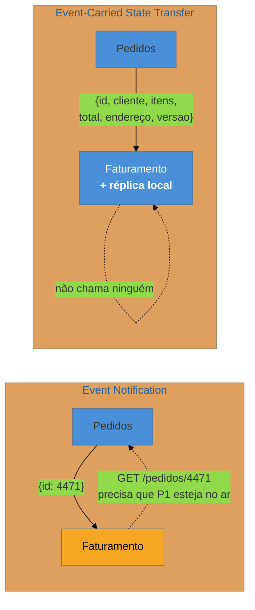

# Event-Carried State Transfer

> [!abstract] TL;DR
> O evento **gordo**: carrega o estado de que o consumidor precisa, para que ele **não volte a perguntar**. Resolve de uma vez os três custos da notificação magra — some a chamada de volta, some a dependência de disponibilidade, e o consumidor passa a ver o estado **do momento do fato**, não o de agora. Em troca, cada consumidor mantém uma **réplica local** eventualmente desatualizada, e o payload vira **contrato público** que você não pode mudar sozinho. Este é o outro extremo do eixo dorsal da família — e a escolha entre ele e a notificação é a decisão de acoplamento mais consequente aqui.

## O produtor caiu às três da manhã e nada parou

O serviço de pedidos ficou indisponível por quarenta minutos de madrugada. Faturamento, logística e antifraude continuaram processando normalmente, porque cada um já tinha, no seu próprio banco, tudo de que precisava: os eventos que receberam traziam o pedido inteiro.

Essa é a promessa do estilo, e ela é real. O consumidor deixa de ter uma dependência **em tempo de processamento** com o produtor.

Três meses depois, a mesma escolha cobra a conta. O time de pedidos precisa desmembrar o campo `endereco` em campos estruturados. É uma mudança interna trivial — só que aquele campo está dentro do payload publicado, e três serviços leem dele. O que era uma refatoração de uma tarde vira uma negociação de três semanas, com versionamento de esquema, período de convivência e migração coordenada.

**As duas cenas são o mesmo padrão.** Você comprou autonomia de execução pagando com acoplamento de formato — e essa é exatamente a troca a avaliar.

## A ideia: mandar o estado junto

O consumidor mantém uma **cópia local** dos dados de que precisa — não do pedido inteiro necessariamente, mas do recorte que interessa a ele — e a atualiza a cada evento. Ele nunca chama o produtor.

Repare no que isso implica: os dados do pedido agora existem em quatro lugares, e três deles estão sempre um pouco atrasados. Isso não é defeito de implementação; é a natureza do estilo, e precisa ser aceito conscientemente.

## Snapshot ou delta: a decisão que quase ninguém toma explicitamente

Há duas formas de "carregar o estado", com propriedades muito diferentes:

**Snapshot** — o evento traz o estado **completo** da entidade após a mudança. É maior, e em troca é **auto-suficiente**: aplicar duas vezes dá o mesmo resultado (idempotente por construção), e com um número de versão você consegue descartar eventos fora de ordem com segurança.

**Delta** — o evento traz **só o que mudou** (`{ desconto: 10 }`). É pequeno e expressivo, e cobra caro: aplicar duas vezes pode corromper (se for incremental), e **exige ordem exata** — perdeu um evento, a réplica diverge para sempre, silenciosamente.

Como a entrega real é *at-least-once* e a ordem só é garantida sob condições específicas, **snapshot com versão é o default seguro**. Delta faz sentido quando o estado é grande e a mudança é minúscula — e aí vale o custo de garantir ordem e deduplicação.

> [!question]- Se cada consumidor tem uma cópia, isso não é duplicar o banco de dados?
> É — e o desconforto é justificado, mas o enquadramento correto ajuda. Não é uma cópia do banco do produtor: é uma **projeção local do recorte que aquele consumidor usa**, no formato que serve a ele. O faturamento guarda valor e cliente; a logística guarda endereço e volume; nenhum dos dois guarda o pedido inteiro. Ainda assim, a objeção de fundo permanece válida e deve ser dita em voz alta: você trocou uma fonte da verdade por várias réplicas eventualmente consistentes, e alguém vai perguntar por que o relatório de um sistema não bate com o do outro. Se a resposta "porque estão a alguns segundos de distância" for inaceitável para aquele dado, o estilo é o errado.

## O eixo dorsal: magro × gordo

A tabela que resume a família:

| | **Event Notification** | **Event-Carried State Transfer** |
| --- | --- | --- |
| Payload | id + fato | o estado necessário |
| Consumidor volta a perguntar | **sim** | não |
| Se o produtor cair | consumidor **trava** | consumidor **segue** |
| Dados replicados | nenhum | um recorte por consumidor |
| Consistência | lê o presente (pode divergir do fato) | consistente com o fato, **eventualmente** atrasada |
| Contrato | mínimo e estável | **o payload inteiro** |
| Refatorar o modelo interno | livre | negociado com consumidores |
| Carga no produtor | N leituras por evento | nenhuma |
| Dado sensível | fica na origem | **replicado e retido no broker** |

Não há vencedor: há duas moedas. Notificação paga em **disponibilidade e latência**; ECST paga em **duplicação e rigidez de contrato**. A escolha é por fluxo, não por sistema — o mesmo produtor pode publicar notificação para uns consumidores e estado para outros.

## O que ele acopla

**Desacopla disponibilidade e tempo.** É o ganho central, e resolve a corrida da nota anterior: o evento traz o estado *daquele instante*, então o consumidor reage ao mundo que gerou o fato, e não a um mundo posterior. Reprocessar a fila de uma semana atrás passa a funcionar de verdade.

**Acopla formato.** O payload é contrato público. Todo campo publicado é um compromisso — e, ao contrário de uma API, você não sabe quem consome nem consegue descontinuar por telemetria com facilidade.

**Acopla a decisões de conteúdo.** Como o produtor decide o que vai no evento, ele passa a precisar saber — ao menos aproximadamente — do que os consumidores precisam. Isso reintroduz, por outra via, um pouco do conhecimento sobre consumidores que o estilo de eventos queria eliminar. É um acoplamento sutil e real.

**Não acopla, mas admite: dados velhos.** A réplica está sempre alguns instantes atrás. Para a maioria dos usos é irrelevante; para saldo, limite de crédito ou estoque no limite, pode não ser — e essa é uma decisão de negócio, não técnica.

## Armadilhas comuns

> [!warning] Aplicar estado fora de ordem
> **O que acontece:** dois eventos do mesmo pedido chegam trocados (retry, partições diferentes, reprocessamento). A réplica local fica com o estado **antigo** sobrescrevendo o novo, e diverge em silêncio — ninguém detecta, porque não há erro. **Por quê:** ordem global não é garantida na prática, e a chegada fora de sequência é normal, não excepcional. **Como evitar:** **versão ou timestamp lógico no payload**, e a regra de aplicar apenas se for mais recente que o registrado (descartando o resto). Onde a ordem for essencial, particione pela chave da entidade, garantindo ordem por chave em vez de global.

> [!warning] Payload que cresce até virar o modelo inteiro
> **O que acontece:** cada novo consumidor pede mais um campo, e o evento chega a dezenas de KB carregando dados que quase ninguém usa — com custo de broker, retenção e, no caso de dados pessoais, exposição desnecessária. **Por quê:** acrescentar um campo é sempre mais fácil que negociar; e como não há dono do payload, ele cresce por acúmulo. **Como evitar:** o evento carrega **o que descreve o fato**, não o estado completo da entidade. Consumidor com necessidade muito particular pode voltar a perguntar — misturar os dois estilos por consumidor é legítimo. E dado sensível fora do evento, sempre que possível.

> [!warning] Réplica local sem política de reconciliação
> **O que acontece:** um evento se perde por um bug de consumidor, e a réplica fica errada **para sempre** — nada no sistema compara com a origem, e o erro só aparece quando um cliente reclama. **Por quê:** o modelo assume que a réplica é construída incrementalmente e nunca verificada. Um único evento perdido é permanente. **Como evitar:** tenha um caminho de **reconstrução** — reprocessar o log desde o início, ou uma varredura periódica que compara com a origem e corrige. Se a réplica não pode ser reconstruída, ela virou uma fonte da verdade paralela sem querer.

## Como explicar em inglês

> "Event-Carried State Transfer means the event carries the state the consumer needs, so it never calls back. That fixes the three problems with thin events at once: no callback, no availability coupling, and the consumer sees the state as of the moment of the fact rather than the state right now — which also makes replay actually work. What you pay is duplication and contract rigidity. Every consumer now keeps a local copy that's eventually stale, and the payload has quietly become a public contract, so renaming an internal field turns into a three-week negotiation. One decision people rarely make explicitly is snapshot versus delta: a snapshot is bigger but self-sufficient and idempotent, a delta is small but requires exact ordering and exactly-once, which you don't have. So snapshot plus a version number is the safe default."

| PT | EN |
| --- | --- |
| evento gordo | fat event |
| réplica local | local replica / local copy |
| dados desatualizados | stale data |
| consistência eventual | eventual consistency |
| fora de ordem | out of order |
| reconstrução / recarga | rebuild / backfill |
| retenção no broker | broker retention |

## O que vem a seguir

Os dois estilos supõem que o evento **foi publicado**. Mas gravar no banco e publicar no broker são duas operações distintas, e não há transação que cubra as duas — o que abre uma falha que nenhum dos estilos resolve: dado gravado sem evento, ou evento publicado sem dado.

- [[05 - Outbox]] — atomicidade entre gravar e publicar; abre a parte de confiabilidade.
- [[06 - Idempotent Consumer (Inbox)]] — o outro lado: a mensagem que chega duas vezes.
- [[03 - Event Notification]] — o outro extremo do eixo, para comparar.

## Veja também

- [[03-Dominios/Engenharia/Arquitetura/System Design/3 - Padrões recorrentes/01 - Pub-Sub e event-driven em escala|Pub-Sub em escala]] — o custo de payload gordo em throughput e retenção.
- [[03-Dominios/Engenharia/Comunicação entre Sistemas/3 - Confiabilidade do contrato/02 - Versionamento e evolução de contrato|Versionamento e evolução de contrato]] — como sustentar o payload que virou contrato.
- [[03-Dominios/Engenharia/Design de Software/Padrões de Projeto/Acesso a Dados/15 - Polyglot persistence e materialized views|Polyglot persistence e materialized views]] — a réplica local como view materializada.

## Fontes

- **Martin Fowler** — [*What do you mean by "Event-Driven"?*](https://martinfowler.com/articles/201701-event-driven.html) — Event-Carried State Transfer como o segundo estilo, e o trade-off de réplicas.
- **Chris Richardson** — [*microservices.io — event-driven architecture*](https://microservices.io/patterns/data/event-driven-architecture.html) — replicação de dados entre serviços por eventos.
- **Hohpe & Woolf** — *Enterprise Integration Patterns* (2004) — Document Message e Event Message, a distinção de payload.
