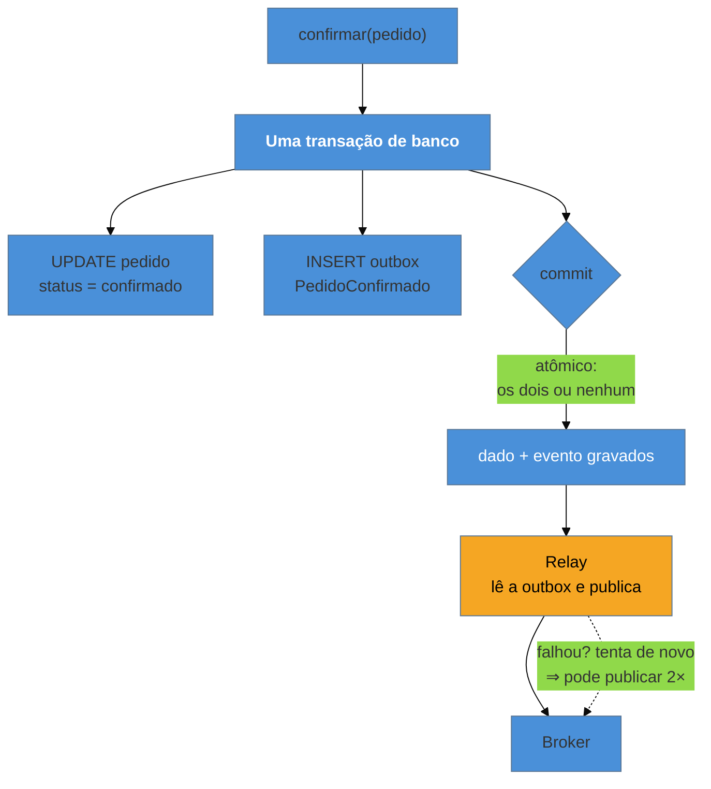

# Outbox

> [!abstract] TL;DR
> Gravar no banco e publicar no broker são **duas** operações, e não existe transação que cubra as duas. Qualquer ordem tem um caso de falha: publicar antes arrisca anunciar um fato que não se consumou; gravar antes arrisca um fato consumado que ninguém soube. É o ***dual-write problem***. O **Outbox** desfaz o dilema gravando o evento **numa tabela, na mesma transação do dado** — uma escrita, atômica por construção — e publicando depois, a partir dessa tabela. O que ele garante é preciso e limitado: *se o dado foi gravado, o evento será publicado* — **pelo menos uma vez**. Nunca exatamente uma.

> [!info] O recorte desta nota
> Aqui o Outbox como **decisão de design**: que falha ele fecha, o que garante e o que não garante. A **implementação** — Polling Publisher, *transaction log tailing* / CDC com Debezium, e o isolamento que a Saga não dá — está desenvolvida em [[03-Dominios/Engenharia/Comunicação entre Sistemas/4 - Comunicação assíncrona/04 - Outbox e Saga|Comunicação 4-04]].

## As duas ordens, e as duas falhas

O pedido foi confirmado. É preciso gravar a mudança no banco e publicar `PedidoConfirmado` no broker. Só há duas ordens possíveis, e ambas quebram:

**Publicar primeiro, gravar depois.** Se a gravação falhar — violação de restrição, deadlock, queda do processo —, o evento já saiu. O faturamento emite a fatura de um pedido que **não existe**. O sistema anunciou um fato que não se consumou, e não há como retirar a afirmação: outros já reagiram.

**Gravar primeiro, publicar depois.** Se a publicação falhar — broker fora do ar, timeout, processo morto entre uma coisa e outra —, o pedido está confirmado no banco e **ninguém soube**. Sem fatura, sem separação, sem e-mail. E o pior: **nenhum erro em lugar nenhum**. Do ponto de vista do usuário deu certo; a inconsistência é descoberta dias depois, por reclamação.

A segunda falha é mais insidiosa que a primeira, e é a que acontece mais — porque a janela entre o commit e a publicação parece pequena demais para importar. Em volume, ela importa.

> [!question]- E se eu usar uma transação distribuída entre banco e broker?
> Tecnicamente possível em alguns arranjos (XA/two-phase commit), e é a resposta que a indústria abandonou. O 2PC trava recursos nos dois lados enquanto coordena, degrada muito a taxa de transferência, e cria um coordenador cuja falha deixa participantes em dúvida — o problema de bloqueio que motivou toda a busca por alternativas. Somem-se a isso brokers modernos que simplesmente **não suportam** XA (o Kafka não oferece 2PC com bancos), e a conclusão prática é a do padrão: em vez de coordenar duas escritas, **faça uma só** e derive a outra dela.

## A ideia: uma escrita só

O evento é gravado **na mesma transação** do dado, numa tabela de saída. O banco garante atomicidade porque é uma transação local, comum: ou as duas linhas existem, ou nenhuma. Depois, um processo separado — o *relay* — lê a tabela e publica.

A engenhosidade está em ter transformado um problema de coordenação entre dois sistemas num problema de **uma escrita local mais um processo de entrega**. E o âmbar marca onde o problema não foi eliminado, apenas deslocado.

## O que ele garante — e o que não

Vale ser cirúrgico aqui, porque é o ponto que mais se entende errado:

| Garante | Não garante |
| --- | --- |
| se o dado foi gravado, o evento **será** publicado | que seja publicado **uma só vez** |
| que não haverá evento sem dado | entrega **imediata** (há latência do relay) |
| ordem por entidade, se a leitura da outbox for ordenada | ordem **global** |
| durabilidade do evento (está no banco) | que o consumidor processe uma vez |

A linha de cima à direita é a mais importante: o relay publica, e pode cair **depois de publicar e antes de marcar como publicado**. Na volta, publica de novo. Isso é inerente — não é falha de implementação, e não há como eliminá-lo sem confirmação atômica entre broker e banco, que é justamente o que não existe.

**Consequência prática:** o Outbox **exige** um consumidor idempotente do outro lado. Os dois padrões são metades da mesma solução, e adotar um sem o outro deixa o sistema com duplicidade não tratada — que é o assunto da próxima nota.

## O que ele acopla

Pela lente da família, o Outbox é peculiar: ele **não muda o acoplamento entre produtor e consumidores** — o contrato do evento é o mesmo, magro ou gordo. O que ele acopla é interno.

**Acopla a publicação ao banco do produtor.** O evento passa a viver na base transacional, o que é a fonte da garantia e também um custo: mais escrita por operação, uma tabela que cresce e precisa de expurgo, e — no caso da leitura por polling — carga adicional de consulta.

**Desacopla a publicação do broker.** Este é o ganho operacional que costuma passar batido: com Outbox, **o broker pode ficar fora do ar sem impedir o negócio**. As operações continuam, os eventos acumulam na tabela, e o relay drena quando o broker volta. Sem Outbox, a indisponibilidade do broker vira indisponibilidade da operação, ou perda de evento.

**Torna o evento parte do modelo persistido.** O que se grava na outbox é o **evento de integração** — o contrato traduzido da [[02 - Domain Events|nota 02]], não o objeto de domínio cru. Gravar o objeto interno ali é o mesmo erro daquela nota, agora com o agravante de ficar persistido e ser publicado depois, quando o formato já mudou.

## Armadilhas comuns

> [!warning] Achar que o Outbox dá *exactly-once*
> **O que acontece:** o time adota o Outbox e considera o problema resolvido. Meses depois, um cliente é cobrado duas vezes porque o relay republicou um evento após uma falha. **Por quê:** o padrão garante que o evento **não se perde**, e ninguém verifica a outra ponta. Publicar e marcar como publicado não são atômicos. **Como evitar:** trate Outbox e [[06 - Idempotent Consumer (Inbox)|consumidor idempotente]] como um **par**. Um sem o outro é meia solução — e a metade que falta é a que produz efeito visível para o cliente.

> [!warning] Tabela de outbox sem expurgo
> **O que acontece:** a tabela cresce indefinidamente. A consulta do relay fica lenta, o backup incha, e um dia o disco acaba — derrubando o banco **transacional**, não um sistema periférico. **Por quê:** o registro publicado não serve mais a nada, mas apagá-lo é trabalho que ninguém prioriza, e o crescimento é invisível até o limite. **Como evitar:** política de retenção desde o primeiro dia — apagar ou arquivar depois de publicado e de uma janela de segurança. E monitore o **tamanho da fila não publicada**: ela crescer é o sinal mais precoce de que o relay parou.

> [!warning] Publicar direto do código da aplicação "porque é mais simples"
> **O que acontece:** alguém acrescenta um `publish()` logo após o `commit()`, contornando a outbox para um caso específico. Aquele caminho volta a ter o dual-write, e a inconsistência reaparece só ali — difícil de correlacionar, porque o resto do sistema é confiável. **Por quê:** a outbox parece cerimônia quando se está escrevendo um fluxo simples e o broker está funcionando. **Como evitar:** a publicação deve ter **um caminho só**, idealmente encapsulado (o repositório grava o evento junto do agregado, e nada mais publica). Exceção pontual em confiabilidade é como exceção em camadas: o custo não é o caso, é o precedente.

## Como explicar em inglês

> "Writing to your database and publishing to a broker are two operations, and there's no transaction spanning both — that's the dual-write problem. Publish first and you might announce something that never committed; commit first and the event can be lost with no error anywhere, which is the nastier failure because it's silent. The Outbox pattern removes the dilemma: you write the event into a table inside the same transaction as the data, so it's one atomic local write, and a separate relay publishes from that table. What it guarantees is precise — if the data was written, the event will be published — but at-least-once, never exactly-once, because the relay can publish and die before marking it sent. So Outbox and an idempotent consumer are two halves of one solution. A nice side benefit people miss: with an outbox, the broker can be down without stopping business — events just queue up in the table."

| PT | EN |
| --- | --- |
| escrita dupla | dual write |
| caixa de saída | outbox |
| retransmissor | relay / message relay |
| pelo menos uma vez | at-least-once |
| expurgo / retenção | purging / retention |
| commit em duas fases | two-phase commit |

## O que vem a seguir

Se o evento pode ser publicado mais de uma vez — e pode —, a responsabilidade passa para o outro lado da linha. O consumidor precisa que processar duas vezes tenha o efeito de uma, e isso é mais sutil do que parece quando o efeito sai do banco e vai para o mundo.

- [[06 - Idempotent Consumer (Inbox)]] — a outra metade da solução.
- [[07 - Saga]] — quando o processo atravessa serviços e precisa de compensação.
- [[02 - Domain Events]] — o que exatamente se grava na outbox (contrato, não objeto interno).

## Veja também

- [[03-Dominios/Engenharia/Comunicação entre Sistemas/4 - Comunicação assíncrona/04 - Outbox e Saga|Outbox e Saga (Comunicação)]] — a implementação: Polling Publisher, CDC/log tailing, isolamento.
- [[03-Dominios/Engenharia/Design de Software/Padrões de Projeto/Acesso a Dados/10 - Unit of Work|Unit of Work]] — a transação que agrupa o dado e o evento.
- [[03-Dominios/Engenharia/Design de Software/Padrões de Projeto/Integração Empresarial (EIP)/13 - Guaranteed Delivery + Dead Letter Channel|Guaranteed Delivery]] — a garantia do lado do canal.

## Fontes

- **Chris Richardson** — [*Transactional Outbox pattern*](https://microservices.io/patterns/data/transactional-outbox.html) — a formulação canônica, com Polling Publisher e Log Tailing.
- **Chris Richardson** — *Microservices Patterns* (2018) — o dual-write problem e as alternativas ao 2PC.
- **Martin Kleppmann** — *Designing Data-Intensive Applications* (2017) — por que o commit em duas fases foi abandonado na prática.
