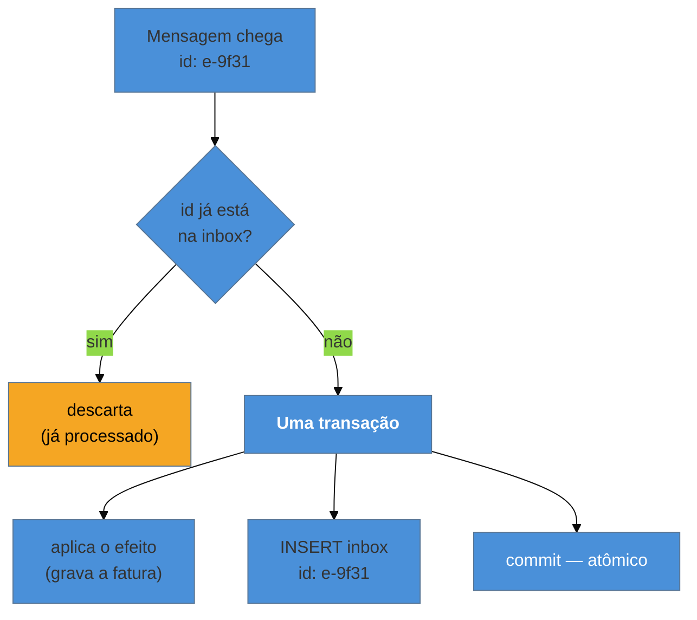

# Idempotent Consumer (Inbox)

> [!abstract] TL;DR
> A entrega real é **pelo menos uma vez** — logo, a mensagem **vai** chegar duplicada, e isso não é
> exceção: é operação normal. O consumidor precisa que processar duas vezes tenha o efeito de uma. A
> estratégia mais geral é o **inbox**: registrar o identificador da mensagem **na mesma transação** do
> efeito, de modo que reprocessar seja detectado e descartado. A parte difícil, e a razão desta nota
> existir separada do dedup de canal, é que **o efeito nem sempre cabe numa transação**: cobrar um
> cartão, enviar um e-mail e chamar um parceiro não têm rollback — e é aí que a idempotência precisa
> atravessar a fronteira, via **chave de idempotência**.

> [!info] O recorte desta nota
> A deduplicação no nível do **canal** — dedup por id de mensagem na mensageria — é
> [[03-Dominios/Engenharia/Design de Software/Padrões de Projeto/Integração Empresarial (EIP)/12 - Idempotent Receiver|EIP-12]].
> Aqui o foco é a **idempotência do efeito de negócio**: gravar duas vezes é um problema técnico com
> solução conhecida; **cobrar duas vezes é outro problema**, e ele não se resolve no canal.

## O cliente cobrado duas vezes

O consumidor de `PedidoConfirmado` faz três coisas: grava a fatura, chama o gateway de pagamento e envia o e-mail de confirmação.

O relay do Outbox republicou o evento depois de uma falha — comportamento esperado, conforme a nota anterior. O consumidor processou de novo. A gravação da fatura tinha chave única, então essa parte falhou de forma limpa e visível. Mas a cobrança **já tinha sido feita** antes do erro, e o e-mail já tinha saído.

O cliente foi cobrado duas vezes e recebeu duas confirmações. E note onde estava a proteção: no banco, que é o lugar em que ela era mais fácil e menos necessária. Os dois efeitos que realmente doem — dinheiro e comunicação com o cliente — estavam desprotegidos, porque estão **fora** do alcance da transação.

## A ideia: registrar o que já foi processado

A forma mais geral é o **inbox** — o espelho do outbox, do lado do consumidor:

O ponto crítico é a atomicidade entre **aplicar o efeito** e **registrar que foi aplicado**. Se fossem duas transações, a falha entre elas produziria exatamente o problema que se quer evitar — efeito aplicado sem registro, e reaplicação na retentativa.

Três estratégias, da mais geral à mais elegante:

**Inbox / dedup explícito** — funciona para qualquer efeito que caiba na transação. Custa uma tabela e uma consulta por mensagem.

**Operação naturalmente idempotente** — `status = 'confirmado'` aplicado duas vezes dá o mesmo resultado; `saldo = saldo - 10` **não**. Quando a operação puder ser expressa como atribuição de estado em vez de incremento, o problema desaparece de graça. É a solução mais barata e a menos lembrada.

**Upsert por chave de negócio** — em vez de deduplicar por id de mensagem, use a chave natural do domínio: `INSERT ... ON CONFLICT (pedido_id) DO NOTHING`. Tem uma vantagem sutil sobre o id de mensagem — protege também contra **dois eventos diferentes** que descrevem o mesmo fato, coisa que o dedup por id não pega.

## O caso difícil: o efeito que não tem rollback

É aqui que a nota se separa do dedup de canal. Cobrar, enviar e-mail, chamar um parceiro: nenhum entra na sua transação, e nenhum se desfaz.

A resposta é levar a idempotência **para dentro da chamada externa**, com uma **chave de idempotência** — um identificador que você gera de forma determinística a partir do evento (o id da mensagem, ou uma chave derivada do domínio) e envia ao parceiro, que se compromete a executar **uma vez por chave** e devolver o mesmo resultado nas repetições. É o mecanismo do cabeçalho `Idempotency-Key` das APIs de pagamento, e existe exatamente por causa deste problema.

Isso muda a garantia de lugar: em vez de você evitar chamar duas vezes — o que não é possível com confiabilidade —, o **parceiro** garante que chamar duas vezes tem o efeito de uma. Onde o parceiro **não** oferece isso (muito comum em integrações legadas), sobram apenas opções ruins, e vale escolher conscientemente: registrar a intenção antes de chamar e reconciliar depois, ou aceitar a duplicidade e ter um processo de detecção.

> [!question]- Se o broker anuncia *exactly-once*, isso tudo não é desnecessário?
> Não, e vale saber por quê para não ser convencido pela propaganda. O que existe em brokers como o Kafka é *exactly-once* **dentro do próprio sistema** — de tópico para tópico, com transações internas. Assim que o efeito sai dali para o seu banco ou para o gateway de pagamento, a garantia acaba, porque não há transação abrangendo o broker e o mundo externo. Na fronteira, o que se consegue é **at-least-once + idempotência = efetivamente uma vez**. Essa combinação é a resposta real, e "exactly-once de ponta a ponta" é, na fronteira, um mito.

## O que ele acopla

**Acopla ao identificador.** A idempotência depende de uma chave estável: id da mensagem, chave de negócio ou hash determinístico. Se o produtor gerar um id novo a cada republicação, **toda a defesa desaba** — e isso é um acoplamento real, e frequentemente implícito, entre produtor e consumidor. Vale explicitar no contrato do evento: *o id é estável entre retransmissões*.

**Acopla a uma janela de tempo.** Guardar todos os ids para sempre é inviável, então a tabela tem retenção — e a retenção define por quanto tempo você está protegido. Uma duplicata que chegue depois da janela passa. A janela deve ser maior que o pior caso de retentativa e de reprocessamento (que pode ser de dias, se alguém reprocessar a fila de ontem).

**Não acopla produtor e consumidor em contrato de dados** — e essa é a virtude: é uma defesa que o consumidor monta **sozinho**, sem negociar. Por isso é um bom lugar para investir: não depende de coordenação entre times.

## Armadilhas comuns

> [!warning] Deduplicar só o que está no banco
> **O que acontece:** o consumidor tem inbox impecável para gravações e nenhuma proteção para a cobrança e o e-mail. O reprocessamento produz o efeito visível ao cliente exatamente onde não havia defesa.
> **Por quê:** a proteção foi construída onde era fácil (transação local), não onde importava.
> **Como evitar:** inventarie os efeitos **externos** de cada consumidor e trate cada um: chave de idempotência no parceiro quando houver, registro de intenção e reconciliação quando não houver.

> [!warning] Dedup em memória
> **O que acontece:** o conjunto de ids processados vive na memória do processo. Um reinício ou um segundo pod fazem tudo passar de novo — e o bug some quando se tenta reproduzir com uma instância só.
> **Por quê:** funciona no teste local, onde há um processo e nada reinicia.
> **Como evitar:** o registro precisa ser **compartilhado e durável** (a mesma base do efeito, idealmente, para caber na mesma transação). Cache distribuído serve, mas perde a atomicidade com o efeito — o que reintroduz a janela de falha.

> [!warning] Idempotência que não cobre a ordem
> **O que acontece:** dois eventos **diferentes** da mesma entidade chegam trocados. Cada um passa pelo dedup (ids distintos, corretamente), e a réplica fica com o estado antigo por cima do novo.
> **Por quê:** idempotência e ordenação são problemas **distintos**, e resolver um dá a sensação de ter resolvido os dois.
> **Como evitar:** idempotência protege contra repetição; contra desordem, use **versão no payload** e descarte o mais antigo, como na [[04 - Event-Carried State Transfer|nota 04]]. Sistemas de produção precisam das duas defesas.

## Como explicar em inglês

> "Delivery is at-least-once, so duplicates aren't an exception, they're normal operation — the consumer has to make processing twice equal processing once. The general technique is an inbox: record the message id in the same transaction as the effect, so a reprocess is detected and dropped. Atomicity there is the whole point; two separate transactions just moves the failure window. But the interesting part is the effects that don't fit in a transaction — charging a card, sending an email, calling a partner. Those have no rollback, so idempotency has to cross the boundary: you send a deterministic idempotency key and the provider guarantees one execution per key. That's exactly why payment APIs have an Idempotency-Key header. And when a broker advertises exactly-once, that's within the broker; at the boundary what you actually get is at-least-once plus idempotency, which is effectively-once."

| PT | EN |
| --- | --- |
| consumidor idempotente | idempotent consumer |
| caixa de entrada | inbox |
| chave de idempotência | idempotency key |
| efetivamente uma vez | effectively-once |
| chave de negócio | business key / natural key |
| janela de deduplicação | deduplication window |
| reconciliação | reconciliation |

## O que vem a seguir

Resolvidas a publicação e a duplicidade, sobra o problema que atravessa **vários serviços**: um pedido que precisa reservar estoque, cobrar e agendar entrega, onde cada passo é uma transação local diferente — e não há transação distribuída para desfazer tudo se o terceiro falhar.

- [[07 - Saga]] — a transação de negócio distribuída e suas compensações; fecha o bloco Adepto.
- [[05 - Outbox]] — a outra metade desta solução.
- [[04 - Event-Carried State Transfer]] — a defesa contra desordem, que é problema distinto.

## Veja também

- [[03-Dominios/Engenharia/Design de Software/Padrões de Projeto/Integração Empresarial (EIP)/12 - Idempotent Receiver|Idempotent Receiver (EIP)]] — a deduplicação no nível do canal.
- [[03-Dominios/Engenharia/Comunicação entre Sistemas/3 - Confiabilidade do contrato/01 - Idempotência|Idempotência (Comunicação)]] — a idempotência como propriedade de contrato de API.
- [[03-Dominios/Engenharia/Comunicação entre Sistemas/4 - Comunicação assíncrona/03 - Garantias de entrega e ordenação|Garantias de entrega e ordenação]] — de onde vem o at-least-once.

## Fontes

- **Chris Richardson** — [*Idempotent Consumer pattern*](https://microservices.io/patterns/communication-style/idempotent-consumer.html) — a formulação canônica, com a tabela de mensagens processadas.
- **Hohpe & Woolf** — *Enterprise Integration Patterns* (2004), Idempotent Receiver — o padrão no nível da mensageria.
- **Stripe** — [*Idempotent requests*](https://docs.stripe.com/api/idempotent_requests) — a chave de idempotência como contrato de API, para efeitos sem rollback.
