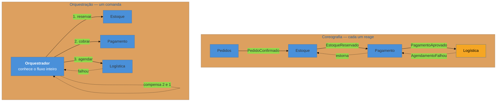

# Saga

> [!abstract] TL;DR
> Um processo de negócio atravessa três serviços, cada um com seu próprio banco. Não há transação distribuída viável — então não existe "desfazer tudo". A **Saga** troca atomicidade por **sequência de transações locais**, cada uma com uma **compensação** que anula seu efeito quando um passo posterior falha. Duas formas de conduzir: **coreografia** (cada serviço reage a eventos; nenhum ponto central, e nenhum lugar onde o fluxo esteja escrito) e **orquestração** (um coordenador comanda; fluxo explícito, ao custo de um componente que sabe demais). A escolha é de acoplamento — e o erro mais caro não é escolher errado, é supor que **toda** compensação existe.

> [!info] O recorte desta nota
> Aqui a Saga como **decisão de acoplamento**: coreografia × orquestração, e o que cada uma amarra. O exemplo trabalhado ponta a ponta e a discussão de **isolamento** (o que a Saga não garante e como conviver com leituras sujas) estão em [[03-Dominios/Engenharia/Comunicação entre Sistemas/4 - Comunicação assíncrona/04 - Outbox e Saga|Comunicação 4-04]].

## O terceiro passo falhou e os dois primeiros já aconteceram

Confirmar um pedido envolve três serviços: reservar o estoque, cobrar o cartão, agendar a entrega. Cada um tem seu banco.

Os dois primeiros passam. O terceiro falha — a transportadora não atende aquele CEP.

Num monólito com um banco só, isso seria um `ROLLBACK` e ninguém saberia. Aqui, o estoque **está** reservado e o cartão **está** cobrado, cada um confirmado na sua transação local, e não existe autoridade capaz de desfazer as duas. A pergunta deixa de ser técnica e vira de negócio: *o que fazer com uma cobrança que já ocorreu?*

A resposta da Saga é honesta e desconfortável: **não se desfaz — compensa-se.** Emite-se um estorno e libera-se a reserva. O sistema não volta ao estado anterior; ele avança para um estado que anula o efeito comercial. E há um intervalo, de segundos a minutos, em que o cliente teve dinheiro debitado por um pedido que não vai existir.

## As duas formas de conduzir

**Coreografia.** Cada serviço escuta eventos e reage. Não há coordenador; o fluxo é emergente. É simples com três passos e vira ilegível com sete — e repare no lado esquerdo do diagrama: para compensar, o serviço de logística precisa emitir um evento que **alguém** vai tratar, o que significa que os serviços passam a conhecer, ainda que indiretamente, o lugar deles na sequência. O desacoplamento aparente esconde um acoplamento distribuído em muitas cabeças.

**Orquestração.** Um componente conhece o fluxo, chama cada passo e decide a compensação. Ganha-se visibilidade — existe **um lugar** que responde "onde está o pedido 4471 e o que falta?" — e paga-se com um componente que concentra conhecimento do processo, e cuja tentação natural é acumular regra de negócio dos outros.

| | **Coreografia** | **Orquestração** |
| --- | --- | --- |
| Fluxo escrito em | lugar nenhum (emergente) | um lugar |
| Acrescentar um passo | mexer em ≥2 serviços | mexer no coordenador |
| "Onde está o pedido X?" | difícil — varrer logs | consulta ao coordenador |
| Ponto único de falha | não | o coordenador (se não for durável) |
| Acoplamento | distribuído e implícito | concentrado e explícito |
| Escala confortável | até ~3-4 passos | qualquer número |

A regra prática: **coreografia para fluxos curtos e estáveis; orquestração assim que o processo tiver valor de negócio próprio** — ou seja, quando alguém quiser perguntar em que pé ele está. E vale dizer que a divisão não é religiosa: é comum orquestrar o fluxo principal e usar eventos para efeitos periféricos.

> [!question]- Por que não usar 2PC e evitar tudo isso?
> Porque o custo é proibitivo na escala em que a Saga é necessária. O commit em duas fases mantém recursos **travados** nos participantes enquanto o coordenador coleta votos — e uma saga dura segundos, minutos ou dias (esperar aprovação de crédito, esperar o parceiro responder). Travar linhas de estoque durante uma espera humana é inviável. Além disso, a falha do coordenador deixa participantes em dúvida, bloqueados. A Saga aceita **abrir mão do isolamento** para não travar nada — e é por isso que o problema de leituras sujas, tratado em Comunicação 4-04, existe.

## O que ela acopla

**Coreografia acopla por conhecimento implícito.** Nenhum serviço declara depender de outro, mas cada um precisa saber **qual evento significa a sua vez** e **qual evento sinaliza que deve compensar**. Esse conhecimento não está escrito em lugar nenhum, o que o torna barato de criar e caríssimo de mudar: alterar a ordem dos passos exige coordenar equipes que não sabem que fazem parte da mesma sequência.

**Orquestração acopla por dependência declarada.** O coordenador conhece todos os passos, e essa dependência é visível — o que é uma virtude, porque dependência visível pode ser gerenciada. O risco é de **erosão**: o coordenador começa sabendo a ordem e termina sabendo as regras, momento em que os serviços viram scripts sem domínio próprio.

**As duas acoplam ao fato de a compensação existir.** Este é o acoplamento que ninguém desenha e que causa os piores incidentes. A Saga pressupõe que cada passo tem inverso comercial. Estorno tem. Liberar reserva tem. **E-mail enviado ao cliente não tem.** SMS não tem. Documento fiscal emitido tem, mas com regras próprias e prazos. Relatório enviado ao regulador, não.

Daí a regra de projeto mais importante desta nota: **ordene os passos do mais reversível para o menos**, e coloque o irreversível **por último** ou fora da saga. Um passo irreversível no meio transforma qualquer falha posterior num problema que o software não resolve.

## Armadilhas comuns

> [!warning] Compensação que não compensa
> **O que acontece:** a saga "compensa" enviando um segundo e-mail de desculpas depois do e-mail de confirmação; ou tenta estornar uma cobrança já repassada. O sistema se declara consistente, e o cliente viveu o efeito. **Por quê:** modelou-se compensação como se todo efeito fosse reversível, porque no banco de dados ele é. **Como evitar:** classifique cada passo — reversível, compensável com custo, **irreversível** — e projete a ordem em função disso. O irreversível vai por último, ou sai da saga e vira consequência do sucesso.

> [!warning] Saga sem timeout
> **O que acontece:** um serviço não responde e a saga fica pendente para sempre. O estoque segue reservado, o pedido nem confirma nem cancela, e a descoberta vem por chamado de cliente semanas depois. **Por quê:** o caminho feliz e o de falha explícita são implementados; **a ausência de resposta** não é uma falha visível — é silêncio, e silêncio não dispara nada. **Como evitar:** todo passo com prazo e ação de expiração. Uma saga precisa de um **relógio**: alguém varrendo instâncias paradas há tempo demais. Sem isso, ela só funciona quando tudo funciona.

> [!warning] Coreografia que cresceu além da conta
> **O que acontece:** o que eram três passos virou sete, com ramificações. Ninguém consegue desenhar o fluxo, mudanças quebram caminhos que ninguém sabia existir, e depurar exige reconstituir a sequência a partir de logs de cinco serviços. **Por quê:** cada passo novo foi acrescentado por um time, localmente, sem que ninguém decidisse "agora o processo é complexo demais para ser emergente". **Como evitar:** trate a passagem para orquestração como uma **migração planejada**, não como derrota. O sinal para migrar é quando alguém do negócio pergunta "em que etapa está?" — pergunta que a coreografia não sabe responder. E aí o coordenador tem nome: [[08 - Process Manager|Process Manager]].

## Como explicar em inglês

> "A saga handles a business transaction that spans services, where there's no distributed transaction to roll back. Instead you get a sequence of local transactions, each with a compensating action that undoes its effect if a later step fails. So it's not a rollback — you don't return to the previous state, you move forward into a state that cancels the commercial effect, and there's a window where the customer was genuinely charged for an order that won't exist. Two ways to run it: choreography, where each service reacts to events and nobody owns the flow, and orchestration, where a coordinator drives it. Choreography is fine for three steps and unreadable at seven. The mistake that actually hurts isn't picking wrong — it's assuming every step is compensable. A refund is; an email that's already been sent isn't. So you order steps from most reversible to least, and irreversible ones go last or outside the saga."

| PT | EN |
| --- | --- |
| transação de negócio | business transaction |
| compensação | compensating transaction |
| coreografia | choreography |
| orquestração | orchestration |
| passo irreversível | irreversible step |
| leitura suja | dirty read |
| expiração / prazo | timeout |

## O que vem a seguir

Isso fecha o bloco **Adepto**. A última armadilha aponta para o próximo padrão: quando a coreografia deixa de dar conta, o coordenador que a substitui não é um detalhe de implementação — é um padrão com nome, estado próprio e requisitos de durabilidade.

- [[08 - Process Manager]] — o orquestrador explícito e stateful; abre o bloco Magus.
- [[09 - Event Sourcing]] — quando o log de eventos vira a fonte da verdade.
- [[06 - Idempotent Consumer (Inbox)]] — pré-requisito: cada passo da saga pode ser reentregue.

## Veja também

- [[03-Dominios/Engenharia/Comunicação entre Sistemas/4 - Comunicação assíncrona/04 - Outbox e Saga|Outbox e Saga (Comunicação)]] — o exemplo trabalhado e a discussão de isolamento.
- [[03-Dominios/Engenharia/Design de Software/Padrões de Projeto/Aplicação Corporativa/09 - Optimistic × Pessimistic Offline Lock|Offline Locks]] — o mesmo problema (transação longa demais para o banco) numa escala menor.
- [[03-Dominios/Engenharia/Design de Software/Padrões de Projeto/Acesso a Dados/14 - Modelagem por agregado e single-table design|Modelagem por agregado]] — a fronteira dentro da qual ainda há transação de verdade.

## Fontes

- **Garcia-Molina & Salem** — *Sagas* (1987) — o artigo original, sobre transações longas e compensação.
- **Chris Richardson** — [*Saga pattern*](https://microservices.io/patterns/data/saga.html) — coreografia × orquestração e o problema de isolamento.
- **Chris Richardson** — *Microservices Patterns* (2018), cap. 4 — o tratamento mais completo, com contramedidas para a falta de isolamento.
- **Hector Garcia-Molina** — o conceito de *compensating transaction*, base de todo o padrão.
