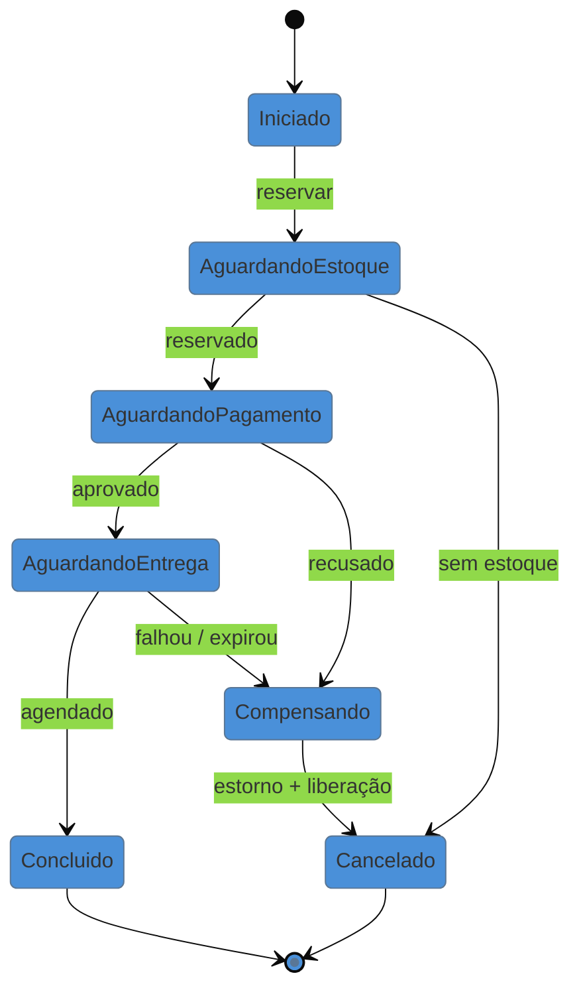

# Process Manager

> [!abstract] TL;DR
> Quando a saga vira orquestrada, o coordenador não é um detalhe de implementação: é um padrão com
> nome. O **Process Manager** mantém o **estado de cada instância** do processo — onde ela está, o que
> já respondeu, o que falta, desde quando espera —, decide o próximo passo e trata **expiração**. É a
> diferença entre um roteador *stateless* (que olha uma mensagem e decide para onde mandar) e algo que
> lembra da conversa. É também o [[03-Dominios/Engenharia/Design de Software/Padrões de Projeto/Aplicação Corporativa/04 - Application Controller|Application Controller]]
> da família anterior — a mesma máquina de estados, agora **distribuída e durável**, que é exatamente o
> que a versão de 2002 não conseguia ser.

## "Em que pé está o pedido 4471?"

A pergunta vem do atendimento, e é razoável. O cliente ligou querendo saber.

Num sistema coreografado, ela não tem resposta direta. O pedido foi confirmado, o estoque emitiu um evento, o pagamento emitiu outro — ou não emitiu, e ninguém sabe se está processando, se falhou em silêncio ou se a mensagem se perdeu. Para responder, alguém abre os logs de quatro serviços, filtra por id de correlação, monta a linha do tempo à mão e conclui, com alguma confiança, que o processo travou esperando a transportadora.

O que falta não é log nem observabilidade. É que **o processo não existe como coisa** em lugar nenhum do sistema. Ele é uma sequência que aconteceu, não uma entidade que se possa consultar. E processos de negócio — contratação, sinistro, onboarding, devolução — costumam ser exatamente aquilo sobre o que o negócio quer perguntar.

## A ideia: o processo como entidade com estado

O Process Manager cria essa entidade. Para cada instância — cada pedido, cada sinistro — existe um registro que guarda:

- **em que passo está** e como chegou até ali;
- **o que já foi respondido** por quem (inclusive respostas que chegaram fora de ordem);
- **o que está pendente** e **desde quando** — a base para expiração;
- **o que fazer** quando cada resposta chegar, quando o prazo estourar, ou quando um passo falhar.

Cada instância é um ponto nesse grafo, e o grafo está escrito **num lugar**. É isso que devolve a resposta ao atendimento — e que torna possível medir o processo (quanto tempo em cada estado, onde ele mais trava), coisa que a coreografia não permite sem instrumentação heroica.

> [!question]- Isso não é a mesma coisa que a saga orquestrada da nota anterior?
> É o mesmo componente, visto de dois ângulos — e vale separar os termos porque eles não são sinônimos. **Saga** nomeia o *problema*: a transação de negócio distribuída e suas compensações. **Process Manager** nomeia o *componente* que conduz um processo de várias etapas, com estado próprio. Toda saga orquestrada tem um Process Manager no comando; mas nem todo Process Manager coordena uma saga — muitos conduzem processos que não têm compensação nenhuma, só etapas, esperas e prazos (um onboarding, uma aprovação em níveis). Hohpe & Woolf catalogaram o componente; Garcia-Molina nomeou o problema.

## Stateful é o ponto — e a durabilidade é o requisito

A distinção que o padrão carrega é contra o **roteador sem estado**: um Content-Based Router olha uma mensagem, decide o destino e esquece. O Process Manager **lembra** — e é isso que permite tratar a categoria de evento que a coreografia não enxerga: **a coisa que não aconteceu**. Uma resposta que nunca chegou não gera mensagem nenhuma; só quem mantém "estou esperando desde as 14h05" pode reagir a esse silêncio.

Daí decorre o requisito operacional: **o estado precisa ser durável**. Um Process Manager em memória perde todas as instâncias em curso no primeiro *deploy* — e processos de negócio duram horas ou dias, então há sempre instâncias em curso. É exatamente aqui que a versão moderna se separa da de 2002: hoje o padrão raramente é escrito à mão, porque existem motores que resolvem a persistência, o relógio e a retomada:

| Ferramenta | O que oferece |
| --- | --- |
| **AWS Step Functions** | máquina de estados declarativa, gerenciada, com timeout e retry por passo |
| **Azure Durable Functions** | orquestração em código, com estado persistido de forma transparente |
| **Temporal** | *workflows* duráveis em código comum, sobrevivendo a falha e *deploy* |
| **Camunda / Zeebe** | BPMN — o processo desenhado como artefato do negócio |

A escolha entre "processo em código" e "processo declarativo" costuma ser a decisão prática. Código é mais expressivo e mais fácil de testar; declarativo é legível para quem não programa — e, num domínio em que o processo **é** o produto (seguros, crédito, saúde), essa legibilidade pode valer mais que a expressividade.

## O que ele acopla

**Concentra o acoplamento — e isso é a proposta, não um efeito colateral.** O Process Manager conhece os passos, a ordem e as compensações. Os serviços participantes, idealmente, não sabem que fazem parte de um processo: eles expõem operações e são chamados. Compare com a coreografia, onde o mesmo conhecimento existe, só que **espalhado e implícito** em cada serviço. Dependência concentrada e visível é gerenciável; distribuída e implícita, não.

**Acopla ao vocabulário dos passos.** Ele precisa saber que existe "reservar estoque" e o que significa falhar. Mudar a semântica de um passo exige mexer no coordenador — o que é honesto: se a semântica mudou, alguém tinha mesmo que ser avisado.

**Não deve acoplar às regras internas dos serviços.** É a linha que separa um coordenador saudável de um God orchestrator, e ela é frágil, porque o coordenador é o único lugar que vê o processo inteiro — o que faz toda regra "que depende de mais de um passo" parecer que cabe ali. O teste: ele decide **a ordem e o que fazer diante de cada resultado**; não decide *se o crédito é aprovado*.

## Armadilhas comuns

> [!warning] Process manager que absorve as regras dos serviços
> **O que acontece:** o coordenador começa sabendo a ordem e termina calculando limite de crédito e regra de frete. Os serviços viram CRUDs sem domínio, e o coordenador vira o arquivo que todo mundo edita.
> **Por quê:** ele enxerga tudo, então toda regra que cruza passos parece pertencer a ele. Cada adição isolada é defensável; a soma esvazia os serviços.
> **Como evitar:** ele coordena **fluxo**, não **mérito**. Se a regra responde "isto é permitido/quanto custa", é do serviço; se responde "o que vem agora / o que fazer se falhar", é dele.

> [!warning] Estado do processo sem durabilidade
> **O que acontece:** um *deploy* de rotina apaga trezentas instâncias em andamento. Pedidos ficam pagos e nunca entregues — e não há como listá-los, porque a lista morreu junto.
> **Por quê:** em desenvolvimento, os processos duram segundos e cabem na memória. A falha só aparece com duração e volume reais.
> **Como evitar:** persista o estado da instância a cada transição, ou use um motor durável. E garanta que exista uma **consulta** por instâncias em curso — sem ela, você não sabe o que perdeu.

> [!warning] Processo sem relógio
> **O que acontece:** um serviço não responde e a instância fica pendente para sempre. Como não há erro, nada alerta; a descoberta vem semanas depois, por reclamação.
> **Por quê:** implementa-se a reação a mensagens que chegam. A **ausência** de mensagem não é um evento — é silêncio, e silêncio não dispara nada por conta própria.
> **Como evitar:** prazo em todo passo que espera resposta, com ação definida na expiração (retentar, compensar, escalar para humano). Um Process Manager sem relógio só funciona quando tudo funciona — que é justamente quando ele não seria necessário.

## Como explicar em inglês

> "A Process Manager is the component that runs a multi-step process and keeps state for each instance — where it is, what's already answered, what's outstanding and since when. That statefulness is the whole point, because it's what lets you react to the thing that didn't happen: a response that never arrives produces no message, so only something holding 'I've been waiting since 14:05' can act on that silence. It's the same idea as an Application Controller, but distributed and durable — which is what the 2002 version couldn't be, since the state lived in a session and died with it. Today you rarely hand-roll it; Step Functions, Durable Functions and Temporal give you the persistence and the clock. And the reason to prefer it over choreography once a process matters is simple: someone from the business will eventually ask what stage an order is at, and choreography has no answer."

| PT | EN |
| --- | --- |
| gerenciador de processo | process manager |
| instância do processo | process instance |
| estado durável | durable state |
| expiração | timeout |
| escalar para humano | escalate to a human |
| orquestração | orchestration |
| retomada após falha | resumption / recovery |

## O que vem a seguir

Até aqui os eventos **notificam** ou **transferem estado**, e o estado atual vive em tabelas. O próximo padrão inverte isso: os eventos passam a **ser** a verdade, e o estado vira um cálculo sobre eles.

- [[09 - Event Sourcing]] — o log como fonte da verdade.
- [[10 - CQRS]] — separar leitura de escrita; **fecha a família**.
- [[07 - Saga]] — o problema que este componente coordena quando há compensação.

## Veja também

- [[03-Dominios/Engenharia/Design de Software/Padrões de Projeto/Aplicação Corporativa/04 - Application Controller|Application Controller]] — a mesma máquina de estados, in-process e não durável.
- [[03-Dominios/Engenharia/Design de Software/Padrões de Projeto/Integração Empresarial (EIP)/05 - Content-Based Router + Message Filter|Content-Based Router]] — o roteador sem estado, contra o qual este padrão se define.
- [[03-Dominios/Engenharia/Design de Software/Padrões de Projeto/Integração Empresarial (EIP)/06 - Splitter + Aggregator|Splitter + Aggregator]] — o Aggregator é o outro padrão stateful do vocabulário EIP.

## Fontes

- **Hohpe & Woolf** — *Enterprise Integration Patterns* (2004), Process Manager — a formulação canônica, e a distinção contra roteadores sem estado.
- **Chris Richardson** — [*Saga pattern — orchestration*](https://microservices.io/patterns/data/saga.html) — o orquestrador como Process Manager.
- **Bernd Rücker** — *Practical Process Automation* (2021) — motores de workflow modernos e a decisão entre processo em código e declarativo.
