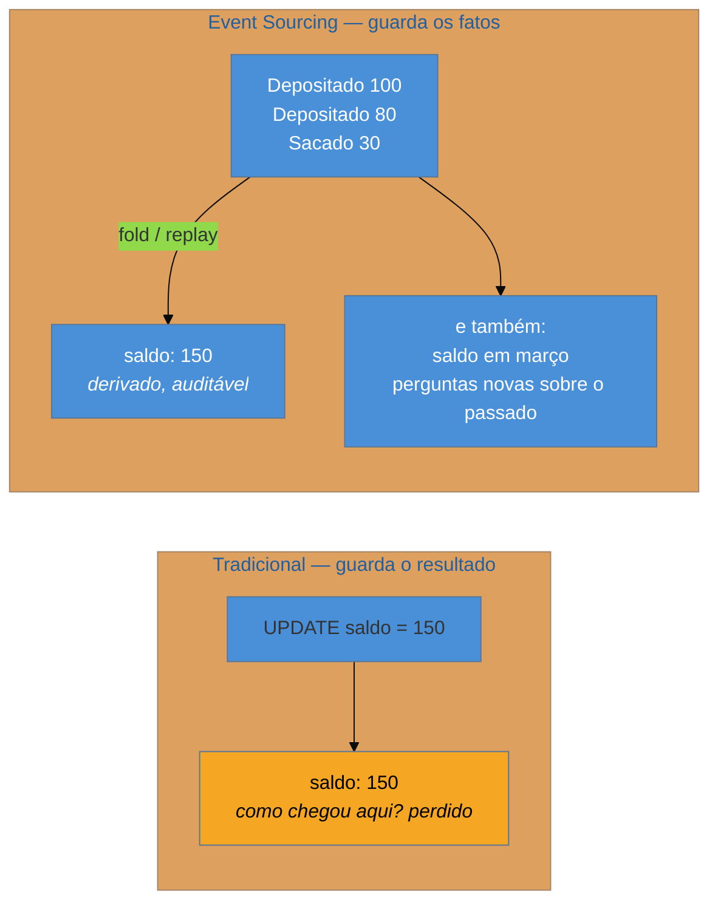

# Event Sourcing

> [!abstract] TL;DR
> Em vez de guardar o **estado atual** e sobrescrevê-lo a cada mudança, guarde a **sequência de fatos** que produziram esse estado — e derive o estado dos fatos, sempre. O saldo deixa de ser uma coluna e passa a ser a soma dos lançamentos. Você ganha auditoria completa de graça, a capacidade de responder "como estava em março?" e, o que é mais valioso, a de **fazer perguntas novas sobre o passado**. Paga em complexidade de leitura, em evolução de esquema de eventos que nunca podem ser reescritos, e numa tensão real com o direito ao esquecimento. É o padrão mais mal-aplicado desta família: quase sempre pertence a **um agregado**, nunca ao sistema inteiro.

> [!info] O recorte desta nota
> Aqui o Event Sourcing como **decisão de design**: o que ele acopla, quando vale e quando não. Escala, *snapshots*, volume de armazenamento e replay em produção estão em [[03-Dominios/Engenharia/Arquitetura/System Design/3 - Padrões recorrentes/03 - Event Sourcing sob a ótica de system design|System Design 3-03]].

## A pergunta que o banco não consegue responder

O time de produto quer saber quantos clientes colocaram um item no carrinho, removeram, e voltaram a colocar dentro de sete dias.

Você abre o banco e a tabela `carrinho_item` tem as linhas atuais. Um item removido **não está lá** — o `DELETE` apagou a informação. Não há como responder à pergunta, nem aproximadamente, e a resposta ao produto é a que todo mundo já deu: "dá para instrumentar e responder daqui a três meses, com dados de aqui pra frente".

Essa cena expõe o que o modelo tradicional de persistência faz: ele guarda **o resultado** e joga fora **o caminho**. Cada `UPDATE` destrói a informação anterior, e cada `DELETE` destrói o fato de ter existido. É uma escolha de projeto tão default que raramente se apresenta como escolha — e ela decide, silenciosamente, quais perguntas o negócio poderá fazer no futuro.

O contador do banco já resolveu isso há séculos: você não apaga um lançamento errado, você lança um estorno. O extrato é o log; o saldo é derivado.

## A ideia: o estado é uma função dos eventos

Os eventos são **append-only** e imutáveis. O estado atual é o resultado de aplicá-los em ordem — na prática, com *snapshots* periódicos para não reprocessar tudo sempre, o que é detalhe de desempenho, não de conceito.

O ganho que mais importa não é a auditoria, embora ela venha junto e seja valiosa em domínios regulados. É a **capacidade de fazer perguntas que ainda não foram formuladas**. Como os fatos brutos foram preservados, uma pergunta nova sobre o passado é uma projeção nova sobre dados que já existem — e a resposta de "três meses" da cena inicial vira "amanhã".

> [!question]- Isso não é a mesma coisa que uma tabela de auditoria?
> Não, e a distinção é a que mais separa quem entendeu o padrão de quem só ouviu falar. Numa tabela de auditoria, o **estado atual é a verdade** e o log é um registro paralelo, mantido por gatilho ou interceptador — se os dois divergirem, o estado ganha, e o log é frequentemente incompleto porque nunca foi crítico. No Event Sourcing, **o log é a verdade** e o estado é derivado: divergência é impossível por construção, porque o estado não tem existência independente. Consequência prática: em auditoria, um `UPDATE` direto no banco corrige o estado e deixa o log mentindo. Aqui, não existe `UPDATE` a fazer.

## O que ele acopla

**Desacopla o estado atual do histórico** — e essa é a inversão que dá nome ao padrão. Em troca, cria acoplamentos novos e duradouros.

**Acopla ao esquema dos eventos passados, para sempre.** Este é o custo que se subestima. Um evento gravado em 2021 será lido em 2029 pelo código de 2029. Você não pode reescrevê-lo — a imutabilidade é o alicerce do padrão. Logo, o código precisa saber interpretar **todas** as versões que já existiram, o que na prática significa uma estratégia de *upcasting* (traduzir eventos antigos para o formato atual no momento da leitura) mantida indefinidamente. Sistemas maduros com Event Sourcing acumulam essa camada, e ela não desaparece nunca.

**Acopla o modelo à granularidade do agregado.** Reconstruir estado por replay só é viável dentro de uma fronteira pequena — o agregado. Isso torna a modelagem de agregados **obrigatória e crítica**, não uma boa prática opcional: errar a fronteira aqui custa muito mais caro que num sistema tradicional.

**Acopla a leitura a projeções.** O log serve mal à consulta: ninguém quer reprocessar eventos para montar uma listagem. Isso empurra naturalmente para modelos de leitura separados — que é o assunto da próxima nota, e a razão pela qual os dois padrões são tão confundidos.

**Tensão com o direito ao esquecimento.** Um log imutável e uma exigência legal de apagar dados pessoais são requisitos que colidem de frente. As saídas conhecidas — *crypto-shredding* (guardar o dado pessoal cifrado e destruir a chave, tornando-o irrecuperável sem alterar o log) ou manter dados pessoais fora dos eventos, referenciados por id — funcionam, mas precisam ser decididas **antes**, não depois do primeiro pedido de exclusão. Reconhecer essa tensão cedo é parte de escolher o padrão com responsabilidade.

## Quando vale — e quando não

| Sinal | Event Sourcing? |
| --- | --- |
| Domínio em que o **histórico é o produto** (contábil, financeiro, saúde, jurídico) | **Sim** — o log é o que o negócio já queria |
| Auditoria regulatória sobre *como* se chegou ao estado | **Sim** |
| O negócio faz perguntas retroativas com frequência | **Sim** |
| CRUD de cadastro, configuração, catálogo | **Não** — pura complexidade adicional |
| Time sem experiência prévia com o padrão | **Cuidado** — o custo de aprendizado é real e o erro é caro de reverter |
| "Para ter auditoria" | **Provavelmente não** — uma tabela de auditoria resolve com uma fração do custo |

A regra que evita a maioria dos desastres: **aplique a um agregado, não ao sistema**. É perfeitamente normal — e recomendável — que a conta corrente seja *event-sourced* e o cadastro de clientes seja um CRUD comum, no mesmo sistema.

## Armadilhas comuns

> [!warning] Aplicar ao sistema inteiro
> **O que acontece:** todo agregado vira *event-sourced*, inclusive cadastros triviais. A produtividade despenca, consultas simples exigem projeções, e o time passa a lutar com o padrão em todo lugar onde ele não era necessário. **Por quê:** ele é apresentado como estilo arquitetural, e adotar pela metade parece incoerente. Não é: é adoção **onde há motivo**. **Como evitar:** escolha por agregado, com a pergunta concreta — *o histórico deste conceito tem valor de negócio?* Para conta corrente, sim; para preferência de notificação, não.

> [!warning] Eventos sem estratégia de versão
> **O que acontece:** um ano depois, o formato precisa mudar. Como os eventos antigos não podem ser reescritos, o código de leitura enche de condicionais por versão, e cada nova mudança piora — até que ninguém tem coragem de mexer. **Por quê:** o esquema do evento parece um detalhe interno na primeira semana. Ele é, na verdade, um **contrato com o futuro** — mais rígido que uma API, porque a API você descontinua e o evento de 2021 estará lá em 2029. **Como evitar:** versione desde o primeiro evento, e concentre a tradução numa camada explícita de *upcasting* em vez de espalhar `if` pelos aplicadores.

> [!warning] Confundir com log de auditoria
> **O que acontece:** o time diz que "faz event sourcing" mas mantém o estado atual como verdade e o log ao lado. Alguém corrige um dado com `UPDATE`, o log e o estado divergem, e a auditoria — que era o motivo de tudo — passa a mentir. **Por quê:** o log ao lado é muito mais barato e parece dar o mesmo benefício. **Como evitar:** teste decisivo — **é possível apagar o estado atual e reconstruí-lo inteiro a partir dos eventos?** Se não, é log de auditoria, e chamá-lo de Event Sourcing só cria expectativa falsa sobre garantias que não existem.

## Como explicar em inglês

> "Instead of storing current state and overwriting it, you store the sequence of facts that produced it, and derive state by replaying them — the balance isn't a column, it's the sum of the entries. The obvious benefit is a complete audit trail, but the more valuable one is being able to answer questions nobody had thought of yet: because you kept the raw facts, a new question about the past is a new projection over data you already have, rather than three months of waiting for instrumentation. The costs are real though. Events are immutable, so the schema is a contract with the future — code in 2029 still has to read events written in 2021, which means an upcasting layer you maintain forever. And an immutable log sits badly with the right to erasure, so crypto-shredding or keeping personal data out of events has to be decided up front. The mistake I'd flag in a review is applying it to the whole system: it belongs to an aggregate whose history is genuinely part of the business."

| PT | EN |
| --- | --- |
| fonte da verdade | source of truth |
| somente acréscimo | append-only |
| reprocessar / reconstruir | replay / rebuild |
| retrato / instantâneo | snapshot |
| tradução de eventos antigos | upcasting |
| trilha de auditoria | audit trail |
| destruição de chave | crypto-shredding |

## O que vem a seguir

O log é excelente para registrar e péssimo para consultar — ninguém quer reprocessar eventos para montar uma listagem. A saída é manter modelos de leitura separados, alimentados pelos eventos. Esse é o quarto estilo de Fowler, e ele **fecha a família**.

- [[10 - CQRS]] — separar escrita de leitura; o mapa-de-escolha e a síntese da família.
- [[08 - Process Manager]] — o coordenador stateful, que frequentemente convive com Event Sourcing.
- [[02 - Domain Events]] — o evento como elemento do modelo, que aqui vira o próprio armazenamento.

## Veja também

- [[03-Dominios/Engenharia/Arquitetura/System Design/3 - Padrões recorrentes/03 - Event Sourcing sob a ótica de system design|Event Sourcing em escala]] — snapshots, volume e replay em produção.
- [[03-Dominios/Engenharia/Design de Software/Padrões de Projeto/Acesso a Dados/14 - Modelagem por agregado e single-table design|Modelagem por agregado]] — a fronteira dentro da qual o replay é viável.
- [[03-Dominios/Ciência/Sistemas Operacionais/12 - Journaling, consistência e durabilidade|Journaling, consistência e durabilidade]] — a mesma ideia de log-como-verdade, um nível abaixo.

## Fontes

- **Martin Fowler** — [*Event Sourcing*](https://martinfowler.com/eaaDev/EventSourcing.html) — a formulação do padrão e a analogia contábil.
- **Martin Fowler** — [*What do you mean by "Event-Driven"?*](https://martinfowler.com/articles/201701-event-driven.html) — Event Sourcing como terceiro estilo, com a ressalva sobre adoção indiscriminada.
- **Greg Young** — palestras e escritos sobre Event Sourcing e versionamento de eventos — a referência sobre *upcasting* e evolução de esquema.
- **Chris Richardson** — [*Event sourcing pattern*](https://microservices.io/patterns/data/event-sourcing.html) — a versão de microsserviços, com projeções e event store.
