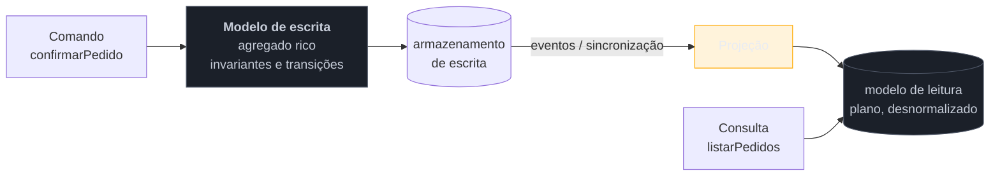

# CQRS

> [!abstract] TL;DR
> **Separar o modelo de escrita do modelo de leitura** — dois modelos para os mesmos dados, cada um desenhado para o que faz. Nasce de um desconforto real: o modelo que garante invariantes na escrita costuma ser péssimo para consultar, e o que serve bem à tela costuma ser plano e desnormalizado. Casa naturalmente com Event Sourcing (as projeções **são** o lado de leitura), o que fez muita gente tratar os dois como um pacote — não são. E é o padrão sobre o qual seus próprios autores mais escreveram advertências: **é cirúrgico, não estrutural**. Aplicado ao sistema inteiro, é o erro que Greg Young passou anos tentando desfazer. Esta nota **fecha a família**.

> [!info] O recorte desta nota
> Aqui o CQRS como **decisão de acoplamento** e critério de aplicação. Separação de cargas, réplicas de leitura e números estão em [[03-Dominios/Engenharia/Arquitetura/System Design/3 - Padrões recorrentes/02 - CQRS sob a ótica de system design|System Design 3-02]].

## Um modelo servindo a dois senhores

O agregado `Pedido` está bem modelado para escrita: encapsula invariantes, valida transições, protege a consistência entre cabeçalho e itens. Exatamente o que se quer de um domínio rico.

Aí chega a tela de acompanhamento. Ela precisa listar pedidos com nome do cliente, cidade de entrega, transportadora, status do pagamento e prazo — dados que vivem em cinco agregados diferentes. As opções são todas ruins: um `JOIN` de cinco tabelas que ignora o domínio, ou carregar cinco agregados por linha da listagem e montar em memória, o que é lento e absurdo.

A resposta comum é contaminar o modelo: acrescentam-se campos desnormalizados ao agregado "porque a tela precisa", métodos de consulta que retornam projeções, e o domínio começa a carregar decisões que são de apresentação. Seis meses depois, ninguém sabe mais quais campos existem por regra de negócio e quais existem porque uma tela precisou.

**O diagnóstico do CQRS é que o problema não é o modelo — é achar que um modelo só deveria servir aos dois usos.**

## A ideia: dois modelos

A distinção de fundo é entre **comando** (muda estado, não devolve dados) e **consulta** (devolve dados, não muda estado) — a separação command-query de Meyer, elevada de método para **modelo**.

O âmbar é onde mora o custo real: a sincronização. Assim que os dois lados existem, há uma janela em que o modelo de leitura ainda não reflete a escrita — **consistência eventual dentro do seu próprio sistema**. E é dela que nasce a armadilha mais frequente do padrão.

> [!question]- CQRS exige Event Sourcing? E bancos separados?
> Nenhum dos dois, e essa confusão é a fonte de metade das más adoções. CQRS é sobre **dois modelos**; onde eles são armazenados é decisão independente. As variantes vão de muito modestas a muito ambiciosas: (1) mesmo banco, mesmas tabelas, apenas **classes** diferentes para leitura e escrita — sem sincronização e sem consistência eventual; (2) mesmo banco, com *views* ou tabelas desnormalizadas de leitura; (3) armazenamentos separados, sincronizados por eventos; (4) Event Sourcing na escrita, com projeções na leitura. **A maior parte do benefício está no nível 1 ou 2**, e é onde a maioria dos sistemas deveria parar. A associação com Event Sourcing é histórica — os dois foram popularizados juntos — e não é uma dependência.

## O que ele acopla

**Desacopla os dois usos.** O modelo de escrita fica livre para ser rico e normalizado; o de leitura, plano e feito sob medida por tela. Nenhum dos dois precisa se comprometer pelo outro, e é possível ter **vários** modelos de leitura sobre a mesma escrita — um por consumidor, cada um com seu formato.

**Acopla ao mecanismo de sincronização.** A partir do nível 3, existe um pipeline que precisa ser monitorado. Se a projeção parar, o sistema continua **aceitando escritas** e servindo leituras cada vez mais velhas, sem erro em lugar nenhum. Isso torna o *lag* de projeção uma métrica de primeira classe — e é a diferença entre um CQRS operado e um CQRS que um dia dá um susto.

**Acopla a interface à consistência eventual.** Este é o acoplamento que surpreende, porque ele é de **produto**, não técnico. O usuário salva e é redirecionado para a listagem; a projeção ainda não atualizou; ele não vê a própria alteração e conclui que o sistema perdeu o dado. Nenhuma explicação técnica resolve isso — a UI precisa ser projetada para a defasagem (confirmação otimista, ler a própria escrita do lado de escrita, indicar processamento).

**Não acopla ao Event Sourcing** — vale repetir, porque a suposição contrária leva times a adotar dois padrões complexos quando precisavam de um simples.

## Armadilhas comuns

> [!warning] CQRS no sistema inteiro
> **O que acontece:** cada caso de uso ganha comando, manipulador, modelo de leitura e projeção. Um CRUD de cadastro passa a exigir seis arquivos, e a produtividade cai sem contrapartida. **Por quê:** o padrão é apresentado como estilo arquitetural, e aplicá-lo em parte parece incoerência. É o contrário: **coerência aqui é aplicar onde há assimetria**. **Como evitar:** aplique onde os dois usos **divergem de verdade** — leitura e escrita com formatos ou cargas muito diferentes. Onde a tela é o espelho do agregado, um modelo só é a resposta certa. É o que os próprios autores do padrão passaram anos repetindo.

> [!warning] Consistência eventual não comunicada à interface
> **O que acontece:** o usuário salva, é redirecionado, não vê a alteração e salva de novo. Duplicatas, chamados de suporte, e a percepção de que o sistema é instável. **Por quê:** a defasagem é tratada como detalhe interno de infraestrutura, e a interface é construída como se a escrita fosse imediatamente visível. **Como evitar:** decida explicitamente a estratégia — ler a própria escrita direto do lado de escrita, atualização otimista na tela, ou sinalizar processamento. A defasagem é do **produto**, não só da arquitetura.

> [!warning] Dois modelos mantidos à mão
> **O que acontece:** alguém "atualiza os dois lados" no código do comando. Um caminho novo esquece de atualizar a leitura, e os modelos divergem em silêncio — sem erro, sem alerta, descoberto por reclamação. **Por quê:** parece mais simples que montar uma projeção, e funciona nos dois primeiros casos de uso. **Como evitar:** o lado de leitura deve ser **derivado**, nunca escrito à mão — por eventos, CDC ou *view*. E precisa ser **reconstruível**: se você não consegue apagar o modelo de leitura e regerá-lo, ele virou uma segunda fonte da verdade sem querer.

---

## Mapa de escolha: os 10 padrões da família

O catálogo é de consulta, e a lente é o acoplamento — então o índice útil parte do **problema que você tem**:

| Seu problema | Padrão | Nota |
| --- | --- | --- |
| não sei o que significa "somos event-driven" aqui | os quatro estilos | [[01 - Panorama da arquitetura de eventos\|01]] |
| a regra de negócio está afogada em efeitos colaterais | Domain Events | [[02 - Domain Events\|02]] |
| refatorar um campo interno quebra consumidores | separar evento de **integração** | [[02 - Domain Events\|02]] |
| quero avisar sem me comprometer com nenhum formato | Event Notification | [[03 - Event Notification\|03]] |
| meu consumidor trava quando o produtor cai | Event-Carried State Transfer | [[04 - Event-Carried State Transfer\|04]] |
| reajo a um fato mas leio um estado já diferente | versão no payload (ou ECST) | [[03 - Event Notification\|03]] · [[04 - Event-Carried State Transfer\|04]] |
| gravei no banco e o evento não saiu | Outbox | [[05 - Outbox\|05]] |
| o cliente foi cobrado duas vezes | Idempotent Consumer + chave de idempotência | [[06 - Idempotent Consumer (Inbox)\|06]] |
| o terceiro passo falhou e os dois primeiros já ocorreram | Saga | [[07 - Saga\|07]] |
| ninguém sabe em que etapa o processo está | Process Manager | [[08 - Process Manager\|08]] |
| o negócio faz perguntas sobre o passado que não posso responder | Event Sourcing | [[09 - Event Sourcing\|09]] |
| um modelo só não serve à escrita e à listagem | CQRS | esta nota |

## A síntese: o espectro do acoplamento

Fechando as dez notas, o fio que as atravessa: **desacoplamento não é uma quantidade que se aumenta — é uma escolha de qual dependência você prefere ter.** Nenhum padrão desta família elimina acoplamento; cada um o move de lugar, e o mapa dos quatro estilos é um espectro do que o evento carrega:

| Estilo | O que o evento carrega | O que você desacopla | O que passa a acoplar |
| --- | --- | --- | --- |
| **Notification** | um fato e um id | dados, formato | **disponibilidade** do produtor |
| **ECST** | o estado do fato | disponibilidade, tempo | **formato** do payload, e réplicas velhas |
| **Event Sourcing** | os fatos **são** o estado | estado atual do histórico | o **esquema dos eventos passados**, para sempre |
| **CQRS** | (não é sobre payload) | os dois usos do modelo | o **pipeline de projeção** e a consistência eventual |

Três conclusões que valem levar para uma discussão de arquitetura:

**A pergunta certa nunca é "usamos eventos?".** É *o que o evento carrega* — e ela pode ser respondida de formas diferentes para fluxos diferentes do mesmo sistema.

**Todo ganho de autonomia é pago em duplicação ou em rigidez.** O consumidor que não precisa perguntar é o consumidor que mantém uma cópia e depende do formato. Não existe a opção que não paga.

**O que se perde em todos os casos é a legibilidade do fluxo**, e essa perda precisa ser **reposta ativamente** — com rastreamento distribuído, catálogo de eventos e, quando o processo tem valor de negócio, um Process Manager que o torne consultável de novo. Arquitetura de eventos sem essa reposição não é desacoplada: é apenas difícil de entender.

## Como explicar em inglês

> "CQRS means separating the write model from the read model — two models over the same data, each designed for what it does. It comes from a real tension: a model that enforces invariants on write tends to be terrible to query, and a model that fits the screen tends to be flat and denormalised. Two things people get wrong. First, it doesn't require Event Sourcing or separate databases — the modest version is just different classes over the same tables, and that's where most systems should stop. Second, it's surgical, not structural: applied to a whole system it turns every CRUD screen into six files, which is the misuse Greg Young spent years pushing back on. The cost that bites in practice isn't technical, it's product: once the read side is asynchronous, the user saves, gets redirected, doesn't see their change, and concludes the system lost it. That has to be designed for."

| PT | EN |
| --- | --- |
| separação comando-consulta | command-query separation |
| modelo de leitura | read model |
| projeção | projection |
| defasagem da projeção | projection lag |
| ler a própria escrita | read-your-own-writes |
| reconstruível | rebuildable |
| assimetria de carga | load asymmetry |

## O que vem a seguir

Isso **fecha a família Arquitetura de Eventos** — os dez padrões, do evento magro ao log como fonte da verdade. Resta uma família no galho-pai: **Nuvem e Resiliência**, que trata dos padrões de sobrevivência quando a chamada falha, demora ou precisa ser contida.

- [[03-Dominios/Engenharia/Design de Software/Padrões de Projeto/index|Padrões de Projeto]] — o galho-pai e o mapa das seis famílias.
- [[01 - Panorama da arquitetura de eventos]] — a abertura, para reler a lente com as dez notas na cabeça.
- [[09 - Event Sourcing]] — o padrão com que este é mais confundido.

## Veja também

- [[03-Dominios/Engenharia/Arquitetura/System Design/3 - Padrões recorrentes/02 - CQRS sob a ótica de system design|CQRS em escala]] — separação de cargas e réplicas de leitura.
- [[03-Dominios/Engenharia/Design de Software/Padrões de Projeto/Acesso a Dados/15 - Polyglot persistence e materialized views|Polyglot persistence e materialized views]] — o modelo de leitura como view materializada.
- [[03-Dominios/Engenharia/Design de Software/Padrões de Projeto/Acesso a Dados/13 - Query Object|Query Object]] — a alternativa leve quando a assimetria não justifica dois modelos.

## Fontes

- **Martin Fowler** — [*CQRS*](https://martinfowler.com/bliki/CQRS.html) — a formulação e a advertência explícita contra o uso indiscriminado.
- **Greg Young** — escritos e palestras sobre CQRS — o autor do termo, e sua insistência de que o padrão é para partes específicas do sistema.
- **Bertrand Meyer** — *Object-Oriented Software Construction* — o princípio de separação comando-consulta, do qual o padrão deriva.
- **Chris Richardson** — [*CQRS pattern*](https://microservices.io/patterns/data/cqrs.html) — a versão de microsserviços, com projeções e consistência eventual.
