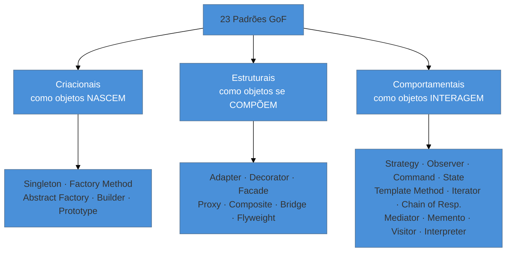

# O que são Design Patterns

> [!abstract] TL;DR
> Um **design pattern** é uma solução catalogada para um problema de projeto que se repete — e,
> antes de tudo, é **vocabulário compartilhado**. Dizer "aqui cabe um Strategy" comunica em três
> palavras o que levaria um parágrafo. Os 23 padrões clássicos vêm do *Gang of Four* (1994) e se
> dividem em três famílias: **criacionais** (como objetos nascem), **estruturais** (como se compõem)
> e **comportamentais** (como interagem). A chave para um sênior não é decorá-los: é **reconhecer**
> quando um resolve um problema real, implementá-lo de forma idiomática — e saber **quando a
> linguagem já resolveu por você**, tornando o padrão desnecessário.

## Dois desenvolvedores, o mesmo desenho

Numa code review, alguém comenta: *"esse `if-else` gigante que escolhe o algoritmo de frete tá pedindo um Strategy"*. Ninguém pede esclarecimento. Todos na sala já sabem: uma interface, implementações intercambiáveis, a escolha feita em runtime. Três palavras carregaram um desenho inteiro.

Esse é o valor central — e mais subestimado — dos design patterns: **eles são uma linguagem**. Antes de serem código, são nomes. O livro que os catalogou não inventou o Strategy nem o Observer; ele deu **nomes** a soluções que bons programadores já reinventavam há décadas, cada um com um vocabulário diferente. Ao nomear, tornou possível conversar sobre desenho de software com a mesma economia com que um médico diz "fratura exposta" em vez de descrever o osso.

> [!question]- Então padrão é uma biblioteca que eu importo?
> Não. Um padrão **não é código para copiar** nem uma classe pronta num pacote. É uma *descrição* de uma solução — a forma da solução, não a solução em si. Você não faz `import Strategy`; você **implementa** o Strategy no seu contexto, na sua linguagem. Duas implementações de Strategy podem não compartilhar uma única linha de código e ainda assim serem o mesmo padrão. O que elas compartilham é a **estrutura da ideia**.

## De onde vieram: o Gang of Four

Em 1994, quatro autores — Erich Gamma, Richard Helm, Ralph Johnson e John Vlissides, apelidados de *Gang of Four* (GoF) — publicaram *Design Patterns: Elements of Reusable Object-Oriented Software*. Eles catalogaram **23 padrões** recorrentes em software orientado a objetos, cada um com nome, problema, solução e consequências.

A ideia não nasceu na computação. Veio do arquiteto (de prédios) **Christopher Alexander**, que na década de 1970 descreveu "linguagens de padrões" para desenho urbano: cada padrão era um problema recorrente no habitar humano ("uma varanda pequena demais não é usada") mais a forma comprovada de resolvê-lo. O GoF transplantou essa noção para o código.

> [!info] Por que "1994" importa para este catálogo
> O GoF foi escrito para **C++ e Smalltalk** — linguagens de 1994, onde faltavam recursos que hoje são triviais (funções de primeira classe convenientes, coleções iteráveis nativas, *pattern matching*, injeção de dependência via framework). Guarde essa data: boa parte da nossa discussão de "quando **não** usar um padrão" nasce dela. Um padrão às vezes é só o contorno para uma lacuna da linguagem da época.

## As três famílias

O GoF agrupa os 23 por **intenção** — o tipo de problema que cada um ataca:



- **Criacionais (5)** — lidam com a **criação de objetos**. O objetivo é abstrair *como* os objetos são instanciados, para o sistema não ficar acoplado às classes concretas. *Ex.: em vez de `new EmailSender()` espalhado, uma fábrica decide qual sender criar.*
- **Estruturais (7)** — lidam com a **composição** de classes e objetos em estruturas maiores. Como encaixar peças — suas e de terceiros — sem que a rigidez de uma contamine a outra. *Ex.: um Adapter que faz a API do Stripe caber na interface que seu código espera.*
- **Comportamentais (11)** — lidam com **algoritmos e a divisão de responsabilidades** entre objetos: como eles conversam, quem decide o quê, como o comportamento varia. *Ex.: um Observer que notifica vários interessados quando um pedido é criado, sem que o emissor conheça os ouvintes.*

Não decore a lista. A divisão serve para **localizar** um padrão no catálogo quando você bate o olho num problema: *"isso é sobre como o objeto nasce, como ele se conecta, ou como ele se comporta?"* — a resposta te leva à família certa.

## A tese deste catálogo: o padrão preenche uma lacuna da linguagem

Aqui está a lente que atravessa **todas** as notas deste galho, e que a maior parte dos tutoriais ignora.

Muitos dos 23 padrões são, no fundo, **contornos para algo que a linguagem de 1994 não te dava de graça**. Quando uma linguagem moderna ganha esse recurso, o padrão não some do mundo — mas **encolhe**: vira uma linha, uma função, uma anotação, em vez de cinco classes cerimoniosas. E reconhecer *quando isso acontece* é o que separa aplicar um padrão de **empilhar cerimônia inútil**.

Por isso, cada nota deste catálogo mostra o padrão em **quatro linguagens — Java, TypeScript, Python e Go** — e comenta explicitamente como os recursos de cada uma mudam (ou dissolvem) a implementação:

| Padrão | Lacuna que ele preenchia | Recurso moderno que o encolhe |
| --- | --- | --- |
| **Iterator** | percorrer coleção sem expor a estrutura | `for...of`, `__iter__`, `range`-over-func — **nativo** em toda linguagem hoje |
| **Strategy** | trocar algoritmo em runtime | **função de primeira classe** — passar a função *é* o Strategy (Python/TS/Go) |
| **Command** | encapsular ação como objeto | closures e funções passáveis |
| **Singleton** | uma instância global controlada | **módulo** (Python/Go) ou **container de DI** (Spring, Nest) |
| **Visitor** | operar sobre tipos variados sem tocá-los | **pattern matching** / `sealed types` (Java 21+, Kotlin, Scala) |
| **Prototype** | copiar objeto caro de criar | `structuredClone`, `dataclasses`, cópia de struct |

E a moeda tem o outro lado: alguns padrões ficaram **mais** relevantes com o tempo — **Adapter**, **Facade** e **Proxy** vivem hoje no coração de todo framework, porque a era da integração e da programação orientada a aspectos (AOP) multiplicou os problemas que eles resolvem.

> [!example] Go é o teste de fogo dessa tese
> Go não tem herança de classes. Isso, sozinho, **dissolve ou reescreve** metade dos padrões OO clássicos: Template Method (que depende de subclasse sobrescrevendo passos) vira composição por *embedding*; Strategy vira um campo do tipo função; o "Singleton" vira uma variável de pacote. Ver o mesmo padrão sobreviver — ou evaporar — na passagem de Java para Go é a forma mais rápida de entender **o que o padrão realmente resolve** (versus o que é só andaime da linguagem).

### Um gostinho da tese: o mesmo problema, quatro linguagens

Vale ver isso concreto uma vez, agora, para calibrar o olho — vamos aprofundar padrão a padrão depois. Suponha o problema clássico do **Strategy**: aplicar um desconto que varia conforme a regra (cliente fiel, Black Friday, sem desconto), escolhida em runtime.

Em **Java**, o padrão do livro pede uma interface e uma classe por regra:

```java
interface Desconto { Money aplicar(Money valor); }

class ClienteFiel implements Desconto {
    public Money aplicar(Money v) { return v.menos(v.percentual(10)); }
}
// uso: checkout.finalizar(carrinho, new ClienteFiel());
```

Em **Python**, **Go** e **TypeScript**, a "estratégia" é só uma **função** — não há interface nem classe para criar, porque a função já é um valor de primeira classe que se passa adiante:

```python
# Python — a função É a estratégia
def cliente_fiel(v): return v * 0.90
finalizar(carrinho, cliente_fiel)
```

```go
// Go — um tipo função, sem hierarquia de classes
type Desconto func(Money) Money
clienteFiel := func(v Money) Money { return v.Menos(v.Percentual(10)) }
finalizar(carrinho, clienteFiel)
```

```typescript
// TypeScript — idem; um alias de tipo função basta
type Desconto = (v: Money) => Money;
const clienteFiel: Desconto = v => v.menos(v.percentual(10));
```

Repare: **é o mesmo padrão** — algoritmo intercambiável selecionado em runtime. Mas o "andaime" de interface + classe que o GoF descreve era, em parte, um contorno para a rigidez do C++/Java de 1994. Onde a linguagem trata função como valor, o padrão **encolhe até quase sumir**. (E o Java moderno reencontra isso via lambda: `checkout.finalizar(carrinho, v -> v.menos(v.percentual(10)))` — a mesma colapsagem.) Guarde a intuição; a nota [[12 - Strategy]] destrincha os trade-offs.

## Padrões num mundo de frameworks

Uma segunda mudança desde 1994: você raramente implementa os padrões mais importantes **à mão**, porque o **framework já os implementa por você**.

Você não escreve um Singleton artesanal em Spring — você anota `@Service` e o container gerencia o ciclo de vida (escopo singleton, de graça). Você não escreve um Proxy — quando usa `@Transactional` ou `@Cacheable`, o Spring **cria** um proxy dinâmico ao redor do seu bean. `JpaRepository` é o padrão Repository. Middleware do Express é Chain of Responsibility.

A consequência prática é uma inversão de prioridade para o sênior:

> **Reconhecer** o padrão que o framework aplicou vale mais do que saber reimplementá-lo do zero.

Porque é o reconhecimento que te salva no debug. Entender que `@Transactional` é um **Proxy** — e não mágica — é o que explica a pegadinha clássica de ele não funcionar numa chamada interna (`this.outroMetodo()`): o proxy só intercepta chamadas que **entram** no bean de fora. Sem o vocabulário do padrão, esse bug é assombração; com ele, é óbvio. Voltaremos a isso em profundidade na nota [[22 - Reconhecer GoF nos frameworks]].

## Como usar este catálogo

Este galho **não é uma trilha linear** que você lê do começo ao fim para "aprender padrões". É um **repertório de consulta**: você chega quando bate o olho num problema (ou num código legado alheio) e quer o nome, o desenho, os trade-offs e — principalmente — o alerta de quando *não* usar.

- **Cada nota é autocontida.** Dá para pular direto no Decorator sem ler o Adapter antes.
- **As fases (Iniciado → Adepto → Magus) ordenam por *centralidade*,** não por dificuldade crescente de aprendizado. Iniciado reúne os padrões que todo dev encontra primeiro (Singleton, Factory, Builder); Adepto é o catálogo de trabalho do dia a dia; Magus junta os situacionais e a síntese de discernimento sênior.
- **Toda nota carrega uma seção "Armadilhas" reforçada.** É de propósito: a literatura ensina à exaustão *quando usar* cada padrão e é curiosamente silenciosa sobre *quando ele é o erro*. Num sistema legado — onde padrões aplicados errado em 2009 ainda te assombram — essa é a parte que salva o dia.

### O que entra neste catálogo (e o que não)

Os 23 do GoF são só a **primeira família** de um repertório maior. Este galho-pai (**Padrões de Projeto**) organiza os padrões em famílias, por fonte e por escala:

| Família | Do que trata | Fonte |
| --- | --- | --- |
| **Clássicos (GoF)** ← *você está aqui* | criação, composição e interação de **objetos** | Gang of Four (1994) |
| **Acesso a Dados** | mapear objeto ↔ banco (DAO, Active Record, Data Mapper, Repository…) | Fowler + NoSQL/cloud |
| **Integração Empresarial** | mensagens entre sistemas (roteadores, filtros, dead letter…) | Hohpe & Woolf (EIP) |
| **Aplicação Corporativa** | apresentação web, distribuição, concorrência offline | Fowler (PoEAA) |
| **Arquitetura de Eventos** | Event Sourcing, CQRS, Saga, Outbox | EDA moderna |
| **Nuvem e Resiliência** | Circuit Breaker, Retry, Bulkhead, Strangler Fig | Azure/AWS patterns |

O que **não** cabe em nenhuma delas: a forma **macro** do sistema (fronteiras de serviço, topologia) — isso é [[03-Dominios/Engenharia/Arquitetura/index|Arquitetura]]. A regra de bolso: se o padrão é sobre *classes e objetos*, é design pattern e mora aqui; se é sobre *serviços e módulos*, é arquitetura.

> **Padrões em uma frase:** são o vocabulário compartilhado do desenho de software — soluções nomeadas para problemas recorrentes, que valem tanto pelo que resolvem quanto por te ensinarem a reconhecer quando a linguagem já resolveu.

## Armadilhas comuns

> [!warning] Tratar o catálogo como checklist
> **O que acontece:** o dev novo descobre padrões e sai aplicando-os em código que não pedia nenhum — cada `if` vira Strategy, cada classe vira Singleton.
> **Por quê:** confunde-se *conhecer* o padrão com *precisar* dele. O padrão é uma resposta; sem a pergunta certa (o problema recorrente), ele só adiciona indireção.
> **Como evitar:** parta sempre do **problema**, nunca do padrão. Se você não consegue nomear a dor concreta que o padrão alivia, não use o padrão.

> [!warning] Confundir padrão de projeto com arquitetura
> **O que acontece:** alguém diz "nossa arquitetura é baseada em Strategy". Isso não descreve arquitetura nenhuma.
> **Por quê:** design patterns (GoF) operam no nível **micro/meso** — classes e objetos. Arquitetura opera no nível **macro** — módulos, serviços, fronteiras. São escalas diferentes.
> **Como evitar:** reserve "padrão" para o nível de classe; a forma macro do sistema vive em [[03-Dominios/Engenharia/Arquitetura/index|Arquitetura]]. (Padrões de camada intermediária — persistência, integração, eventos — têm suas próprias famílias neste galho-pai.)

> [!warning] Achar que o framework te dispensa de entender o padrão
> **O que acontece:** o dev usa `@Transactional`, `@Cacheable`, `JpaRepository` por anos sem saber que são Proxy e Repository — até um bug de proxy (transação que não abre numa chamada interna) virar um mistério de horas.
> **Por quê:** o framework **esconde** a implementação, não a **existência** do padrão. Quando o comportamento foge do esperado, quem não reconhece o padrão por baixo não tem modelo mental para depurar — vira "mágica que quebrou".
> **Como evitar:** o oposto de reimplementar não é ignorar; é **reconhecer**. Saiba qual padrão o framework aplicou e por quê. É exatamente a habilidade que a nota [[22 - Reconhecer GoF nos frameworks]] treina.

## Como explicar em inglês

> "Design patterns are, first and foremost, a shared vocabulary. Saying 'this calls for a Strategy' communicates an entire design in three words. They're not libraries you import — they're *descriptions* of solutions you implement in your own context. What I focus on as a senior isn't memorizing the 23 Gang of Four patterns; it's **recognizing** when one solves a real problem, implementing it idiomatically, and — just as important — knowing when the language already solves it for me. The Iterator pattern is baked into every modern language now; Strategy is often just a first-class function. Half the value of knowing the catalog is knowing which patterns your language made obsolete."

| PT | EN |
| --- | --- |
| padrão de projeto | design pattern |
| vocabulário compartilhado | shared vocabulary |
| solução catalogada | catalogued solution |
| problema recorrente | recurring problem |
| padrão criacional / estrutural / comportamental | creational / structural / behavioral pattern |
| reconhecer um padrão | to recognize a pattern |
| abstração prematura | premature abstraction |
| a linguagem resolve isso de graça | the language handles this for free |
| andaime / cerimônia | boilerplate / ceremony |

## O que vem a seguir

Com o vocabulário e a lente no lugar, começamos pela família **criacional** — e pelo padrão mais famoso, mais ensinado e, ironicamente, mais controverso de todos. O Singleton é o caso perfeito para estrear a tese deste catálogo: em Python e Go, ele praticamente não existe como "padrão", porque um módulo já *é* um singleton.

- [[02 - Singleton]] — a instância única, por que ela é estado global disfarçado, e como cada linguagem a resolve (ou dispensa).
- [[22 - Reconhecer GoF nos frameworks]] — o outro lado: os padrões que você já usa sem perceber, escondidos dentro de Spring, JPA e afins.
- [[23 - Quando NÃO usar - anti-patterns e discernimento sênior]] — a síntese do discernimento que cada nota antecipa em "Armadilhas".

## Veja também

- [[03-Dominios/Engenharia/Design de Software/Orientação a Objetos/index|Orientação a Objetos]] — a base (encapsulamento, composição, polimorfismo) sobre a qual os padrões operam.
- [[03-Dominios/Engenharia/Design de Software/SOLID/index|SOLID]] — os princípios que muitos padrões materializam (OCP e DIP, em especial).
- [[03-Dominios/Engenharia/Arquitetura/index|Arquitetura]] — a forma macro do sistema, onde os "padrões" mudam de escala.

## Fontes

- **Gamma, Helm, Johnson, Vlissides (GoF)** — *Design Patterns: Elements of Reusable Object-Oriented Software* (1994) — o catálogo original dos 23 padrões; a fonte canônica.
- **Refactoring Guru** — [*Design Patterns*](https://refactoring.guru/design-patterns) — catálogo visual moderno com exemplos idiomáticos em várias linguagens; a melhor referência de consulta rápida.
- **DigitalOcean** — [*Gang of Four (GoF) Design Patterns*](https://www.digitalocean.com/community/tutorials/gangs-of-four-gof-design-patterns) — panorama claro das três categorias.
- **Christopher Alexander** — *A Pattern Language* (1977) — a origem da ideia de "linguagem de padrões", fora da computação.
- **InfoQ** — [*Modern Java Design Patterns*](https://www.infoq.com/news/2022/10/modern-java-design-patterns) — como recursos modernos da linguagem reescrevem os padrões clássicos.
