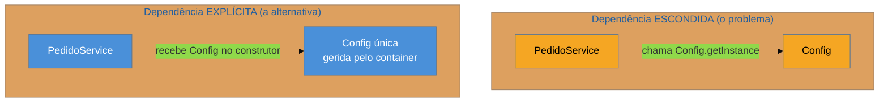

# Singleton

> [!abstract] TL;DR
> O **Singleton** garante que uma classe tenha **uma única instância** e oferece um ponto de acesso global a ela. É o padrão mais ensinado — e o mais **controverso**: um singleton mutável é **estado global disfarçado**, com todos os problemas que isso traz (dependências escondidas, testes contaminados, bugs de concorrência). A ironia da nossa lente cross-linguagem: em **Python e Go**, o padrão quase não existe, porque um **módulo/pacote já é um singleton**; em **Java**, precisa de maquinaria. E em qualquer stack moderno, o **container de injeção de dependência** te dá o escopo singleton **sem** o acoplamento do `getInstance()`. Saiba implementá-lo — mas na maioria das vezes a resposta certa é *não* usá-lo.

## Você precisa de exatamente um

Sua aplicação carrega a configuração de um arquivo na inicialização. É caro (lê disco, faz parse) e o resultado não muda durante a execução. Faz sentido carregar **uma vez** e todo mundo ler a mesma cópia. Ou: você tem um *pool* de conexões com o banco — abrir conexão é caro, então há **um** pool que todos compartilham. Ou um *logger*, um cache em memória, um relógio da aplicação.

O impulso ingênuo é uma **variável global**: `config = carrega()` no topo, todo mundo acessa. Funciona até você perceber os problemas — qualquer um pode reatribuir a variável, a inicialização acontece cedo demais (ou tarde demais), e em testes o estado vaza de um caso para o outro. O Singleton nasce como a versão "adulta" da variável global: **uma** instância, criada sob controle, com um ponto de acesso conhecido.

O detalhe que separa o Singleton de "só uma variável global" é o **controle da criação**: a própria classe garante que ninguém consiga criar uma segunda instância. Em OO clássico, isso se faz **escondendo o construtor**.

## A ideia, e a raiz do problema



Repare no contraste, porque ele é o coração de toda a controvérsia. Quando `PedidoService` chama `Config.getInstance()` lá no meio de um método, ele **depende de `Config` sem declarar isso em lugar nenhum**. Quem lê a assinatura de `PedidoService` não faz ideia de que ele fala com `Config`. A dependência é real, mas **invisível** — e o que é invisível não se substitui em teste, não aparece no diagrama, não se rastreia. Guarde essa observação: é dela que saem quase todas as armadilhas lá embaixo.

## O padrão nas quatro linguagens

Aqui a lente do catálogo fica gritante: o "mesmo" padrão vai de *cinco linhas cerimoniosas* a *não escrever nada*.

### Java — onde o padrão realmente é um padrão

O jeito ingênuo (`static` + construtor privado) funciona, mas o idiomático moderno, recomendado por Joshua Bloch no *Effective Java*, é um **enum de um elemento** — thread-safe na inicialização, à prova de serialização e de ataques por reflection, de graça:

```java
public enum Config {
    INSTANCE;

    private final Properties props = carregar();  // roda uma vez, na 1ª referência

    public String get(String chave) { return props.getProperty(chave); }
}

// uso:
String url = Config.INSTANCE.get("db.url");
```

Se você precisa de inicialização preguiçosa (lazy) sem enum, o idioma do *holder* resolve o thread-safety sem `synchronized`:

```java
public class Config {
    private Config() { }
    private static class Holder { static final Config INSTANCE = new Config(); }
    public static Config getInstance() { return Holder.INSTANCE; }  // classe Holder só carrega na 1ª chamada
}
```

> [!question]- E o famoso "double-checked locking"?
> É a implementação lazy com `if (instance == null)` dentro e fora de um bloco `synchronized`. Ela é o **cartão-postal das sutilezas de concorrência**: antes do Java 5 era simplesmente quebrada (o modelo de memória permitia enxergar um objeto "meio construído"), e mesmo hoje exige a palavra-chave `volatile` no campo para funcionar. O *holder idiom* acima entrega o mesmo lazy sem nenhuma dessas armadilhas — por isso é preferível. Se você ver double-checked locking num código legado, desconfie de que está sutilmente errado.

### Python — o módulo já é o singleton

Este é o momento da tese. Em Python, um **módulo é importado e cacheado uma única vez** por processo (`sys.modules`). Ou seja: qualquer objeto no nível do módulo **já tem semântica de singleton**, sem padrão nenhum:

```python
# config.py
_props = _carregar()           # roda uma vez, na primeira importação

def get(chave): return _props[chave]
```

```python
# em qualquer outro lugar:
import config
url = config.get("db.url")     # mesma instância de _props em todo o processo
```

Dá para escrever um Singleton "de verdade" com `__new__` ou uma metaclasse — mas a comunidade Python é direta a respeito: *se você está implementando o padrão Singleton em Python, quase certamente está fazendo algo errado*, geralmente por hábito trazido de uma linguagem mais rígida. O módulo já resolveu.

### Go — variável de pacote + `sync.Once`

Go não tem classes nem construtores. O singleton é uma **variável de pacote**, e a inicialização preguiçosa thread-safe é feita com `sync.Once`, que garante que a função de init rode **exatamente uma vez**, mesmo com várias goroutines chamando ao mesmo tempo:

```go
package config

var (
    instance *Config
    once     sync.Once
)

func Get() *Config {
    once.Do(func() { instance = carregar() })  // roda uma vez; leituras seguintes são baratas
    return instance
}
```

Em Go, isso não é "um padrão que você não deveria usar" — é uma ferramenta de concorrência do dia a dia, *desde que* construída com `sync.Once` (ou `sync.OnceValue`, a partir do Go 1.21) para evitar corrida na inicialização.

### TypeScript — o módulo ES também é cacheado

Como em Python, um **módulo ES é avaliado uma vez** e o resultado é compartilhado por todos os importadores. Um objeto exportado no nível do módulo já é singleton:

```typescript
// config.ts
const props = carregar();               // roda uma vez
export const config = { get: (k: string) => props[k] };
```

Se você quer o encapsulamento de classe, o padrão explícito existe (construtor privado + `static instance`), mas na prática o módulo costuma bastar.

> **A tese, cristalizada:** o Singleton é, em boa parte, um **contorno para linguagens sem um espaço de nomes global controlado**. Onde a linguagem já dá isso (módulo em Python/TS, pacote em Go), o padrão **evapora**. Onde não dá tão limpo (Java), ele vira maquinaria — e mesmo lá, o container de DI é a resposta preferível.

## Quando a linguagem (ou o framework) torna o padrão desnecessário

Mesmo em Java, você **raramente** escreve `getInstance()` na prática moderna — porque o **container de injeção de dependência** gerencia o ciclo de vida por você. Um bean anotado com `@Service`/`@Component` no Spring tem, por padrão, **escopo singleton**: existe uma instância, gerida pelo container, mas ela chega às suas classes **pelo construtor** (injeção), não por um acesso global escondido.

```java
@Service
public class PedidoService {
    private final Config config;                 // dependência EXPLÍCITA
    public PedidoService(Config config) {         // o container injeta a única instância
        this.config = config;
    }
}
```

Você ganha exatamente o que o Singleton prometia (uma instância compartilhada) **sem** o que ele custava (acoplamento invisível, dificuldade de teste). É por isso que, num stack com DI, a frase certa em entrevista é: *"eu não implemento Singleton; eu declaro um bean de escopo singleton e deixo o container cuidar"*.

## Armadilhas comuns

O Singleton é o padrão onde esta seção mais importa. Quase todo uso "por conveniência" cai em uma destas.

> [!warning] Singleton mutável = estado global disfarçado
> **O que acontece:** o singleton guarda estado que muda em runtime (um cache, um contador, um "usuário atual"). Em produção surgem bugs de concorrência; em testes, um caso contamina o outro porque o estado sobrevive entre eles. **Por quê:** um singleton mutável é uma variável global com roupa de OO — e estado global compartilhado é a fonte clássica de bugs não-determinísticos e de acoplamento temporal (a ordem de execução passa a importar). **Como evitar:** se precisa mesmo ser singleton, mantenha-o **imutável** (só leitura após a construção). Estado mutável compartilhado quase sempre quer ser um serviço com escopo gerido, não um global.

> [!warning] A dependência escondida (viola o DIP)
> **O que acontece:** `PedidoService` chama `Config.getInstance()` no meio de um método. A assinatura da classe não revela que ela depende de `Config`. **Por quê:** o acesso global **acopla** o chamador a uma implementação concreta sem passar pela porta da frente (o construtor). Isso quebra a Inversão de Dependência ([[06 - DIP - Inversão de Dependência]]) — você depende de um concreto, não de uma abstração injetada — e esconde o grafo de dependências real do sistema. **Como evitar:** injete a dependência pelo construtor. Se ela aparece na assinatura, ela é honesta: rastreável, substituível, óbvia.

> [!warning] Impossível de mockar em teste
> **O que acontece:** você quer testar `PedidoService` com uma `Config` falsa, mas ele chama `Config.getInstance()` internamente — não há por onde injetar o dublê. **Por quê:** o ponto de acesso global é resolvido **dentro** da classe, em tempo de execução; o teste não tem gancho para substituí-lo. Você acaba recorrendo a truques frágeis (resetar o singleton por reflection entre testes). **Como evitar:** dependência injetada troca-se por um stub/mock trivialmente. Testabilidade é o sintoma mais barato de detectar acoplamento ruim — se é difícil testar, o design está te avisando.

> [!warning] Singleton para tudo / classe utilitária
> **O que acontece:** classes de utilidade viram singletons "para não precisar instanciar", ou todo serviço vira `getInstance()` por hábito. **Por quê:** confunde-se "só preciso de um" com "preciso de um Singleton". Se a classe é **sem estado** (só funções puras), ela não precisa de instância nenhuma — métodos estáticos (ou funções de módulo/pacote) bastam, sem o acoplamento global. **Como evitar:** sem estado → funções estáticas / de módulo. Com estado compartilhado → bean de escopo singleton gerido pelo container. "Singleton artesanal" quase nunca é a resposta.

## Como explicar em inglês

> "Singleton guarantees a single instance with a global access point. I know how to implement it — in Java, an enum is the idiomatic, thread-safe way — but in practice I almost never do. In Python or Go, a module or package is already a singleton, so the pattern basically disappears. And in any framework with dependency injection, I just declare a singleton-scoped bean and let the container manage the lifecycle. That gives me the single shared instance **without** the hidden coupling — because the real problem with a hand-rolled Singleton is that `getInstance()` hides a dependency that never shows up in the constructor. A mutable Singleton is just global state in disguise: hard to test, and a source of concurrency bugs. So my rule is: recognize it, know it when I see it in legacy code, but reach for dependency injection instead."

| PT | EN |
| --- | --- |
| instância única | single instance |
| ponto de acesso global | global access point |
| estado global (disfarçado) | (disguised) global state |
| dependência escondida | hidden dependency |
| injeção de dependência | dependency injection |
| escopo singleton (gerido pelo container) | (container-managed) singleton scope |
| thread-safe / seguro para concorrência | thread-safe |
| inicialização preguiçosa | lazy initialization |
| difícil de mockar | hard to mock |

## O que vem a seguir

O Singleton controla *quantas* instâncias existem. O próximo padrão criacional controla *qual classe* é instanciada — delegando essa decisão para longe de quem só quer "um objeto que faça o trabalho". E, de novo, veremos a linguagem encolher o padrão: onde há função de primeira classe, a "fábrica" muitas vezes é só uma função.

- [[03 - Factory Method]] — delegar a decisão de qual classe concreta criar.
- [[06 - DIP - Inversão de Dependência]] — o princípio SOLID que o acesso global escondido viola; a raiz teórica da controvérsia do Singleton.
- [[22 - Reconhecer GoF nos frameworks]] — o escopo singleton do container, que substitui o `getInstance()` na prática.

## Veja também

- [[03-Dominios/Engenharia/Design de Software/Orientação a Objetos/08 - Acoplamento e coesão|Acoplamento e coesão]] — por que a dependência escondida é acoplamento ruim.
- [[03-Dominios/Engenharia/Design de Software/SOLID/07 - DIP na prática - DI e IoC|DI e IoC]] — a alternativa idiomática ao Singleton em stacks modernos.

## Fontes

- **Joshua Bloch** — *Effective Java*, Item 3 ("Enforce the singleton property with a private constructor or an enum type") — a fonte do enum como Singleton idiomático em Java.
- **Gamma, Helm, Johnson, Vlissides (GoF)** — *Design Patterns* (1994) — a definição original do padrão criacional.
- **Refactoring Guru** — [*Singleton*](https://refactoring.guru/design-patterns/singleton) — exemplos idiomáticos em várias linguagens e discussão de trade-offs.
- **GeeksforGeeks** — [*Why is Singleton considered an anti-pattern?*](https://www.geeksforgeeks.org/system-design/why-is-singleton-design-pattern-is-considered-an-anti-pattern/) — a síntese das críticas (estado global, acoplamento, testabilidade).
- **The Coding Gopher** — [*The Singleton in Go: Safe, Boring, and Surprisingly Useful*](https://thecodinggopher.substack.com/p/the-singleton-in-go-safe-boring-and-7f0) — o idioma `sync.Once` + variável de pacote.
