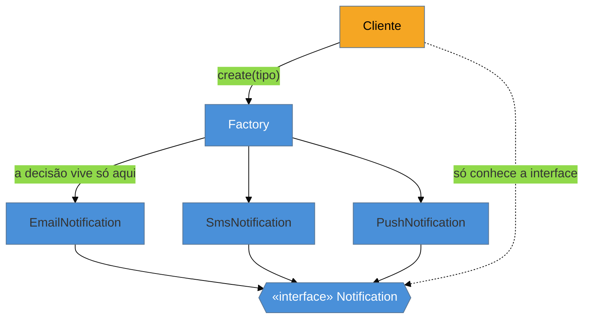

# Factory Method

> [!abstract] TL;DR
> O **Factory Method** encapsula a decisão de **qual classe concreta instanciar** atrás de uma interface, para que o resto do código dependa da abstração e não do `new` de um tipo específico. Resolve o problema do "`new EmailNotification()` espalhado por toda parte" — quando surge um novo tipo, você muda **um** lugar, não vinte. Na nossa lente cross-linguagem, é um caso claro de encolhimento: onde há **função de primeira classe**, a "fábrica" muitas vezes é só uma **função** ou um **dicionário** de construtores. A armadilha número um: criar uma fábrica que só embrulha um único construtor — cerimônia pura.

## O `new` que se multiplica

Você começa simples: em três lugares do código, `new EmailNotification()`. Um dia entra SMS. Aí Push. Agora cada ponto que notifica precisa de um `if tipo == EMAIL ... else if tipo == SMS ...` com o `new` certo — e essa lógica de escolha está **duplicada** em todo lugar que cria uma notificação. Adicionar um quarto tipo vira uma caçada por todos os pontos de criação.

O problema não é criar objetos; é que a **decisão de qual criar** está grudada em quem só queria "uma notificação para enviar". O Factory Method extrai essa decisão para um lugar único — a fábrica — e devolve ao chamador algo que ele trata pela **interface** (`Notification`), sem saber (nem se importar com) a classe concreta por baixo.



O cliente (âmbar) toca apenas a interface; os tipos concretos e a lógica que escolhe entre eles ficam do lado da fábrica. Trocar ou acrescentar um concreto não encosta no cliente.

> [!question]- Factory Method, Simple Factory e Abstract Factory são a mesma coisa?
> Não, e a confusão é clássica em entrevista. **Simple Factory** é um idioma (não-GoF): um método/função que recebe um parâmetro e devolve o concreto certo — é o que 90% das pessoas chamam de "factory" no dia a dia. **Factory Method** (GoF) é mais específico: uma classe base define um método de criação que as **subclasses sobrescrevem** para decidir o tipo — a escolha é feita por *herança*. **Abstract Factory** (próxima nota) cria **famílias** de objetos relacionados. Nesta nota tratamos os dois primeiros juntos, porque na prática moderna o "Factory Method por subclasse" é raro e o que você usa é a fábrica-como-função.

## O padrão nas quatro linguagens

### Java

A fábrica é uma interface (ou método) que centraliza o `switch` de criação:

```java
public interface NotificationFactory {
    Notification create(NotificationType type);
}

public class DefaultNotificationFactory implements NotificationFactory {
    public Notification create(NotificationType type) {
        return switch (type) {           // a decisão vive AQUI, num lugar só
            case EMAIL -> new EmailNotification();
            case SMS   -> new SmsNotification();
            case PUSH  -> new PushNotification();
        };
    }
}
```

### Python — uma função (ou um dicionário) basta

Sem a obrigação de tudo ser classe, a fábrica é uma função. E o `switch` costuma virar um **dicionário de construtores** — mais declarativo e fácil de estender:

```python
_TIPOS = {"email": EmailNotification, "sms": SmsNotification, "push": PushNotification}

def create_notification(tipo: str) -> Notification:
    return _TIPOS[tipo]()          # a classe é um valor de primeira classe; só chamar
```

### Go — a `func New...` idiomática

Go não tem construtores; a convenção é uma função `New...` que devolve a **interface**, escondendo o concreto:

```go
func NewNotification(tipo string) (Notification, error) {
    switch tipo {
    case "email": return &EmailNotification{}, nil
    case "sms":   return &SmsNotification{}, nil
    default:      return nil, fmt.Errorf("tipo desconhecido: %s", tipo)
    }
}
```

### TypeScript — função + mapa de tipos

```typescript
const registry: Record<string, () => Notification> = {
  email: () => new EmailNotification(),
  sms: () => new SmsNotification(),
};
const createNotification = (tipo: string): Notification => registry[tipo]();
```

> **A tese:** o Factory Method "clássico" (subclasse sobrescreve o método de criação) resolve, via herança, o que linguagens com **funções de primeira classe** resolvem passando uma função ou consultando um mapa. Onde a classe pode ser tratada como valor (Python, Go, TS), a fábrica encolhe para uma função — e o `switch` gigante costuma virar um **registro** que você estende sem tocar no código de despacho.

## Quando o framework já resolve

No Spring, você raramente escreve a fábrica à mão: injeta um **`Map<String, Notification>`** e o container o popula com **todos** os beans daquele tipo, indexados pelo nome. Adicionar um tipo novo = criar um bean; o mapa se atualiza sozinho, sem editar nenhum `switch`:

```java
@Service
public class Notifier {
    private final Map<String, Notification> canais;   // Spring injeta todos os beans Notification
    public Notifier(Map<String, Notification> canais) { this.canais = canais; }

    public void enviar(String canal, Mensagem m) { canais.get(canal).send(m); }
}
```

Isso é a fábrica **respeitando o Aberto-Fechado** ([[03 - OCP - Aberto-Fechado]]): o sistema fica aberto para novos canais (nova classe) e fechado para modificação (nenhum `switch` para editar).

## Armadilhas comuns

> [!warning] Fábrica que só embrulha um construtor
> **O que acontece:** cria-se uma `UserFactory.create()` que faz apenas `return new User(...)`, sem nenhuma decisão nem lógica de criação. **Por quê:** o valor do Factory Method está em **encapsular uma escolha** (qual tipo) ou **lógica de criação complexa**. Sem escolha nem complexidade, a fábrica é uma camada de indireção que só afasta o leitor do `new` real. **Como evitar:** só introduza a fábrica quando há **mais de um** tipo possível, ou construção com validação/montagem não-trivial. Um construtor direto é mais honesto.

> [!warning] O `switch` que precisa ser editado a cada novo tipo
> **O que acontece:** toda vez que surge um tipo novo, você abre a fábrica e acrescenta mais um `case`. A "centralização" só mudou o lugar do problema. **Por quê:** um `switch` fechado sobre tipos viola o Aberto-Fechado — o código de despacho **muda** a cada extensão. Em escala, vira um ponto de conflito e de bugs de "esqueci de adicionar o case". **Como evitar:** troque o `switch` por um **registro** (mapa nome→construtor) que os próprios tipos populam, ou deixe o container de DI montar o mapa. A extensão passa a ser *adicionar*, nunca *editar*.

> [!warning] Confundir com Abstract Factory (over-engineering)
> **O que acontece:** para criar um único tipo de objeto, alguém monta uma hierarquia de "fábrica de fábricas". **Por quê:** Abstract Factory serve para criar **famílias** de objetos que variam juntas (ver próxima nota). Aplicá-lo a um objeto só é cerimônia sem retorno — YAGNI. **Como evitar:** precisa de **um** objeto cuja classe varia? Factory Method / função. Precisa de **um conjunto** de objetos que mudam em bloco? Aí sim Abstract Factory.

## Como explicar em inglês

> "A Factory Method encapsulates the decision of *which* concrete class to instantiate, so the rest of the code depends on an interface instead of a specific `new`. It shines when that decision depends on config or user input, and when you want a single place to change when a new type shows up. But in a language with first-class functions, the 'factory' is often just a function or a dictionary of constructors — I don't need a subclass hierarchy for that. And in Spring I usually don't write it at all: I inject a `Map` of beans and let the container populate it, which keeps the code open for extension and closed for modification. The trap I watch for is a factory that only wraps a single constructor — that's indirection with no payoff."

| PT | EN |
| --- | --- |
| fábrica / método fábrica | factory / factory method |
| classe concreta | concrete class |
| decisão de criação | creation decision |
| registro (nome → construtor) | registry (name → constructor) |
| despacho | dispatch |
| aberto para extensão | open for extension |
| indireção sem retorno | indirection with no payoff |

## O que vem a seguir

O Factory Method cria **um** objeto cuja classe concreta varia. E quando você precisa criar um **conjunto** de objetos que precisam combinar entre si — botões, janelas e menus de um mesmo tema, ou os drivers de um mesmo banco? Aí o padrão sobe um nível: a fábrica passa a produzir **famílias** coerentes.

- [[04 - Abstract Factory]] — fábrica de famílias de objetos relacionados.
- [[03 - OCP - Aberto-Fechado]] — o princípio que a fábrica-com-registro materializa.
- [[12 - Strategy]] — o vizinho comportamental: como o Factory, encolhe para uma função em linguagens funcionais (mas seleciona *comportamento*, não *criação*).

## Veja também

- [[03-Dominios/Engenharia/Design de Software/SOLID/03 - OCP - Aberto-Fechado|OCP]] — por que o registro vence o `switch`.
- [[03-Dominios/Engenharia/Design de Software/Orientação a Objetos/06 - Interfaces e classes abstratas|Interfaces e classes abstratas]] — o mecanismo OO que a fábrica usa para esconder o concreto.

## Fontes

- **Gamma, Helm, Johnson, Vlissides (GoF)** — *Design Patterns* (1994) — Factory Method e Abstract Factory como padrões criacionais.
- **Refactoring Guru** — [*Factory Method*](https://refactoring.guru/design-patterns/factory-method) — a distinção entre Factory Method, Simple Factory e Abstract Factory, com exemplos.
- **Joshua Bloch** — *Effective Java*, Item 1 ("Consider static factory methods instead of constructors") — as vantagens de fábricas estáticas sobre construtores em Java.
