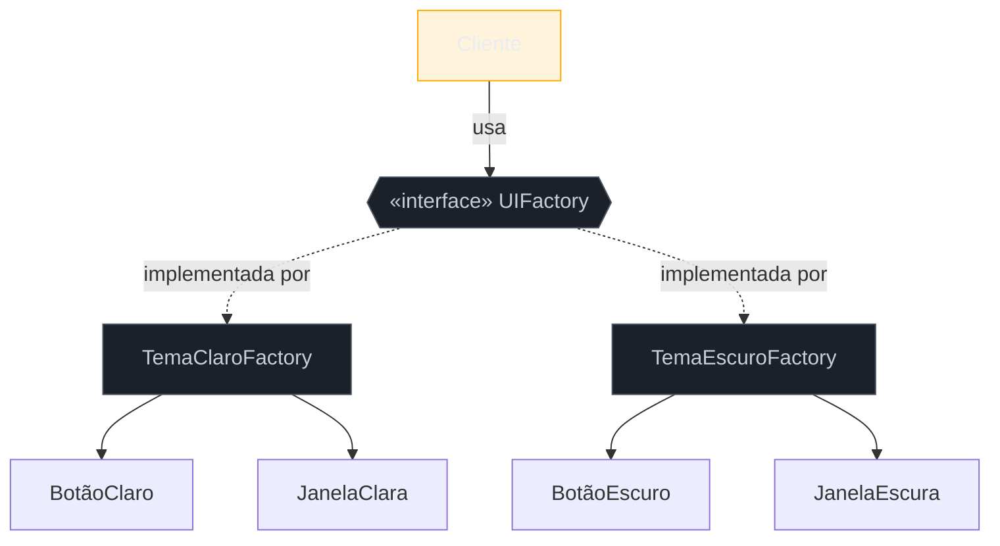

# Abstract Factory

> [!abstract] TL;DR
> O **Abstract Factory** cria **famílias de objetos relacionados** sem acoplar o código às classes concretas — garantindo que os membros da família **combinem entre si**. É o Factory Method subido um nível: em vez de criar *um* objeto cuja classe varia, cria um *conjunto coeso* que varia em bloco (todos os widgets de um tema, todos os drivers de um banco). É o padrão criacional **mais raro em backend moderno**: quando aparece, é em *toolkits* de UI, drivers de banco de dados, suporte a múltiplas plataformas ou dublês de teste. Sua fraqueza estrutural conhecida: é fácil adicionar uma **nova família**, mas doloroso adicionar um **novo produto** à família — mexe em todas as fábricas.

## Quando um objeto não vem sozinho

Imagine uma UI com dois temas: claro e escuro. Cada tema tem seu botão, sua caixa de seleção, sua janela. O problema não é criar *um* botão — é garantir que, escolhido o tema escuro, **tudo** que a tela cria seja do tema escuro. Um botão claro no meio de uma janela escura é um bug visual. Os objetos precisam vir **em família coerente**.

Outro caso, mais de backend: sua aplicação suporta Postgres e MySQL. A conexão, o comando e a transação de cada banco têm que ser da **mesma** família — você não mistura uma transação de Postgres com um comando de MySQL. Ou ainda: numa suíte de testes, você quer trocar o *conjunto* inteiro de dependências reais por um conjunto de dublês, de uma vez.

Em todos, o Factory Method sozinho não basta, porque ele cria um objeto de cada vez, sem garantir a **coerência entre eles**. O Abstract Factory é a interface que produz a família inteira, e cada implementação concreta produz uma família consistente.

## A ideia



O cliente recebe **uma** `UIFactory` e chama `criarBotão()`, `criarJanela()`. Qual família ele obtém foi decidido num único ponto (na inicialização); dali em diante, tudo o que ele cria é automaticamente coerente.

## O padrão nas quatro linguagens

### Java — a interface de família

```java
public interface UIFactory {
    Botao criarBotao();
    Janela criarJanela();
}

public class TemaEscuroFactory implements UIFactory {
    public Botao criarBotao()   { return new BotaoEscuro(); }
    public Janela criarJanela() { return new JanelaEscura(); }
}

// escolhido uma vez, na inicialização:
UIFactory ui = config.temaEscuro() ? new TemaEscuroFactory() : new TemaClaroFactory();
Botao b = ui.criarBotao();   // sempre coerente com a janela
```

### Python — uma família pode ser só um módulo (ou uma tupla de funções)

Sem a obrigação de interfaces nominais, a "fábrica de família" pode ser um **módulo** que expõe as funções de criação, ou um objeto simples agrupando-as:

```python
# tema_escuro.py  — o módulo É a fábrica da família
def criar_botao():  return BotaoEscuro()
def criar_janela(): return JanelaEscura()

# uso: escolhe-se o módulo certo uma vez
import tema_escuro as ui
b = ui.criar_botao()
```

### Go — interface com métodos que retornam interfaces

```go
type UIFactory interface {
    CriarBotao() Botao
    CriarJanela() Janela
}

type TemaEscuroFactory struct{}
func (TemaEscuroFactory) CriarBotao() Botao   { return botaoEscuro{} }
func (TemaEscuroFactory) CriarJanela() Janela { return janelaEscura{} }
```

### TypeScript — objeto de funções tipado

```typescript
interface UIFactory {
  criarBotao(): Botao;
  criarJanela(): Janela;
}
const temaEscuro: UIFactory = {
  criarBotao: () => new BotaoEscuro(),
  criarJanela: () => new JanelaEscura(),
};
```

> **A tese:** em Java/Go, o Abstract Factory pede uma interface nominal e uma implementação por família. Em Python/TS, onde um **módulo** ou um **objeto de funções** já agrupa criadores coerentes, a "fábrica abstrata" é frequentemente só *escolher qual módulo/objeto usar* — a estrutura formal encolhe, a ideia (uma família coerente selecionada num ponto) permanece.

## Onde ele ainda vive (e onde não)

Seja honesto sobre a frequência: **em backend de aplicação, você quase nunca escreve um Abstract Factory**. Ele sobrevive onde há **variação em conjunto**:

- **Toolkits de UI** multiplataforma (widgets por sistema operacional / tema).
- **Drivers de banco / SDKs** onde conexão + comando + transação variam juntos.
- **Portabilidade** (mesma app, back-ends de armazenamento diferentes).
- **Dublês de teste** — trocar toda a família de dependências reais por *fakes* de uma vez.

Fora desses, desconfie. Quase sempre o que você precisa é um Factory Method simples ou injeção de dependência.

## Armadilhas comuns

> [!warning] Abstract Factory prematura (fábrica de fábricas sem necessidade)
> **O que acontece:** para criar objetos que **não** variam em família, monta-se uma hierarquia de fábricas abstratas "para o caso de um dia precisar". **Por quê:** o padrão só se paga quando existem **múltiplas famílias coerentes** que variam juntas. Com uma família só, é indireção pura — YAGNI em estado puro. **Como evitar:** exija ver **pelo menos duas** famílias reais antes de abstrair. Uma? Factory Method ou construtor direto.

> [!warning] Adicionar um novo produto quebra todas as fábricas
> **O que acontece:** a família tem Botão e Janela; você precisa acrescentar um Menu. Agora **toda** implementação de `UIFactory` precisa ganhar `criarMenu()` — a interface muda e todas as fábricas junto. **Por quê:** é a fraqueza estrutural conhecida do padrão: ele é **aberto para novas famílias** (adicionar TemaAltoContraste é fácil) mas **fechado para novos produtos** (adicionar um tipo de widget é caro). A rigidez está na interface de família. **Como evitar:** só use Abstract Factory quando o **conjunto de produtos é estável** e o que varia são as **famílias**. Se novos produtos entram toda hora, o padrão vai te atrapalhar.

> [!warning] Confundir com Factory Method
> **O que acontece:** usa-se "Abstract Factory" para criar um único tipo de objeto, ou "Factory Method" onde há uma família inteira variando junto. **Por quê:** são escalas diferentes — um objeto (Factory Method) versus um conjunto coeso (Abstract Factory). Trocar um pelo outro gera ou over-engineering, ou incoerência de família. **Como evitar:** a pergunta decisiva é: *"o que varia é um objeto, ou um conjunto que precisa combinar entre si?"*

## Como explicar em inglês

> "Abstract Factory creates **families** of related objects that need to be consistent with each other — think all the widgets of a UI theme, or the connection, command and transaction of a specific database driver. It's Factory Method one level up: instead of one object, a coherent set that varies together. Honestly, it's the creational pattern I write least often in backend work — it really belongs to UI toolkits, drivers, and cross-platform code. And it has a well-known weakness: adding a new *family* is easy, but adding a new *product* to the family forces a change in every factory. So I only reach for it when the set of products is stable and the families are what vary."

| PT | EN |
| --- | --- |
| família de objetos | family of objects |
| objetos relacionados / coerentes | related / consistent objects |
| variar em bloco | vary together |
| fábrica de família | family factory |
| aberto para novas famílias | open for new families |
| fechado para novos produtos | closed for new products |
| dublê de teste | test double |

## O que vem a seguir

Vimos padrões que decidem *qual* classe (ou família) criar. O próximo lida com um problema diferente: criar **um** objeto que é complexo de montar — muitos campos, muitos passos, muitos opcionais. Onde o construtor de dez parâmetros vira ilegível, entra o Builder.

- [[05 - Builder]] — construir objetos complexos passo a passo.
- [[03 - Factory Method]] — o irmão de um nível abaixo, para revisar a distinção.
- [[04 - Abstract Factory]] no mundo dos testes: ver [[03-Dominios/Engenharia/Testes/index|Testes]] para trocar famílias de dependências por dublês.

## Veja também

- [[03-Dominios/Engenharia/Design de Software/SOLID/03 - OCP - Aberto-Fechado|OCP]] — a assimetria "aberto para famílias, fechado para produtos" é uma leitura de OCP.
- [[03-Dominios/Engenharia/Design de Software/Orientação a Objetos/07 - Composição sobre herança|Composição sobre herança]] — a família é composta, não herdada.

## Fontes

- **Gamma, Helm, Johnson, Vlissides (GoF)** — *Design Patterns* (1994) — Abstract Factory, com o exemplo canônico de *look-and-feel* de UI.
- **Refactoring Guru** — [*Abstract Factory*](https://refactoring.guru/design-patterns/abstract-factory) — exemplo de UI multiplataforma e a discussão da fraqueza "novo produto".
- **Source Making** — [*Abstract Factory*](https://sourcemaking.com/design_patterns/abstract_factory) — quando o padrão se justifica e quando é excesso.
