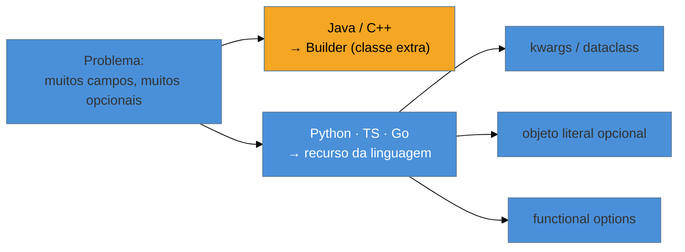

# Builder

> [!abstract] TL;DR
> O **Builder** constrói um objeto complexo **passo a passo**, separando a montagem da representação
> final. Resolve dois problemas concretos: o **construtor de dez parâmetros** (ilegível, fácil de
> errar a ordem) e o objeto **imutável com muitos campos opcionais**. É talvez o exemplo mais
> didático da lente deste catálogo: o Builder existe porque Java e C++ **não têm argumentos
> nomeados nem opcionais**. Em **Python** (`kwargs`/`dataclass`), **TypeScript** (objeto literal) e
> **Go** (*functional options*), o mesmo problema se resolve com recursos da linguagem — o padrão
> praticamente desaparece. A armadilha principal: usar Builder para um objeto de dois ou três
> campos, trocando clareza por cerimônia.

## O construtor que ninguém consegue ler

Você precisa criar um `User` com nome, e-mail, papel, endereço, data de nascimento, flag de ativo, preferências... A criação vira isto:

```java
User u = new User("Josenaldo", "jm@ex.com", null, Role.ADMIN, null, true, null, false);
```

Quem lê essa linha não sabe o que é cada argumento sem abrir a definição da classe. O terceiro parâmetro é `null` — mas `null` de quê? Trocar a ordem de dois parâmetros do mesmo tipo compila e explode em runtime. E se metade dos campos é opcional, você acaba com **vários construtores sobrecarregados** ("telescoping constructors"), um para cada combinação — uma escada que não escala.

O Builder ataca isso deixando você nomear cada campo na hora de montar, na ordem que quiser, preenchendo só o que importa — e produzindo, ao final, um objeto **imutável** e válido.

## O padrão nas quatro linguagens — a tese em estado puro

### Java — onde o Builder ganha a vida

Com Lombok, uma anotação gera o builder; sem ela, você escreve a classe interna. O ganho de legibilidade é imediato:

```java
@Builder
public class User {
    private final String name;
    private final String email;
    private final Role role;
    private final Address address;
    private final LocalDate birthdate;
}

User u = User.builder()
    .name("Josenaldo")
    .email("jm@ex.com")
    .role(Role.ADMIN)
    .build();               // objeto imutável, campos opcionais omitidos
```

Cada campo é nomeado; a ordem é livre; o que não importa fica de fora. A biblioteca padrão do Java usa o padrão o tempo todo — `StringBuilder`, `Stream.Builder`, `HttpRequest.newBuilder()`.

### Python — `kwargs`/`dataclass` já resolvem

Python tem **argumentos nomeados** e **valores default** na própria linguagem. O problema que o Builder resolve simplesmente não existe:

```python
@dataclass(frozen=True)
class User:
    name: str
    email: str
    role: Role = Role.USER
    address: Address | None = None
    birthdate: date | None = None

u = User(name="Josenaldo", email="jm@ex.com", role=Role.ADMIN)   # nomeado, opcionais omitidos
```

### Go — o padrão *functional options*

Go não tem argumentos opcionais, mas resolve com um idioma próprio — funções que configuram o objeto — em vez de uma classe Builder:

```go
func NewUser(name, email string, opts ...Option) *User {
    u := &User{name: name, email: email, role: RoleUser}   // defaults
    for _, opt := range opts { opt(u) }
    return u
}
func WithRole(r Role) Option { return func(u *User) { u.role = r } }

u := NewUser("Josenaldo", "jm@ex.com", WithRole(RoleAdmin))
```

### TypeScript — objeto literal com campos opcionais

```typescript
interface UserInit { name: string; email: string; role?: Role; address?: Address; }
const criarUser = (init: UserInit): User => ({ role: Role.User, ...init });

const u = criarUser({ name: "Josenaldo", email: "jm@ex.com", role: Role.Admin });
```

> **A tese, no seu caso mais limpo:** o Builder é a resposta *estrutural* (uma classe extra) para a falta de um recurso *da linguagem* (argumentos nomeados/opcionais). Onde a linguagem tem esse recurso, escrever um Builder é reinventar de forma verbosa o que já vem de graça. Reconhecer isso é o que evita você portar mecanicamente um Builder de Java para Python — e piorar o código no caminho.



## Armadilhas comuns

> [!warning] Builder para um objeto simples
> **O que acontece:** cria-se um Builder para uma classe de dois ou três campos obrigatórios.
> **Por quê:** o Builder só se paga com **muitos** campos (a regra prática é ~4+) ou muitos opcionais. Para poucos campos, um construtor direto (ou um `record`/`dataclass`) é mais curto e mais claro; o Builder só adiciona uma indireção fluente sem benefício.
> **Como evitar:** conte os campos e os opcionais. Poucos e obrigatórios → construtor/record. Muitos ou muitos opcionais → Builder (em Java) ou o recurso equivalente da sua linguagem.

> [!warning] `build()` que devolve um objeto inválido
> **O que acontece:** o Builder deixa construir e chamar `build()` mesmo faltando um campo obrigatório; o objeto meio-montado só quebra lá adiante, longe da causa.
> **Por quê:** um dos pontos do Builder é entregar um objeto **válido e completo**. Se ele não valida no `build()`, perde essa garantia e ainda espalha o erro no tempo (o `NullPointerException` acontece longe de onde o campo faltou).
> **Como evitar:** valide invariantes **dentro** do `build()` (ex.: lançar se `email` é nulo). Melhor ainda: exija os obrigatórios como parâmetros da própria fábrica/construtor, deixando o Builder só para os opcionais.

> [!warning] Reinventar o Builder onde a linguagem já dá argumentos nomeados
> **O que acontece:** um dev vindo de Java escreve uma classe Builder completa em Python ou Kotlin — linguagens que têm argumentos nomeados nativos.
> **Por quê:** é portar a *solução* sem checar se o *problema* ainda existe. Em Python/Kotlin/TS, os argumentos nomeados e defaults resolvem o mesmo caso com uma fração do código.
> **Como evitar:** antes de escrever um Builder, pergunte: *minha linguagem tem argumentos nomeados e opcionais?* Se sim, use-os. O Builder fica reservado para quando você precisa de construção com **passos** ou **lógica** (não só nomear campos).

## Como explicar em inglês

> "Builder constructs a complex object step by step, which solves two things: the unreadable ten-parameter constructor, and immutable objects with lots of optional fields. In Java it's genuinely useful — `HttpRequest.newBuilder()` is a great example. But it's the clearest case of a pattern that exists to work around a missing language feature: named and optional arguments. In Python I'd just use keyword arguments or a dataclass; in Go, functional options; in TypeScript, an object literal with optional fields. So I know the pattern, but I only write an explicit Builder in Java — and even then, only when there are enough fields to justify it. Building a Builder for a three-field object is ceremony, not clarity."

| PT | EN |
| --- | --- |
| construir passo a passo | build step by step |
| construtor telescópico | telescoping constructor |
| campos opcionais | optional fields |
| argumentos nomeados | named arguments |
| valores default | default values |
| objeto imutável | immutable object |
| opções funcionais | functional options |
| validar invariantes | validate invariants |

## O que vem a seguir

Fechamos quatro dos cinco criacionais decidindo *qual* classe criar (Factory, Abstract Factory) ou *como montar* um objeto complexo (Builder). O último criacional muda a pergunta: e se o jeito mais barato de obter um objeto novo for **copiar** um que já existe?

- [[06 - Prototype]] — criar clonando um objeto existente; cópia rasa vs profunda em cada linguagem.
- [[02 - Singleton]] — revisar o outro extremo criacional (uma instância só).

## Veja também

- [[03-Dominios/Engenharia/Design de Software/Orientação a Objetos/09 - Identidade, igualdade e imutabilidade|Identidade, igualdade e imutabilidade]] — por que o Builder costuma produzir objetos imutáveis.
- [[03-Dominios/Tecnologia/Go/index|Go]] — o idioma *functional options* no seu habitat.

## Fontes

- **Joshua Bloch** — *Effective Java*, Item 2 ("Consider a builder when faced with many constructor parameters") — a referência canônica do Builder em Java.
- **Gamma, Helm, Johnson, Vlissides (GoF)** — *Design Patterns* (1994) — a definição original (com foco na separação construção/representação).
- **Refactoring Guru** — [*Builder*](https://refactoring.guru/design-patterns/builder) — exemplos e a distinção entre o Builder do GoF e o "builder fluente" moderno.
- **Dave Cheney** — [*Functional options for friendly APIs*](https://dave.cheney.net/2014/10/17/functional-options-for-friendly-apis) — o idioma de Go que substitui o Builder.
