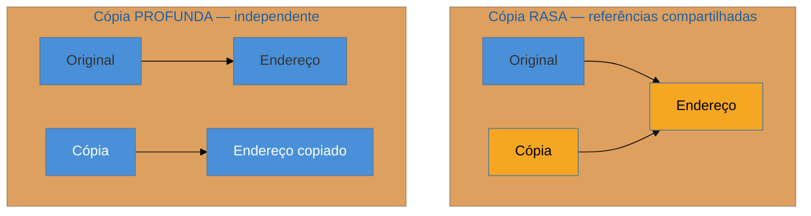

# Prototype

> [!abstract] TL;DR
> O **Prototype** cria objetos novos **clonando** um existente, em vez de instanciá-los do zero. Faz sentido quando a criação é cara (o objeto foi carregado do banco, montado com muita configuração) e você quer uma cópia — igual ou levemente modificada. Como padrão formal, é **raro** hoje: a imutabilidade com métodos `with...()`/`copy()` costuma ser a resposta melhor. Mas o **tema por trás dele — cópia rasa (*shallow*) versus profunda (*deep*)** — é praticíssimo e **onde as linguagens mais divergem**, sendo fonte clássica de bugs em código legado (mutar a cópia e ver o original mudar junto). A armadilha número um é justamente a cópia rasa silenciosa.

## Quando recriar sai caro

Você tem um objeto que custou para existir: uma configuração carregada e validada, um documento montado com dezenas de campos, uma entidade puxada do banco com relacionamentos. Agora precisa de **outro** quase igual — talvez idêntico, talvez com um campo diferente. Recriar do zero significa refazer todo o trabalho caro de montagem.

O Prototype diz: parta de um objeto **modelo** e **copie-o**. Em vez de `new` seguido de vinte `set`, você clona o protótipo e ajusta só o que muda. Em jogos, um inimigo pré-configurado é clonado para popular a fase; em editores, um objeto selecionado é duplicado; em testes, um objeto-base é clonado e variado por caso.

O detalhe que decide se isso funciona ou vira um pesadelo de debug é **o que "copiar" significa** — e aqui não há resposta única.

## Raso versus profundo: o coração da questão



Uma **cópia rasa** duplica o objeto de topo, mas os campos que são *referências* (um `Address`, uma lista) continuam **apontando para os mesmos objetos internos**. Resultado: alterar o endereço da cópia altera o do original — eles compartilham o mesmo `Address`. Uma **cópia profunda** clona também tudo o que está pendurado, recursivamente, produzindo um objeto verdadeiramente independente. Qual você quer depende do caso — mas obter a rasa **sem querer** é um dos bugs mais escorregadios que existem.

## O padrão nas quatro linguagens

### Java — `clone()` é um design quebrado; prefira copy constructor

O mecanismo nativo (`Cloneable` + `Object.clone()`) é notoriamente problemático — é *shallow* por padrão, tem contrato mal definido e Joshua Bloch recomenda **evitá-lo**. A alternativa idiomática é um **construtor de cópia** ou uma fábrica de cópia, onde você controla a profundidade explicitamente:

```java
public User(User outro) {
    this.name = outro.name;
    this.address = new Address(outro.address);  // cópia profunda, deliberada
}
```

### Python — `copy.copy` vs `copy.deepcopy`

Python torna a escolha explícita na biblioteca padrão, e deixa a classe customizar via `__copy__`/`__deepcopy__`:

```python
import copy
raso    = copy.copy(original)       # compartilha objetos internos
profundo = copy.deepcopy(original)  # clona recursivamente
```

### Go — cópia de struct é rasa (e silenciosa)

Atribuir uma struct em Go **já copia** — mas é raso: campos que são ponteiros, slices ou maps continuam compartilhados. Não há `deepcopy` nativo; a cópia profunda é manual (ou via serialização):

```go
copia := *original          // raso: slices/maps/ponteiros ainda são compartilhados!
copia.Tags = append([]string(nil), original.Tags...)  // clona o slice à mão
```

### TypeScript — `spread` é raso; `structuredClone` é profundo

```typescript
const raso = { ...original };            // ou Object.assign — objetos aninhados compartilhados
const profundo = structuredClone(original); // cópia profunda nativa (moderna)
```

> **A tese:** o "Prototype" como padrão formal quase não aparece; o que aparece o tempo todo é a **operação de cópia**, e cada linguagem tem uma semântica default diferente (Go copia struct raso ao atribuir; Java erra pelo `clone()`; Python e TS te dão as duas opções explícitas). Saber *qual* cópia sua linguagem faz por padrão é o que separa clonar com segurança de plantar um bug de aliasing.

## Por que ele é raro hoje: imutabilidade

Quando os objetos são **imutáveis**, a pergunta "raso ou profundo?" perde a força — se nada muda, compartilhar referências internas é seguro, e "clonar com uma alteração" vira um método `with...()` que devolve nova instância:

```java
record User(String name, Address address) {
    User withName(String novo) { return new User(novo, this.address); }  // seguro: tudo imutável
}
```

`dataclasses.replace()` em Python, cópia de struct + ajuste em Go, o *spread* em objetos imutáveis em TS — todos entregam "um novo objeto quase igual" sem o padrão Prototype e sem risco de aliasing. Por isso, num design moderno, a resposta costuma ser **imutabilidade + `with`**, não Prototype.

## Armadilhas comuns

> [!warning] Cópia rasa silenciosa (bug de aliasing)
> **O que acontece:** você "clona" um objeto, altera um campo aninhado da cópia e o original muda junto — ou vice-versa. O bug aparece longe da cópia, difícil de rastrear. **Por quê:** a cópia rasa compartilha as referências internas. Mutar através de uma das cópias afeta todas, porque é o **mesmo** objeto interno. É o default silencioso de `clone()` em Java, da atribuição de struct em Go e do *spread* em JS/TS. **Como evitar:** saiba a semântica default da sua linguagem e **escolha deliberadamente**: cópia profunda quando os internos são mutáveis e devem ser independentes; ou, melhor, torne os internos imutáveis e o problema evapora.

> [!warning] Usar `Cloneable`/`clone()` em Java
> **O que acontece:** implementa-se `Cloneable` esperando uma cópia correta, e ganha-se um *shallow clone* com contrato confuso e sem chamar construtor. **Por quê:** `Cloneable` é um design reconhecidamente falho (o próprio Bloch recomenda evitá-lo): não invoca construtores, exige *casting*, e a profundidade fica ambígua. **Como evitar:** use um **construtor de cópia** (`new User(outro)`) ou uma fábrica estática de cópia — explícitos, controlam a profundidade, e rodam a validação do construtor.

> [!warning] Clonar quando imutabilidade resolveria melhor
> **O que acontece:** monta-se maquinaria de clonagem para produzir variações de um objeto mutável, convivendo com o risco de aliasing. **Por quê:** clonar objetos mutáveis é gerenciar o risco; torná-los imutáveis **elimina** o risco. Um `with...()` sobre um objeto imutável dá "novo objeto quase igual" sem cópia profunda nem aliasing. **Como evitar:** prefira imutabilidade + métodos `with`/`copy`. Reserve a clonagem para quando você **realmente** precisa duplicar estado mutável caro de reconstruir.

## Como explicar em inglês

> "Prototype creates new objects by cloning an existing one, which pays off when creation is expensive and you want a copy, possibly with small changes. Honestly, as a formal pattern it's rare now — I usually reach for immutability with a `with`/`copy` method instead. But the idea *behind* it, shallow versus deep copy, is extremely practical and it's where languages differ the most: Go's struct assignment is a shallow copy, Java's `clone()` is a broken shallow copy so I use a copy constructor, Python gives you `copy` and `deepcopy` explicitly, and in TypeScript `structuredClone` does a deep copy. The classic bug is a silent shallow copy where mutating the clone also mutates the original — knowing your language's default is what prevents it."

| PT | EN |
| --- | --- |
| clonar / clone | to clone / clone |
| cópia rasa | shallow copy |
| cópia profunda | deep copy |
| referência compartilhada | shared reference |
| aliasing (referências cruzadas) | aliasing |
| construtor de cópia | copy constructor |
| imutabilidade | immutability |
| objeto modelo / protótipo | prototype object |

## O que vem a seguir

Com o Prototype fechamos os **cinco padrões criacionais** — todos sobre *como objetos nascem*. A próxima família muda a pergunta: dado que os objetos existem, **como encaixá-los** entre si, com o legado e com bibliotecas de terceiros? Entramos nos padrões **estruturais**, começando pelo tradutor de interfaces.

- [[07 - Adapter]] — casar interfaces incompatíveis; a ponte para código legado e APIs de terceiros.
- [[01 - O que são Design Patterns]] — revisar o mapa das três famílias antes de mudar de categoria.

## Veja também

- [[03-Dominios/Engenharia/Design de Software/Orientação a Objetos/09 - Identidade, igualdade e imutabilidade|Identidade, igualdade e imutabilidade]] — a base conceitual de cópia, identidade e por que a imutabilidade dissolve o problema.
- [[05 - Builder]] — o criacional vizinho, também frequentemente substituído por imutabilidade + `with`.

## Fontes

- **Joshua Bloch** — *Effective Java*, Item 13 ("Override clone judiciously") — por que evitar `Cloneable` e preferir construtores de cópia.
- **Gamma, Helm, Johnson, Vlissides (GoF)** — *Design Patterns* (1994) — a definição original do Prototype.
- **Refactoring Guru** — [*Prototype*](https://refactoring.guru/design-patterns/prototype) — o padrão e a discussão de cópia rasa vs profunda.
- **MDN** — [*structuredClone()*](https://developer.mozilla.org/en-US/docs/Web/API/structuredClone) — a cópia profunda nativa em JS/TS.
