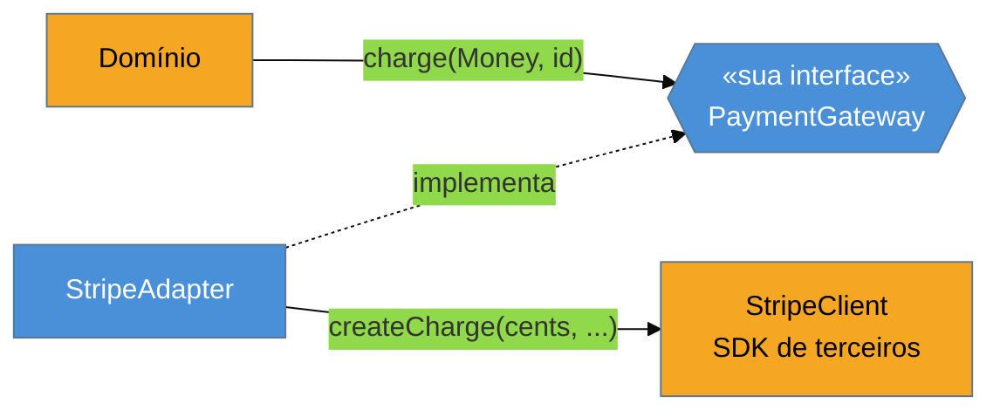

# Adapter

> [!abstract] TL;DR
> O **Adapter** converte a interface de uma classe para **outra que o cliente espera**, servindo de
> ponte entre o seu código e o de terceiros (ou o legado). É o padrão que mantém o vocabulário de
> uma biblioteca externa **contido na borda** do sistema, sem vazar para o domínio — a base do
> Ports & Adapters (arquitetura hexagonal). Na nossa lente cross-linguagem, ele expõe uma distinção
> importante: em linguagens de **tipagem nominal** (Java), o adapter é obrigatório sempre que as
> interfaces não batem *por nome*, mesmo que a forma encaixe; em **tipagem estrutural** (Go, TS), se
> a forma já encaixa, o adapter de "declaração" **desaparece** — mas o de **tradução** (renomear,
> converter unidades, mapear erros) continua necessário. A armadilha principal: um adapter que
> **vaza** exatamente o que deveria esconder.

## Quando as interfaces não se encaixam

Você integra pagamentos com o Stripe. O SDK deles expõe algo como `createCharge(long cents, String currency, String customer)`. Só que o seu domínio fala outra língua: `PaymentGateway.charge(Money amount, String customerId)`. Os dois fazem "cobrar", mas com **nomes, tipos e formatos diferentes** — centavos como `long` versus um `Money` com moeda embutida.

Você tem duas opções ruins e uma boa. Ruim 1: espalhar chamadas a `StripeClient` por todo o código — agora o vocabulário do Stripe (e o acoplamento a ele) contamina o domínio inteiro, e trocar de gateway vira uma cirurgia. Ruim 2: mudar seu domínio para falar "Stripês". A boa: escrever **um** objeto que implementa a **sua** interface (`PaymentGateway`) e, por dentro, traduz as chamadas para o SDK. Esse objeto é o Adapter.

O ganho é de **contenção**: todo o conhecimento sobre o Stripe fica num arquivo. O resto do sistema conhece só `PaymentGateway`. Trocar Stripe por outro provedor = escrever outro adapter, sem tocar no domínio.

## A ideia



O domínio depende só da **sua** interface (azul). O adapter é o único ponto que conhece o SDK (âmbar) e faz a tradução de vocabulário na fronteira.

> [!question]- Adapter de objeto ou de classe?
> O GoF descreve dois sabores. O **class adapter** usa herança múltipla (herda do alvo e do adaptado) — inviável em Java/Go/etc. e desencorajado. O **object adapter** usa **composição**: o adapter *contém* o objeto adaptado e delega a ele. É o único que usamos na prática, e combina com [[03-Dominios/Engenharia/Design de Software/Orientação a Objetos/07 - Composição sobre herança|composição sobre herança]].

## O padrão nas quatro linguagens

### Java — tipagem nominal: o adapter é obrigatório

Em Java, uma classe só "é" um `PaymentGateway` se **declarar** `implements PaymentGateway`. Mesmo que `StripeClient` tivesse exatamente os métodos certos, ele não serviria sem essa declaração — e você não pode editá-lo (é de terceiros). Logo, o adapter é inevitável:

```java
class StripeAdapter implements PaymentGateway {
    private final StripeClient stripe;                       // composição
    StripeAdapter(StripeClient stripe) { this.stripe = stripe; }

    public PaymentResult charge(Money amount, String customerId) {
        StripeCharge c = stripe.createCharge(               // tradução: Money → (cents, currency)
            amount.getCents(),
            amount.getCurrency().getCode(),
            customerId);
        return PaymentResult.fromStripe(c);                 // tradução do retorno de volta ao domínio
    }
}
```

### Go — tipagem estrutural: metade do adapter evapora

Go satisfaz interfaces **implicitamente**: se um tipo tem os métodos certos, ele já implementa a interface, sem `implements`. Se o SDK expusesse um `Charge(Money, string) (PaymentResult, error)` idêntico à sua interface, **nenhum adapter seria necessário** — ele já casaria. O adapter só reaparece quando há **tradução real** (nomes/tipos diferentes), e aí é um *wrapper* fino:

```go
type StripeAdapter struct{ stripe *StripeClient }

func (a StripeAdapter) Charge(amount Money, customerID string) (PaymentResult, error) {
    c, err := a.stripe.CreateCharge(amount.Cents(), amount.Currency(), customerID)
    if err != nil { return PaymentResult{}, err }
    return fromStripe(c), nil
}
```

### TypeScript — estrutural também

TS usa tipagem estrutural: se o objeto tem a forma esperada, ele serve, sem declaração. Quando a forma difere, o adapter costuma ser só uma função ou um objeto que traduz:

```typescript
const stripeAdapter = (stripe: StripeClient): PaymentGateway => ({
  charge: (amount, customerId) =>
    fromStripe(stripe.createCharge(amount.cents, amount.currency, customerId)),
});
```

### Python — duck typing

"Se anda como pato e grasna como pato...": Python não checa declaração nenhuma; basta o objeto ter os métodos usados. O adapter aparece quando os nomes/assinaturas não batem — de novo, um wrapper fino.

> **A tese:** o Adapter existe por dois motivos que a maioria funde num só — **(1)** casar a *declaração* de tipo e **(2)** traduzir o *conteúdo* (nomes, unidades, erros). A tipagem estrutural de Go/TS/Python **elimina o motivo (1)**: se a forma bate, não há cerimônia de declaração. Mas o motivo (2) é imune à linguagem — sempre que "cents:long" precisa virar "Money", há tradução, e o adapter fino sobrevive. Reconhecer qual dos dois você tem evita escrever adapters cerimoniosos onde a forma já encaixa.

## Armadilhas comuns

> [!warning] O adapter que vaza o que deveria esconder
> **O que acontece:** o adapter implementa a sua interface, mas devolve **tipos do SDK** (um `StripeCharge`) ou aceita parâmetros no formato do SDK. O vocabulário externo vaza pelo buraco.
> **Por quê:** a razão de existir do adapter é **conter** a dependência externa. Se ele expõe os tipos de terceiros na sua fronteira, o acoplamento vaza para o domínio assim mesmo — você pagou o preço do adapter sem ganhar o isolamento.
> **Como evitar:** o adapter traduz **nos dois sentidos** — entrada do domínio → SDK, e retorno do SDK → tipos do domínio. Nada do SDK cruza a fronteira.

> [!warning] O adapter que vira service (lógica de negócio dentro)
> **O que acontece:** além de traduzir, o adapter começa a validar regras, orquestrar chamadas, decidir fluxos.
> **Por quê:** o adapter deve ser **fino** — só tradução de vocabulário. Lógica de negócio dentro dele mistura duas responsabilidades (violando SRP) e esconde regra num lugar onde ninguém procura.
> **Como evitar:** regra de negócio fica no domínio/serviço; o adapter só converte formatos e delega. Se ele está "pensando", virou outra coisa.

> [!warning] Escrever adapter onde a tipagem estrutural já casa
> **O que acontece:** um dev vindo de Java escreve um adapter cerimonioso em Go/TS para um tipo cuja forma **já** satisfaz a interface.
> **Por quê:** é portar a solução (motivo 1, declaração) para uma linguagem onde ele não existe. Sem tradução real, o adapter é só indireção.
> **Como evitar:** em Go/TS, primeiro cheque se a forma já encaixa — se sim, use direto. Só adapte quando houver **tradução** (nomes/tipos/erros diferentes).

## Como explicar em inglês

> "Adapter converts a third-party interface into the one my code expects, so the vendor's vocabulary stays contained at the boundary instead of leaking into my domain — it's the core of Ports and Adapters. I always use the object-adapter form: composition, wrapping the SDK and delegating. One nuance I like to point out: in a nominally-typed language like Java, I *need* the adapter even when the shapes match, because the type has to explicitly declare the interface. In Go or TypeScript, structural typing means that if the shape already matches, no adapter is needed at all — the pattern only reappears when there's real translation, like turning `cents: long` into a `Money` object. The trap I watch for is a leaky adapter that returns the vendor's types — that defeats the whole purpose."

| PT | EN |
| --- | --- |
| adaptador / wrapper | adapter / wrapper |
| casar interfaces | to match interfaces |
| tipagem nominal / estrutural | nominal / structural typing |
| duck typing | duck typing |
| vazar (o vocabulário) | to leak (the vocabulary) |
| conter a dependência | to contain the dependency |
| tradução de vocabulário | vocabulary translation |
| portas e adaptadores | ports and adapters |

## O que vem a seguir

O Adapter muda a interface de um objeto para outra. O próximo estrutural **mantém** a interface, mas **acrescenta comportamento** por fora — e por composição, empilhável em runtime. É o padrão que explica os streams de I/O do Java e o middleware do Express.

- [[08 - Decorator]] — adicionar comportamento sem alterar a classe, envolvendo o objeto.
- [[03-Dominios/Engenharia/Design de Software/Orientação a Objetos/07 - Composição sobre herança|Composição sobre herança]] — por que o object adapter vence o class adapter.

## Veja também

- [[03-Dominios/Engenharia/Arquitetura/index|Arquitetura]] — Ports & Adapters / hexagonal, onde o adapter é a costura da borda.
- [[03-Dominios/Engenharia/Comunicação entre Sistemas/index|Comunicação entre Sistemas]] — adapters de SDK e clientes HTTP na fronteira de integração.

## Fontes

- **Gamma, Helm, Johnson, Vlissides (GoF)** — *Design Patterns* (1994) — Adapter (object vs class adapter).
- **Refactoring Guru** — [*Adapter*](https://refactoring.guru/design-patterns/adapter) — exemplos e a forma de objeto por composição.
- **Alistair Cockburn** — [*Hexagonal Architecture (Ports and Adapters)*](https://alistair.cockburn.us/hexagonal-architecture/) — o adapter como costura entre domínio e mundo externo.
- **Medium / Higher-Order Functions** — [*Duck Typing vs Structural vs Nominal Typing*](https://medium.com/higher-order-functions/duck-typing-vs-structural-typing-vs-nominal-typing-e0881860bf10) — por que a tipagem estrutural encolhe o adapter.
