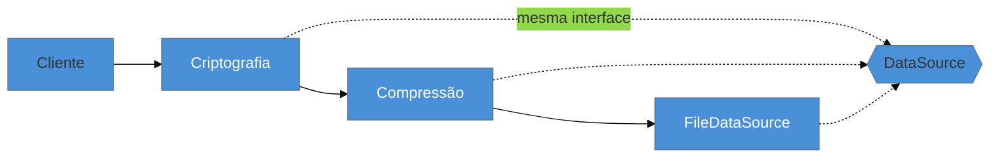

# Decorator

> [!abstract] TL;DR
> O **Decorator** adiciona comportamento a um objeto **envolvendo-o** em outro que implementa a **mesma interface** — de forma composicional e **empilhável em runtime**, sem alterar a classe original nem explodir em subclasses. É o padrão por trás dos *streams* de I/O do Java (`BufferedInputStream(GZIPInputStream(...))`) e dos *middlewares*. Cuidado com uma confusão clássica da nossa lente cross-linguagem: o **`@decorator` de Python/TypeScript é um recurso da linguagem** (decoração de função/classe) que é *primo*, não idêntico, ao Decorator do GoF (envolver objetos). A armadilha campeã: uma pilha profunda de decorators que ninguém consegue depurar — e trocar a interface no meio do caminho (aí já é Adapter).

## Adicionar comportamento sem tocar na classe

Você tem um `DataSource` que lê e grava bytes. Agora precisa que alguns fluxos sejam **comprimidos**, outros **criptografados**, alguns **ambos** — e em ordens diferentes. A saída ingênua por herança vira um pesadelo combinatório: `CompressedDataSource`, `EncryptedDataSource`, `CompressedEncryptedDataSource`, `EncryptedCompressedDataSource`... uma subclasse para cada combinação. Isso não escala: N comportamentos independentes geram 2^N classes.

O Decorator inverte a lógica. Em vez de uma classe por combinação, você cria **um decorator por comportamento**, cada um implementando a mesma interface `DataSource` e **envolvendo** outro `DataSource`. Aí você **empilha** em runtime, na ordem que quiser: comprimir-e-depois-criptografar é só aninhar dois wrappers. Cada decorator faz sua parte e delega o resto ao objeto que envolve.

## A ideia



Todos — o núcleo e os decorators — implementam `DataSource`. O cliente fala com o de fora sem saber quantas camadas existem; cada camada acrescenta seu comportamento e repassa a chamada para dentro. Como todos têm a **mesma interface**, a pilha é transparente: o cliente não muda quando você adiciona ou remove uma camada.

## O padrão nas quatro linguagens

### Java — o exemplo canônico são os streams de I/O

A biblioteca de I/O do Java **é** um catálogo de Decorators: cada wrapper adiciona um comportamento (buffering, descompressão) sobre outro `InputStream`:

```java
InputStream in = new BufferedInputStream(   // + buffering
    new GZIPInputStream(                    // + descompressão
        new FileInputStream("dados.gz")));  // núcleo: leitura do arquivo
```

Você lê `in` sem saber quantas camadas há embaixo — todas são `InputStream`.

### Go — *embedding* de interface + wrapping

Go não tem herança, mas o **embedding** de interface dá o mesmo efeito: o decorator embute a interface e sobrescreve só o método que quer decorar, delegando o resto. A biblioteca padrão faz isso com `io.Reader` (ex.: `gzip.NewReader`, `bufio.NewReader`), exatamente como os streams do Java:

```go
type logReader struct { io.Reader }                 // embute a interface
func (l logReader) Read(p []byte) (int, error) {
    n, err := l.Reader.Read(p)                       // delega
    log.Printf("li %d bytes", n)                     // decora
    return n, err
}
```

### Python e TypeScript — cuidado: `@` é um primo, não o mesmo

Aqui mora a confusão. Python e TS têm **decorators de linguagem** (a sintaxe `@`), que envolvem **funções ou classes** em tempo de definição:

```python
@retry(times=3)          # o @ envolve a FUNÇÃO abaixo, adicionando retry
def buscar(): ...
```

Isso *é* "adicionar comportamento sem alterar o alvo" — o espírito do Decorator — mas opera no nível de **função/classe**, não de **objeto envolvido pela mesma interface**. O Decorator do GoF (objeto envolve objeto, mesma interface, empilhável) você escreve em Python/TS igual ao Java, com wrappers. Em entrevista, deixe claro que sabe distinguir: *"o `@` de Python é decoração de função; o Decorator do GoF é envolver um objeto na mesma interface — relacionados, mas níveis diferentes"*.

> **A tese:** o recurso `@` das linguagens absorveu o caso mais comum de "acrescentar um *concern* transversal" (retry, cache, log) a uma função. Mas o **Decorator de objeto** — empilhar camadas sobre a mesma interface, escolhidas em runtime — continua vivo e é o que explica os streams de I/O e os pipelines de middleware em qualquer linguagem.

## Decorator vs herança, e vs middleware

O trunfo sobre **herança** é o *runtime*: você compõe a pilha quando executa, não quando compila, e evita a explosão de subclasses. Já o **middleware** (Express, servlet filters) é, no fundo, o Decorator aplicado a requisições — cada camada processa e chama a próxima. Quando o comportamento é um *concern* transversal aplicado a muitos alvos (segurança, logging, transação), a AOP/middleware — implementada via [[10 - Proxy]] — costuma ser mais adequada que decorar objeto por objeto à mão.

## Armadilhas comuns

> [!warning] Confundir o `@decorator` da linguagem com o Decorator do GoF
> **O que acontece:** afirma-se que "Python tem o Decorator embutido" e para por aí, sem perceber que o `@` decora funções/classes, não objetos numa interface comum. **Por quê:** são níveis diferentes. O `@` resolve *concern* em função; o padrão GoF resolve *composição empilhável de comportamento sobre a mesma interface de objeto*. Confundi-los leva a usar o `@` onde você precisava de wrappers de objeto (ou vice-versa). **Como evitar:** pergunte se você está decorando **uma função** (use `@`) ou **compondo camadas sobre um objeto de interface X, escolhidas em runtime** (use o padrão, com wrappers).

> [!warning] A pilha profunda que ninguém depura
> **O que acontece:** cinco, seis decorators aninhados; um bug aparece e você não sabe em qual camada, nem em que ordem elas rodam. **Por quê:** cada camada é transparente individualmente, mas a **ordem** importa (comprimir-depois-criptografar ≠ o inverso) e o *stack trace* fica cheio de wrappers parecidos. Transparência demais vira opacidade. **Como evitar:** limite a profundidade; nomeie bem cada decorator; documente a ordem esperada. Se a pilha é fixa e sempre a mesma, talvez uma única classe seja mais honesta.

> [!warning] O "decorator" que muda a interface
> **O que acontece:** o wrapper acrescenta métodos novos ou muda assinaturas — o cliente passa a depender do wrapper concreto, não da interface. **Por quê:** o Decorator **preserva a interface** — é isso que torna a pilha transparente e substituível. Se você mudou a interface, o que você fez foi um **Adapter**, não um Decorator. **Como evitar:** mesmo tipo de entrada e saída que o objeto decorado. Mudou a interface? Reclassifique: é [[07 - Adapter]].

## Como explicar em inglês

> "Decorator adds behavior by wrapping an object in another that implements the same interface, so I can stack behaviors at runtime instead of exploding into subclasses. Java's I/O streams are the textbook example — `BufferedInputStream` wrapping `GZIPInputStream` wrapping `FileInputStream`, all `InputStream`. One thing I'm careful about: Python's and TypeScript's `@decorator` is a *language feature* that decorates functions or classes — it's a cousin of the pattern, not the same thing. The GoF Decorator is object-wrapping on a shared interface, and I write that the same way in any language. For cross-cutting concerns applied broadly, I'd often reach for AOP or middleware — which is really Decorator via Proxy — instead of hand-wrapping every object. The trap is a deep stack you can't debug, or a wrapper that changes the interface, which is actually an Adapter."

| PT | EN |
| --- | --- |
| envolver (um objeto) | to wrap (an object) |
| mesma interface | same interface |
| empilhável em runtime | stackable at runtime |
| explosão de subclasses | subclass explosion |
| concern transversal | cross-cutting concern |
| decorator de linguagem (`@`) | language decorator |
| ordem das camadas | layer ordering |

## O que vem a seguir

O Decorator mantém a interface e acrescenta camadas. O próximo estrutural faz o oposto em espírito: **esconde** um subsistema complexo atrás de uma interface **mais simples**. É, sem exagero, o padrão mais usado do mundo — e você provavelmente escreveu um hoje sem saber.

- [[09 - Facade]] — uma interface simplificada sobre um subsistema complexo.
- [[10 - Proxy]] — o primo que também envolve mantendo a interface, mas para **controlar acesso** (e implementa AOP/middleware).

## Veja também

- [[03-Dominios/Tecnologia/Node/index|Node]] — middleware do Express como Decorator de requisições.
- [[03-Dominios/Engenharia/Design de Software/Orientação a Objetos/07 - Composição sobre herança|Composição sobre herança]] — o princípio que o Decorator encarna contra a explosão de subclasses.

## Fontes

- **Gamma, Helm, Johnson, Vlissides (GoF)** — *Design Patterns* (1994) — Decorator (com o exemplo de janelas com bordas/scroll).
- **Refactoring Guru** — [*Decorator*](https://refactoring.guru/design-patterns/decorator) — a composição empilhável e o contraste com herança.
- **Java Platform Docs** — [*java.io*](https://docs.oracle.com/en/java/javase/21/docs/api/java.base/java/io/package-summary.html) — os streams decorados da biblioteca padrão.
- **PEP 318** — [*Decorators for Functions and Methods*](https://peps.python.org/pep-0318/) — o `@` de Python, o primo que confunde.
